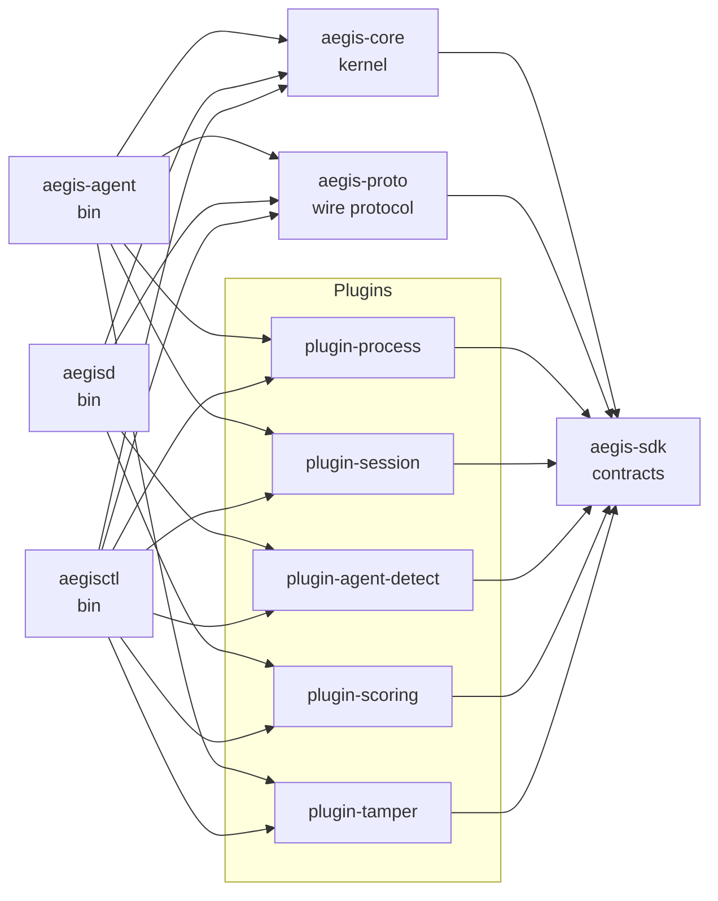
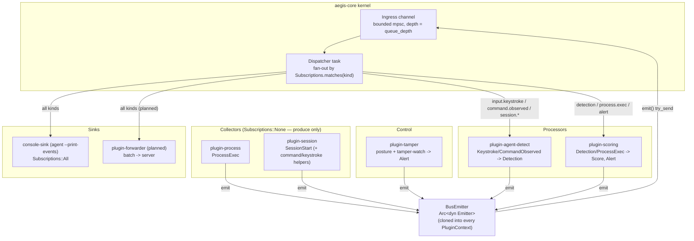
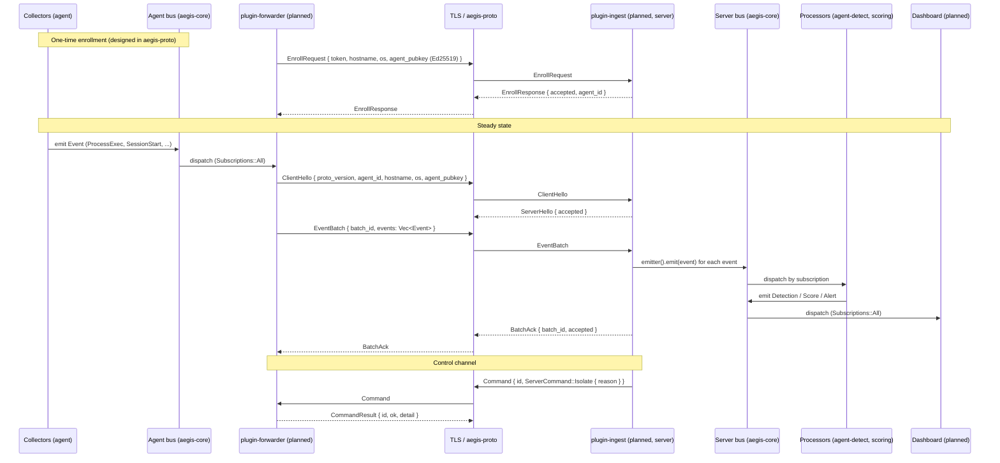
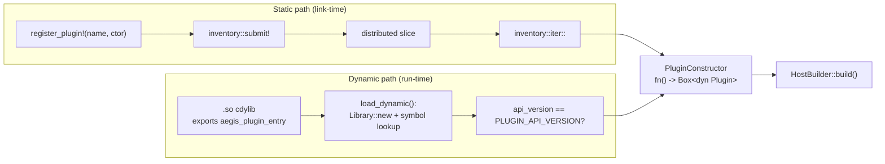
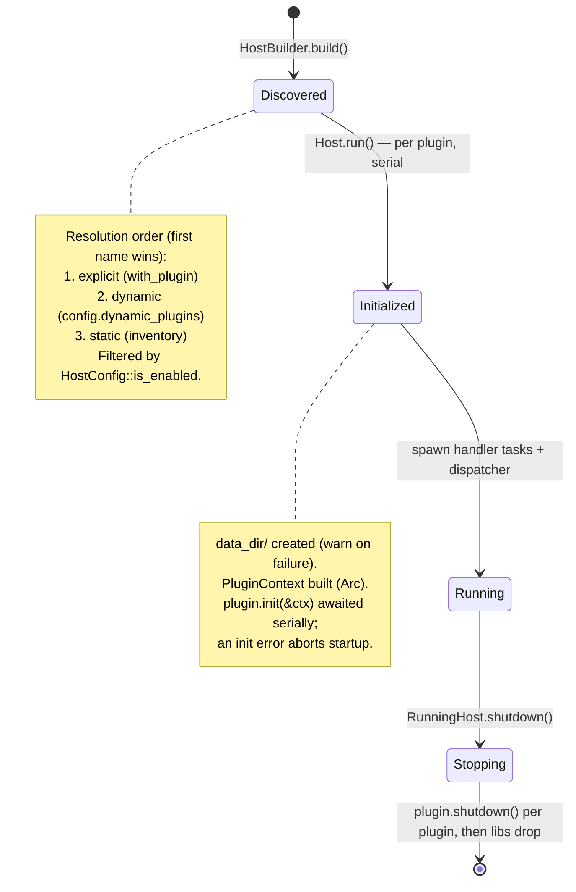
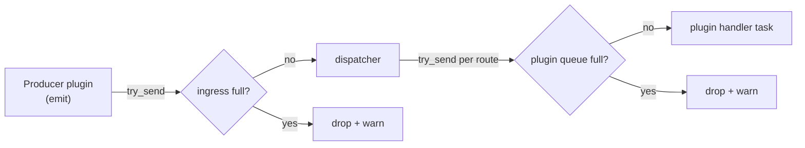
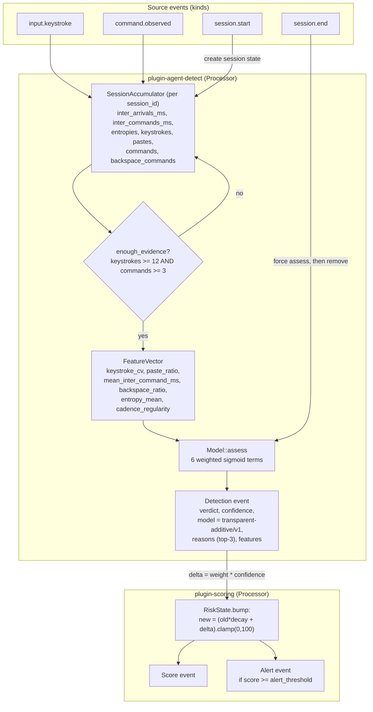
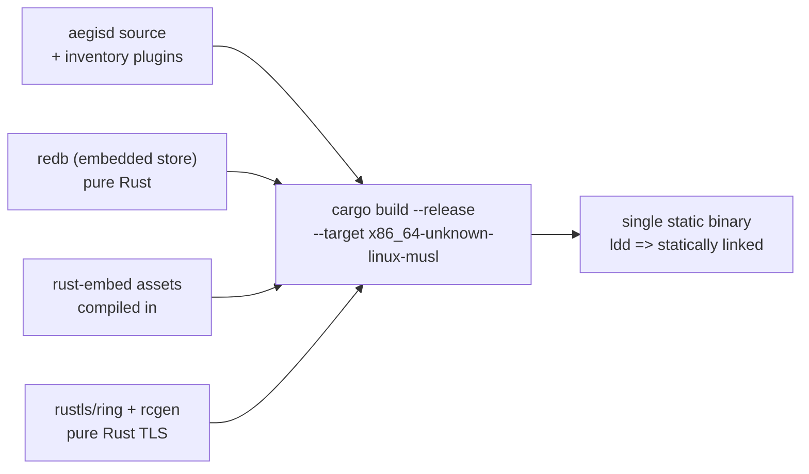
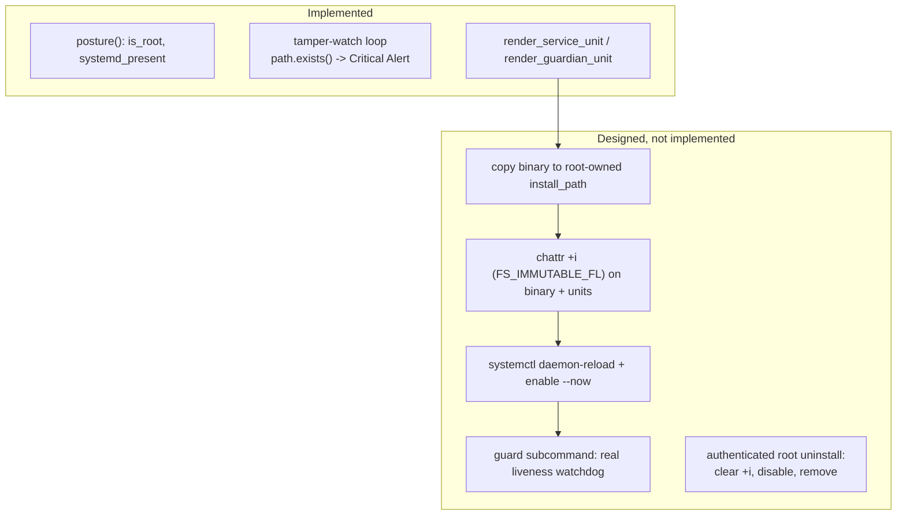

# Aegis Architecture

Aegis is a plugin-native, client/server platform for **behavioral
insider-threat modeling**. Its flagship capability is distinguishing an
**automated agent** from a **human operator** at a Linux endpoint, using only
*timing and structure* telemetry — never keystroke content.

This document describes the architecture **as it exists in the source tree**.
Where a capability is designed but not yet wired (for example the agent→server
transport), it is called out explicitly so the diagrams are not mistaken for
the running system. The roadmap of concrete next steps is at the end.

> Scope note: this is an active research prototype. The *kernel*, the *event
> model*, the *plugin contract*, the *wire protocol*, and the *five built-in
> plugins* are implemented and unit-tested. The network layer (TLS ingest,
> forwarder), enrollment, persistence, the dashboard, and the privileged
> installer are designed (types/protocol present) but not yet implemented in the
> binaries. See [Implementation status](#implementation-status).

---

## Table of contents

1. [Overview and design axioms](#overview-and-design-axioms)
2. [Workspace layout](#workspace-layout)
3. [Component diagram](#component-diagram)
4. [Data flow: agent → server](#data-flow-agent--server)
5. [The event model](#the-event-model)
6. [The plugin model](#the-plugin-model)
7. [Plugin lifecycle](#plugin-lifecycle)
8. [Subscriptions, routing, and back-pressure](#subscriptions-routing-and-back-pressure)
9. [The agent-vs-human detection pipeline](#the-agent-vs-human-detection-pipeline)
10. [The self-contained server](#the-self-contained-server)
11. [Tamper-resistance approach](#tamper-resistance-approach)
12. [Extension guide: a feature is a plugin](#extension-guide-a-feature-is-a-plugin)
13. [Implementation status](#implementation-status)
14. [Architecture Decision Record](#architecture-decision-record)

---

## Overview and design axioms

Two axioms, stated in `crates/aegis-sdk/src/lib.rs`, drive every other choice:

- **Everything is an `Event`.** Telemetry, derived signals, scores, detections,
  and alerts all share one envelope (`aegis_sdk::Event`) and travel one bus.
- **Everything is a `Plugin`.** The kernel (`aegis-core`) implements *no*
  features. It discovers plugins, wires them onto the bus, routes events by
  subscription, and manages lifecycle. Detection, scoring, collection,
  transport, persistence, and even endpoint self-protection are all plugins.

A strict dependency layering enforces this: `aegis-sdk` (contracts) ← `aegis-core`
(kernel) ← binaries. Plugins depend **only** on `aegis-sdk`, never on the
kernel, so a plugin can never reach into core internals.

The system is a three-binary client/server deployment:

| Binary | Crate | Role |
|--------|-------|------|
| `aegis-agent` | `crates/aegis-agent` | Endpoint client. Runs collector + self-protection plugins; (designed) forwards telemetry; provides the tamper-resistant install lifecycle. |
| `aegisd` | `crates/aegis-server` | Server. A single self-contained static binary that (designed) ingests telemetry, runs the central detection/scoring processors, and serves the operator dashboard. |
| `aegisctl` | `crates/aegis-cli` | Management CLI. Today: plugin introspection and version reporting. |

---

## Workspace layout

```
crates/
  aegis-sdk     Stable contracts: Event model + Plugin trait/registration. No features.
  aegis-core    The kernel: plugin host, event bus, static + dynamic loaders, config.
  aegis-proto   Wire protocol: length-prefixed JSON frames, agent↔server message grammar.
  aegis-agent   Endpoint client binary (aegis-agent).
  aegis-server  Self-contained server binary (aegisd).
  aegis-cli     Management CLI (aegisctl).
plugins/
  plugin-process       Collector: process-execution telemetry (/proc sampler).
  plugin-session       Collector: session lifecycle + content-free command/keystroke stats.
  plugin-agent-detect  Processor: the agent-vs-human distinction (flagship).
  plugin-scoring       Processor: per-subject decaying risk aggregation + alerting.
  plugin-tamper        Control: endpoint self-protection (posture + tamper watch + install spec).
```

Dependency direction (arrows point at the dependency):



A binary "links in" a plugin with `use plugin_x as _;`. The empty import forces
the linker to include the crate, which runs its `inventory::submit!` so the
kernel discovers it at startup — no registry file and no explicit registration
call.

---

## Component diagram

The kernel owns a single ingress channel and a dispatcher. Each plugin gets its
own bounded queue and its own task. Plugins emit back onto the same ingress, so
a processor's derived events (e.g. `Detection`) re-enter the bus and reach other
plugins (e.g. `plugin-scoring`).



Notes that match the code exactly:

- Collectors (`plugin-process`, `plugin-session`) and `plugin-tamper` declare
  `Subscriptions::None`: they are pure producers and run background tasks spawned
  in `init()`.
- `plugin-agent-detect` subscribes to `input.keystroke`, `command.observed`,
  `session.start`, `session.end`.
- `plugin-scoring` subscribes to `detection`, `process.exec`, `alert` (the
  `alert` arm is currently a no-op — see [routing](#subscriptions-routing-and-back-pressure)).
- `console-sink` is an inline `Plugin` defined in `aegis-agent/src/main.rs`,
  added via `HostBuilder::with_plugin` when `--print-events` is passed.

---

## Data flow: agent → server

The wire protocol (`aegis-proto`) is fully specified and unit-tested. The
network *plumbing* that uses it (a forwarder Sink on the agent, an ingest
listener on the server) is **not yet implemented**. The diagram below shows the
intended end-to-end flow; dashed boxes are designed-not-yet-built.



Key protocol facts (`crates/aegis-proto/src/lib.rs`):

- Framing is a `u32` big-endian length prefix followed by JSON bytes. JSON is
  deliberate: `EventPayload::Custom(serde_json::Value)` is self-describing and
  would not round-trip through a non-self-describing binary format.
- `PROTO_VERSION: u16 = 1`; `MAX_FRAME_BYTES = 16 * 1024 * 1024` bounds the
  receive path. `read_message`/`write_message` are generic over any
  `AsyncRead`/`AsyncWrite + Unpin`, so they layer cleanly over a `tokio-rustls`
  stream.
- Two-phase identity: `EnrollRequest`/`EnrollResponse` (first contact, one-time
  token, carries the agent's 32-byte Ed25519 public key) vs.
  `ClientHello`/`ServerHello` (per-session handshake on an already-enrolled
  connection). Transport security (mTLS) and token auth are layered *under* this
  protocol — the crate defines only the message grammar and framing.
- The server→agent control channel is `Message::Command { id, ServerCommand }`
  with `ServerCommand` = `Rescore`, `SetConfig`, `Isolate`, `Noop`; the agent
  replies with `CommandResult`.

`aegis-proto` is intentionally **not** part of the in-process bus machinery — it
is the transport-layer wire format, used by the (planned) forwarder and ingest
plugins only. The two buses (agent and server) are entirely separate in-process
event buses bridged by the network.

---

## The event model

Defined in `crates/aegis-sdk/src/event.rs`. The unit of information is `Event`:

```rust
pub struct Event {
    pub id: Uuid,
    pub ts_ns: u64,          // producer timestamp, ns since Unix epoch
    pub agent_id: AgentId,   // enrolled endpoint identity (String)
    pub source: String,      // producing plugin name, or "host"
    pub kind: String,        // routing topic, e.g. "command.observed"
    pub payload: EventPayload,
    pub labels: BTreeMap<String, String>,
}
```

`EventPayload` is a serde-tagged enum (`#[serde(tag = "type", rename_all =
"snake_case")]`). The variants and their canonical routing kinds
(`EventPayload::default_kind()`) are:

| Variant | `kind` | Key fields |
|---------|--------|-----------|
| `ProcessExec` | `process.exec` | `pid, ppid, uid, exe, cmdline, cwd` |
| `SessionStart` | `session.start` | `session_id, tty, user, remote` |
| `SessionEnd` | `session.end` | `session_id` |
| `Keystroke` | `input.keystroke` | `session_id, inter_arrival_ns, is_paste, burst_len` |
| `CommandObserved` | `command.observed` | `session_id, command_len, token_count, shannon_entropy, had_backspace, edit_distance_prev, inter_command_ns, command_hash` |
| `Score` | `score` | `subject, model, score, features: BTreeMap<String,f64>` |
| `Detection` | `detection` | `subject, verdict, confidence, model, reasons, features` |
| `Alert` | `alert` | `severity, title, detail, subject` |
| `Heartbeat` | `heartbeat` | `uptime_s` |
| `Custom(serde_json::Value)` | `custom` | arbitrary plugin-defined payload |

Supporting types:

- `Verdict` — `Human | Agent | Uncertain` (implements `Display`).
- `Severity` — ordered `Info < Low < Medium < High < Critical`.
- `AgentId = String`, `SessionId = String`.
- `now_ns() -> u64` — wall-clock nanoseconds since the Unix epoch.

Builders: `Event::new(agent_id, source, payload)` derives `kind` from
`payload.default_kind()` and stamps `ts_ns`; `Event::with_label(k, v)` and
`Event::with_kind(kind)` are chainable.

### Privacy by design

The event model encodes the content-free constraint structurally:

- `Keystroke` carries **only** inter-arrival timing, a paste/burst flag, and the
  burst length. There is no field for character content.
- `CommandObserved` carries structural statistics plus a **salted hash**
  (`command_hash`) for cross-session correlation — never the verbatim command.

`Custom` is the explicit escape hatch: third-party plugins can introduce new
event types without an SDK change, and (because the wire format is JSON) those
events round-trip over the network transparently.

---

## The plugin model

Defined in `crates/aegis-sdk/src/plugin.rs`. A plugin implements one async
trait:

```rust
#[async_trait]
pub trait Plugin: Send + Sync {
    fn metadata(&self) -> PluginMetadata;
    fn subscriptions(&self) -> Subscriptions { Subscriptions::None }
    async fn init(&mut self, _ctx: &PluginContext) -> anyhow::Result<()> { Ok(()) }
    async fn handle(&self, _event: &Event, _ctx: &PluginContext) -> anyhow::Result<()> { Ok(()) }
    async fn shutdown(&self) -> anyhow::Result<()> { Ok(()) }
}
```

`PluginMetadata { name, version, description, kind, api_version }` carries a
`PluginKind` (`Collector | Processor | Sink | Control`) used for operator
display; `PluginMetadata::new(...)` stamps `api_version = PLUGIN_API_VERSION`.

`PluginContext` is the per-plugin runtime handle passed to `init` and `handle`:

```rust
pub struct PluginContext {
    pub agent_id: String,
    pub data_dir: PathBuf,       // private dir: <host data_dir>/<plugin name>
    pub config: serde_json::Value,
    pub emitter: Arc<dyn Emitter>,
}
```

`config_as::<T: DeserializeOwned + Default>()` deserializes the plugin's config
subtree, falling back to `T::default()` when the subtree is JSON `null` — so
per-plugin config is fully optional. `emit(event)` publishes back onto the bus.

A critical contract detail: **`handle` takes `&self`, not `&mut self`.** Handler
tasks run concurrently, so any stateful plugin uses interior mutability —
`plugin-agent-detect` and `plugin-scoring` both wrap state in
`Arc<Mutex<...>>`. `init` takes `&mut self` and runs exactly once *before* the
plugin is shared (`Arc`-wrapped), giving a single safe setup window. Collectors
spawn their producer task in `init()` after cloning `ctx.emitter`.

### Two registration paths, one constructor

Both paths converge on the same `PluginConstructor = fn() -> Box<dyn Plugin>`.

**Static (the default for built-ins):** the `register_plugin!` macro submits a
`PluginRegistration { api_version, name, constructor }` to an `inventory`
distributed slice at link time. `inventory::collect!(PluginRegistration)` (in
the SDK) is the collection point; the kernel iterates
`inventory::iter::<PluginRegistration>` at startup. The SDK re-exports
`inventory` so plugin crates need no direct `inventory` dependency. All five
built-in plugins register this way, e.g.:

```rust
register_plugin!("plugin-process", || Box::new(ProcessPlugin::default()));
```

**Dynamic (cdylib):** a shared object exports a C-ABI entrypoint named by
`DYN_ENTRY_SYMBOL` (`b"aegis_plugin_entry"`) with signature `DynEntry =
unsafe extern "C" fn() -> *mut DynPluginRegistration`. The
`#[repr(C)] DynPluginRegistration { api_version, constructor }` is returned
across the ABI. `aegis-core::loader::load_dynamic(path)` looks up the symbol,
null-checks the pointer, adopts it via `Box::from_raw`, validates
`api_version == PLUGIN_API_VERSION`, and returns a `DynamicPlugin { library,
constructor }` that keeps the `libloading::Library` mapped.



> Safety: a dynamic `.so` runs **in-process with full host privileges**. The
> ABI-version handshake catches gross mismatches but cannot make untrusted code
> safe; `loader.rs` documents that only trusted, integrity-checked paths should
> be loaded. There is currently **no** signature or content-hash check on the
> path (see the ADR).

### ABI version handling is asymmetric

`PLUGIN_API_VERSION: u32 = 1` is checked in two places with different strictness:

- **Static** (`HostBuilder::build`): a mismatch logs `tracing::warn` and
  **skips** the plugin (lenient).
- **Dynamic** (`load_dynamic`): a mismatch `bail!`s with an error (strict).

This asymmetry is worth noting: a statically-linked plugin whose
`PLUGIN_API_VERSION` does not match the host disappears silently with only a warn
log, even though a compiled-in ABI mismatch is arguably *more* dangerous (the
vtable layout may be incompatible). See the ADR.

---

## Plugin lifecycle

The host has three stages: **discovery** (`HostBuilder` / `Host`), **run**
(`Host::run -> RunningHost`), and **shutdown**.



Details from `crates/aegis-core/src/host.rs`:

1. **Discovery & precedence.** `HostBuilder::build()` resolves three sources in
   order — explicit (`with_plugin`) > dynamic (`config.dynamic_plugins`) >
   static (`inventory`) — using a `HashSet<String>` of seen names so the **first
   occurrence of a name wins**. `HostConfig::is_enabled(name)` filters each
   candidate (disabled list always wins; an `enabled_plugins` allowlist, if
   `Some`, is strict).

2. **Init.** `Host::run()` creates the ingress channel sized to
   `config.queue_depth`, then for each plugin: creates `data_dir/<name>`
   (`create_dir_all`; failure is warn-logged, not fatal), builds an
   `Arc<PluginContext>`, and awaits `plugin.init(&ctx)` **serially**. An init
   error aborts startup (`with_context` names the failing plugin).

3. **Run.** After init, each plugin is converted to `Arc<dyn Plugin>` and gets
   its own bounded `mpsc::channel::<Event>(queue_depth)` drained by its own
   `tokio::spawn` task. A single dispatcher task drains the ingress and fans out.
   Both the dispatcher and each handler `select!` on a `watch::channel<bool>`
   shutdown signal.

4. **Shutdown.** `RunningHost::shutdown()` sends `true` on the watch channel,
   awaits the dispatcher join handle, awaits all handler join handles, then calls
   `plugin.shutdown()` on each entry **sequentially**. The
   `_libs: Vec<libloading::Library>` field is declared **last** on `RunningHost`
   so dynamic plugin code stays mapped until all plugin `Arc`s and tasks have
   dropped.

`RunningHost::emitter() -> Arc<dyn Emitter>` exposes a cloneable handle for
feeding **external** events into the bus — this is the documented injection point
a network ingest plugin would use.

---

## Subscriptions, routing, and back-pressure

### Subscriptions

`Subscriptions` is `All | None | Kinds(HashSet<String>)`.
`Subscriptions::matches(kind)` decides delivery; `Subscriptions::kinds(iter)`
builds the `Kinds` set. A plugin's `subscriptions()` is read once at run time and
stored alongside its queue sender.

### Routing

The dispatcher (in `host.rs`) loops over `(Subscriptions, mpsc::Sender<Event>)`
routes; for each event it `try_send`s a clone to every plugin whose
subscription matches `event.kind`. Each plugin drains its own queue on its own
task, so a slow plugin back-pressures **only itself** and never head-of-line
blocks the others.

Because processors emit derived events back onto the same ingress, the bus is
effectively a feedback loop: `plugin-agent-detect` emits `Detection`, which the
dispatcher then routes to `plugin-scoring`. There is **no ordering or dependency
declaration** between plugins — delivery across independent per-plugin queues is
only eventually consistent. This is acceptable for the current processors
(scoring is decay-based and order-insensitive) but is a known limitation for any
future plugin needing strict causal ordering.

### Back-pressure: drop, don't block

Both write points are **non-blocking and drop-on-full**:

- `BusEmitter::emit` (`bus.rs`) uses `try_send`; on `TrySendError::Full` it logs
  `tracing::warn` and drops the event; on `Closed` it logs `tracing::debug`.
- The dispatcher's per-plugin fan-out (`host.rs`) uses `try_send`; on `Full` it
  logs `tracing::warn` and drops.



This bounds memory under saturation but means high-frequency collectors can
silently lose events. There is **no dropped-event counter, no dead-letter
queue, and no back-pressure signal** to the producer — only log lines. For a
detection system this matters: undetected telemetry loss is indistinguishable
from the absence of that behavior, and biased loss (e.g. dropping fast
keystrokes) would skew the `keystroke_cv` feature. Adding a drop counter is a
high-priority item in the ADR. The single knob today is
`HostConfig::queue_depth` (default `4096`).

---

## The agent-vs-human detection pipeline

This is the flagship capability, implemented across `plugins/plugin-agent-detect`
(`features.rs`, `model.rs`, `lib.rs`) and `plugins/plugin-scoring`.



### Feature extraction (`features.rs`)

Per `session_id`, a `SessionAccumulator` collects raw observations.
`record_keystroke` discards inter-arrivals outside `(0, 60_000) ms` as noise;
`record_command` discards inter-command gaps outside `(0, 3_600_000) ms`.
`enough_evidence()` gates on `MIN_KEYSTROKES = 12` and `MIN_COMMANDS = 3`.

`features()` returns `Option<FeatureVector>` (None until the gate passes):

| Feature | Meaning / intuition |
|---------|---------------------|
| `keystroke_cv` | Coefficient of variation (std/mean) of inter-keystroke timing. **The core discriminator**: humans are bursty/irregular (high CV); automation is metronomic (low CV). |
| `paste_ratio` | Fraction of commands delivered as atomic pastes/bursts. |
| `mean_inter_command_ms` | Mean think time between commands (humans read output; agents react). |
| `backspace_ratio` | Fraction of commands composed with corrections (humans err). |
| `entropy_mean` | Mean Shannon entropy of commands. |
| `cadence_regularity` | `1 - min(1, CV of inter-command timing)` — clockwork cadence ⇒ agent. |

`FeatureVector::to_map()` flattens to a labelled `BTreeMap<String, f64>` for the
`Detection` event's `features` field (explainability).

### The model (`model.rs`)

A deliberately **transparent additive model**. Each feature is mapped to an
"agent-evidence" value in `[0,1]` by a logistic transfer (`sigmoid`) with a
documented center/slope, then combined as a weighted average. Six terms
(weights sum to 1.0):

| Term | Weight | Evidence |
|------|--------|----------|
| `metronomic-typing` | 0.25 | `sigmoid(8.0 * (0.45 - keystroke_cv))` |
| `paste-injection` | 0.20 | `paste_ratio.clamp(0,1)` |
| `instant-reaction` | 0.25 | `sigmoid(0.004 * (1000 - mean_inter_command_ms))` |
| `errorless-input` | 0.15 | `sigmoid(40.0 * (0.06 - backspace_ratio))` |
| `dense-commands` | 0.05 | `sigmoid(3.0 * (entropy_mean - 4.2))` |
| `regular-cadence` | 0.10 | `cadence_regularity.clamp(0,1)` |

`Model::assess` produces `p_agent` (weighted mean), a `Verdict`
(`>= agent_threshold (0.65)` ⇒ Agent; `<= human_threshold (0.35)` ⇒ Human;
between ⇒ Uncertain), a `confidence`, and up to three `reasons` (the strongest
contributors toward the chosen direction). The coefficients are **hand-calibrated
constants**, not learned; the `Model::assess` interface is designed to be
swappable for a learned model behind the same shape.

### Verdict-driven scoring (`plugin-scoring`)

`plugin-scoring` subscribes to `detection`, `process.exec`, `alert`:

- **`Detection` with `Verdict::Agent`:** `delta = agent_detection_weight (60.0) *
  confidence`; subject is the detection's `subject` (the `session_id`).
- **`ProcessExec`:** subject is `"uid:{uid}"`; `delta = process_weight (5.0)`,
  multiplied by 3 for a suspicious executable (`nc, ncat, socat, nmap, tcpdump,
  scp, rsync, curl, wget, base64, openssl, gpg`).
- **`Alert`:** falls through to the wildcard arm and returns `Ok(())` — **a
  no-op**. Incoming alerts are consumed but do not affect scoring.

After each bump, `RiskState.bump` applies `new = (old*decay + delta).clamp(0,
100)` (`decay = 0.98`), always emits a `Score` event, and emits an `Alert`
(severity from `severity_for`: `>=90` Critical, `>=75` High, else Medium) when
`score >= alert_threshold (75.0)`.

Two known quirks visible in the code: the `Score` event's `features` map is
emitted **empty** (`Default::default()`), discarding the per-signal breakdown;
and the `Detection` subject (`session_id`) and `ProcessExec` subject
(`"uid:{uid}"`) live in **disjoint namespaces**, so a detected agent session and
that user's suspicious process executions accumulate into separate scores rather
than compounding. Both are in the ADR.

### The pipeline is currently inert end-to-end

`plugin-agent-detect` subscribes to `input.keystroke` and `command.observed`,
but **no plugin in the workspace emits those kinds.** `plugin-session` emits a
single `SessionStart` at startup (derived from `$USER`, `$SSH_TTY`/`$TTY`,
`$SSH_CONNECTION`) and exports `command_stats()` / `shannon_entropy()` helpers
for a future capture layer — but it does no live tty/pty interception. Without
`Keystroke`/`CommandObserved` events, `enough_evidence()` never passes, so no
`Detection` is ever produced and `plugin-scoring`'s verdict-driven path never
fires. Closing this gap (a tty/pty collector) is the single highest-leverage
change; it is the first item in the ADR roadmap.

---

## The self-contained server

`aegisd` is required to ship as **a single, self-contained, statically-linked
binary**: no external database and no runtime asset directory. The architecture
chooses pure-Rust, musl-friendly dependencies throughout to make that possible.

### Embedded store (planned, deps present)

`redb` (a pure-Rust embedded ACID key-value store, no C dependency) is declared
as a workspace dependency for durable persistence. It is **not yet referenced**
by any source file. The intended design is a `plugin-store` Sink subscribing to
the bus and writing events keyed by `(agent_id, ts_ns, event_id)`, which would:
give the operator a queryable history behind each alert; let the server-side risk
scores survive restart (today `RiskState.scores` is an in-memory `HashMap` that
resets to zero on restart); and give `ServerCommand::Rescore` a history to replay.

### Embedded assets (planned, deps present)

`axum`, `tower`, `rust-embed`, and `mime_guess` are declared for the operator
dashboard. `rust-embed` compiles HTML/JS/CSS **into** the binary, satisfying the
"no runtime asset directory" constraint. The dashboard is intended as a
`plugin-dashboard` Sink (subscribing to `Subscriptions::All`, serving the `--http`
address). None of these are referenced by source yet; `aegisd` parses `--listen`
and `--http` but binds neither socket.

### Static musl linking

- `rust-toolchain.toml` pins channel `1.92.0` and includes the
  `x86_64-unknown-linux-musl` target.
- The crypto/TLS stack is `rustls` + `ring` (`default-features = false`),
  `tokio-rustls` + `ring`, and `rcgen` + `ring` — pure-Rust, no OpenSSL — so a
  static build does not need to link a system TLS library.
- `Cargo.toml` defines `[profile.release]` (`opt-level = 3`, `lto = "thin"`,
  `codegen-units = 1`, `strip = true`, `panic = "abort"`) and `[profile.dist]`
  (`inherits = "release"`, `lto = "fat"`) for the smallest release artifact.



> Status: CI (`.github/workflows/ci.yml`) has a `static-server` job that builds
> `aegisd` for `x86_64-unknown-linux-musl` (installing `musl-tools` for the
> linker) and asserts the result with `ldd ... => statically linked`, uploading
> the binary as an artifact. Gaps that remain: there is no `.cargo/config.toml`
> pinning the musl cross-linker (CI relies on `musl-tools` instead), and
> `aegisd`'s doc comment references a `BUILD.md` that does not exist. One caveat
> to document: a static musl binary cannot safely `dlopen` a glibc-linked `.so`,
> so **dynamic plugins for a musl server must also be built for musl.**

---

## Tamper-resistance approach

The protected asset is **monitoring visibility**. In an insider-threat
deployment the monitored (typically unprivileged) user must not be able to
silently disable monitoring on their own workstation — the same property
commercial EDR/DLP agents provide. The approach uses **supported OS mechanisms
only**; it is explicitly **not a rootkit**, uses no kernel exploits and no
process hiding, and always retains an **authenticated root/administrator
uninstall** path. (See `docs/THREAT_MODEL.md`.)

Self-protection is expressed as a plugin (`plugin-tamper`, `PluginKind::Control`)
plus an installer spec — "the agent defends itself" is just another capability,
not core behavior. Three layers:

1. **Posture detection** (implemented). `posture()` reports `is_root` (read from
   `/proc/self/status`, avoiding a libc dependency) and `systemd_present` (PID 1
   `comm == "systemd"`).
2. **Tamper-watch loop** (implemented). A task spawned in `init()` checks every
   `check_interval_s` (floored at 1s) whether each `protected_paths` entry still
   exists; a missing path emits a `Severity::Critical` `Alert`. *Limitation:* it
   checks `path.exists()` only — it detects deletion, not in-place content
   modification, attribute change, or inode replacement.
3. **Hardened install** (spec implemented, privileged steps **not** implemented).
   `install.rs` renders two systemd units via `render_service_unit` /
   `render_guardian_unit` from an `InstallSpec` (defaults: service `aegis-agent`,
   guardian `aegis-guardian`, install path `/usr/local/sbin/aegis-agent`, run as
   `root`). The service uses `Restart=always`, `RestartSec=1`,
   `OOMScoreAdjust=-900`, `KillMode=process`, and `Requires` the guardian; the
   guardian `BindsTo` the service, so killing one triggers recovery of both.



The decisive missing mechanism is the **immutable attribute**. With
`FS_IMMUTABLE_FL` set on root-owned files, an unprivileged user cannot modify or
delete the binary or units (clearing the flag needs `CAP_LINUX_IMMUTABLE` ≈
root); root can always `chattr -i` and uninstall — preserving the authenticated
admin uninstall guarantee. Today `aegis-agent install` only **prints** the
rendered units, `uninstall` prints a deferral line, and `guard` logs and exits.
Implementing these privileged steps is required to actually meet the
"unprivileged user cannot uninstall" goal and is high-priority in the ADR.

---

## Extension guide: a feature is a plugin

Adding any capability — a new collector, a new detector, a sink, a control
function — means **adding a plugin**, never modifying the kernel.

### 1. Create a crate that depends only on `aegis-sdk`

```toml
# plugins/plugin-myfeature/Cargo.toml
[dependencies]
aegis-sdk = { path = "../../crates/aegis-sdk" }
async-trait = "0.1"
anyhow = "1"
tokio = { version = "1", features = ["sync", "time"] }   # if you spawn tasks
serde = { version = "1", features = ["derive"] }          # if you have config
```

Add the crate to the workspace `members` list in the root `Cargo.toml`.

### 2. Implement `Plugin`

```rust
use aegis_sdk::{
    register_plugin, Event, EventPayload, Plugin, PluginContext,
    PluginKind, PluginMetadata, Subscriptions,
};
use async_trait::async_trait;

#[derive(Default)]
pub struct MyPlugin;

#[async_trait]
impl Plugin for MyPlugin {
    fn metadata(&self) -> PluginMetadata {
        PluginMetadata::new(
            "plugin-myfeature",
            env!("CARGO_PKG_VERSION"),
            "what it does",
            PluginKind::Processor, // or Collector / Sink / Control
        )
    }

    // Producers return Subscriptions::None; consumers list kinds.
    fn subscriptions(&self) -> Subscriptions {
        Subscriptions::kinds(["detection", "process.exec"])
    }

    // One-time setup; &mut self. Collectors spawn their producer task here.
    async fn init(&mut self, _ctx: &PluginContext) -> anyhow::Result<()> {
        Ok(())
    }

    // Hot path; &self — use interior mutability (Mutex/DashMap) for state.
    async fn handle(&self, event: &Event, ctx: &PluginContext) -> anyhow::Result<()> {
        if let EventPayload::Detection { subject, .. } = &event.payload {
            ctx.emit(Event::new(
                &ctx.agent_id,
                "plugin-myfeature",
                EventPayload::Alert {
                    severity: aegis_sdk::Severity::Low,
                    title: "example".into(),
                    detail: format!("saw detection for {subject}"),
                    subject: Some(subject.clone()),
                },
            )).await;
        }
        Ok(())
    }
}

register_plugin!("plugin-myfeature", || Box::new(MyPlugin::default()));
```

### 3. Link it into a binary

Add the dependency to the target binary's `Cargo.toml` and force-link it so its
`inventory` registration is included:

```rust
use plugin_myfeature as _;
```

That is the entire integration. `aegisctl plugins` will now list it, and the host
will route the kinds you subscribed to.

### Guidelines that match the existing plugins

- **State:** `handle` is `&self`; hold state behind `Arc<Mutex<...>>`. Drop the
  lock guard **before** any `.await` (as `plugin-agent-detect::maybe_emit` does)
  — never hold a `Mutex` guard across an await point.
- **Config:** define a `#[derive(Default, Serialize, Deserialize)]` config struct
  and read it in `init` via `ctx.config_as()?`. Operators set it under
  `[plugins."plugin-myfeature"]` in the host TOML; absence yields your `Default`.
- **Producers:** clone `ctx.emitter` in `init`, then `tokio::spawn` a loop (see
  `plugin-process` / `plugin-tamper`).
- **Privacy:** never put raw content in an event. Reuse
  `plugin_session::command_stats` / `shannon_entropy` for structural summaries.
- **New event types:** prefer an existing `EventPayload` variant; for genuinely
  novel data use `EventPayload::Custom(serde_json::Value)` rather than changing
  the SDK.
- **Dynamic plugins:** to ship as a separate `.so`, build a `cdylib` exporting
  `aegis_plugin_entry` returning a `*mut DynPluginRegistration`, and add its path
  to `HostConfig::dynamic_plugins`.

---

## Implementation status

| Area | Status |
|------|--------|
| Event model (`aegis-sdk`) | Implemented, tested |
| Plugin trait + static (`inventory`) registration | Implemented, tested |
| Dynamic (cdylib) loader | Implemented (no integrity check beyond ABI version) |
| Kernel: discovery, dispatch, lifecycle, back-pressure | Implemented, tested |
| Wire protocol (`aegis-proto`) | Implemented, tested |
| `plugin-process`, `plugin-session`, `plugin-tamper` (collectors/control) | Implemented, tested |
| `plugin-agent-detect`, `plugin-scoring` (processors) | Implemented, tested |
| Keystroke / command capture (tty/pty) | **Not implemented** — detection pipeline is inert without it |
| Agent forwarder (TLS, batching) | **Not implemented** (`aegis-proto` dep present, unused; `--server` ignored) |
| Server ingest listener (TLS/8443) | **Not implemented** (`--listen` parsed, not bound) |
| Operator dashboard (HTTP/8080) | **Not implemented** (`--http` parsed, not bound; axum/rust-embed deps present, unused) |
| Enrollment + Ed25519 identity lifecycle | **Not implemented** (protocol present; agent_id is the literal `agent-local`) |
| Embedded store (redb) | **Not implemented** (dep present, unused; server state is in-memory) |
| Privileged installer (copy, `chattr +i`, systemctl) + guardian watchdog | **Not implemented** (unit-text rendering only) |
| Static musl build (CI `ldd` static-link assertion) | Implemented (`static-server` job in CI) |
| Static musl build config (`.cargo/config.toml`, `BUILD.md`) | **Missing** |

The "not implemented" rows are precisely the agent↔server data path, the
detection pipeline's first link, and the tamper-resistance enforcement — i.e.
the gap between the implemented kernel/plugins and the running platform the
overview describes.

---

## Architecture Decision Record

Distilled from the cross-discipline round-table review. Priority reflects impact
on making the platform function as designed. "ADR" entries record both
*standing* design decisions (already in the code) and *recommended* decisions
(the roadmap).

| # | Decision | Rationale | Priority |
|---|----------|-----------|----------|
| 1 | **Everything is an Event; everything is a Plugin** (standing). One envelope on one bus; the kernel implements no features; plugins depend only on `aegis-sdk`. | Keeps the core feature-free and replaceable; any capability is added without touching the kernel. Enforced by the SDK←core←binary layering. | standing |
| 2 | **Privacy by design in the event schema** (standing). `Keystroke` carries timing/shape only; `CommandObserved` carries structural stats + a salted hash. | The structural constraint makes content capture impossible by construction, not just by policy. | standing |
| 3 | **Two registration paths, one constructor** (standing). Static `inventory` for built-ins; C-ABI cdylib for third parties; both yield `fn() -> Box<dyn Plugin>`. | Built-ins need zero boilerplate (link = register); the platform still supports out-of-tree plugins. | standing |
| 4 | **Drop-on-full back-pressure** (standing). `try_send` at ingress and per-plugin fan-out; per-plugin queues isolate slow consumers. | Bounds memory and prevents head-of-line blocking. Accepts silent loss under saturation. | standing |
| 5 | **Transparent additive detection model** (standing). Six weighted sigmoid terms, hand-calibrated, with top-3 `reasons`. | Explainability is essential for an insider-threat verdict; the `Model::assess` interface stays swappable for a learned model. | standing |
| 6 | **Self-contained static server** (standing). Pure-Rust musl-friendly deps (`rustls`+`ring`, `redb`, `rust-embed`); `[profile.dist]` fat-LTO. | Meets the "single binary, no external DB, no asset dir" constraint. | standing |
| 7 | **Tamper resistance via supported OS mechanisms only** (standing). Root-owned files + immutable attribute + systemd watchdog pair; authenticated root uninstall always exists. | Resists the unprivileged user without becoming a rootkit; preserves admin control and auditability. | standing |
| 8 | **Implement a tty/pty capture plugin** to emit `Keystroke` / `CommandObserved`. | The detection pipeline is structurally complete but receives zero input events, so it never produces a verdict. This is the single highest-leverage change. | high |
| 9 | **Implement the agent forwarder + server ingest** as plugins using `aegis-proto` over `tokio-rustls`; inject via `RunningHost::emitter()`. | Without them the client/server platform is disconnected: the server's processors never receive agent telemetry. | high |
| 10 | **Implement the privileged installer** (binary copy, `FS_IMMUTABLE_FL` via ioctl, `systemctl enable`) and a real `guard` watchdog. | Required to actually achieve "an unprivileged user cannot uninstall, but root can." Today install only prints unit text. | high |
| 11 | **Expose a dropped-event counter / saturation metric** and surface it (heartbeat label or dashboard). | Silent telemetry loss is indistinguishable from absence of behavior and can be induced to suppress a signature; operators need observability. | high |
| 12 | **Implement enrollment + per-agent Ed25519 identity** (`EnrollRequest`/`EnrollResponse`, key gen at install, token store). | Gives each endpoint a cryptographic identity, enables mTLS session auth and the `Isolate` control path; today `agent_id` is the literal `agent-local`. | high |
| 13 | **Replace the default `hash_salt`** (`"aegis-default-salt"`) with a per-deployment salt (generated at install / derived at enrollment); warn if the default is in use. | A shared default makes `command_hash` correlatable across all default deployments, defeating the privacy isolation property. | high |
| 14 | **Add a persistent event store (`plugin-store`, redb)**. | Server risk scores and history are in-memory and reset on restart; an alert has no replayable evidence and `Rescore` has no history to read. | high/medium |
| 15 | **Add an integrity gate to `load_dynamic`** (content hash allowlist and/or Ed25519 signature) before relying on third-party `.so`s. | Dynamic plugins run in-process with full privileges; the ABI-version check authenticates nothing. A planted `.so` is a privilege-escalation vector for the very user `plugin-tamper` resists. | medium |
| 16 | **Implement the operator dashboard (`plugin-dashboard`, axum + rust-embed)** and `aegisctl` control-plane subcommands. | Alerts currently have no operator-facing delivery and `ServerCommand::Isolate` is unreachable; the dashboard is where the trust boundary is enforced. | medium |
| 17 | **Add client-side batching + WAL in the forwarder** (size/age flush, redb-backed, idempotent on `batch_id`). | Per-event TLS writes are wasteful; without a WAL any restart before `BatchAck` permanently loses audit telemetry. Keep frames well under `MAX_FRAME_BYTES`. | medium |
| 18 | **Populate `Score.features`** with the per-signal contribution and **correlate `ProcessExec` risk with the session** instead of the disjoint `uid:{uid}` subject. | Score events are currently uninformative for explainability, and agent-detected sessions never compound with that user's suspicious processes. | medium |
| 19 | **Extend tamper-watch to content integrity** (hash baseline at init; compare per tick; optionally inode/mtime pre-filter). | `path.exists()` detects deletion but not in-place binary replacement — the exact way to swap in an agent that suppresses its own detections. | medium |
| 20 | **Make the static ABI-version mismatch a hard error** (match the strict dynamic path) and add an actionable SDK-version message. | Today a compiled-in `PLUGIN_API_VERSION` mismatch silently warn-and-skips, producing an agent that starts but is missing capabilities. | medium |
| 21 | **Add a model calibration/evaluation harness** and embed a coefficient fingerprint in the `Detection.model` field. | Coefficients are hand-tuned with no empirical validation and are fully visible to an adversary; a harness grounds them and guards against regressions. | medium |
| 22 | **Add a plugin health/readiness signal** (default-Ok trait method) and consider explicit init ordering by `PluginKind`. | Lets a transport plugin report a bind failure (init cannot fail the host after returning) and removes reliance on non-deterministic `inventory` link order. | medium/low |
| 23 | **Emit and consume `Heartbeat`** for agent liveness; alert on missed heartbeats. | `Heartbeat` is defined but never produced/consumed; the server cannot distinguish a graceful disconnect from a killed/tampered agent. | low |
| 24 | **Move `plugin-process` from `/proc` polling toward inotify/eBPF** and replace the clear-on-overflow `seen` set with TTL eviction. | Short-lived agent processes can complete within the poll window and be missed; clearing the 65,536-cap set re-emits every running process as new. | low |
| 25 | **Defer WASM plugin sandboxing.** Keep static/dynamic in-process plugins as trusted code; mitigate dynamic risk with #15. | Async/tokio plugins have no practical WASM story today and the sensitive timing data crosses the host boundary regardless; the isolation benefit is marginal versus the cost. | low |
| 26 | **Add `.cargo/config.toml` (musl linker) and write `BUILD.md`.** | CI already builds `aegisd` for musl and asserts static linking via `ldd` (the `static-server` job), but there is no committed toolchain/linker config to reproduce that locally, and the `BUILD.md` referenced by `aegisd`'s doc comment is still missing. | low |

---

*See also: [`README.md`](../README.md) for build/run, and
[`docs/THREAT_MODEL.md`](THREAT_MODEL.md) for the security and ethics analysis.*
