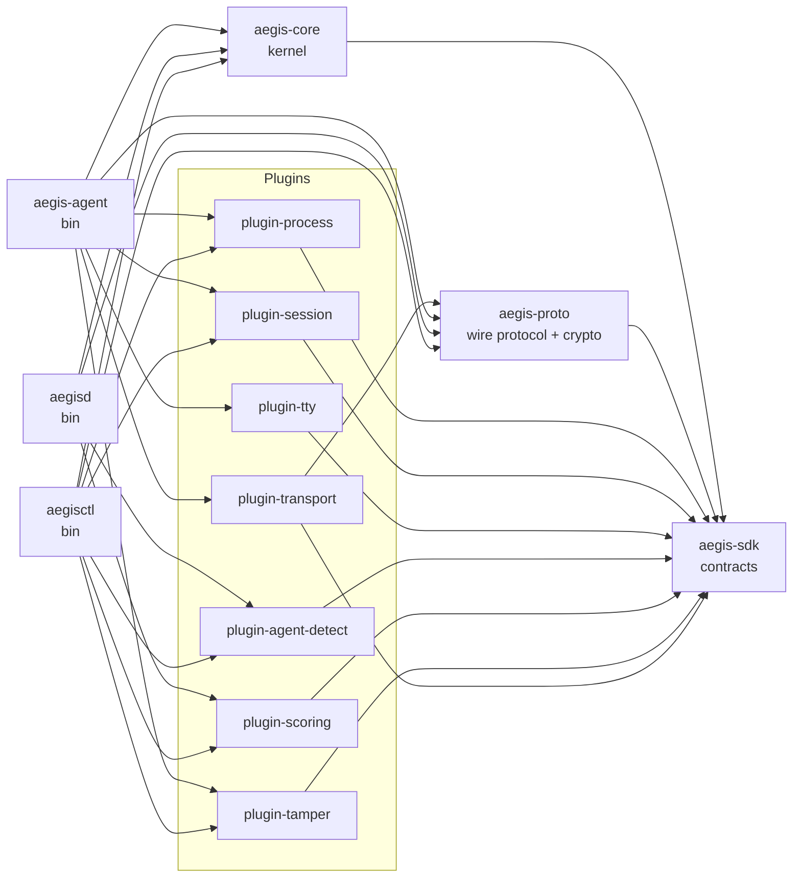
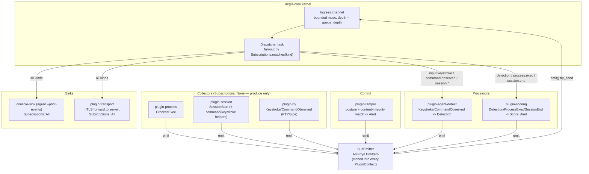
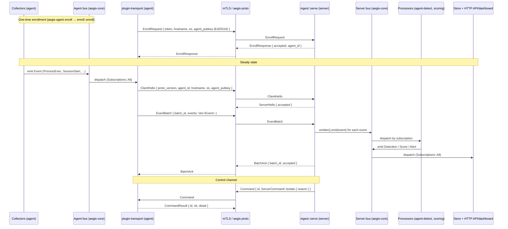
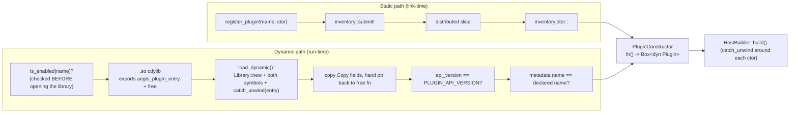
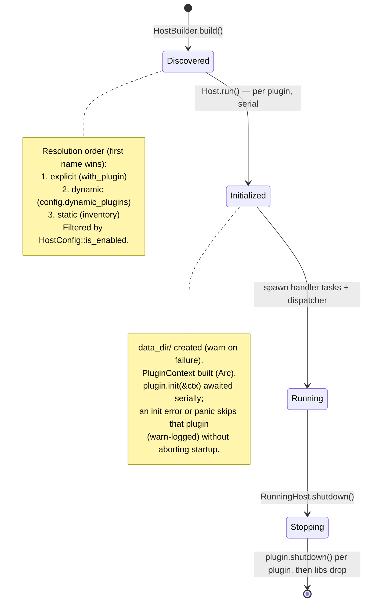
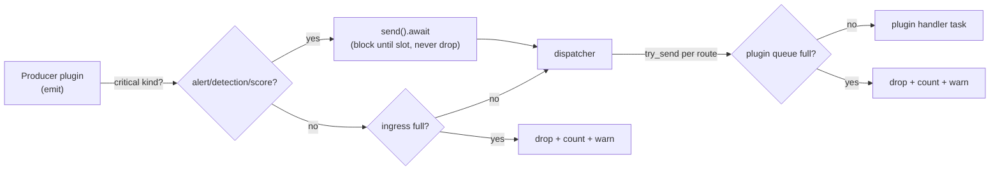
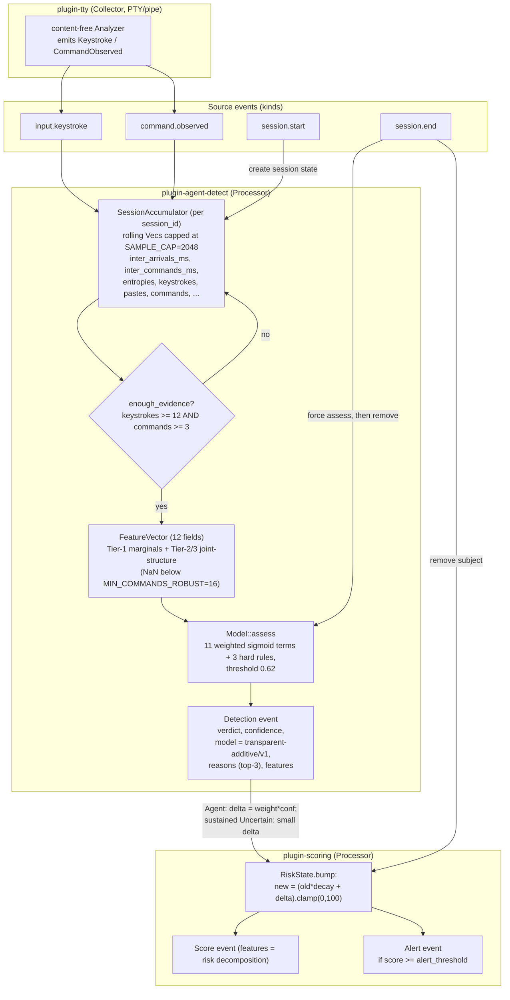
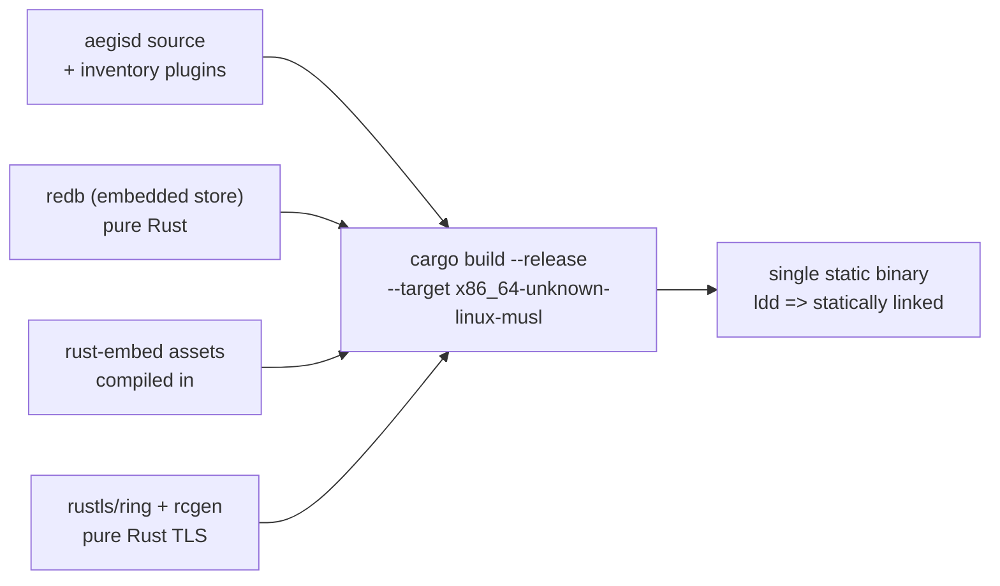
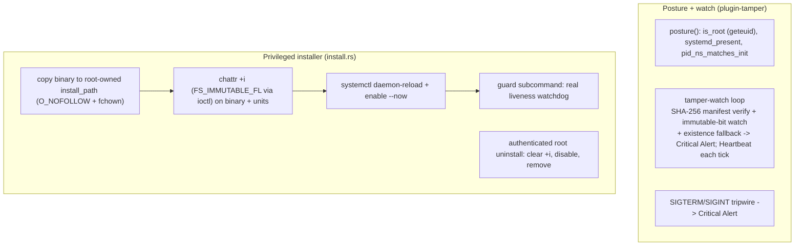

# Aegis Architecture

Aegis is a plugin-native, client/server platform for **behavioral
insider-threat modeling**. Its flagship capability is distinguishing an
**automated agent** from a **human operator** at a Linux endpoint, using only
*timing and structure* telemetry — never keystroke content.

This document describes the architecture **as it exists in the source tree**.
The roadmap of concrete next steps is at the end.

> Scope note: this is an active research prototype, but the end-to-end platform
> is now implemented and tested. The *kernel*, the *event model*, the *plugin
> contract*, the *wire protocol*, and the *seven built-in plugins* are
> implemented and unit-tested. The network layer (TLS 1.3 ingest listener,
> mTLS+Ed25519 forwarder), enrollment, persistence (redb), the operator
> dashboard, and the privileged installer/guardian are **implemented and
> exercised** — including an end-to-end integration test that drives synthetic
> keystroke/command telemetry through the real bus into a Detection → Score →
> Alert (`crates/aegis-integration-tests/tests/pipeline.rs`). See
> [Implementation status](#implementation-status). The genuinely open items are
> a small set of hardening gaps tracked in the ADR (most prominently a
> signature/hash integrity gate on dynamically loaded `.so` plugins).

---

## Table of contents

1. [Overview and design axioms](#overview-and-design-axioms)
2. [Workspace layout](#workspace-layout)
3. [Component diagram](#component-diagram)
4. [Data flow: agent → server](#data-flow-agent--server)
5. [The event model](#the-event-model)
6. [The plugin model](#the-plugin-model)
7. [Plugin lifecycle](#plugin-lifecycle)
8. [Subscriptions, routing, and back-pressure](#subscriptions-routing-and-back-pressure)
9. [The agent-vs-human detection pipeline](#the-agent-vs-human-detection-pipeline)
10. [The self-contained server](#the-self-contained-server)
11. [Tamper-resistance approach](#tamper-resistance-approach)
12. [Extension guide: a feature is a plugin](#extension-guide-a-feature-is-a-plugin)
13. [Implementation status](#implementation-status)
14. [Architecture Decision Record](#architecture-decision-record)

---

## Overview and design axioms

Two axioms, stated in `crates/aegis-sdk/src/lib.rs`, drive every other choice:

- **Everything is an `Event`.** Telemetry, derived signals, scores, detections,
  and alerts all share one envelope (`aegis_sdk::Event`) and travel one bus.
- **Everything is a `Plugin`.** The kernel (`aegis-core`) implements *no*
  features. It discovers plugins, wires them onto the bus, routes events by
  subscription, and manages lifecycle. Detection, scoring, collection,
  transport, persistence, and even endpoint self-protection are all plugins.

A strict dependency layering enforces this: `aegis-sdk` (contracts) ← `aegis-core`
(kernel) ← binaries. Plugins depend **only** on `aegis-sdk`, never on the
kernel, so a plugin can never reach into core internals.

The system is a three-binary client/server deployment:

| Binary | Crate | Role |
|--------|-------|------|
| `aegis-agent` | `crates/aegis-agent` | Endpoint client. Runs collector + self-protection plugins; forwards telemetry over mTLS (`plugin-transport`); enrolls (`enroll` subcommand); provides the tamper-resistant install/uninstall/guard lifecycle and an instrumented `shell` subcommand. |
| `aegisd` | `crates/aegis-server` | Server. A single self-contained static binary that ingests telemetry over a TLS-1.3 listener, runs the central detection/scoring processors, persists to an embedded redb store, and serves the operator HTTP API/dashboard. It binds both the `--listen` (ingest) and `--http` (API) sockets. |
| `aegisctl` | `crates/aegis-cli` | Management CLI. Today: plugin introspection and version reporting. |

---

## Workspace layout

```
crates/
  aegis-sdk     Stable contracts: Event model + Plugin trait/registration. No features.
  aegis-core    The kernel: plugin host, event bus, static + dynamic loaders, config.
  aegis-proto   Wire protocol + crypto: length-prefixed JSON frames, agent↔server
                message grammar, TLS-1.3 config, SHA-256 cert pinning, Ed25519 auth.
  aegis-agent   Endpoint client binary (aegis-agent).
  aegis-server  Self-contained server binary (aegisd): store, ingest, enroll, api, dashboard.
  aegis-cli     Management CLI (aegisctl).
  aegis-integration-tests  End-to-end pipeline + dynamic-loader tests over the real bus.
  example-plugin           Reference out-of-tree plugin.
plugins/
  plugin-process       Collector: process-execution telemetry (/proc sampler).
  plugin-session       Collector: session lifecycle (SessionStart) + content-free
                       command/keystroke summary helpers reused by other collectors.
  plugin-tty           Collector: interactive-shell keystroke/command telemetry via a
                       PTY (shell mode) or a timestamped pipe (CI mode); content-free.
  plugin-agent-detect  Processor: the agent-vs-human distinction (flagship).
  plugin-scoring       Processor: per-subject decaying risk aggregation + alerting.
  plugin-tamper        Control: endpoint self-protection (posture + content-integrity
                       tamper watch + privileged installer/guardian).
  plugin-transport     Sink: mTLS forwarder to the server (ring buffer + disk spill,
                       Ed25519 session auth); Subscriptions::All.
```

Dependency direction (arrows point at the dependency):



`plugin-transport` is the one plugin that depends on `aegis-proto` (it speaks the
wire protocol); all other plugins depend only on `aegis-sdk`.

A binary "links in" a plugin with `use plugin_x as _;`. The empty import forces
the linker to include the crate, which runs its `inventory::submit!` so the
kernel discovers it at startup — no registry file and no explicit registration
call.

---

## Component diagram

The kernel owns a single ingress channel and a dispatcher. Each plugin gets its
own bounded queue and its own task. Plugins emit back onto the same ingress, so
a processor's derived events (e.g. `Detection`) re-enter the bus and reach other
plugins (e.g. `plugin-scoring`).



Notes that match the code exactly:

- Collectors (`plugin-process`, `plugin-session`, `plugin-tty`) and
  `plugin-tamper` declare `Subscriptions::None`: they are pure producers and run
  background tasks spawned in `init()`. `plugin-tty` defaults to `mode = "off"`
  and is inert unless explicitly enabled (it would otherwise seize the terminal).
- `plugin-agent-detect` subscribes to `input.keystroke`, `command.observed`,
  `session.start`, `session.end`.
- `plugin-scoring` subscribes to `detection`, `process.exec`, `session.end`. The
  `session.end` arm evicts the session's accumulated risk; there is no `alert`
  subscription (the old no-op arm was removed).
- `plugin-transport` subscribes to `Subscriptions::All` and forwards every event
  to the server over mTLS.
- `console-sink` is an inline `Plugin` defined in `aegis-agent/src/main.rs`,
  added via `HostBuilder::with_plugin` when `--print-events` is passed.

---

## Data flow: agent → server

The wire protocol (`aegis-proto`) is fully specified and unit-tested, and the
network *plumbing* that uses it is implemented: a forwarder Sink on the agent
(`plugin-transport`) and a TLS-1.3 ingest listener on the server
(`aegis-server::ingest::serve`). The diagram below shows the end-to-end flow.



Key protocol facts (`crates/aegis-proto/src/lib.rs`):

- Framing is a `u32` big-endian length prefix followed by JSON bytes. JSON is
  deliberate: `EventPayload::Custom(serde_json::Value)` is self-describing and
  would not round-trip through a non-self-describing binary format.
- `PROTO_VERSION: u16 = 1`; `MAX_FRAME_BYTES = 16 * 1024 * 1024` bounds the
  receive path. `read_message`/`write_message` are generic over any
  `AsyncRead`/`AsyncWrite + Unpin`, so they layer cleanly over a `tokio-rustls`
  stream.
- Two-phase identity: `EnrollRequest`/`EnrollResponse` (first contact, one-time
  token, carries the agent's 32-byte Ed25519 public key) vs.
  `ClientHello`/`ServerHello` (per-session handshake on an already-enrolled
  connection). Transport security is layered under this grammar and **is now
  implemented**: `aegis-proto::tls` builds a TLS-1.3-only config, `aegis-proto::pin`
  pins the server cert by SHA-256 fingerprint, and the session is authenticated by
  an Ed25519 challenge-response bound to the served leaf's pin (with RFC-5705
  channel binding) — see `plugins/plugin-transport/src/actor.rs` and
  `crates/aegis-server/src/ingest.rs`.
- The server→agent control channel is `Message::Command { id, ServerCommand }`
  with `ServerCommand` = `Rescore`, `SetConfig`, `Isolate`, `Noop`; the agent
  replies with `CommandResult`.

`aegis-proto` is intentionally **not** part of the in-process bus machinery — it
is the transport-layer wire format, used by the `plugin-transport` forwarder and
the server ingest listener only. The two buses (agent and server) are entirely separate in-process
event buses bridged by the network.

---

## The event model

Defined in `crates/aegis-sdk/src/event.rs`. The unit of information is `Event`:

```rust
pub struct Event {
    pub id: Uuid,
    pub ts_ns: u64,          // producer timestamp, ns since Unix epoch
    pub agent_id: AgentId,   // enrolled endpoint identity (String)
    pub source: String,      // producing plugin name, or "host"
    pub kind: String,        // routing topic, e.g. "command.observed"
    pub payload: EventPayload,
    pub labels: BTreeMap<String, String>,
}
```

`EventPayload` is a serde-tagged enum (`#[serde(tag = "type", rename_all =
"snake_case")]`). The variants and their canonical routing kinds
(`EventPayload::default_kind()`) are:

| Variant | `kind` | Key fields |
|---------|--------|-----------|
| `ProcessExec` | `process.exec` | `pid, ppid, uid, exe, cmdline, cwd` |
| `SessionStart` | `session.start` | `session_id, tty, user, remote` |
| `SessionEnd` | `session.end` | `session_id` |
| `Keystroke` | `input.keystroke` | `session_id, inter_arrival_ns, is_paste, burst_len` |
| `CommandObserved` | `command.observed` | `session_id, command_len, token_count, shannon_entropy, had_backspace, edit_distance_prev, inter_command_ns, command_hash` |
| `Score` | `score` | `subject, model, score, features: BTreeMap<String,f64>` |
| `Detection` | `detection` | `subject, verdict, confidence, model, reasons, features` |
| `Alert` | `alert` | `severity, title, detail, subject` |
| `Heartbeat` | `heartbeat` | `uptime_s` |
| `Custom(serde_json::Value)` | `custom` | arbitrary plugin-defined payload |

Supporting types:

- `Verdict` — `Human | Agent | Uncertain` (implements `Display`).
- `Severity` — ordered `Info < Low < Medium < High < Critical`.
- `AgentId = String`, `SessionId = String`.
- `now_ns() -> u64` — wall-clock nanoseconds since the Unix epoch.

Builders: `Event::new(agent_id, source, payload)` derives `kind` from
`payload.default_kind()` and stamps `ts_ns`; `Event::with_label(k, v)` and
`Event::with_kind(kind)` are chainable.

### Privacy by design

The event model encodes the content-free constraint structurally:

- `Keystroke` carries **only** inter-arrival timing, a paste/burst flag, and the
  burst length. There is no field for character content.
- `CommandObserved` carries structural statistics plus a **salted hash**
  (`command_hash`) for cross-session correlation — never the verbatim command.

`Custom` is the explicit escape hatch: third-party plugins can introduce new
event types without an SDK change, and (because the wire format is JSON) those
events round-trip over the network transparently.

---

## The plugin model

Defined in `crates/aegis-sdk/src/plugin.rs`. A plugin implements one async
trait:

```rust
#[async_trait]
pub trait Plugin: Send + Sync {
    fn metadata(&self) -> PluginMetadata;
    fn subscriptions(&self) -> Subscriptions { Subscriptions::None }
    async fn init(&mut self, _ctx: &PluginContext) -> anyhow::Result<()> { Ok(()) }
    async fn handle(&self, _event: &Event, _ctx: &PluginContext) -> anyhow::Result<()> { Ok(()) }
    async fn shutdown(&self) -> anyhow::Result<()> { Ok(()) }
}
```

`PluginMetadata { name, version, description, kind, api_version }` carries a
`PluginKind` (`Collector | Processor | Sink | Control`) used for operator
display; `PluginMetadata::new(...)` stamps `api_version = PLUGIN_API_VERSION`.

`PluginContext` is the per-plugin runtime handle passed to `init` and `handle`:

```rust
pub struct PluginContext {
    pub agent_id: String,
    pub data_dir: PathBuf,       // private dir: <host data_dir>/<plugin name>
    pub config: serde_json::Value,
    pub emitter: Arc<dyn Emitter>,
}
```

`config_as::<T: DeserializeOwned + Default>()` deserializes the plugin's config
subtree, falling back to `T::default()` when the subtree is JSON `null` — so
per-plugin config is fully optional. `emit(event)` publishes back onto the bus.

A critical contract detail: **`handle` takes `&self`, not `&mut self`.** Handler
tasks run concurrently, so any stateful plugin uses interior mutability —
`plugin-agent-detect` and `plugin-scoring` both wrap state in
`Arc<Mutex<...>>`. `init` takes `&mut self` and runs exactly once *before* the
plugin is shared (`Arc`-wrapped), giving a single safe setup window. Collectors
spawn their producer task in `init()` after cloning `ctx.emitter`.

### Two registration paths, one constructor

Both paths converge on the same `PluginConstructor = fn() -> Box<dyn Plugin>`.

**Static (the default for built-ins):** the `register_plugin!` macro submits a
`PluginRegistration { api_version, name, constructor }` to an `inventory`
distributed slice at link time. `inventory::collect!(PluginRegistration)` (in
the SDK) is the collection point; the kernel iterates
`inventory::iter::<PluginRegistration>` at startup. The SDK re-exports
`inventory` so plugin crates need no direct `inventory` dependency. All seven
built-in plugins register this way, e.g.:

```rust
register_plugin!("plugin-process", || Box::new(ProcessPlugin::default()));
```

**Dynamic (cdylib):** a shared object exports a C-ABI entrypoint named by
`DYN_ENTRY_SYMBOL` (`b"aegis_plugin_entry"`) returning `*mut DynPluginRegistration`,
**and** a paired free function named by `DYN_FREE_SYMBOL`. The
`#[repr(C)] DynPluginRegistration { api_version, constructor }` is returned across
the ABI. `aegis-core::loader::load_dynamic(path)` looks up both symbols (so it
never calls the entrypoint without a way to free what it returns), wraps the
entrypoint call in `catch_unwind` (an unwind across `extern "C"` is UB),
null-checks the pointer, **copies the `Copy` fields out and hands the pointer back
to the plugin's free function** — it does *not* take ownership via `Box::from_raw`,
which would free the allocation with the host's allocator (UB across mixed
toolchains). It then validates `api_version == PLUGIN_API_VERSION` and returns a
`DynamicPlugin { library, constructor }` that keeps the `libloading::Library`
mapped.



> Safety: a dynamic `.so` runs **in-process with full host privileges**. The host
> now checks enablement *before* opening the library (a disabled-but-listed path is
> never `dlopen`ed), wraps the entrypoint and every constructor in `catch_unwind`,
> rejects a `.so` whose reported metadata name does not match its declared name, and
> frees the registration in the plugin's own allocator. The ABI-version handshake
> still cannot make untrusted code *safe*, and there is currently **no signature or
> content-hash integrity gate** on the path — `loader.rs` documents that only
> trusted, integrity-checked paths should be loaded, but does not enforce it. This
> is the most significant open hardening item (see the ADR).

### ABI version handling is asymmetric

`PLUGIN_API_VERSION: u32 = 1` is checked in two places with different strictness:

- **Static** (`HostBuilder::build`): a mismatch logs `tracing::warn` and
  **skips** the plugin (lenient).
- **Dynamic** (`load_dynamic`): a mismatch `bail!`s with an error (strict).

This asymmetry is worth noting: a statically-linked plugin whose
`PLUGIN_API_VERSION` does not match the host disappears silently with only a warn
log, even though a compiled-in ABI mismatch is arguably *more* dangerous (the
vtable layout may be incompatible). See the ADR.

---

## Plugin lifecycle

The host has three stages: **discovery** (`HostBuilder` / `Host`), **run**
(`Host::run -> RunningHost`), and **shutdown**.



Details from `crates/aegis-core/src/host.rs`:

1. **Discovery & precedence.** `HostBuilder::build()` resolves three sources in
   order — explicit (`with_plugin`) > dynamic (`config.dynamic_plugins`) >
   static (`inventory`) — using a `HashSet<String>` of seen names so the **first
   occurrence of a name wins**. `HostConfig::is_enabled(name)` filters each
   candidate (disabled list always wins; an `enabled_plugins` allowlist, if
   `Some`, is strict).

2. **Init.** `Host::run()` creates the ingress channel sized to
   `config.queue_depth`, then for each plugin: creates `data_dir/<name>`
   (`create_dir_all`; failure is warn-logged, not fatal), builds an
   `Arc<PluginContext>`, and awaits `plugin.init(&ctx)` **serially**. Both an
   `Err` return and a panic during `init` are caught by `catch_unwind`, logged
   at `warn`, and the plugin is **skipped** — one bad plugin does not abort
   startup for the rest. (This is the M8 audit fix; previously an init error
   would unwind `run`.)

3. **Run.** After init, each plugin is converted to `Arc<dyn Plugin>` and gets
   its own bounded `mpsc::channel::<Event>(queue_depth)` drained by its own
   `tokio::spawn` task. A single dispatcher task drains the ingress and fans out.
   Both the dispatcher and each handler `select!` on a `watch::channel<bool>`
   shutdown signal.

4. **Shutdown.** `RunningHost::shutdown()` sends `true` on the watch channel,
   awaits the dispatcher join handle, awaits all handler join handles, then calls
   `plugin.shutdown()` on each entry **sequentially**. The
   `_libs: Vec<libloading::Library>` field is declared **last** on `RunningHost`
   so dynamic plugin code stays mapped until all plugin `Arc`s and tasks have
   dropped.

`RunningHost::emitter() -> Arc<dyn Emitter>` exposes a cloneable handle for
feeding **external** events into the bus — this is the documented injection point
a network ingest plugin would use.

---

## Subscriptions, routing, and back-pressure

### Subscriptions

`Subscriptions` is `All | None | Kinds(HashSet<String>)`.
`Subscriptions::matches(kind)` decides delivery; `Subscriptions::kinds(iter)`
builds the `Kinds` set. A plugin's `subscriptions()` is read once at run time and
stored alongside its queue sender.

### Routing

The dispatcher (in `host.rs`) loops over `(Subscriptions, mpsc::Sender<Event>)`
routes; for each event it `try_send`s a clone to every plugin whose
subscription matches `event.kind`. Each plugin drains its own queue on its own
task, so a slow plugin back-pressures **only itself** and never head-of-line
blocks the others.

Because processors emit derived events back onto the same ingress, the bus is
effectively a feedback loop: `plugin-agent-detect` emits `Detection`, which the
dispatcher then routes to `plugin-scoring`. There is **no ordering or dependency
declaration** between plugins — delivery across independent per-plugin queues is
only eventually consistent. This is acceptable for the current processors
(scoring is decay-based and order-insensitive) but is a known limitation for any
future plugin needing strict causal ordering.

### Back-pressure: drop low-value telemetry, block on security-critical kinds

The bus splits its two write points by event criticality. `is_critical_kind`
(`bus.rs`) flags `alert`, `detection`, and `score`:

- **Security-critical kinds (`alert`/`detection`/`score`)** take a *non-droppable*
  path at the ingress: `BusEmitter::emit` uses `tx.send().await` (back-pressure —
  await a slot) rather than dropping. This closes the "flood cheap telemetry to
  evict the alert that would catch it" primitive: a burst of keystrokes can no
  longer silently displace a `Detection`/`Alert`/`Score`.
- **Low-value telemetry (everything else, e.g. `input.keystroke`, `heartbeat`)**
  stays non-blocking: `emit` uses `try_send` and drops on a full queue, bounding
  memory under saturation.
- The dispatcher's per-plugin fan-out (`host.rs`) uses `try_send` and drops on a
  full per-plugin queue.

**Every drop is counted.** `BusMetrics` (`bus.rs`) holds lock-free atomic
counters — `ingress_dropped` (full + closed) and `fanout_dropped` — exposed via
`RunningHost::bus_metrics()`, so telemetry loss is observable and alertable rather
than a silent log line. A `Closed` ingress drop (the shutdown window) now logs at
`warn` with the event kind too.



This bounds memory under saturation while guaranteeing delivery of the detection
outputs. Biased loss of low-value telemetry (e.g. dropping fast keystrokes) could
still skew the `keystroke_cv` feature under extreme load, which is why the drop
counters exist and `HostConfig::queue_depth` (default `4096`) is tunable; the
critical kinds are protected regardless of the queue depth.

---

## The agent-vs-human detection pipeline

This is the flagship capability, implemented across `plugins/plugin-agent-detect`
(`features.rs`, `model.rs`, `lib.rs`) and `plugins/plugin-scoring`.



### Feature extraction (`features.rs`)

Per `session_id`, a `SessionAccumulator` collects raw observations.
`record_keystroke` discards inter-arrivals outside `(0, 60_000) ms` as noise;
`record_command` discards inter-command gaps outside `(0, 3_600_000) ms`. The raw
sample `Vec`s are bounded to a rolling window of the most-recent `SAMPLE_CAP =
2048` samples, so an attacker-chosen unbounded session cannot exhaust memory.
`enough_evidence()` gates on `MIN_KEYSTROKES = 12` and `MIN_COMMANDS = 3`.

`features()` returns `Option<FeatureVector>` (None until the gate passes). The
vector carries twelve fields in two tiers — six cheap first-moment **Tier-1
marginals**, and six **Tier-2/3 joint-structure** features (the latter four of
which require `MIN_COMMANDS_ROBUST = 16` command gaps and are `NaN` until then):

| Feature | Tier | Meaning / intuition |
|---------|------|---------------------|
| `keystroke_cv` | 1 | Coefficient of variation (std/mean) of inter-keystroke timing. Humans are bursty/irregular (high CV); automation is metronomic (low CV). |
| `paste_ratio` | 1 | Fraction of commands delivered as atomic pastes/bursts. |
| `mean_inter_command_ms` | 1 | Mean think time between commands (humans read output; agents react). |
| `backspace_ratio` | 1 | Fraction of commands composed with corrections (humans err). |
| `entropy_mean` | 1 | Mean Shannon entropy of commands. |
| `cadence_regularity` | 1 | `1 - min(1, CV of inter-command timing)` — clockwork cadence ⇒ agent. |
| `gap_autocorr` | 3 | Lag-1 autocorrelation of think times. i.i.d. injected delays score ≈0 (agent); genuine humans show 0.1–0.6. Traps the cheapest timing evasion. |
| `think_tail_ratio` | 3 | Heaviness of the think-time tail. Constant/uniform padding ⇒ ratio ≈1 (agent); genuine heavy tails ⇒ ≫1. |
| `throughput_decay` | 3 | Slope of throughput over the session. Human fatigue ⇒ negative; flat/positive ⇒ agent. |
| `reaction_floor_hits` | 2 | Fraction of non-paste command gaps below the ~150 ms physiological floor. |
| `whole_line_paste_ratio` | 2 | Fraction of commands delivered as a single atomic line (agent-shaped). |
| `keystroke_burst_cv` | 3 | Within-burst keystroke CV; corroborates char-by-char fakes. |

`FeatureVector::to_map()` flattens to a labelled `BTreeMap<String, f64>` for the
`Detection` event's `features` field (explainability). It **skips non-finite
values** (`is_finite` guard), so a short session's `NaN` Tier-3 features cannot
make the `Detection` payload fail to serialize.

### The model (`model.rs`)

A deliberately **transparent additive model**. Each feature is mapped to an
"agent-evidence" value in `[0,1]` by a logistic transfer (`sigmoid`) with a
documented center/slope, then combined as a weighted average. The model has been
**re-weighted to favor evasion-robust signals**: because the Tier-1 marginals are
cheap to forge (an evader injecting i.i.d. padding/jitter matches all of them and
historically slipped to `Human`), they are *demoted* to a combined ≈0.24 and the
bulk of the weight (≈0.66) sits on the Tier-2/3 joint-structure terms an
i.i.d.-delay evader cannot reproduce. Eleven terms (weights nominally sum to 1.0
before NaN-renormalization):

| Term | Weight | Evidence |
|------|--------|----------|
| `metronomic-typing` | 0.06 | `sigmoid(8.0 * (0.45 - keystroke_cv))` |
| `paste-injection` | 0.04 | `paste_ratio.clamp(0,1)` |
| `instant-reaction` | 0.10 | `sigmoid(0.004 * (1000 - mean_inter_command_ms))` |
| `errorless-input` | 0.04 | `sigmoid(40.0 * (0.06 - backspace_ratio))` |
| `dense-commands` | 0.02 | `sigmoid(3.0 * (entropy_mean - 4.2))` |
| `regular-cadence` | 0.04 | `cadence_regularity.clamp(0,1)` |
| `gap-non-autocorrelation` | 0.22 | `sigmoid(6.0 * (0.18 - gap_autocorr))` |
| `constant-think-time` | 0.12 | `sigmoid(2.2 * (2.0 - think_tail_ratio))` |
| `no-throughput-decay` | 0.14 | `sigmoid(4.0 * (throughput_decay + 0.05))` |
| `whole-line-injection` | 0.12 | `whole_line_paste_ratio.clamp(0,1)` |
| `burst-metronome` | 0.06 | `sigmoid(8.0 * (0.30 - keystroke_burst_cv))` |

**NaN handling:** any term whose evidence is `NaN` (a Tier-3 feature on a short
session) is dropped and the weighted average renormalizes over the surviving
terms, so a short session leans on the hard-rule inputs and Tier-1 remnants → more
`Uncertain` by design (false-positive-protecting).

**Hard rules (asymmetric ratchet):** after the weighted average, a small set of
explainable rules can only ever *raise* `p_agent` (noisy-OR), never lower it:
(1) sustained sub-floor reaction (`reaction_floor_hits >= 0.25`) co-occurring with
whole-line delivery (`>= 0.5`) ⇒ `p_agent` floored at 0.92; (2) sustained sub-floor
non-paste reaction alone (`reaction_floor_hits >= 0.25`, a minimum-evidence gate so
a single isolated slip does not force a verdict) ⇒ floored at 0.80; (3) the full
i.i.d.-evader signature (near-zero autocorrelation **and** flat throughput **and** a
narrow think-time tail simultaneously) ⇒ floored at 0.72. A genuine human with a
heavy think-time tail never trips rule 3.

`Model::assess` produces `p_agent`, a `Verdict`
(`>= agent_threshold (0.62)` ⇒ Agent; `<= human_threshold (0.35)` ⇒ Human;
between ⇒ Uncertain), a `confidence`, and up to three `reasons` (hard-rule reasons
lead, then the strongest contributors). The thresholds are documented as
**FPR-budgeted** — a field deployment should re-derive `agent_threshold` from the
(1−α) quantile of its own human-only `p_agent` distribution. The coefficients are
**hand-calibrated constants**, not learned; the `Model::assess` interface is
designed to be swappable for a learned model behind the same shape.

### Verdict-driven scoring (`plugin-scoring`)

`plugin-scoring` subscribes to `detection`, `process.exec`, `session.end`:

- **`Detection` with `Verdict::Agent`:** `delta = agent_detection_weight (60.0) *
  confidence`; subject is the detection's `subject` (the `session_id`).
- **`Detection` with `Verdict::Uncertain`** (above `uncertain_min_confidence`,
  default 0.5): `delta = uncertain_detection_weight (6.0) * confidence` — a small,
  decaying increment. An isolated `Uncertain` decays away harmlessly, but a session
  that *persistently* camps the dead band (where `Uncertain` confidence peaks)
  accumulates faster than it decays and climbs toward an alert. This makes the old
  "dead-band camping" evasion actionable.
- **`ProcessExec`:** subject is `"uid:{uid}"`; `delta = process_weight (5.0)`,
  multiplied by 3 for a suspicious executable (`nc, ncat, socat, nmap, tcpdump,
  scp, rsync, curl, wget, base64, openssl, gpg`).
- **`SessionEnd`:** removes the session's accumulated risk from the map (so
  session-keyed subjects don't linger).

After each bump, `RiskState.bump` applies `new = (old*decay + delta).clamp(0,
100)` (`decay = 0.98`, range-validated in `init`), emits a `Score` event, and emits
an `Alert` (severity from `severity_for`: `>=90` Critical, `>=75` High, else Medium)
when `score >= alert_threshold (75.0)`. A subject whose score decays below a
negligible floor is evicted, so the map cannot grow without bound across many
short-lived subjects.

`Score.features` now carries the **risk decomposition** (`risk_score`, `delta`,
`decay`, plus `source_confidence` / `verdict_agentness` for detection-sourced
bumps), so the dashboard can explain a score. One quirk remains, noted in the ADR:
the `Detection` subject (`session_id`) and `ProcessExec` subject (`"uid:{uid}"`)
live in **disjoint namespaces**, so a detected agent session and that user's
suspicious process executions accumulate into separate scores rather than
compounding.

### End-to-end: the pipeline is live and tested

`plugin-tty` emits `Keystroke` / `CommandObserved` (its content-free `Analyzer`,
driven either by a real PTY in `mode = "shell"` or a timestamped pipe in
`mode = "pipe"`), which feed `plugin-agent-detect` → `Detection` →
`plugin-scoring` → `Score` / `Alert`. The integration test
`crates/aegis-integration-tests/tests/pipeline.rs`
(`agent_session_yields_detection_score_and_alert`) drives synthetic agent
telemetry through the **real** `aegis-core` bus (the same processors the server
loads) and asserts the full Keystroke/CommandObserved → Detection(Agent) → Score →
Alert flow, including host-asserted `source` provenance and the populated
`Score.features`. A companion test asserts a human session is never classified
`Agent`. The only collector that did *not* exist when this section was first
written — a tty/pty collector — is now `plugin-tty`.

> Caveat on fidelity (preserved from the threat model): `plugin-tty` reconstructs
> behavioral statistics from a **PTY** (shell mode) or a pipe (CI). This is
> userspace interception, not a kernel-boundary (eBPF/HID) source, so the timing
> it reports is still a self-reported scalar an adversary co-resident in the same
> session could in principle shape. The model's re-weighting toward joint-structure
> features raises the cost of that shaping, but moving to un-forgeable signals
> remains future work (see THREAT_MODEL §5.1).

### Historical note: the collector gap (now closed)

`plugin-agent-detect` subscribes to `input.keystroke` and `command.observed`.
Earlier in development **no plugin emitted those kinds** — `plugin-session` emits a
single `SessionStart` at startup (derived from `$USER`, `$SSH_TTY`/`$TTY`,
`$SSH_CONNECTION`) and exports `command_stats()` / `shannon_entropy()` helpers, but
does no live interception. That gap — once the single highest-leverage item on the
roadmap — is now **closed** by `plugin-tty`, which emits `Keystroke` /
`CommandObserved` from a PTY or pipe; `enough_evidence()` passes and the full
verdict-driven path fires (see the integration test above). `plugin-session`
remains as a lightweight session-lifecycle collector and a library of content-free
summary helpers.

---

## The self-contained server

`aegisd` is required to ship as **a single, self-contained, statically-linked
binary**: no external database and no runtime asset directory. The architecture
chooses pure-Rust, musl-friendly dependencies throughout to make that possible.

### Embedded store (implemented)

`redb` (a pure-Rust embedded ACID key-value store, no C dependency) is the
server's durable persistence layer, **implemented** in
`crates/aegis-server/src/store.rs` as a single file `{data_dir}/aegis.redb`. It
materializes tables for `events` (keyed by `composite_key(ts_ns, id)`),
`events_by_agent` (a secondary index for the operator pagination API),
`detections`, `scores`, `alerts`, `agents`, and `enroll_tokens`. The in-host
`StoreSink` (`sink.rs`, `Subscriptions::All`) persists derived telemetry
(detections/scores/alerts/heartbeats), and the ingest path writes raw agent
telemetry. A background compaction task prunes old `events`/`alerts` past a
retention window and **prunes the `events_by_agent` index in the same write
transaction**, so the pagination API does not accumulate stale pointers.

> Note: `plugin-scoring`'s in-process `RiskState` is still an in-memory `HashMap`
> (it evicts decayed/ended subjects but resets on restart). Server-side *history*
> now survives restart via the store; replaying it into the live risk scores
> (`ServerCommand::Rescore` over stored history) remains future work.

### Embedded assets (implemented)

`axum`, `tower`, `rust-embed`, and `mime_guess` back the operator HTTP
API/dashboard, **implemented** in `crates/aegis-server/src/api.rs` (the JSON
`/api/v1/...` routes) and `dashboard.rs` (the SPA). `rust_embed::RustEmbed`
compiles the dashboard bundle **into** the binary, satisfying the "no runtime
asset directory" constraint; the dashboard is wired as the axum `Router` fallback
with an SPA-aware handler. `aegisd` binds **both** sockets: `--listen` for the TLS
ingest listener (`ingest::serve`) and `--http` for the API/dashboard
(`api::serve`).

### Static musl linking

- `rust-toolchain.toml` pins channel `1.92.0` and includes the
  `x86_64-unknown-linux-musl` target.
- The crypto/TLS stack is `rustls` + `ring` (`default-features = false`),
  `tokio-rustls` + `ring`, and `rcgen` + `ring` — pure-Rust, no OpenSSL — so a
  static build does not need to link a system TLS library.
- `Cargo.toml` defines `[profile.release]` (`opt-level = 3`, `lto = "thin"`,
  `codegen-units = 1`, `strip = true`, `panic = "abort"`) and `[profile.dist]`
  (`inherits = "release"`, `lto = "fat"`) for the smallest release artifact.



> Status: CI (`.github/workflows/ci.yml`) has a `static-server` job that builds
> `aegisd` for `x86_64-unknown-linux-musl` (installing `musl-tools` for the
> linker) and asserts the result with `ldd ... => statically linked`, uploading
> the binary as an artifact. Gaps that remain: there is no `.cargo/config.toml`
> pinning the musl cross-linker (CI relies on `musl-tools` instead), and
> `aegisd`'s doc comment references a `BUILD.md` that does not exist. One caveat
> to document: a static musl binary cannot safely `dlopen` a glibc-linked `.so`,
> so **dynamic plugins for a musl server must also be built for musl.**

---

## Tamper-resistance approach

The protected asset is **monitoring visibility**. In an insider-threat
deployment the monitored (typically unprivileged) user must not be able to
silently disable monitoring on their own workstation — the same property
commercial EDR/DLP agents provide. The approach uses **supported OS mechanisms
only**; it is explicitly **not a rootkit**, uses no kernel exploits and no
process hiding, and always retains an **authenticated root/administrator
uninstall** path. (See `docs/THREAT_MODEL.md`.)

Self-protection is expressed as a plugin (`plugin-tamper`, `PluginKind::Control`)
plus a privileged installer — "the agent defends itself" is just another
capability, not core behavior. All layers below are **implemented**:

1. **Posture detection.** `posture()` reports `is_root` (via `geteuid()` — the
   *effective* uid, which is what the privileged operations actually require),
   `systemd_present` (PID 1 `comm == "systemd"`), and `pid_ns_matches_init`
   (compares `/proc/self/ns/pid` to `/proc/1/ns/pid` to detect a
   sandboxed/containerized mis-deployment). At init the plugin emits a `Critical`
   alert enumerating any weakness (not root / no systemd / wrong PID-ns / protected
   files not immutable) rather than failing closed.
2. **Tamper-watch loop.** A task spawned in `init()` runs every `check_interval_s`
   (floored at 1s) and now does **content integrity**, not just existence:
   (a) it verifies each protected file against a SHA-256 **baseline manifest**
   (`manifest::verify`, which uses a `metadata` size pre-filter then a streaming
   hash, so a hostile oversized/same-size replacement is caught without slurping
   the file) — catching in-place replacement; (b) it watches the **immutable bit**
   on each protected path (clearing it required root and is itself auditable
   tampering); (c) it falls back to an existence check for any unmanifested path;
   and (d) it emits a `Heartbeat` each tick so the server can distinguish a
   kill/restart from a network drop. Any drift emits a `Severity::Critical` `Alert`.
   A SIGTERM/SIGINT **tripwire** also emits a `Critical` alert before the process
   exits, so an externally induced stop is reported even when a guardian revives it.
3. **Hardened install/uninstall/guard.** `install.rs` renders two systemd units
   (`render_service_unit` / `render_guardian_unit` from an `InstallSpec`: service
   `aegis-agent`, guardian `aegis-guardian`, install path
   `/usr/local/sbin/aegis-agent`, `User=root`) **and performs the privileged steps**:
   it copies the binary and writes the units/manifest root-owned through
   `O_NOFOLLOW` fds with `fchown`, runs `systemctl daemon-reload` + `enable --now`,
   and sets `FS_IMMUTABLE_FL` (via ioctl, `immutable.rs`) on the binary and units.
   `uninstall()` clears the immutable bit, disables, and removes — the authenticated
   root uninstall path. `guard()` is a real liveness watchdog loop (the `aegis-agent
   guard` subcommand). The service uses `Restart=always`, `RestartSec=1`,
   `OOMScoreAdjust=-900`, `KillMode=process`, and `Requires` the guardian; the
   guardian `BindsTo` the service, so killing one triggers recovery of both.



The decisive mechanism is the **immutable attribute**. With `FS_IMMUTABLE_FL` set
on root-owned files, an unprivileged user cannot modify or delete the binary or
units (clearing the flag needs `CAP_LINUX_IMMUTABLE` ≈ root); root can always
`chattr -i` and uninstall — preserving the authenticated admin uninstall guarantee.
The deployed `run` path injects this hardened layout into `plugin-tamper`'s config
when running as root, so the immutable-bit watch and manifest check are live in the
service.

> By design, the tamper-watch loop is **alert-only**: it reports drift but never
> re-arms the immutable bit or rewrites a drifted file. Clearing the bit or
> replacing a protected file already requires root, and auto-re-arming would race
> the legitimate root uninstall (which clears the bit on purpose). See
> `docs/THREAT_MODEL.md` for the rationale.

---

## Extension guide: a feature is a plugin

Adding any capability — a new collector, a new detector, a sink, a control
function — means **adding a plugin**, never modifying the kernel.

### 1. Create a crate that depends only on `aegis-sdk`

```toml
# plugins/plugin-myfeature/Cargo.toml
[dependencies]
aegis-sdk = { path = "../../crates/aegis-sdk" }
async-trait = "0.1"
anyhow = "1"
tokio = { version = "1", features = ["sync", "time"] }   # if you spawn tasks
serde = { version = "1", features = ["derive"] }          # if you have config
```

Add the crate to the workspace `members` list in the root `Cargo.toml`.

### 2. Implement `Plugin`

```rust
use aegis_sdk::{
    register_plugin, Event, EventPayload, Plugin, PluginContext,
    PluginKind, PluginMetadata, Subscriptions,
};
use async_trait::async_trait;

#[derive(Default)]
pub struct MyPlugin;

#[async_trait]
impl Plugin for MyPlugin {
    fn metadata(&self) -> PluginMetadata {
        PluginMetadata::new(
            "plugin-myfeature",
            env!("CARGO_PKG_VERSION"),
            "what it does",
            PluginKind::Processor, // or Collector / Sink / Control
        )
    }

    // Producers return Subscriptions::None; consumers list kinds.
    fn subscriptions(&self) -> Subscriptions {
        Subscriptions::kinds(["detection", "process.exec"])
    }

    // One-time setup; &mut self. Collectors spawn their producer task here.
    async fn init(&mut self, _ctx: &PluginContext) -> anyhow::Result<()> {
        Ok(())
    }

    // Hot path; &self — use interior mutability (Mutex/DashMap) for state.
    async fn handle(&self, event: &Event, ctx: &PluginContext) -> anyhow::Result<()> {
        if let EventPayload::Detection { subject, .. } = &event.payload {
            ctx.emit(Event::new(
                &ctx.agent_id,
                "plugin-myfeature",
                EventPayload::Alert {
                    severity: aegis_sdk::Severity::Low,
                    title: "example".into(),
                    detail: format!("saw detection for {subject}"),
                    subject: Some(subject.clone()),
                },
            )).await;
        }
        Ok(())
    }
}

register_plugin!("plugin-myfeature", || Box::new(MyPlugin::default()));
```

### 3. Link it into a binary

Add the dependency to the target binary's `Cargo.toml` and force-link it so its
`inventory` registration is included:

```rust
use plugin_myfeature as _;
```

That is the entire integration. `aegisctl plugins` will now list it, and the host
will route the kinds you subscribed to.

### Guidelines that match the existing plugins

- **State:** `handle` is `&self`; hold state behind `Arc<Mutex<...>>`. Drop the
  lock guard **before** any `.await` (as `plugin-agent-detect::maybe_emit` does)
  — never hold a `Mutex` guard across an await point.
- **Config:** define a `#[derive(Default, Serialize, Deserialize)]` config struct
  and read it in `init` via `ctx.config_as()?`. Operators set it under
  `[plugins."plugin-myfeature"]` in the host TOML; absence yields your `Default`.
- **Producers:** clone `ctx.emitter` in `init`, then `tokio::spawn` a loop (see
  `plugin-process` / `plugin-tamper`).
- **Privacy:** never put raw content in an event. Reuse
  `plugin_session::command_stats` / `shannon_entropy` for structural summaries.
- **New event types:** prefer an existing `EventPayload` variant; for genuinely
  novel data use `EventPayload::Custom(serde_json::Value)` rather than changing
  the SDK.
- **Dynamic plugins:** to ship as a separate `.so`, build a `cdylib` exporting
  both `aegis_plugin_entry` (returns a `*mut DynPluginRegistration`) and the paired
  `aegis_plugin_free_registration` free function (so the registration is released by
  its owning allocator, not the host's), and add its path to
  `HostConfig::dynamic_plugins`. See `crates/example-plugin` for a reference cdylib.

---

## Implementation status

| Area | Status |
|------|--------|
| Event model (`aegis-sdk`) | Implemented, tested |
| Plugin trait + static (`inventory`) registration | Implemented, tested |
| Dynamic (cdylib) loader | Implemented, tested (allocator-correct free, `catch_unwind`, enable-before-load, name match; **no signature/hash integrity gate** — see ADR #15) |
| Kernel: discovery, dispatch, lifecycle, back-pressure (+ drop metrics, critical-kind back-pressure, per-plugin source/agent_id stamping) | Implemented, tested |
| Wire protocol (`aegis-proto`) + TLS-1.3 config + SHA-256 pinning + Ed25519 auth | Implemented, tested |
| `plugin-process`, `plugin-session`, `plugin-tamper` (collectors/control) | Implemented, tested |
| `plugin-tty` (keystroke/command capture, PTY shell + pipe modes) | Implemented, tested (real PTY; defaults to `off`) |
| `plugin-agent-detect`, `plugin-scoring` (processors) | Implemented, tested |
| `plugin-transport` (mTLS forwarder, ring + disk spill, Ed25519 session auth) | Implemented, tested |
| End-to-end Detection → Score → Alert over the real bus | Implemented, tested (`aegis-integration-tests/tests/pipeline.rs`) |
| Server ingest listener (TLS-1.3, `--listen`) | Implemented, tested (idle/first-frame timeouts, ts_ns clamp, FIFO + global dedup) |
| Operator HTTP API/dashboard (`--http`, axum + rust-embed) | Implemented (both sockets bound) |
| Enrollment + Ed25519 identity lifecycle | Implemented, tested (one-time token burn, challenge-response) |
| Embedded store (redb) | Implemented, tested (`{data_dir}/aegis.redb`; compaction prunes the secondary index in-txn) |
| Privileged installer (copy, `chattr +i`, systemctl) + guardian watchdog + uninstall | Implemented (`O_NOFOLLOW` + `fchown`; SIGTERM tripwire) |
| Content-integrity tamper-watch (SHA-256 manifest + immutable-bit) | Implemented, tested |
| Static musl build (CI `ldd` static-link assertion) | Implemented (`static-server` job in CI) |
| Dynamic-plugin `.so` signature/hash integrity gate | **Not implemented** (ADR #15 — the one remaining high-leverage gap) |
| Per-deployment `command_hash` salt | **Partial** — still defaults to `"aegis-default-salt"` (ADR #13) |
| Static ABI-version mismatch on static plugins | **Warn-and-skip** (lenient; ADR #20 proposes a hard error) |
| Static musl build config (`.cargo/config.toml`, `BUILD.md`) | **Verify** (CI relies on `musl-tools`; ADR #26) |

The agent↔server data path, the detection pipeline's first link (tty/pty capture),
the persistence layer, the dashboard, enrollment, and the tamper-resistance
enforcement are now all implemented and exercised. The remaining open rows are a
small set of hardening gaps (most importantly the dynamic-loader integrity gate)
tracked in the ADR below.

---

## Architecture Decision Record

Distilled from the cross-discipline round-table review. Priority reflects impact
on making the platform function as designed. "ADR" entries record both
*standing* design decisions (already in the code) and *recommended* decisions
(the roadmap). The **Status** column records what the code now does: most of the
original roadmap has since been **implemented** — the remaining open items are
called out as Open/Partial.

| # | Decision | Rationale | Priority | Status |
|---|----------|-----------|----------|--------|
| 1 | **Everything is an Event; everything is a Plugin** (standing). One envelope on one bus; the kernel implements no features; plugins depend only on `aegis-sdk`. | Keeps the core feature-free and replaceable; any capability is added without touching the kernel. Enforced by the SDK←core←binary layering. | standing | In code |
| 2 | **Privacy by design in the event schema** (standing). `Keystroke` carries timing/shape only; `CommandObserved` carries structural stats + a salted hash. | The structural constraint makes content capture impossible by construction, not just by policy. | standing | In code |
| 3 | **Two registration paths, one constructor** (standing). Static `inventory` for built-ins; C-ABI cdylib for third parties; both yield `fn() -> Box<dyn Plugin>`. | Built-ins need zero boilerplate (link = register); the platform still supports out-of-tree plugins. | standing | In code |
| 4 | **Criticality-aware back-pressure** (standing). Low-value telemetry is `try_send`-dropped (and **counted** via `BusMetrics`); `alert`/`detection`/`score` take a non-droppable `send().await` path; per-plugin queues isolate slow consumers. | Bounds memory and prevents head-of-line blocking, while guaranteeing the detection outputs are never flood-evicted; loss is observable. | standing | In code |
| 5 | **Transparent additive detection model** (standing). Eleven weighted sigmoid terms (Tier-1 marginals demoted ≈0.24, Tier-2/3 joint-structure ≈0.66) + three asymmetric hard rules, hand-calibrated, FPR-budgeted threshold 0.62, with top-3 `reasons`. | Explainability is essential for an insider-threat verdict; the re-weighting and hard rules raise the cost of cheap i.i.d.-delay evasion; the `Model::assess` interface stays swappable for a learned model. | standing | In code |
| 6 | **Self-contained static server** (standing). Pure-Rust musl-friendly deps (`rustls`+`ring`, `redb`, `rust-embed`); `[profile.dist]` fat-LTO. | Meets the "single binary, no external DB, no asset dir" constraint. | standing | In code |
| 7 | **Tamper resistance via supported OS mechanisms only** (standing). Root-owned files + immutable attribute (applied at install) + systemd watchdog pair + content-integrity watch; authenticated root uninstall always exists. | Resists the unprivileged user without becoming a rootkit; preserves admin control and auditability. | standing | In code |
| 8 | **Implement a tty/pty capture plugin** to emit `Keystroke` / `CommandObserved`. | Was the single highest-leverage change: the detection pipeline was structurally complete but received zero input events. | high | **Done** (`plugin-tty`; real PTY shell mode + pipe mode) |
| 9 | **Implement the agent forwarder + server ingest** using `aegis-proto` over `tokio-rustls`; inject via `RunningHost::emitter()`. | Without them the client/server platform is disconnected. | high | **Done** (`plugin-transport` + `ingest::serve`) |
| 10 | **Implement the privileged installer** (binary copy, `FS_IMMUTABLE_FL` via ioctl, `systemctl enable`) and a real `guard` watchdog. | Required to actually achieve "an unprivileged user cannot uninstall, but root can." | high | **Done** (`install.rs` install/uninstall/guard; `O_NOFOLLOW`+`fchown`) |
| 11 | **Expose a dropped-event counter / saturation metric.** | Silent telemetry loss can be induced to suppress a signature; operators need observability. | high | **Done** (`BusMetrics`, `RunningHost::bus_metrics()`) |
| 12 | **Implement enrollment + per-agent Ed25519 identity.** | Gives each endpoint a cryptographic identity, enables mTLS session auth and the `Isolate` path. | high | **Done** (`enroll::enroll`, challenge-response auth) |
| 13 | **Replace the default `hash_salt`** with a per-deployment salt; warn if the default is in use. | A shared default makes `command_hash` correlatable across all default deployments. | high | **Open** — still defaults to `"aegis-default-salt"` in `plugin-tty`/`plugin-session` |
| 14 | **Add a persistent event store (redb).** | Server history was in-memory and reset on restart. | high/medium | **Done** (`store.rs`, `StoreSink`). Replaying history into live scores (`Rescore`) is still open. |
| 15 | **Add an integrity gate to `load_dynamic`** (content hash allowlist and/or Ed25519 signature). | Dynamic plugins run in-process with full privileges; the ABI-version check authenticates nothing. | medium | **Open** — the single most significant remaining gap (loader has only a doc comment; enable-before-load, `catch_unwind`, allocator-correct free, and name-match are done) |
| 16 | **Implement the operator dashboard (axum + rust-embed)** and control-plane surfacing. | The dashboard is where the trust boundary is enforced and where alerts are delivered. | medium | **Done** (`api.rs` + `dashboard.rs`). `aegisctl` control-plane subcommands still thin. |
| 17 | **Add client-side batching + WAL in the forwarder** (size/age flush, idempotent on `batch_id`). | Per-event TLS writes are wasteful; a WAL prevents loss on restart before `BatchAck`. | medium | **Done** (ring buffer + disk spill with enforced cap in `plugin-transport`) |
| 18 | **Populate `Score.features`** and **correlate `ProcessExec` risk with the session** instead of the disjoint `uid:{uid}` subject. | Score events were uninformative; agent-detected sessions never compound with that user's processes. | medium | **Partial** — `Score.features` now carries the risk decomposition; the `Detection`/`ProcessExec` subject namespaces are still disjoint |
| 19 | **Extend tamper-watch to content integrity** (hash baseline; per-tick compare; size pre-filter). | Existence checks miss in-place binary replacement. | medium | **Done** (`manifest.rs`: size pre-filter + streaming hash; immutable-bit watch) |
| 20 | **Make the static ABI-version mismatch a hard error** (match the strict dynamic path). | A compiled-in `PLUGIN_API_VERSION` mismatch silently warn-and-skips. | medium | **Open** — static path still warn-and-skips (`host.rs`); dynamic path is strict |
| 21 | **Add a model calibration/evaluation harness** and embed a coefficient fingerprint in `Detection.model`. | Coefficients are hand-tuned and fully visible to an adversary. | medium | **Partial** — a synthetic-evaluation harness (`plugin_agent_detect::synth`) exists and drives the e2e test; a coefficient fingerprint in `Detection.model` is still open |
| 22 | **Add a plugin health/readiness signal** and consider explicit init ordering by `PluginKind`. | Lets a transport plugin report a bind failure; removes reliance on `inventory` link order. | medium/low | **Open** |
| 23 | **Emit and consume `Heartbeat`** for agent liveness; alert on missed heartbeats. | The server must distinguish a graceful disconnect from a killed/tampered agent. | low | **Partial** — `plugin-tamper` emits `Heartbeat` each tick; server-side missed-heartbeat alerting still open |
| 24 | **Move `plugin-process` from `/proc` polling toward inotify/eBPF** and TTL-evict the `seen` set. | Short-lived agent processes can be missed; clearing the cap set re-emits every process. | low | **Open** |
| 25 | **Defer WASM plugin sandboxing.** Keep in-process plugins trusted; mitigate dynamic risk with #15. | The isolation benefit is marginal versus the cost; sensitive timing crosses the host boundary regardless. | low | **Deferred** (by decision) |
| 26 | **Add `.cargo/config.toml` (musl linker) and write `BUILD.md`.** | CI builds `aegisd` for musl via `musl-tools` but there is no committed linker config to reproduce locally. | low | **Verify/Open** |

---

*See also: [`README.md`](../README.md) for build/run, and
[`docs/THREAT_MODEL.md`](THREAT_MODEL.md) for the security and ethics analysis.*
