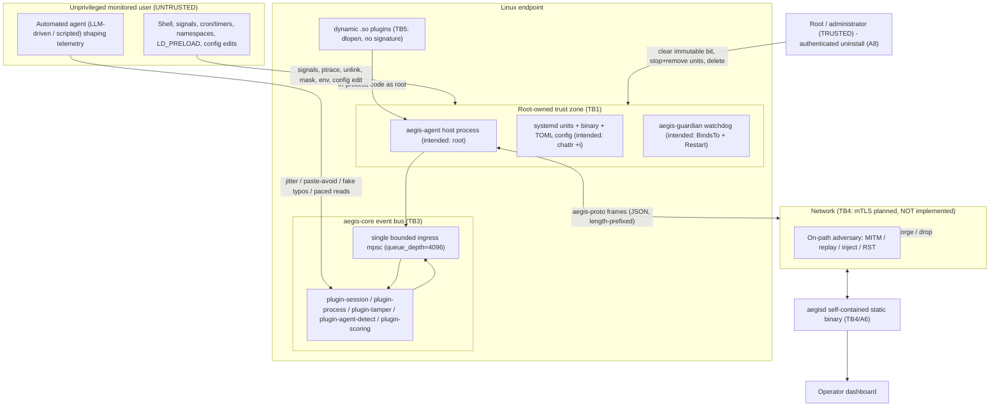

# Aegis Threat Model & Ethics

> Aegis is a plugin-native client/server platform for **behavioral insider-threat
> modeling**. Its flagship capability is **agent-vs-human detection** at a Linux
> endpoint. The endpoint client (`aegis-agent`) must resist being silently
> disabled by an **unprivileged monitored user** while remaining fully removable
> by **root/administrator** — ethical EDR-style self-protection, explicitly **not**
> a rootkit. The server (`aegisd`) is a self-contained, statically-linked binary.
> Every capability is a plugin.

This document is a rigorous, code-grounded threat model. Line references point at
the actual source as of this writing. Several attacks below are *currently
exploitable* precisely because the hardening lifecycle (`Command::Install`,
`Command::Guard`, `Command::Uninstall`) is a **stub** that prints unit text and
exits (`crates/aegis-agent/src/main.rs:109-141`). Those are called out explicitly
and drive the prioritized backlog at the end.

---

## 1. Protected Assets

| # | Asset | What "compromise" means | Where it lives |
|---|-------|-------------------------|----------------|
| A1 | **Endpoint visibility** | The agent is alive, running as root, and emitting telemetry. Loss = the endpoint "goes dark" silently. | `aegis-agent`, `plugin-tamper`, `plugin-session`, `plugin-process` |
| A2 | **Detection integrity (agent-vs-human)** | Verdicts reflect reality. Compromise = an automated agent is classified `Human`/`Uncertain`, or an innocent user is framed as `Agent`. | `plugin-agent-detect` (`model.rs`, `features.rs`) |
| A3 | **Telemetry integrity & provenance** | Events on the bus / wire genuinely originate from the trusted collector and are unmodified, unreplayed, unforged. | `aegis-sdk` event model, `aegis-proto`, `aegis-core` bus |
| A4 | **Scoring & alerting fidelity** | Risk scores and alerts are neither suppressed nor manufactured. | `plugin-scoring` |
| A5 | **Privacy of subjects** | Telemetry is **content-free** (timing/structure only); the command-correlation salt is secret. | `plugin-session` (`hash_salt`, `command_hash`), `EventPayload::Keystroke`/`CommandObserved` |
| A6 | **Server availability & integrity** | The single static binary ingests, processes, persists, and serves the dashboard without being overwhelmed or poisoned. | `aegisd` |
| A7 | **Host-process integrity** | Only trusted plugin code runs in-process; the address space (FDs, emitter, salt) is not hijacked. | `aegis-core` loader/host, plugin ABI |
| A8 | **Administrator control (the deliberate backdoor)** | Root can **always** uninstall via an authenticated path; hardening must never collateral-damage this. | `plugin-tamper::install`, `Command::Uninstall` |

The overarching protected asset is **A1 (visibility)**: the entire tamper-resistance
posture exists to keep an unprivileged monitored user from silently turning
monitoring off, exactly as commercial EDR/DLP behaves.

---

## 2. Trust Boundaries

Five boundaries matter. The two highest-value ones for this platform are
**TB1** (unprivileged user vs. root-owned agent) and **TB3** (untrusted event
producer vs. the bus the model trusts).

- **TB1 — Privilege boundary on the endpoint.** Unprivileged monitored user vs.
  the root-owned agent process and its root-owned, immutable on-disk artifacts.
  *Crossing TB1 requires becoming root.* This is the boundary tamper-resistance
  defends. It is **not currently enforced**: the agent typically runs as the
  user because `Command::Install` never sets `User=root` or applies `chattr +i`.
- **TB2 — Process boundary.** The agent's address space vs. other local
  processes (ptrace, `LD_PRELOAD`, signals, namespaces).
- **TB3 — Bus trust boundary.** Inside `aegis-core`, every plugin shares one
  `Arc<dyn Emitter>` and the model consumes *self-reported scalars* from whatever
  publishes `input.keystroke` / `command.observed`. There is **no producer
  authentication, ACL, or signature** on events (`event.source` is a free-form
  string, `host.rs:222` clones to all subscribers).
- **TB4 — Network boundary.** Agent ↔ server over `aegis-proto`. mTLS + per-agent
  Ed25519 are *documented as layered underneath* (`aegis-proto/src/lib.rs:9-11`)
  but the transport plugin **does not exist**, so this boundary is currently
  cryptographically open.
- **TB5 — Supply-chain boundary.** Plugin code (static at build time, or dynamic
  `.so` loaded via `libloading::Library::new` in an `unsafe` block,
  `loader.rs:35`) vs. the root host process that `dlopen`s it with no signature
  check.

---

## 3. Adversary Model

| ID | Adversary | Capabilities | Explicitly out of scope |
|----|-----------|-------------|-------------------------|
| **ADV-U** | Unprivileged monitored user (insider) disabling/evading the agent | Full control of own UID's processes, env, cron/user-timers, namespaces (if `unprivileged_userns_clone=1`); can read the open-source code; may write user-writable paths in misconfigured deployments | Becoming root by any means; physical attacks; firmware/BIOS |
| **ADV-A** | Automated agent (LLM-driven or scripted) running *as* ADV-U, shaping telemetry to evade the classifier | Drives a real pty/tty and controls its own write timing/content; computes `p_agent` offline from public coefficients; partitions work into sessions/commands | Forging kernel-level signals or synthesizing USB-HID interrupts (it lacks the privilege) — this is the basis of the strongest defenses |
| **ADV-N** | Network adversary between agent and server | On-path: intercept, modify, inject, drop, RST the TCP stream; act as MITM before mTLS exists | Breaking correctly-deployed mTLS (the mitigation target) |
| **ADV-P** | Malicious or compromised plugin loaded into the host | In-process code execution with host privileges once loaded (static-compromised at build, or dynamic `.so`); holds the shared emitter, FDs, `data_dir` | N/A — this adversary is inside TB5 by assumption |

A non-adversarial actor, **the administrator (root)**, is modeled explicitly: it
must retain a clean uninstall path through every layer (A8).

---

## 4. Attack Trees

Severity/`residual_risk` reflects the posture **after** the recommended mitigation
is applied. "Status" flags whether the attack is exploitable *today* given the
stub install lifecycle.

### 4.1 ADV-U — Unprivileged user disabling or evading the agent

| # | Vector | Precondition | Impact | Mitigation | Status today | Residual |
|---|--------|-------------|--------|-----------|--------------|----------|
| U1 | `SIGKILL`/`SIGTERM` the agent directly | Agent **not** running as root (signals allowed across same UID). True now: `Install` is a stub, so the agent runs as the user | Total visibility loss. No alert: tamper loop fires only on missing files at 15s ticks (`lib.rs:121-133`) and dies with the process | Run as root via `User=root` unit (`install.rs:62`); posture self-check refuses to start if `is_root==false`, alerting first; real guardian (`BindsTo`+`Restart=always`, `RestartSec` small) revives; add `SIGTERM`/`SIGINT` handler emitting `Severity::Critical` before exit | **Exploitable** | low |
| U2 | `systemctl mask`/`disable` the unit | Unit perms weaker than `0644 root:root`, or permissive polkit, or user-scope unit shadowing in `~/.config/systemd/user/` | No restart on next reboot/kill; guardian `BindsTo` also fails, removing the watchdog. Persistent across reboots | `chattr +i` on both unit files; lock polkit to root/admin group; inotify/audit on `/etc/systemd/system/`; assert `/proc/1/comm==systemd` and both units active at startup | Exploitable if deployed | low |
| U3 | Delete/truncate the binary at `/usr/local/sbin/aegis-agent` | `chattr +i` not applied (stub) **and** write access to path/ancestor | Running process unaffected (open FD), but next guardian-triggered restart fails `ENOENT`; monitoring stops permanently | `chattr +i` the binary at install; verify `FS_IMMUTABLE_FL` via `FS_IOC_GETFLAGS` in startup posture check; tamper loop already watches existence — extend to inode-flag check | **Exploitable** | low |
| U4 | In-place binary replacement (`cp --no-preserve /bin/true …`) | `chattr +i` not applied; write access; agent restarts once so the stub is exec'd | Agent becomes a no-op on restart. **No alert**: tamper loop only calls `path.exists()` (`lib.rs:122`); a present-but-different file passes. Guardian is itself a stub | Hash protected paths (SHA-256) vs. a root-owned `chattr+i` baseline manifest (e.g. `/var/lib/aegis/manifest.json`); emit `Critical` on mismatch; combine with immutable-bit check (clearing it needs root → auditable) | **Exploitable** | **medium** |
| U5 | `LD_PRELOAD` injection to intercept libc (`read`/`write`/`connect`) | Dynamically-linked build; agent started in user session | Injected `.so` suppresses or forges telemetry; model sees no evidence (→`Uncertain`) or human-like forgery | Ship the agent **statically linked** (musl) — static binaries ignore `LD_PRELOAD`; run as root (root ignores user `LD_PRELOAD`); set `NoNewPrivileges`; assert `/proc/self/maps` has no unexpected `.so` from user home | Exploitable in dev builds | low |
| U6 | User/mount namespace evasion (`unshare --mount`, bind a fake `/proc`,`/dev/input`) | `kernel.unprivileged_userns_clone=1` (default on Ubuntu/Debian) | Activity inside the namespace is invisible to `/proc` scans; model gets no process telemetry. Behavioral evasion without disabling the agent | Harden sysctls (`unprivileged_userns_clone=0`, `yama.ptrace_scope=1`, `unprivileged_bpf_disabled=1`); agent asserts initial PID-ns by comparing `/proc/self/ns/pid` to `/proc/1/ns/pid`; move toward namespace-transparent eBPF collectors | Exploitable | **medium** |
| U7 | `ptrace` attach (GDB/strace) | Agent same UID as attacker, or `yama.ptrace_scope=0` | Extract the command-hash **salt** (de-anonymizes `command_hash`); pause threads to delay telemetry; `SIGSEGV` to crash | Run as root (cross-UID ptrace denied); `yama.ptrace_scope=1`; `prctl(PR_SET_DUMPABLE,0)`; seccomp-bpf denying `ptrace` on own PID | Exploitable if not root | low |
| U8 | cron/user-timer kill loop exploiting the `RestartSec` window | Agent not root (signals allowed); cron/user timers available | Repeated ~1s blind gaps at `RestartSec=1`; sustained sub-second loop ≈ near-continuous blindness without ever fully disabling the service | Run as root; shorten `RestartSec` (~100ms); emit `Heartbeat`, server alerts on >2× missed interval; server gap-detector distinguishes network drops from kill-restart discontinuities; `StartLimitBurst`/`StartLimitInterval` to alert on rapid restarts | Exploitable if not root | low |
| U9 | Malicious dynamic-plugin injection via writable TOML | Agent TOML config writable by the user; restart occurs | Host `dlopen`s an attacker `.so` **as root** → arbitrary code execution in-process; forge detections, suppress telemetry, exfiltrate salt | `chattr +i` the config; verify it is `root`-owned and `0600`/`0640` at startup; Ed25519-sign plugins and verify before `dlopen`; or set `dynamic_plugins=[]` in the immutable hardened config | Exploitable if config writable | **medium** |
| U10 | Bus / session-state exhaustion | A local IPC ingress (future forwarder) reachable by the user | Unbounded `sessions` `HashMap` growth → OOM (`agent-detect/src/lib.rs:52`); CPU saturation from forced re-assessment every `assess_every=10`; missed tamper tick | Cap `sessions` (e.g. 1024) and reject excess with `Severity::High`; authenticate local IPC (`SO_PEERCRED`, root-only); verify `OOMScoreAdjust=-900` at runtime; per-`session_id` rate-limit | Latent (needs ingress) | low |
| U11 | Env-var redirection (`AEGIS_SERVER`, `AEGIS_AGENT_ID`) | Agent started by user; server URL not pinned in immutable config | All telemetry silently redirected to an attacker server that discards it; real server sees the agent as merely offline | Pin server URL in the `chattr+i` config (not from env); server pins `agent_id` at enrollment; mTLS makes redirection futile without the server key | Exploitable if started manually | low |
| U12 | Behavioral evasion via human-mimicking automation | Attacker reads the public model weights/thresholds and tunes timing | Automation scores below `agent_threshold=0.65` → `Uncertain`/`Human`; insider automation evades with **no interaction with the protection mechanism at all** | Don't ship production coefficients in public source; load server-signed weights; add an opaque second-stage model; recency/drift features; raise `MIN_*` from server config; cross-session baselining | **Exploitable by design** | **high** |

### 4.2 ADV-A — Automated agent shaping telemetry to evade `plugin-agent-detect`

The model is fully white-box from this repo. Numerics below were **independently
recomputed** against `model.rs`: naive agent `p_agent=0.898` (`Agent`), full mimic
`0.055` (`Human`), timing-only mimic `0.445` (`Uncertain`), dead-band partial mimic
`0.568` (`Uncertain`), human reference `0.033` (`Human`). `plugin-scoring` adds risk
**only** on `Verdict::Agent` (`lib.rs:98-106`); `Uncertain` and `Human` add zero.

| # | Vector | Lever (weight) | Linux technique | Marginal Δp_agent from naive | Mitigation | Residual |
|---|--------|----------------|-----------------|------------------------------|-----------|----------|
| A1 | Inter-keystroke jitter | metronomic-typing (0.25) | `clock_nanosleep` heavy-tailed gaps; `tmux send-keys`/`xdotool --delay` randomized | −0.208 (→0.69) | Distributional timing prior (KS/digraph likelihood, autocorrelation); **kernel-boundary timestamps via eBPF** on the tty line discipline; **HID/evdev correlation** (a pty has no `/dev/input` interrupts); adversarial training | high |
| A2 | Read-pacing / artificial think-time | instant-reaction (0.25) | `sleep` between sends; `epoll`/`select` on pty + randomized post-read delay scaled to output | −0.245 (→0.653) | Cut weight of self-reported timing; model think-time **shape** vs. output volume/variance; eBPF detects epoll-wait-then-burst; cross-check pager/scroll (`SIGWINCH`) | high |
| A3 | Synthetic typo+backspace | errorless-input (0.15) | One backspace (`0x7f`) in ~1-in-10 commands; `had_backspace` is a per-command bool | −0.137 | Replace bool with correction **dynamics** (burst length, correction-position entropy, latency); lower slope/raise centre from real data; treat too-uniform corrections as anti-mimicry signal | high |
| A4 | Paste avoidance | paste-injection (0.20) | Per-character `write()`s; disable bracketed paste (no `ESC[200~`) | −0.140 | Don't trust `is_paste`; detect sub-human minimum flight-time (<~30ms) as machine-origin; cross-check `command_len` vs. total composition time; HID correlation | high |
| A5 | **Dead-band camping** | exploits thresholds, not features | Tune any subset so `p_agent∈(0.35,0.65)`; partial mimic = `0.568` forever | n/a (no fidelity needed) | Make `Uncertain` actionable (small per-update risk + dashboard surfacing); **hysteresis/SPRT/EWMA** of `p_agent` across re-assessments so a session camped at 0.57 trips; asymmetric, adversary-aware thresholds | **high** |
| A6 | Direct telemetry forgery on the bus | bypasses input shaping | Side-loaded plugin or unauthenticated local ingest emits a perfect human stream for a guessable `USER:pid` session_id | total | Authenticate telemetry at origin (kernel-anchored, signed); bus ACL on `event.source` so only the collector kind may publish input events; mTLS + per-event nonce/sequence; unguessable random-UUID session_id | **high** |
| A7 | Evidence-gate starvation | exploits `MIN_KEYSTROKES=12`/`MIN_COMMANDS=3` | Work in <3 commands / one pipeline; churn short-lived `pid`-keyed sessions; emit under a session never started/ended | total (no verdict ever) | Accumulate evidence per **user/host**, not just session_id; treat high rate of ultra-short sessions as its own risk feature; score non-interactive command bursts; bound/TTL the sessions map (also fixes the DoS) | **high** |
| A8 | White-box tuning of entropy/cadence tails | dense-commands (0.05), regular-cadence (0.10) | Pad low-entropy whitespace; irregular cadence so `cadence_regularity` stays low | −0.037, −0.075 | Keep the interface transparent but ship per-deployment coefficients off the endpoint; **move final classification server-side**; non-additive ensemble with feature interactions (defeats offline inversion); anti-mimicry meta-feature | medium |

### 4.3 ADV-N — Network adversary between agent and server

All of these rest on the same root cause: **mTLS and per-agent signing are
documented but unimplemented** (`aegis-proto/src/lib.rs:9-11`; no transport
plugin exists), and the grammar carries **no per-message authentication**.

| # | Vector | Impact | Mitigation | Residual |
|---|--------|--------|-----------|----------|
| N1 | MITM on initial enrollment; forge `EnrollResponse`, substitute `agent_pubkey` | Adversary owns the enrolled identity; forges all subsequent `ClientHello`/`EventBatch`; suppresses tamper alerts | Pinned CA before first proto byte; per-enrollment client cert; token = single-use HMAC over `agent_pubkey‖nonce` with short TTL; server pins `agent_pubkey` per `agent_id` | low |
| N2 | Replay captured benign `EventBatch`, drop real ones | `RiskState` decay (0.98) holds score near 0; model never sees real timing; threshold 75.0 never crossed | Per-agent monotonic sequence (reject ≠ `last_seen+1`); Ed25519 over `seq‖batch_id‖events_hash`; server clock-window check on `ts_ns` (±60s) | low |
| N3 | Forged `ServerCommand::SetConfig` | Disable detection: `assess_every=2^31`, `alert_threshold=100.0`, `check_interval_s=huge`, `protected_paths=[]`, or leak salt via known `hash_salt` | Ed25519-sign every `Command` over `id‖plugin‖config` (canonical); pin server pubkey at enrollment; per-plugin JSON-Schema + numeric bounds (`assess_every≤1000`, `check_interval_s≥1`) | **medium** |
| N4 | Forged `ServerCommand::Isolate` (DoS / alert fatigue) or suppressed (let threat continue) | Mass forced isolation storms the dashboard; or dropped `Isolate` lets a confirmed insider continue | Sign all commands; rate-limit `Isolate` acceptance (≤1/60s/agent); server alerts on missing `CommandResult` | low |
| N5 | Inject forged `EventBatch` to **frame** a user | `ProcessExec` with watched exes or `Detection{Agent,1.0}` drives a target subject past 75.0 → HR/access action against an innocent | Sign batches; reject `agent_id` ≠ TLS cert subject (tamper alert); per-agent rate-limit high-confidence detections | low |
| N6 | Protocol downgrade of `proto_version` | Forces a future-weaker version, retaining read/forge ability; injected `ServerHello{accepted:false}` causes outages | Server-enforced minimum version (non-negotiable); agent pins minimum; cover `proto_version` in the enrollment signature/transcript; sign `ServerHello` | medium |
| N7 | Enrollment-token interception/reuse → rogue agent | Rogue endpoint poisons models, receives/suppresses `Isolate`, or burns the one-time token so legit enrollment fails | Bind token to `agent_pubkey‖hostname‖expiry` via server-keyed HMAC; verify binding; short TTL; TLS before any app bytes; consumed-token set | low |
| N8 | Telemetry suppression via TCP RST / selective frame drop | Subject produces no server-side telemetry; `RiskState` decays to 0; active exfiltration is invisible for the suppression window | Server per-agent heartbeat deadline → `High` "telemetry gap" alert; agent `BatchAck` timeout → re-queue, then local tamper alert; monotonic server-verified `uptime_s` | medium |

### 4.4 ADV-P — Malicious or compromised plugin in the host process

| # | Vector | Impact | Mitigation | Residual |
|---|--------|--------|-----------|----------|
| P1 | Arbitrary code execution via dynamic load with no integrity check (`libloading::Library::new` in `unsafe`, `loader.rs:35`; `.so` constructor runs before the ABI check) | Full in-process code execution at the agent's privilege (root); inherits FDs, `Arc<dyn Emitter>`, `data_dir`, salt | Ed25519-sign `.so` and verify before `dlopen`; require root-owned, non-world-writable path (not under user home or a user-writable tmpfs — check via `stat`/`statvfs`); config `root:root 0600` + `chattr +i`; consider a fork+seccomp plugin-runner subprocess | **medium** |
| P2 | Bus flooding to suppress all telemetry (single shared 4096-slot ingress; `BusEmitter::try_send` drops on full, `bus.rs:31`) | All behavioral telemetry + tamper alerts silently dropped; endpoint looks alive but emits nothing | Per-plugin token-bucket before the shared ingress; per-source counts → auto `Critical` + suspension; min-event-rate watchdog per collector; two-tier priority for `alert`/`tamper` | **medium** |
| P3 | False detection injection (emit `Detection{subject,Agent,0.99}`; scoring adds `60*0.99≈59.4`, two hits cross 75.0) | Frame any user as an AI agent → `High`/`Critical` alert, possible `Isolate`; or flood for alert fatigue | Plugin-kind ACL: only `Processor` may emit `Detection`; host validates `event.source` against registered name; sign `Detection`/`Alert`; rate-limit per source; server corroboration with session telemetry | **medium** |
| P4 | Tamper-alert suppression (flood the shared ingress so the 15s tamper `Critical` is dropped pre-fan-out) | Server gets no tamper notification while files are removed; defeats the only runtime integrity signal | Dedicated high-priority channel for `Critical` alerts (tamper holds a direct reference); file-hash baseline (catches in-place replace); server-enforced signed integrity-digest heartbeat | **medium** |
| P5 | Host crash via `panic!`/`std::process::exit`/`abort` in plugin code | Process termination; with the **stub** `Command::Guard` there is no live guardian, so only systemd `RestartSec=1` recovers; a tight crash loop can trip `StartLimitBurst` → persistent DoS | Subprocess isolation for dynamic plugins; implement `Guard` as a real watchdog (inotify/socket heartbeat → `systemctl start`); tune `StartLimitBurst`/`StartLimitIntervalSec`; `catch_unwind` around static-plugin `handle` | low |
| P6 | Full event-stream exfiltration via `Subscriptions::All` (dispatcher clones every event, `host.rs:222`; pattern exists in `ConsoleSink`, `agent/src/main.rs:85`) | A malicious sink reads every `SessionStart`/`CommandObserved`/`ProcessExec.cmdline` and forwards out-of-band, bypassing transport; `cmdline` may contain secrets | Plugin capability manifest (`network.egress`, `subscribe.all`) enforced via seccomp; block `Subscriptions::All` in prod without explicit approval (log `High`); network-namespaced subprocesses (`CLONE_NEWNET`, no default route); secrets-aware `cmdline` redaction | low |
| P7 | ABI/type confusion via mismatched `#[repr(C)] DynPluginRegistration` (`plugin.rs:212`; `Box::from_raw`, `loader.rs:54`) with a correct `api_version` integer | Wrong struct layout → garbage function-pointer call → controlled jump = root code execution | Include a struct-layout hash in/alongside `PLUGIN_API_VERSION`; restrict `dynamic_plugins` to root + `chattr +i`; signed manifest binding the exact SDK version; prefer static-only in prod | low |
| P8 | Session-state memory exhaustion (co-located): emit `SessionStart` with random `session_id` in a loop; unbounded `sessions` `HashMap` (`agent-detect/src/lib.rs:52`) | OOM of the agent / system memory pressure; `OOMScoreAdjust=-900` ironically protects the attacker's other processes first | Cap the map (≈1024) and reject excess with `High`; session TTL eviction; per-source `session.start` rate-limit; bound the per-session `Vec`s | low |

---

## 5. Game-Theoretic Analysis

### 5.1 Detection-vs-Evasion (Stackelberg signaling game)

**Setup.** A leader-follower game with **one-sided commitment**. The defender
(Aegis) moves first by publishing the model — and because the codebase is
open-source, the follower sees the feature set `F`, every logistic centre/slope,
the six weights, the thresholds (`agent_threshold=0.65`, `human_threshold=0.35`),
and the evidence gate (`MIN_KEYSTROKES=12`, `MIN_COMMANDS=3`) **exactly**. The
adaptive agent (ADV-A) then best-responds by choosing an evasion-effort vector
`e = (jitter, paste-avoidance, fake-typos, paced-reading, entropy-padding,
irregular-cadence)` shaping the six self-reported scalars.

**Cost structure of the levers.** The two 0.25-weight **timing** terms cost
*throughput* (the agent must `clock_nanosleep` between writes and insert artificial
think-time, trading task speed for stealth). `fake-typos` (0.15, steep slope 40 at
centre 0.06) is *nearly free* — one backspace per handful of commands maxes it out.
`paste-avoidance` (0.20) costs a per-character write loop instead of one bulk write.
`entropy-padding` (0.05) and `irregular-cadence` (0.10) are *nearly free*.

**Payoffs (independently recomputed against `model.rs`).** A naive agent scores
`p_agent=0.898` (`Agent`, caught). Spending the two near-free levers plus the two
timing levers yields the full mimic at `0.055` (confident `Human`). The two timing
levers alone reach `0.445` (`Uncertain`) — **half the total model weight defeated by
`sleep()` calls with no behavioral fidelity**. Marginal value from the naive
baseline: think-time −0.245, jitter −0.208, paste-avoidance −0.140, fake-typos
−0.137, irregular-cadence −0.075, entropy-padding −0.037. The distinguished
**dead-band** strategy (`p_agent=0.568`) is even cheaper: it produces zero risk and
no alert forever, with *less* fidelity than a full human mimic, because
`plugin-scoring` treats `Uncertain` exactly like `Human`.

**Equilibrium.** Against the model *as written* there is **no interior mixed
equilibrium worth defending**. The follower's best response is a pure strategy
(full mimic ≈0.06, or dead-band camp ≈0.57) that evades with probability ≈1 at
cost far below any plausible automated-insider budget — every feature is a
self-reported scalar the agent controls, and the additive, public boundary is
**directly invertible** (the agent computes `p_agent` offline for any candidate).
The defender **cannot escape by tuning thresholds/weights**: the follower sees the
full commitment and games it to the cheapest crossing. The equilibrium shifts only
when the defender changes the **strategy space**, not its parameters:

- **(a) Un-forgeable signals.** Move features from agent-controlled self-report to
  ground truth the unprivileged agent cannot fabricate: kernel-boundary timestamps
  via eBPF on the tty line discipline (`tty_insert_flip_string`/`n_tty_receive_buf`,
  `bpf_ktime_get_ns`) and HID/evdev interrupt correlation (a pty fed by a program
  emits no `/dev/input` events). This turns "call `sleep()`" into "forge kernel
  timestamps and synthesize USB-HID interrupts" — capabilities ADV-A lacks.
- **(b) Actionable dead band.** Make sustained `Uncertain` add incremental risk and
  add hysteresis (SPRT/EWMA across the `assess_every` re-assessments) so a session
  camped at 0.57 eventually trips. This deletes the cheapest pure strategy.
- **(c) Server-side boundary.** Emit features to the server, classify there, keep
  production coefficients off the endpoint — breaking offline invertibility.
- **(d) Anti-mimicry meta-feature.** A vector simultaneously optimal on all six axes
  is statistically improbable for a real human; over-perfect profiles should raise,
  not lower, suspicion.

**Feature evasion-robustness ranking (cost to fake).** *Robust*: kernel-anchored
timing + HID correlation + sub-human minimum-flight-time + correction-burst
naturalness. *Cheap-to-fake (all current features)*: `backspace_ratio` cheapest
(steep slope, low centre), then self-reported `keystroke_cv` and
`mean_inter_command_ms` (defeated by `sleep`), then `is_paste`/`paste_ratio`
(per-character writes), then `entropy_mean`/`cadence_regularity` (nearly free).

> **Design rule.** A feature is worth its weight only if faking it costs the
> adversary a resource it cannot cheaply spend. Rebalance away from self-reported
> scalars toward ground-truth-anchored signals, and never let the production
> decision boundary live on the monitored endpoint.

### 5.2 Tamper-vs-Removal (war of attrition with a privileged backdoor)

**Setup.** A sequential game. The defender commits a layer set `L` at install
time: (L1) run as root (`User=root`, `install.rs:62`); (L2) `Restart=always` with
short `RestartSec`; (L3) the guardian `BindsTo` pair; (L4) `chattr +i` on
binary+units+config; (L5) startup posture self-check that refuses to run / alerts
if `is_root`/namespace/immutable invariants fail; (L6) `SIGTERM`/heartbeat alert so
disappearance is reported even when revive is fast. The insider then escalates
tamper effort `t` up an escalating menu (signal, sub-second kill loop, delete /
in-place replace, mask/disable, malicious-`.so` config edit, ptrace/`LD_PRELOAD`)
until persistent visibility loss is achieved or the next rung exceeds its privilege
budget. The **administrator** sits orthogonal to all layers, holding the one
privileged primitive, so the authenticated uninstall passes through every layer by
design (A8).

**The decisive structural fact.** Every layer is gated on a *distinct privileged
primitive*, and an unprivileged user possesses **none** of them once L1 holds.
With `User=root`: the user cannot signal the process (cross-UID kill denied),
cannot ptrace it (UID mismatch), and `LD_PRELOAD` from the user is ignored. With
`chattr +i`: delete/truncate/`cp`-overwrite all first require clearing the
immutable flag, which needs `CAP_LINUX_IMMUTABLE`, i.e. root. With
`Restart=always`+guardian `BindsTo`: a single kill is futile and killing either
unit revives both. So the layers are **not additive-in-difficulty, they are
conjunctive**: defeating monitoring requires clearing *every* layer, and every
layer's clear-cost is "become root."

**Payoffs.** Insider payoff = visibility-loss − effort − detection penalty (every
failed rung emits a `Critical` alert, the *opposite* of going dark quietly). The
current code leaves seams **because the layers aren't deployed**: `Install` and
`Guard` are stubs, so the agent runs as the user (L1 absent), `chattr` is never
applied (L4 absent), and the guardian does nothing (L3 hollow). With L1/L4 absent,
the cheapest rungs work: a plain `SIGKILL` (process is user-owned, no alert because
the 15s tick dies with the process) and silent in-place replacement (the loop only
calls `path.exists()`). The transient-gap sub-game: even with a working guardian, a
sub-second kill loop exploits the `RestartSec` window — blind-fraction ≈1.0 at
`RestartSec=1s` under a ≥1/s loop, dropping to ≈0.10 at `RestartSec=0.1s` — but a
sustained loop trips `StartLimitBurst`, converting a stealthy gap into a loud
repeated-restart signal **if** an L6 alert exists.

**Equilibrium.** With the full set (L1–L6) deployed, the subgame-perfect
equilibrium is: the unprivileged insider's best response is **not to attempt
persistent removal** — every rung that could succeed needs root it lacks, and every
rung it *can* run either fails to persist past the guardian revive or trips a
`Critical` alert (both strictly worse for silent counter-surveillance). The insider
is pushed to the residual high-fidelity strategy that never touches the protection
mechanism: behavioral evasion (Game 5.1) or sub-second gap exploitation — which is
exactly why those carry higher residual risk while direct-tamper rungs are rated
low. With the **current stub** deployment the equilibrium inverts: a cheap kill or
silent in-place replacement achieves persistent loss at near-zero cost and zero
alert.

> **Comparative statics.** Persistent-removal probability for an unprivileged
> insider is a **step function of layer *completeness*, not layer *count***. It
> stays ≈1 until L1 (root ownership) **and** L4 (immutability) **and** a working L3
> (guardian) all hold simultaneously, then collapses toward 0 — because the layers
> are conjunctive and each independently demands root. Beyond that point, extra
> layers yield diminishing *resistance* against an insider who already cannot reach
> root, but still add *detection depth* (L5/L6 turn any future privilege-escalation
> tamper attempt into a loud event instead of a silent gap).

> **Design rule.** Deploy the *smallest* set of independent layers such that every
> removal path is gated on a privileged primitive the insider lacks, place exactly
> **one** intentional backdoor (authenticated root uninstall) that holds that
> primitive, then stop adding resistance and spend the next increment on
> **detection**. The minimal sufficient set here is four conjunctive layers
> (root-run, immutability, real guardian, hash+immutable-bit tamper check) — all
> currently stubbed, hence the top of the backlog.

---

## 6. Defenses & Component Mapping

| Defense | Defeats (attack IDs) | Component(s) | Type |
|---------|----------------------|--------------|------|
| Run agent as root via `User=root` unit | U1, U5, U7, U8 | `aegis-agent` (`Command::Install`), `plugin-tamper::install` | Resistance |
| `chattr +i` on binary + units + config | U2, U3, U4, U9, P1, P7 | `aegis-agent` (`Command::Install`), `plugin-tamper::install` | Resistance |
| Startup posture self-check (`is_root`, immutable bit via `FS_IOC_GETFLAGS`, initial PID-ns) → refuse/alert | U1, U3, U6, U7 | `plugin-tamper` (`posture()`) | Detection |
| Real guardian (`BindsTo` + `Restart`, short `RestartSec`, `StartLimit*`) | U1, U2, U8, P5 | `aegis-agent` (`Command::Guard`), `plugin-tamper::install` | Resistance/Detection |
| SHA-256 baseline manifest + inode-flag check in tamper loop | U4, P4 | `plugin-tamper` (`lib.rs:121-133`) | Detection |
| `SIGTERM`/`SIGINT` handler emits `Critical` before exit | U1 | `aegis-agent` | Detection |
| Static (musl) link; `NoNewPrivileges`; `/proc/self/maps` assert | U5 | `aegis-agent` build, unit | Resistance |
| System sysctl hardening (`userns`, `ptrace_scope`, `bpf`) | U6, U7 | deployment baseline | Resistance |
| eBPF kernel-boundary timing + HID/evdev correlation | A1, A2, A4, A6 | `plugin-session` (future eBPF collector) | Resistance |
| Correction-dynamics + sub-human flight-time features | A3, A4 | `plugin-agent-detect` (`features.rs`) | Detection |
| Actionable `Uncertain` + hysteresis (SPRT/EWMA) | A5, U12 | `plugin-scoring`, `plugin-agent-detect` | Detection |
| Per-user/host evidence accumulation; short-session anomaly feature | A7 | `plugin-agent-detect`, `aegis-server` | Detection |
| Server-side classification + per-deployment signed coefficients | A8, U12 | `aegis-server`, `plugin-agent-detect` | Resistance |
| Bound/TTL/rate-limit `sessions` map | U10, A7, P8 | `plugin-agent-detect` (`lib.rs:52`) | Resistance |
| mTLS + pinned CA before first proto byte | N1, N6, N7 | `aegis-proto`, transport plugin, `aegis-server` | Resistance |
| Per-agent Ed25519 signatures + monotonic sequence + clock window | N2, N3, N4, N5 | `aegis-proto`, `aegis-server` | Resistance |
| Token bound to `agent_pubkey‖hostname‖expiry`, single-use, short TTL | N7 | `aegis-server` | Resistance |
| Server heartbeat-deadline gap alert; agent `BatchAck` timeout | N8, U8 | `aegis-server`, transport plugin | Detection |
| Plugin signature verification before `dlopen`; layout-hash in ABI | P1, P7, U9 | `aegis-core` (`loader.rs`) | Resistance |
| Per-plugin rate-limit + priority channel for `Critical` | P2, P4 | `aegis-core` (`bus.rs`, `host.rs`) | Resistance/Detection |
| Plugin-kind ACL on `Detection`/`Alert`; validate `event.source` | P3, A6 | `aegis-core` (`host.rs` dispatcher) | Resistance |
| Subprocess + seccomp + network-ns isolation; capability manifest | P1, P5, P6 | `aegis-core` (plugin-runner) | Resistance |
| Per-plugin JSON-Schema + numeric bounds on pushed config | N3 | `aegis-core`, each plugin `init` | Resistance |
| Unguessable random-UUID `session_id` | A6 | `plugin-session` (`lib.rs:71`) | Resistance |

---

## 7. Ethics & Guardrails

These are **hard constraints**, not aspirations. They bound what Aegis is allowed
to do, and are enforced (or, where stubbed, *intended* to be enforced) in code.

1. **Tamper resistance targets the unprivileged user only.** Every protection
   mechanism is gated on a privileged primitive (root file ownership,
   `CAP_LINUX_IMMUTABLE`, cross-UID signal/ptrace rules). The design *raises the
   floor* so the minimum capability for any removal path is root — it never tries to
   resist root. This is the explicit equilibrium target of §5.2.
2. **An authenticated root uninstall always exists (A8).** `Command::Uninstall` is
   the deliberate backdoor: clear the immutable bit, stop and remove the units,
   delete files. Administrators retain control by design; hardening must never make
   the system unremovable. (Today this is a stub — implementing it is on the
   backlog, but the contract is non-negotiable.)
3. **No rootkit techniques.** Supported OS mechanisms only — root-owned files, the
   immutable attribute, and a systemd watchdog pair (`plugin-tamper/src/lib.rs:11-14`).
   **No** kernel exploits, **no** process hiding, **no** syscall-table or LSM
   tampering, **no** `/proc` masking. The agent is always visible to root in `ps`,
   `systemctl`, and on disk.
4. **Content-free telemetry by design (A5).** `EventPayload::Keystroke` carries only
   inter-arrival timing, paste/burst shape, and burst length — never characters
   (`event.rs:87-98`). Commands are summarized structurally (length, token count,
   Shannon entropy, backspace flag, edit distance) plus a salted SHA-256
   `command_hash` for correlation without content (`plugin-session/src/lib.rs:98-114`).
   The salt is a protected asset precisely because it gates de-anonymization.
5. **Explainability.** The classifier is a transparent additive model whose every
   verdict is attributable to named features via `Detection::reasons`
   (`model.rs:116-134`) — important for an insider-threat tool where a verdict may
   trigger an HR action. (Note the tension with §5.1: production *coefficients*
   should move server-side even though the *interface* stays explainable.)

---

## 8. Limitations & Residual Risk

- **The hardening lifecycle is unimplemented.** `Command::Install`,
  `Command::Guard`, and `Command::Uninstall` are stubs (`aegis-agent/src/main.rs:109-141`).
  Until completed, the agent typically runs as the user with no immutable files and
  no live guardian — so U1, U3, U4 are exploitable *now*, and §5.2's equilibrium is
  inverted. **This is the single highest-leverage gap.**
- **The transport layer does not exist.** mTLS and per-agent Ed25519 are documented
  but unbuilt (`aegis-proto/src/lib.rs:9-11`). The entire ADV-N tree (N1–N8) is open
  until a transport plugin lands. The protocol grammar itself carries no per-message
  authentication, replay protection, or sequence numbers.
- **The classifier is white-box and offline-invertible (residual: high).** A1–A8
  are structural: the model is additive with public coefficients and a public
  threshold pair, and consumes self-reported scalars. The dead-band (A5) and
  evidence-gate (A7) strategies need *no* mimicry fidelity at all. Mitigation
  requires changing the strategy space (eBPF/HID ground truth, server-side boundary,
  actionable `Uncertain`), not re-tuning — see §5.1.
- **The bus has no producer authentication (TB3).** Any in-process plugin (P3, P6,
  P8) or local ingress (A6, U10) can emit any payload for any subject; `event.source`
  is unverified free-form text.
- **Dynamic plugin loading is a root code-execution primitive (P1, P7, U9).** `dlopen`
  in an `unsafe` block with only an integer ABI check; the `.so` constructor runs
  before even that check.
- **Behavioral evasion is the irreducible residual.** Even with a perfectly hardened
  and authenticated deployment, a sufficiently sophisticated agent that mimics human
  behavior with kernel-level fidelity (or operates below the evidence gate) remains
  the hardest case. The goal is to *raise its cost above the unprivileged budget*,
  not to claim impossibility.
- **DoS gaps are brief but real.** Crash/OOM loops (P5, P8, U10) cause restart-window
  blindness; the mitigation is detection (heartbeat-gap alerts, `StartLimit*`) and
  bounding, not prevention.

---

## 9. Abuse-Resistance (preventing misuse of Aegis itself)

A behavioral-surveillance tool with tamper resistance is dual-use. These
guardrails constrain *the operator*, not just external adversaries:

- **Consent and scope must be explicit.** Aegis is intended for environments where
  monitoring is disclosed and lawful (managed corporate endpoints). The content-free
  design (A5) is a deliberate limit on how invasive deployment *can* be — there is no
  keystroke-content capture path to abuse.
- **The root-uninstall backdoor is the operator's accountability anchor.** Because
  removal is always possible by the machine owner / administrator (Guardrail 2),
  Aegis cannot become covert spyware that the legitimate owner cannot evict. Any
  future change that weakens this violates the threat model.
- **No covert/rootkit capability to repurpose.** By forbidding process hiding and
  kernel tampering (Guardrail 3), Aegis denies itself the very primitives that would
  make it useful as stalkerware. The agent is always discoverable by root.
- **Provenance prevents framing.** Several attacks (N5, P3, A6) are *false-positive*
  weapons — manufacturing `Agent` verdicts to trigger HR/access action against an
  innocent person. Authenticating telemetry origin (signatures, bus ACLs, TLS-bound
  `agent_id`) is therefore an *ethical* control, not only a security one: it protects
  monitored subjects from being framed via the tool.
- **Explainable, corroborated verdicts before action.** `Detection::reasons` plus a
  server-side requirement that a detection be corroborated by session telemetry from
  the same endpoint before acting (P3 mitigation) guards against acting on a single
  injected or low-fidelity signal — protecting the human subject from automated
  misjudgment.
- **Salt secrecy protects subjects, not just the system.** The `command_hash` salt
  (A5) keeps command correlation unlinkable across deployments; protecting it (U7,
  N3) prevents an abuser from de-anonymizing what is meant to be content-free.

---

## 10. Summary & Prioritized Mitigation Backlog

**Summary.** Aegis's design is sound in shape — conjunctive, root-gated tamper
layers with a deliberate root backdoor, and a content-free, explainable classifier
— but its *current implementation* leaves three classes of high-impact gap: (1) the
endpoint hardening lifecycle is stubbed, so the unprivileged user can kill or
silently replace the agent today (U1/U3/U4) and §5.2's protective equilibrium is
inverted; (2) the network layer has no mTLS/signing, opening the entire on-path tree
(N1–N8); and (3) the agent-vs-human model is white-box, additive, offline-invertible,
and fed self-reported scalars, so a scripted insider evades it with `sleep()` calls,
one backspace, or by camping the `Uncertain` dead band — with **high** residual risk
that only a strategy-space change (kernel/HID-anchored signals, server-side boundary,
actionable dead band) can address. The backlog below is ordered by leverage:
complete the four conjunctive tamper layers first (they collapse persistent-removal
probability from ≈1 to ≈0 against an unprivileged insider), then authenticate the
wire, then re-architect detection toward un-forgeable signals.

The structured backlog accompanying this document maps each item to its owning
component (`plugin-tamper`, `plugin-agent-detect`, `aegis-proto`, `aegis-server`,
`aegis-core`) with a priority. The highest-priority items are: implement the real
root-run + `chattr +i` + guardian install lifecycle (`plugin-tamper`/`aegis-agent`);
harden the tamper loop with a hash baseline and immutable-bit check (`plugin-tamper`);
move agent-vs-human classification server-side with actionable `Uncertain` and
hysteresis (`plugin-agent-detect`/`aegis-server`); implement mTLS + per-agent Ed25519
signing, sequencing, and config-command authentication (`aegis-proto`/`aegis-server`);
and add plugin signature verification, a producer ACL on `event.source`, and bounded
per-plugin/per-session queues (`aegis-core`).
