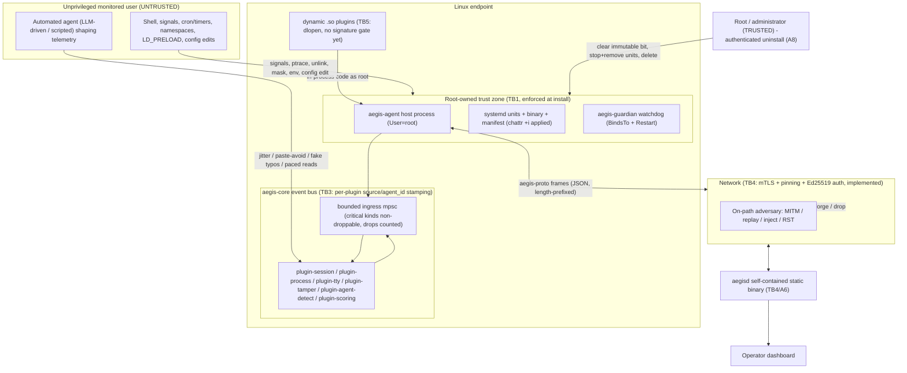

# Aegis Threat Model & Ethics

> Aegis is a plugin-native client/server platform for **behavioral insider-threat
> modeling**. Its flagship capability is **agent-vs-human detection** at a Linux
> endpoint. The endpoint client (`aegis-agent`) must resist being silently
> disabled by an **unprivileged monitored user** while remaining fully removable
> by **root/administrator** — ethical EDR-style self-protection, explicitly **not**
> a rootkit. The server (`aegisd`) is a self-contained, statically-linked binary.
> Every capability is a plugin.

This document is a rigorous, code-grounded threat model. It analyses the system's
adversary model, attack trees, and equilibria; those analyses are **valid
independent of implementation status** and are preserved in full.

> **Implementation status (updated).** An earlier revision of this document was
> written before the hardening lifecycle, the transport layer, and several
> mitigations were built, and described many attacks as *currently exploitable
> because the install/guard/uninstall path was a stub*. **That is no longer the
> case.** `Command::Install`/`Uninstall`/`Guard` now perform real privileged work
> (`crates/aegis-agent/src/main.rs`); the agent runs as root via a `User=root`
> unit; `chattr +i` is applied at install; the guardian is a real watchdog; the
> tamper loop does SHA-256 content integrity + immutable-bit checks; the bus stamps
> per-plugin provenance and protects security-critical events; mTLS + cert pinning
> + Ed25519 session auth are implemented; and `Uncertain` is now actionable. The
> attack-tree **"Status today" / residual** columns and the game-theoretic
> conclusions have been updated to reflect this. The genuine residual risks that
> remain are the behavioral white-box/offline-invertibility problem (§5.1), the
> userspace (non-kernel) nature of the tty collector, and a small set of hardening
> gaps (most notably a signature/hash integrity gate on dynamically loaded `.so`
> plugins). Line numbers below are indicative; the files have grown since the
> original anchors were recorded.

---

## 1. Protected Assets

| # | Asset | What "compromise" means | Where it lives |
|---|-------|-------------------------|----------------|
| A1 | **Endpoint visibility** | The agent is alive, running as root, and emitting telemetry. Loss = the endpoint "goes dark" silently. | `aegis-agent`, `plugin-tamper`, `plugin-session`, `plugin-process` |
| A2 | **Detection integrity (agent-vs-human)** | Verdicts reflect reality. Compromise = an automated agent is classified `Human`/`Uncertain`, or an innocent user is framed as `Agent`. | `plugin-agent-detect` (`model.rs`, `features.rs`) |
| A3 | **Telemetry integrity & provenance** | Events on the bus / wire genuinely originate from the trusted collector and are unmodified, unreplayed, unforged. | `aegis-sdk` event model, `aegis-proto`, `aegis-core` bus |
| A4 | **Scoring & alerting fidelity** | Risk scores and alerts are neither suppressed nor manufactured. | `plugin-scoring` |
| A5 | **Privacy of subjects** | Telemetry is **content-free** (timing/structure only); the command-correlation salt is secret. | `plugin-session` (`hash_salt`, `command_hash`), `EventPayload::Keystroke`/`CommandObserved` |
| A6 | **Server availability & integrity** | The single static binary ingests, processes, persists, and serves the dashboard without being overwhelmed or poisoned. | `aegisd` |
| A7 | **Host-process integrity** | Only trusted plugin code runs in-process; the address space (FDs, emitter, salt) is not hijacked. | `aegis-core` loader/host, plugin ABI |
| A8 | **Administrator control (the deliberate backdoor)** | Root can **always** uninstall via an authenticated path; hardening must never collateral-damage this. | `plugin-tamper::install`, `Command::Uninstall` |

The overarching protected asset is **A1 (visibility)**: the entire tamper-resistance
posture exists to keep an unprivileged monitored user from silently turning
monitoring off, exactly as commercial EDR/DLP behaves.

---

## 2. Trust Boundaries

Five boundaries matter. The two highest-value ones for this platform are
**TB1** (unprivileged user vs. root-owned agent) and **TB3** (untrusted event
producer vs. the bus the model trusts).

- **TB1 — Privilege boundary on the endpoint.** Unprivileged monitored user vs.
  the root-owned agent process and its root-owned, immutable on-disk artifacts.
  *Crossing TB1 requires becoming root.* This is the boundary tamper-resistance
  defends, and it is **now enforced** when deployed: `install.rs` renders `User=root`
  units and applies `chattr +i`, and the deployed `run` path injects the hardened
  layout when running as root.
- **TB2 — Process boundary.** The agent's address space vs. other local
  processes (ptrace, `LD_PRELOAD`, signals, namespaces).
- **TB3 — Bus trust boundary.** Inside `aegis-core`, every plugin emits through a
  per-plugin `ScopedEmitter` (`bus.rs`) that **overwrites `source` and `agent_id`**
  with host-asserted values before forwarding, so a plugin can no longer spoof
  another plugin's name, claim `"host"`, or forge an `agent_id`. The model still
  consumes *self-reported scalars* from whatever publishes `input.keystroke` /
  `command.observed`, and there is still **no per-kind producer ACL** (e.g. nothing
  restricts which plugin may emit `Detection`) — that narrower gap remains.
- **TB4 — Network boundary.** Agent ↔ server over `aegis-proto`. mTLS, SHA-256 cert
  pinning, and per-agent Ed25519 session authentication are **implemented**
  (`aegis-proto::tls`/`pin`, `plugin-transport`, `aegis-server::ingest`), so this
  boundary is cryptographically defended for a correctly-deployed (pinned)
  enrollment. The residual on-path risks are the usual ones against a correctly
  configured mTLS channel.
- **TB5 — Supply-chain boundary.** Plugin code (static at build time, or dynamic
  `.so` loaded via `libloading::Library::new` in an `unsafe` block) vs. the root
  host process that `dlopen`s it. The loader now checks enablement before opening,
  contains panics with `catch_unwind`, frees in the plugin's own allocator, and
  rejects a name mismatch — but it still performs **no signature or content-hash
  check** on the `.so` (the remaining open gap; see ADV-P / P1).

---

## 3. Adversary Model

| ID | Adversary | Capabilities | Explicitly out of scope |
|----|-----------|-------------|-------------------------|
| **ADV-U** | Unprivileged monitored user (insider) disabling/evading the agent | Full control of own UID's processes, env, cron/user-timers, namespaces (if `unprivileged_userns_clone=1`); can read the open-source code; may write user-writable paths in misconfigured deployments | Becoming root by any means; physical attacks; firmware/BIOS |
| **ADV-A** | Automated agent (LLM-driven or scripted) running *as* ADV-U, shaping telemetry to evade the classifier | Drives a real pty/tty and controls its own write timing/content; computes `p_agent` offline from public coefficients; partitions work into sessions/commands | Forging kernel-level signals or synthesizing USB-HID interrupts (it lacks the privilege) — this is the basis of the strongest defenses |
| **ADV-N** | Network adversary between agent and server | On-path: intercept, modify, inject, drop, RST the TCP stream; act as MITM against an improperly-deployed (un-pinned) enrollment | Breaking correctly-deployed mTLS with cert pinning (now the implemented mitigation target) |
| **ADV-P** | Malicious or compromised plugin loaded into the host | In-process code execution with host privileges once loaded (static-compromised at build, or dynamic `.so`); holds the shared emitter, FDs, `data_dir` | N/A — this adversary is inside TB5 by assumption |

A non-adversarial actor, **the administrator (root)**, is modeled explicitly: it
must retain a clean uninstall path through every layer (A8).

---

## 4. Attack Trees

Severity/`residual_risk` reflects the posture **after** the recommended mitigation
is applied. The "Status today" column reflects the **current** code: the hardening
lifecycle, transport, and bus provenance are now implemented, so most rungs that
were exploitable against the earlier stub are now mitigated (the mitigation column
describes what is in code). The attack vectors and their impacts are retained in
full because they define the residual risk the design must keep defending.

### 4.1 ADV-U — Unprivileged user disabling or evading the agent

| # | Vector | Precondition | Impact | Mitigation | Status today | Residual |
|---|--------|-------------|--------|-----------|--------------|----------|
| U1 | `SIGKILL`/`SIGTERM` the agent directly | Agent **not** running as root (signals allowed across same UID). The hardened install now runs the agent as root, so a same-UID user cannot signal it | Total visibility loss if it could be killed. | Run as root via `User=root` unit (in `install.rs`); posture self-check emits `Critical` if not root; real guardian (`BindsTo`+`Restart=always`, small `RestartSec`) revives; **SIGTERM/SIGINT tripwire emits `Critical` before exit** (`plugin-tamper` `spawn_signal_tripwire`) — all implemented | **Mitigated** (root-run + guardian + tripwire) | low |
| U2 | `systemctl mask`/`disable` the unit | Unit perms weaker than `0644 root:root`, or permissive polkit, or user-scope unit shadowing in `~/.config/systemd/user/` | No restart on next reboot/kill; guardian `BindsTo` also fails, removing the watchdog. Persistent across reboots | `chattr +i` on both unit files; lock polkit to root/admin group; inotify/audit on `/etc/systemd/system/`; assert `/proc/1/comm==systemd` and both units active at startup | Exploitable if deployed | low |
| U3 | Delete/truncate the binary at `/usr/local/sbin/aegis-agent` | Requires clearing `chattr +i` first (now applied at install) → needs root | Running process unaffected (open FD), but a successful delete would fail the next guardian restart `ENOENT` | `chattr +i` the binary at install (done); immutable-bit watch in the tamper loop flags a cleared flag as `Critical`; manifest check flags deletion/replacement — all implemented | **Mitigated** (immutable + immutable-bit watch) | low |
| U4 | In-place binary replacement (`cp --no-preserve /bin/true …`) | Requires clearing `chattr +i` (root); write access | Agent would become a no-op on restart | SHA-256 **baseline manifest** check each tick catches an in-place replacement (`manifest::verify`, size pre-filter + streaming hash), emitting `Critical`; combined with the immutable-bit check (clearing it needs root → auditable). Implemented in `plugin-tamper` | **Mitigated** (content-integrity manifest) | low |
| U5 | `LD_PRELOAD` injection to intercept libc (`read`/`write`/`connect`) | Dynamically-linked build; agent started in user session | Injected `.so` suppresses or forges telemetry; model sees no evidence (→`Uncertain`) or human-like forgery | Ship the agent **statically linked** (musl) — static binaries ignore `LD_PRELOAD`; run as root (root ignores user `LD_PRELOAD`); set `NoNewPrivileges`; assert `/proc/self/maps` has no unexpected `.so` from user home | Exploitable in dev builds | low |
| U6 | User/mount namespace evasion (`unshare --mount`, bind a fake `/proc`,`/dev/input`) | `kernel.unprivileged_userns_clone=1` (default on Ubuntu/Debian) | Activity inside the namespace is invisible to `/proc` scans; model gets no process telemetry. Behavioral evasion without disabling the agent | Harden sysctls (`unprivileged_userns_clone=0`, `yama.ptrace_scope=1`, `unprivileged_bpf_disabled=1`); agent **now asserts initial PID-ns** by comparing `/proc/self/ns/pid` to `/proc/1/ns/pid` (`pid_ns_matches_init`, emits `Critical` if mismatched); namespace-transparent eBPF collectors still future | PID-ns self-check landed; eBPF still future | **medium** |
| U7 | `ptrace` attach (GDB/strace) | Agent same UID as attacker, or `yama.ptrace_scope=0` | Extract the command-hash **salt** (de-anonymizes `command_hash`); pause threads to delay telemetry; `SIGSEGV` to crash | Run as root (cross-UID ptrace denied); `yama.ptrace_scope=1`; `prctl(PR_SET_DUMPABLE,0)`; seccomp-bpf denying `ptrace` on own PID | Exploitable if not root | low |
| U8 | cron/user-timer kill loop exploiting the `RestartSec` window | Agent not root (signals allowed); cron/user timers available | Repeated ~1s blind gaps at `RestartSec=1`; sustained sub-second loop ≈ near-continuous blindness without ever fully disabling the service | Run as root; shorten `RestartSec` (~100ms); emit `Heartbeat`, server alerts on >2× missed interval; server gap-detector distinguishes network drops from kill-restart discontinuities; `StartLimitBurst`/`StartLimitInterval` to alert on rapid restarts | Exploitable if not root | low |
| U9 | Malicious dynamic-plugin injection via writable TOML | Agent TOML config writable by the user; restart occurs | Host `dlopen`s an attacker `.so` **as root** → arbitrary code execution in-process; forge detections, suppress telemetry, exfiltrate salt | `chattr +i` the config (the hardened install makes the layout immutable); the loader checks enablement before opening and rejects a name mismatch — but the decisive control, **Ed25519/hash verification of the `.so` before `dlopen`**, is still **not implemented** (ADR #15); or set `dynamic_plugins=[]` in the immutable config | **Partially mitigated**; integrity gate still open | **medium** |
| U10 | Bus / session-state exhaustion | A local IPC ingress reachable by the user | CPU saturation from forced re-assessment; missed tamper tick. (The per-session `Vec` OOM vector is now bounded — see mitigation) | Per-session sample `Vec`s are **capped at `SAMPLE_CAP=2048`** (rolling window) and sessions are removed on `session.end`, so unbounded growth no longer applies; authenticate local IPC (`SO_PEERCRED`, root-only); verify `OOMScoreAdjust=-900` at runtime; per-`session_id` rate-limit | Memory bound landed; rate-limit still future | low |
| U11 | Env-var redirection (`AEGIS_SERVER`, `AEGIS_AGENT_ID`) | Agent started by user; server URL not pinned in immutable config | All telemetry silently redirected to an attacker server that discards it; real server sees the agent as merely offline | Pin server URL in the `chattr+i` config (not from env); server pins `agent_id` at enrollment; mTLS makes redirection futile without the server key | Exploitable if started manually | low |
| U12 | Behavioral evasion via human-mimicking automation | Attacker reads the public model weights/thresholds and tunes timing | Automation tuned to score below `agent_threshold=0.62` evades the per-snapshot Agent verdict with **no interaction with the protection mechanism at all**. Harder than before: the re-weighting demands joint-structure fidelity, and sustained `Uncertain` now accrues risk (so "camp the dead band" is no longer free) | Don't ship production coefficients in public source; classify server-side with signed weights; add an opaque second-stage model; recency/drift features; raise `MIN_*` from server config; cross-session baselining | **Residual by design** (cost raised) | **high** |

### 4.2 ADV-A — Automated agent shaping telemetry to evade `plugin-agent-detect`

The model is fully white-box from this repo. The marginal-Δ numerics in the table
below were computed against the **earlier six-term model (threshold 0.65)** and are
retained as an *illustration of the lever structure* — they are no longer the live
coefficients. The model has since been **re-weighted to blunt exactly these
single-lever evasions**: the cheap Tier-1 marginals (metronomic-typing, paste,
instant-reaction, errorless-input, dense-commands, regular-cadence) are demoted to a
combined ≈0.24, while ≈0.66 of the weight now sits on Tier-2/3 joint-structure terms
(gap autocorrelation 0.22, no-throughput-decay 0.14, constant-think-time 0.12,
whole-line-injection 0.12, burst-metronome 0.06) that an i.i.d.-delay evader cannot
reproduce, plus three asymmetric hard rules and a tightened threshold of **0.62**.
The qualitative point of this tree is therefore *stronger* than before: an evader
who only spends the timing/paste/typo levers (A1–A4) now lands in `Uncertain` rather
than `Human`, and — critically — `plugin-scoring` now adds **incremental, decaying
risk on sustained `Uncertain`** as well as on `Agent`, so the cheapest strategy no
longer yields zero risk forever (see A5).

| # | Vector | Lever (current weight) | Linux technique | Marginal Δp_agent (old 6-term model) | Mitigation | Residual |
|---|--------|----------------|-----------------|------------------------------|-----------|----------|
| A1 | Inter-keystroke jitter | metronomic-typing (0.06) | `clock_nanosleep` heavy-tailed gaps; `tmux send-keys`/`xdotool --delay` randomized | −0.208 in old model | Now **demoted** in weight; the `gap-non-autocorrelation` term (0.22) traps i.i.d. jitter; **kernel-boundary timestamps via eBPF**; **HID/evdev correlation** (a pty has no `/dev/input` interrupts); adversarial training | high |
| A2 | Read-pacing / artificial think-time | instant-reaction (0.10) | `sleep` between sends; `epoll`/`select` on pty + randomized post-read delay scaled to output | −0.245 in old model | Self-reported timing demoted; `constant-think-time` (0.12) and `no-throughput-decay` (0.14) catch flat/padded think-time; eBPF detects epoll-wait-then-burst; cross-check pager/scroll (`SIGWINCH`) | high |
| A3 | Synthetic typo+backspace | errorless-input (0.04) | One backspace (`0x7f`) in ~1-in-10 commands; `had_backspace` is a per-command bool | −0.137 in old model | Demoted; replace bool with correction **dynamics**; lower slope/raise centre from real data; treat too-uniform corrections as anti-mimicry signal | high |
| A4 | Paste avoidance | paste-injection (0.04) + whole-line-injection (0.12) | Per-character `write()`s; disable bracketed paste (no `ESC[200~`) | −0.140 in old model | `paste_ratio` demoted but `whole_line_paste_ratio` (0.12) and the `reaction_floor_hits >= 0.25 && whole_line >= 0.5` hard rule catch whole-line delivery; detect sub-human minimum flight-time (<~30ms); HID correlation | high |
| A5 | **Dead-band camping** | exploits thresholds, not features | Tune any subset so `p_agent∈(0.35,0.62)` | n/a (no fidelity needed) | **Now mitigated:** `plugin-scoring` makes sustained `Uncertain` *actionable* — a small, decaying `uncertain_detection_weight` increment that, on a session that keeps re-emitting `Uncertain` (where its confidence peaks), accumulates faster than it decays and climbs to an alert (the pipeline test documents this). A single `Uncertain` still decays away harmlessly. Hysteresis/SPRT across re-assessments (`log_likelihood_ratio`) further hardens it | **medium** (was high) |
| A6 | Direct telemetry forgery on the bus | bypasses input shaping | Side-loaded plugin emits a perfect human stream for a guessable `USER:pid` session_id | total | **`source`/`agent_id` forgery is now blocked** by the per-plugin `ScopedEmitter` (host-asserted). Remaining: the `session_id` is still `user:pid`-shaped (guessable), and there is no per-kind producer ACL (any loaded plugin may still emit input/Detection events for a valid subject); unguessable random-UUID session_id and a producer ACL would close it | **medium** (was high) |
| A7 | Evidence-gate starvation | exploits `MIN_KEYSTROKES=12`/`MIN_COMMANDS=3` | Work in <3 commands / one pipeline; churn short-lived `pid`-keyed sessions; emit under a session never started/ended | total (no verdict ever) | Accumulate evidence per **user/host**, not just session_id; treat high rate of ultra-short sessions as its own risk feature; score non-interactive command bursts. (The per-session memory DoS this also implied is now fixed: `Vec`s capped at `SAMPLE_CAP`) | **high** |
| A8 | White-box tuning of entropy/cadence tails | dense-commands (0.02), regular-cadence (0.04) | Pad low-entropy whitespace; irregular cadence so `cadence_regularity` stays low | −0.037, −0.075 in old model | Both further **demoted**; keep the interface transparent but ship per-deployment coefficients off the endpoint; **move final classification server-side**; non-additive ensemble with feature interactions; anti-mimicry meta-feature | medium |

### 4.3 ADV-N — Network adversary between agent and server

The transport layer is now **implemented**, so the original root cause ("mTLS and
per-agent signing are documented but unimplemented") no longer holds. In code:
TLS-1.3-only negotiation (`aegis-proto::tls`), SHA-256 server-cert **pinning**
bound to the served leaf (`pin.rs`, `bind_pin`), a per-session **Ed25519
challenge-response** with RFC-5705 channel binding (`plugin-transport::actor`,
`aegis-server::ingest`), server-side **`agent_id` override** to the authenticated
identity, **`ts_ns` clamping** to a window around the server clock, a **FIFO
per-connection dedup** plus a **bounded cross-connection global dedup window**, and
first-frame / idle read timeouts. The N1–N8 vectors are retained as the defense
checklist; the **Status** notes which mitigations are now in code versus residual.

| # | Vector | Impact | Mitigation | Residual / Status |
|---|--------|--------|-----------|----------|
| N1 | MITM on initial enrollment; forge `EnrollResponse`, substitute `agent_pubkey` | Adversary owns the enrolled identity; forges all subsequent `ClientHello`/`EventBatch`; suppresses tamper alerts | Pinned server cert before first app byte (the agent enrolls with a `--pin`); per-enrollment identity; single-use token burned atomically; server pins identity per `agent_id` | low — **pinning + token burn implemented**; depends on the operator supplying the correct pin out-of-band |
| N2 | Replay captured benign `EventBatch`, drop real ones | `RiskState` decay (0.98) holds score near 0; model never sees real timing; threshold 75.0 never crossed | Server clock-window check on `ts_ns` (clamped to ±window); cross-connection dedup of `Event.id`; per-agent monotonic sequence would further harden | low — **ts_ns clamp + bounded global dedup implemented**; explicit per-batch sequence still future |
| N3 | Forged `ServerCommand::SetConfig` | Disable detection: `assess_every=huge`, `alert_threshold=100.0`, `check_interval_s=huge`, `protected_paths=[]`, or leak salt | Commands ride the authenticated mTLS session; add per-`Command` Ed25519 signature over `id‖plugin‖config`; per-plugin numeric bounds (`decay` already range-validated; `check_interval_s` floored at 1) | **medium** — channel is authenticated, but a dedicated per-command signature and full config schema validation are still future |
| N4 | Forged `ServerCommand::Isolate` (DoS / alert fatigue) or suppressed | Mass forced isolation storms the dashboard; or dropped `Isolate` lets a confirmed insider continue | Commands authenticated by the session; rate-limit `Isolate` acceptance; server alerts on missing `CommandResult` | low — channel authenticated; rate-limit/alert-on-missing still future |
| N5 | Inject forged `EventBatch` to **frame** a user | `Detection{Agent,1.0}` / watched-exe `ProcessExec` drives a target past 75.0 → action against an innocent | Server **overwrites `agent_id`** with the authenticated identity (implemented), so an enrolled agent can only attribute to itself; per-agent rate-limit on high-confidence detections still future | low — **agent_id override implemented** |
| N6 | Protocol downgrade of `proto_version` | Forces a future-weaker version; injected `ServerHello{accepted:false}` causes outages | TLS is pinned to 1.3 (no TLS downgrade); add a server-enforced minimum `proto_version` and cover it in the auth transcript | medium — **TLS-version downgrade closed**; app-level `proto_version` minimum still future |
| N7 | Enrollment-token interception/reuse → rogue agent | Rogue endpoint poisons models, or burns the one-time token so legit enrollment fails | Single-use token **burned atomically** in the enroll transaction; token TTL; TLS+pin before app bytes; enrollment string lengths bounded (`MAX_ENROLL_FIELD_LEN`) | low — **atomic burn + length limits implemented** |
| N8 | Telemetry suppression via TCP RST / selective frame drop | Subject produces no server-side telemetry; `RiskState` decays to 0; active exfiltration is invisible for the suppression window | `plugin-tamper` now **emits `Heartbeat`** each tick (server can deadline it); agent-side spill re-queues undelivered batches; server per-agent heartbeat-gap alert still future | medium — **heartbeat emission + spill re-queue implemented**; server-side gap alerting still future |

### 4.4 ADV-P — Malicious or compromised plugin in the host process

| # | Vector | Impact | Mitigation | Residual |
|---|--------|--------|-----------|----------|
| P1 | Arbitrary code execution via dynamic load with no integrity check (`libloading::Library::new` in `unsafe`; the entrypoint runs before the ABI check) | Full in-process code execution at the agent's privilege (root); inherits FDs, `Arc<dyn Emitter>`, `data_dir`, salt | The **decisive control is still open**: Ed25519-sign the `.so` and verify before `dlopen`; require root-owned, non-world-writable path. The loader *has* been hardened around this gap (enable-before-load, `catch_unwind` on the entrypoint, name-match rejection), but performs no integrity/signature check; config `root:root 0600` + `chattr +i` is the current compensating control | **medium** — integrity gate not implemented (ADR #15) |
| P2 | Bus flooding to suppress all telemetry (shared ingress; cheap events evict a security event) | Previously: all telemetry + tamper alerts silently dropped. **Now blunted:** `alert`/`detection`/`score` take a non-droppable back-pressure path (`is_critical_kind`), so a flood of cheap telemetry can no longer evict them | Per-plugin token-bucket before the shared ingress; per-source counts → auto `Critical`; min-event-rate watchdog | low — **critical-kind back-pressure + per-cause drop counters (`BusMetrics`) implemented** |
| P3 | False detection injection (emit `Detection{subject,Agent,0.99}`; scoring adds `60*0.99≈59.4`, two hits cross 75.0) | Frame any user as an AI agent → `High`/`Critical` alert, possible `Isolate`; or flood for alert fatigue | Host now **asserts `source`/`agent_id`** per plugin (`ScopedEmitter`), so impersonation/identity-forgery is closed. Remaining: a **per-kind producer ACL** (only a `Processor` may emit `Detection`) is still absent; sign `Detection`/`Alert`; rate-limit per source; server corroboration with session telemetry | **medium** — source/identity asserted; kind-ACL still open |
| P4 | Tamper-alert suppression (flood the ingress so the tamper `Critical` is dropped pre-fan-out) | Previously: server gets no tamper notification. **Now blunted:** tamper alerts are `alert`-kind, on the non-droppable critical path | A dedicated high-priority channel would harden further; the SHA-256 manifest baseline already catches in-place replacement; server-enforced signed integrity-digest heartbeat | low — **critical-kind back-pressure + content-integrity baseline implemented** |
| P5 | Host crash via `panic!`/`std::process::exit`/`abort` in plugin code | Process termination. The guardian is now a real watchdog (no longer a stub), so it plus systemd `RestartSec=1` recovers; a tight crash loop could still trip `StartLimitBurst` | `Guard` is **implemented** as a real liveness watchdog; `catch_unwind` now wraps the FFI entrypoint and every constructor; subprocess isolation for dynamic plugins and `StartLimit*` tuning still future | low — **real guardian + catch_unwind implemented** |
| P6 | Full event-stream exfiltration via `Subscriptions::All` (the dispatcher clones every event; `ConsoleSink`/`plugin-transport` use this pattern) | A malicious sink reads every `SessionStart`/`CommandObserved`/`ProcessExec.cmdline` and forwards out-of-band; `cmdline` may contain secrets | Plugin capability manifest (`network.egress`, `subscribe.all`) enforced via seccomp; block `Subscriptions::All` in prod without explicit approval; network-namespaced subprocesses; secrets-aware `cmdline` redaction | low — still future |
| P7 | ABI/type confusion via mismatched `#[repr(C)] DynPluginRegistration` with a correct `api_version` integer | Wrong struct layout → garbage function-pointer call → controlled jump = root code execution | The cross-allocator `Box::from_raw` UB is **fixed** (the host copies the `Copy` fields and frees via the plugin's paired `DYN_FREE_SYMBOL`), and an unwind across the entrypoint is contained by `catch_unwind`. Still recommended: a struct-layout hash alongside `PLUGIN_API_VERSION`, a signed manifest binding the exact SDK version, prefer static-only in prod | low — **`Box::from_raw`/panic fixed**; layout-hash still future |
| P8 | Session-state memory exhaustion (co-located): emit `SessionStart`/`Keystroke` with random `session_id` in a loop | Previously: unbounded `sessions` growth → OOM. **Now bounded:** per-session sample `Vec`s are capped at `SAMPLE_CAP=2048` (rolling window) and sessions are removed on `session.end` | Per-source `session.start` rate-limit and a session-count cap would harden further | low — **per-session Vec bound implemented** |

---

## 5. Game-Theoretic Analysis

### 5.1 Detection-vs-Evasion (Stackelberg signaling game)

**Setup.** A leader-follower game with **one-sided commitment**. The defender
(Aegis) moves first by publishing the model — and because the codebase is
open-source, the follower sees the feature set `F`, every logistic centre/slope,
the weights, the thresholds (`agent_threshold=0.62`, `human_threshold=0.35`), and
the evidence gate (`MIN_KEYSTROKES=12`, `MIN_COMMANDS=3`) **exactly**. The adaptive
agent (ADV-A) then best-responds by choosing an evasion-effort vector shaping the
self-reported scalars.

> The model has since been **re-weighted to partially shift this game** (see §4.2):
> the cheap self-reported marginals are demoted to ≈0.24 and ≈0.66 of the weight
> now rides on Tier-2/3 joint-structure features that an i.i.d.-delay evader cannot
> reproduce, with three asymmetric hard rules on top. This raises the *cost* of the
> cheapest evasions and is exactly the "move weight toward harder-to-fake signals"
> move below — but those Tier-2/3 features are still derived from the **same
> userspace PTY/pipe stream** (`plugin-tty`), so the white-box / offline-
> invertibility critique below remains qualitatively valid: a sufficiently
> sophisticated adversary that controls the stream can still in principle shape
> them, and the production boundary still lives on the endpoint. The numbers below
> were computed against the **earlier six-term/0.65 model** and are kept to
> illustrate the lever economics, not as the live coefficients.

**Cost structure of the levers (old six-term model).** The two 0.25-weight
**timing** terms cost *throughput* (the agent must `clock_nanosleep` between writes
and insert artificial think-time). `fake-typos` (0.15, steep slope 40 at centre
0.06) was *nearly free*. `paste-avoidance` (0.20) costs a per-character write loop.
`entropy-padding` (0.05) and `irregular-cadence` (0.10) were *nearly free*. The
re-weighting now charges far less for these (Tier-1 ≈0.24 total) and far more for
joint-structure terms, so the same lever spend buys much less evasion.

**Payoffs (old six-term model, illustrative).** A naive agent scored
`p_agent≈0.898` (`Agent`, caught). The two near-free levers plus the two timing
levers reached a full mimic ≈`0.055` (`Human`); the two timing levers alone reached
≈`0.445` (`Uncertain`). The distinguished **dead-band** strategy (≈`0.568`) was the
cheapest of all. Crucially, in that earlier system the dead band produced **zero
risk forever** because `plugin-scoring` treated `Uncertain` exactly like `Human` —
**this is now fixed**: sustained `Uncertain` accrues incremental, decaying risk and
climbs to an alert (§4.2 A5), so dead-band camping is no longer a free strategy.

**Equilibrium.** Against an additive, public boundary fed by self-reported scalars,
there is **no interior mixed equilibrium worth defending**: the follower sees the
full commitment and best-responds with a pure strategy at cost far below any
plausible automated-insider budget, because the boundary is **directly invertible**
(the agent computes `p_agent` offline for any candidate). The defender **cannot
escape by tuning thresholds/weights alone**. The current re-weighting + actionable
dead band raise the follower's cost and delete the cheapest pure strategy, but the
*structural* escape requires changing the **strategy space**, not just parameters:

- **(a) Un-forgeable signals.** Move features from agent-controlled self-report to
  ground truth the unprivileged agent cannot fabricate: kernel-boundary timestamps
  via eBPF on the tty line discipline (`tty_insert_flip_string`/`n_tty_receive_buf`,
  `bpf_ktime_get_ns`) and HID/evdev interrupt correlation (a pty fed by a program
  emits no `/dev/input` events). This turns "call `sleep()`" into "forge kernel
  timestamps and synthesize USB-HID interrupts" — capabilities ADV-A lacks.
- **(b) Actionable dead band.** *(Now implemented.)* `plugin-scoring` makes sustained
  `Uncertain` add incremental, decaying risk, and `Model::log_likelihood_ratio`
  exposes a per-snapshot log-odds for sequential (SPRT/EWMA) accumulation across
  re-assessments, so a session camped at ~0.5–0.6 eventually trips. This deletes the
  cheapest pure strategy.
- **(c) Server-side boundary.** *(Still future.)* Emit features to the server,
  classify there, keep production coefficients off the endpoint — breaking offline
  invertibility. The transport and server now exist to support this; the final
  classification still runs in the agent's `plugin-agent-detect`.
- **(d) Anti-mimicry meta-feature.** *(Partially realized.)* A vector simultaneously
  optimal on every axis is statistically improbable for a real human; over-perfect
  profiles should raise, not lower, suspicion. The hard rules approximate this for
  specific joint conditions (e.g. zero-autocorrelation + flat throughput + narrow
  think-time tail), but a general anti-mimicry meta-feature is still future.

**Feature evasion-robustness ranking (cost to fake).** *Robust*: kernel-anchored
timing + HID correlation + sub-human minimum-flight-time + correction-burst
naturalness. *Cheap-to-fake (the Tier-1 marginals — now demoted in weight for this
reason)*: `backspace_ratio` cheapest (steep slope, low centre), then self-reported
`keystroke_cv` and `mean_inter_command_ms` (defeated by `sleep`), then
`is_paste`/`paste_ratio` (per-character writes), then `entropy_mean`/`cadence_regularity`.
*Harder but still userspace-derived (now carrying the bulk of the weight)*: gap
autocorrelation, throughput decay, think-time-tail shape, whole-line-injection,
burst metronome — costly to fake jointly, but ultimately still computed from the
PTY/pipe stream rather than a kernel/HID ground truth.

> **Design rule.** A feature is worth its weight only if faking it costs the
> adversary a resource it cannot cheaply spend. Rebalance away from self-reported
> scalars toward ground-truth-anchored signals, and never let the production
> decision boundary live on the monitored endpoint.

### 5.2 Tamper-vs-Removal (war of attrition with a privileged backdoor)

**Setup.** A sequential game. The defender commits a layer set `L` at install
time — **all of which are now implemented in code**: (L1) run as root (`User=root`,
`install.rs`); (L2) `Restart=always` with short `RestartSec`; (L3) the guardian
`BindsTo` pair plus the real `guard` watchdog; (L4) `chattr +i` on
binary+units+manifest; (L5) startup posture self-check that **alerts** (`Critical`)
if `is_root`/PID-namespace/immutable invariants fail (it deliberately does not
refuse to run — exiting would aid an attacker who induced the condition); (L6)
`SIGTERM`/`SIGINT` tripwire + per-tick `Heartbeat` so disappearance is reported even
when revive is fast. The insider then escalates
tamper effort `t` up an escalating menu (signal, sub-second kill loop, delete /
in-place replace, mask/disable, malicious-`.so` config edit, ptrace/`LD_PRELOAD`)
until persistent visibility loss is achieved or the next rung exceeds its privilege
budget. The **administrator** sits orthogonal to all layers, holding the one
privileged primitive, so the authenticated uninstall passes through every layer by
design (A8).

**The decisive structural fact.** Every layer is gated on a *distinct privileged
primitive*, and an unprivileged user possesses **none** of them once L1 holds.
With `User=root`: the user cannot signal the process (cross-UID kill denied),
cannot ptrace it (UID mismatch), and `LD_PRELOAD` from the user is ignored. With
`chattr +i`: delete/truncate/`cp`-overwrite all first require clearing the
immutable flag, which needs `CAP_LINUX_IMMUTABLE`, i.e. root. With
`Restart=always`+guardian `BindsTo`: a single kill is futile and killing either
unit revives both. So the layers are **not additive-in-difficulty, they are
conjunctive**: defeating monitoring requires clearing *every* layer, and every
layer's clear-cost is "become root."

**Payoffs.** Insider payoff = visibility-loss − effort − detection penalty (every
failed rung emits a `Critical` alert, the *opposite* of going dark quietly). With
the layers now deployed, the cheap rungs that the earlier stub left open are closed:
a plain `SIGKILL` is denied (cross-UID, process is root-owned) and would fire the
SIGTERM/SIGINT tripwire if root issued it; silent in-place replacement is caught by
the SHA-256 manifest check; clearing `chattr +i` requires root and the immutable-bit
watch flags it. The transient-gap sub-game still applies: even with a working
guardian, a sub-second kill loop exploits the `RestartSec` window — blind-fraction
≈1.0 at `RestartSec=1s` under a ≥1/s loop, dropping to ≈0.10 at `RestartSec=0.1s` —
and a sustained loop trips `StartLimitBurst`, converting a stealthy gap into a loud
repeated-restart signal (the L6 heartbeat/tripwire alert now exists to surface it).

**Equilibrium.** With the full set (L1–L6) deployed — **which is now the case** — the
subgame-perfect equilibrium is: the unprivileged insider's best response is **not to
attempt persistent removal** — every rung that could succeed needs root it lacks, and
every rung it *can* run either fails to persist past the guardian revive or trips a
`Critical` alert (both strictly worse for silent counter-surveillance). The insider
is pushed to the residual high-fidelity strategy that never touches the protection
mechanism: behavioral evasion (Game 5.1) or sub-second gap exploitation — which is
exactly why those carry higher residual risk while direct-tamper rungs are rated low.
The earlier "stub deployment inverts the equilibrium" caveat **no longer applies**;
the residual risk is now concentrated in (a) the behavioral classifier (§5.1) and
(b) a transient-root attacker who clears immutability, does its work, and is alerted
on but leaves the file mutable until a human re-installs — the alert-only design
choice noted below.

> **Comparative statics.** Persistent-removal probability for an unprivileged
> insider is a **step function of layer *completeness*, not layer *count***. It
> stays ≈1 until L1 (root ownership) **and** L4 (immutability) **and** a working L3
> (guardian) all hold simultaneously, then collapses toward 0 — because the layers
> are conjunctive and each independently demands root. Beyond that point, extra
> layers yield diminishing *resistance* against an insider who already cannot reach
> root, but still add *detection depth* (L5/L6 turn any future privilege-escalation
> tamper attempt into a loud event instead of a silent gap).

> **Design rule.** Deploy the *smallest* set of independent layers such that every
> removal path is gated on a privileged primitive the insider lacks, place exactly
> **one** intentional backdoor (authenticated root uninstall) that holds that
> primitive, then stop adding resistance and spend the next increment on
> **detection**. The minimal sufficient set here is four conjunctive layers
> (root-run, immutability, real guardian, hash+immutable-bit tamper check) — **all
> now implemented**, so this part of the design is realized in code.

> **On the alert-only tamper loop (design note).** The runtime tamper-watch loop is
> deliberately **alert-only**: on detecting content drift, a cleared immutable bit,
> or a missing file it emits a `Critical` alert but never re-arms the immutable bit
> or rewrites the drifted file. This is intentional and consistent with the threat
> model: (1) clearing the immutable bit or replacing a protected file already
> requires root, so the loop is detecting a *post-root* event, not resisting an
> unprivileged user; (2) the design is explicitly **not self-modifying** and **not a
> rootkit**; and (3) auto-re-arming would **race the legitimate root uninstall**
> (which clears the bit on purpose, A8) and could fight an administrator. Self-
> healing, if ever added, must be config-gated, cooperate with uninstall (e.g. a
> sentinel that suppresses re-arming), and only re-arm files that still match the
> manifest digest. The residual is a transient-root attacker who clears immutability,
> acts, and is alerted on while the file stays mutable until a human re-installs —
> an accepted, detection-covered residual.

---

## 6. Defenses & Component Mapping

| Defense | Defeats (attack IDs) | Component(s) | Type | Status |
|---------|----------------------|--------------|------|--------|
| Run agent as root via `User=root` unit | U1, U5, U7, U8 | `aegis-agent` (`Command::Install`), `plugin-tamper::install` | Resistance | **Implemented** |
| `chattr +i` on binary + units + manifest | U2, U3, U4, U9, P1, P7 | `aegis-agent` (`Command::Install`), `plugin-tamper::install`/`immutable` | Resistance | **Implemented** |
| Startup posture self-check (`is_root` via `geteuid`, immutable bit, initial PID-ns) → alert | U1, U3, U6, U7 | `plugin-tamper` (`posture()`) | Detection | **Implemented** (alerts; does not refuse) |
| Real guardian (`BindsTo` + `Restart`, short `RestartSec`, `StartLimit*`) | U1, U2, U8, P5 | `aegis-agent` (`Command::Guard`), `plugin-tamper::install` | Resistance/Detection | **Implemented** (`StartLimit*` tuning future) |
| SHA-256 baseline manifest + immutable-bit check in tamper loop | U4, P4 | `plugin-tamper` (`lib.rs`, `manifest.rs`) | Detection | **Implemented** |
| `SIGTERM`/`SIGINT` handler emits `Critical` before exit | U1 | `plugin-tamper` (`spawn_signal_tripwire`) | Detection | **Implemented** |
| Static (musl) link; `NoNewPrivileges`; `/proc/self/maps` assert | U5 | `aegis-agent` build, unit | Resistance | Static link done; `/proc/self/maps` assert future |
| System sysctl hardening (`userns`, `ptrace_scope`, `bpf`) | U6, U7 | deployment baseline | Resistance | Deployment guidance |
| eBPF kernel-boundary timing + HID/evdev correlation | A1, A2, A4, A6 | future eBPF collector | Resistance | Future |
| Correction-dynamics + sub-human flight-time features | A3, A4 | `plugin-agent-detect` (`features.rs`) | Detection | Partial (`reaction_floor_hits` landed; richer correction dynamics future) |
| Actionable `Uncertain` + hysteresis (SPRT/EWMA) | A5, U12 | `plugin-scoring`, `plugin-agent-detect` | Detection | **Implemented** (`uncertain_detection_weight`; `log_likelihood_ratio`) |
| Per-user/host evidence accumulation; short-session anomaly feature | A7 | `plugin-agent-detect`, `aegis-server` | Detection | Future |
| Server-side classification + per-deployment signed coefficients | A8, U12 | `aegis-server`, `plugin-agent-detect` | Resistance | Future (classification still on the endpoint) |
| Bound/TTL/rate-limit `sessions` map | U10, A7, P8 | `plugin-agent-detect` (`features.rs`) | Resistance | **Implemented** (`SAMPLE_CAP`, `session.end` removal); per-source rate-limit future |
| mTLS + pinned cert before first proto byte | N1, N6, N7 | `aegis-proto`, `plugin-transport`, `aegis-server` | Resistance | **Implemented** (TLS-1.3 + SHA-256 pin) |
| Per-agent Ed25519 session auth + clock window | N2, N3, N4, N5 | `aegis-proto`, `plugin-transport`, `aegis-server` | Resistance | **Implemented** (challenge-response + `ts_ns` clamp); per-batch sequence/per-command signature future |
| Token single-use (atomic burn), TTL, length-bounded | N7 | `aegis-server` (`enroll`) | Resistance | **Implemented** |
| Server heartbeat-deadline gap alert; agent `BatchAck` timeout | N8, U8 | `aegis-server`, `plugin-transport` | Detection | Partial (`Heartbeat` emitted + spill re-queue; server gap alert future) |
| Plugin signature verification before `dlopen`; layout-hash in ABI | P1, P7, U9 | `aegis-core` (`loader.rs`) | Resistance | **Open** (the key remaining gap, ADR #15) |
| Per-plugin rate-limit + non-droppable path for `Critical` | P2, P4 | `aegis-core` (`bus.rs`, `host.rs`) | Resistance/Detection | **Implemented** (critical-kind back-pressure + `BusMetrics`); per-plugin rate-limit future |
| Plugin-kind ACL on `Detection`/`Alert`; assert `event.source` | P3, A6 | `aegis-core` (`bus.rs` `ScopedEmitter`) | Resistance | `source`/`agent_id` assertion **implemented**; per-kind producer ACL future |
| Subprocess + seccomp + network-ns isolation; capability manifest | P1, P5, P6 | `aegis-core` (plugin-runner) | Resistance | Future (panic isolation via `catch_unwind` landed) |
| Per-plugin numeric bounds on pushed/loaded config | N3 | `aegis-core`, each plugin `init` | Resistance | Partial (`decay`/`ewma_alpha` validated; full schema future) |
| Unguessable random-UUID `session_id` | A6 | collector (`plugin-tty`/`plugin-session`) | Resistance | **Open** (`session_id` still `user:pid`-shaped) |

---

## 7. Ethics & Guardrails

These are **hard constraints**, not aspirations. They bound what Aegis is allowed
to do, and are enforced in code.

1. **Tamper resistance targets the unprivileged user only.** Every protection
   mechanism is gated on a privileged primitive (root file ownership,
   `CAP_LINUX_IMMUTABLE`, cross-UID signal/ptrace rules). The design *raises the
   floor* so the minimum capability for any removal path is root — it never tries to
   resist root. This is the explicit equilibrium target of §5.2.
2. **An authenticated root uninstall always exists (A8).** `Command::Uninstall` is
   the deliberate backdoor: clear the immutable bit, stop and remove the units,
   delete files. Administrators retain control by design; hardening must never make
   the system unremovable. **This is implemented** (`plugin_tamper::install::uninstall`,
   wired to `aegis-agent uninstall`); the contract is non-negotiable. The alert-only
   tamper loop (it never re-arms or rewrites) is part of honoring it — see the design
   note in §5.2.
3. **No rootkit techniques.** Supported OS mechanisms only — root-owned files, the
   immutable attribute, and a systemd watchdog pair (`plugin-tamper/src/lib.rs`).
   **No** kernel exploits, **no** process hiding, **no** syscall-table or LSM
   tampering, **no** `/proc` masking. The agent is always visible to root in `ps`,
   `systemctl`, and on disk.
4. **Content-free telemetry by design (A5).** `EventPayload::Keystroke` carries only
   inter-arrival timing, paste/burst shape, and burst length — never characters.
   Commands are summarized structurally (length, token count, Shannon entropy,
   backspace flag, edit distance) plus a salted SHA-256 `command_hash` for
   correlation without content. This is now actually produced by `plugin-tty`, whose
   `Analyzer` reconstructs each line in a transient buffer **only** to compute those
   statistics and then discards it — the content-free invariant is structural, not
   merely a policy. The salt is a protected asset precisely because it gates
   de-anonymization (and it still defaults to a shared value — ADR #13).
5. **Explainability.** The classifier is a transparent additive model whose every
   verdict is attributable to named features (and to any fired hard rule) via
   `Detection::reasons` — important for an insider-threat tool where a verdict may
   trigger an HR action. (Note the tension with §5.1: production *coefficients*
   should move server-side even though the *interface* stays explainable.)

---

## 8. Limitations & Residual Risk

- **The hardening lifecycle is implemented** (was the top gap). `Command::Install`,
  `Command::Guard`, and `Command::Uninstall` perform real privileged work
  (`crates/aegis-agent/src/main.rs`), and the deployed `run` path injects the
  hardened tamper layout when root. U1/U3/U4 are mitigated (root-run + `chattr +i` +
  guardian + content-integrity watch), and §5.2's equilibrium is no longer inverted.
- **The transport layer is implemented.** mTLS (TLS-1.3), SHA-256 cert pinning, and
  per-agent Ed25519 session authentication are built (`aegis-proto`,
  `plugin-transport`, `aegis-server::ingest`); `ts_ns` is clamped and `Event.id` is
  deduped. The residual ADV-N items are app-level hardening (per-batch sequence
  numbers, a per-command signature, a server-side heartbeat-gap alert), not the
  absence of a transport.
- **The classifier is white-box and offline-invertible (residual: medium–high).**
  The model is additive with public coefficients and a public threshold, and is fed
  scalars derived from a **userspace** PTY/pipe stream. The re-weighting toward
  joint-structure features and the now-**actionable** dead band (A5) and the
  per-session memory bound (A7) raise the cost of the cheapest evasions, but the
  *structural* fix still requires changing the strategy space (eBPF/HID ground
  truth, server-side boundary), not re-tuning — see §5.1.
- **The bus authenticates provenance but lacks a per-kind producer ACL (TB3).** A
  per-plugin `ScopedEmitter` now asserts `source`/`agent_id`, so a plugin cannot
  spoof another's identity. What remains: nothing restricts *which* plugin may emit a
  given kind (e.g. a Collector could still emit a `Detection` under its own,
  correctly-attributed name), so P3's framing vector is narrowed but not fully closed.
- **Dynamic plugin loading is still a root code-execution primitive without an
  integrity gate (P1, P7, U9).** The cross-allocator UB and panic-across-FFI are
  fixed, enablement is checked before opening, and a name mismatch is rejected — but
  there is **no signature or content-hash check** on the `.so`. This is the single
  most significant remaining hardening gap (ADR #15).
- **Behavioral evasion is the irreducible residual.** Even with a perfectly hardened
  and authenticated deployment, a sufficiently sophisticated agent that mimics human
  behavior with kernel-level fidelity (or operates below the evidence gate) remains
  the hardest case. The goal is to *raise its cost above the unprivileged budget*,
  not to claim impossibility.
- **DoS gaps are brief but real.** Crash/OOM loops (P5, P8, U10) cause restart-window
  blindness; the mitigation is detection (heartbeat-gap alerts, `StartLimit*`) and
  bounding, not prevention.

---

## 9. Abuse-Resistance (preventing misuse of Aegis itself)

A behavioral-surveillance tool with tamper resistance is dual-use. These
guardrails constrain *the operator*, not just external adversaries:

- **Consent and scope must be explicit.** Aegis is intended for environments where
  monitoring is disclosed and lawful (managed corporate endpoints). The content-free
  design (A5) is a deliberate limit on how invasive deployment *can* be — there is no
  keystroke-content capture path to abuse.
- **The root-uninstall backdoor is the operator's accountability anchor.** Because
  removal is always possible by the machine owner / administrator (Guardrail 2),
  Aegis cannot become covert spyware that the legitimate owner cannot evict. Any
  future change that weakens this violates the threat model.
- **No covert/rootkit capability to repurpose.** By forbidding process hiding and
  kernel tampering (Guardrail 3), Aegis denies itself the very primitives that would
  make it useful as stalkerware. The agent is always discoverable by root.
- **Provenance prevents framing.** Several attacks (N5, P3, A6) are *false-positive*
  weapons — manufacturing `Agent` verdicts to trigger HR/access action against an
  innocent person. Authenticating telemetry origin (signatures, bus ACLs, TLS-bound
  `agent_id`) is therefore an *ethical* control, not only a security one: it protects
  monitored subjects from being framed via the tool.
- **Explainable, corroborated verdicts before action.** `Detection::reasons` plus a
  server-side requirement that a detection be corroborated by session telemetry from
  the same endpoint before acting (P3 mitigation) guards against acting on a single
  injected or low-fidelity signal — protecting the human subject from automated
  misjudgment.
- **Salt secrecy protects subjects, not just the system.** The `command_hash` salt
  (A5) keeps command correlation unlinkable across deployments; protecting it (U7,
  N3) prevents an abuser from de-anonymizing what is meant to be content-free.

---

## 10. Summary & Prioritized Mitigation Backlog

**Summary.** Aegis's design is sound in shape — conjunctive, root-gated tamper
layers with a deliberate root backdoor, and a content-free, explainable classifier —
and the implementation now **realizes** that shape. The three classes of high-impact
gap the earlier revision called out have been addressed: (1) the endpoint hardening
lifecycle is implemented (root-run + `chattr +i` + real guardian + content-integrity
tamper-watch + SIGTERM tripwire), so §5.2's protective equilibrium holds and
U1/U3/U4 are mitigated; (2) the network layer has mTLS + cert pinning + per-agent
Ed25519 session auth + `ts_ns` clamp + dedup, closing the wholesale-open ADV-N tree;
and (3) the agent-vs-human model has been re-weighted toward joint-structure
features and the `Uncertain` dead band is now actionable, so the cheapest evasions
(`sleep()`, one backspace, dead-band camping) cost more and no longer yield zero
risk — though the white-box / offline-invertibility residual persists because the
features are still derived from a userspace stream and classified on the endpoint.

**What remains** (ordered by leverage):

1. **Dynamic-loader integrity gate** (`aegis-core`) — Ed25519/hash verification of a
   `.so` before `dlopen`, plus path-ownership checks. The single most significant
   open hardening item (ADV-P P1, ADR #15).
2. **Strategy-space hardening of detection** (`plugin-agent-detect`/`aegis-server`) —
   move the production decision boundary server-side and toward un-forgeable
   (eBPF/HID) signals; add a per-kind producer ACL on the bus and an unguessable
   `session_id`.
3. **App-level wire hardening** (`aegis-proto`/`aegis-server`) — per-batch sequence
   numbers, a per-`Command` signature, and a server-side missed-heartbeat gap alert.
4. **Per-deployment `command_hash` salt** (ADR #13) — replace the shared default.
5. **Operational hardening** — per-source rate limits, `StartLimit*` tuning, and the
   smaller items tracked in `docs/security-audit.md`.

The structured backlog accompanying this document maps each item to its owning
component with a priority; the implemented items above were its former top entries.
