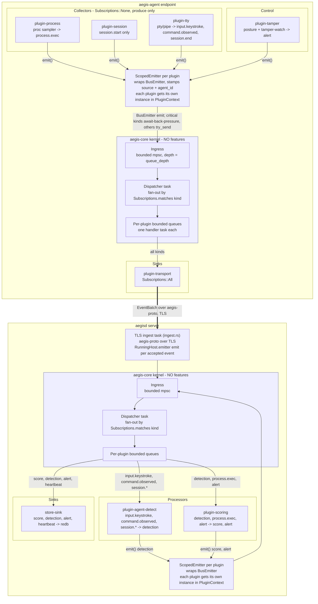
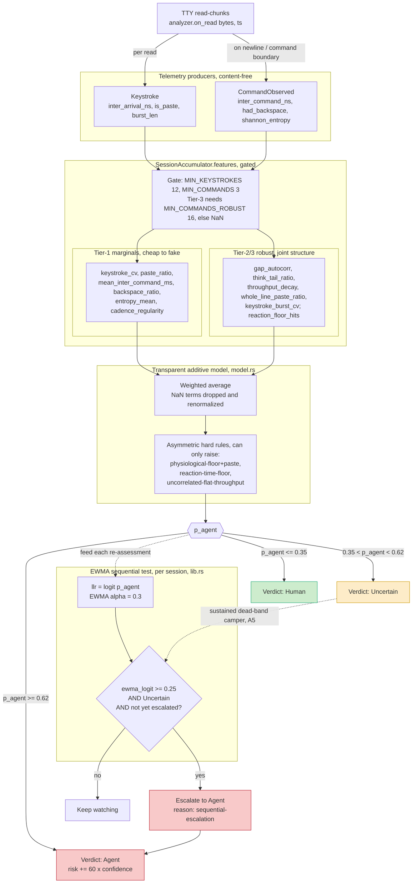
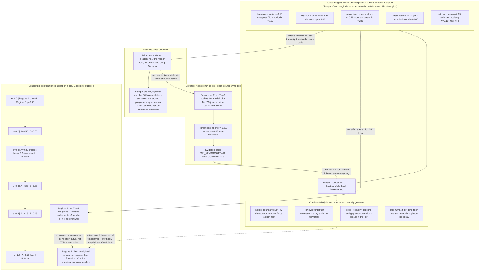
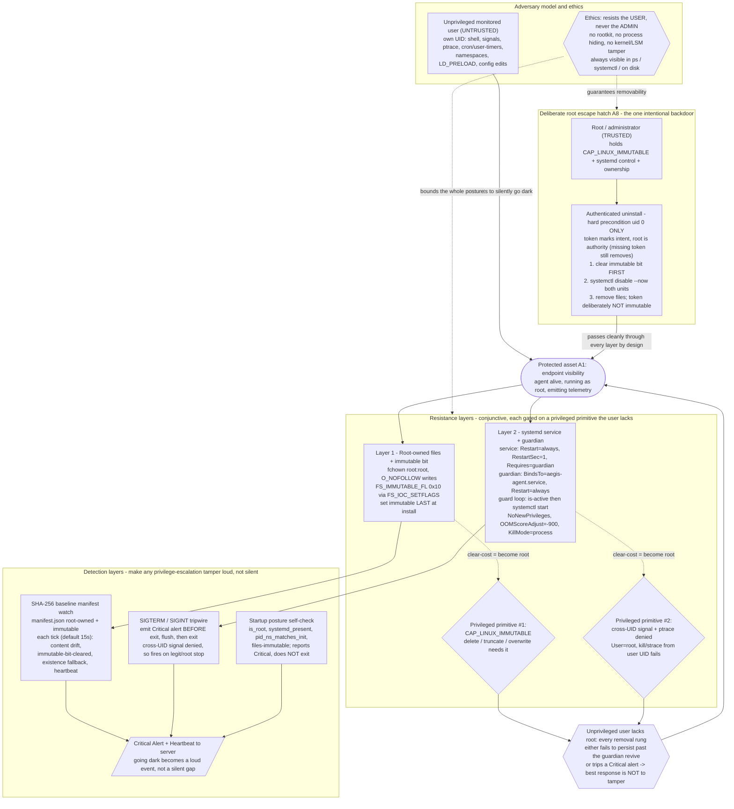
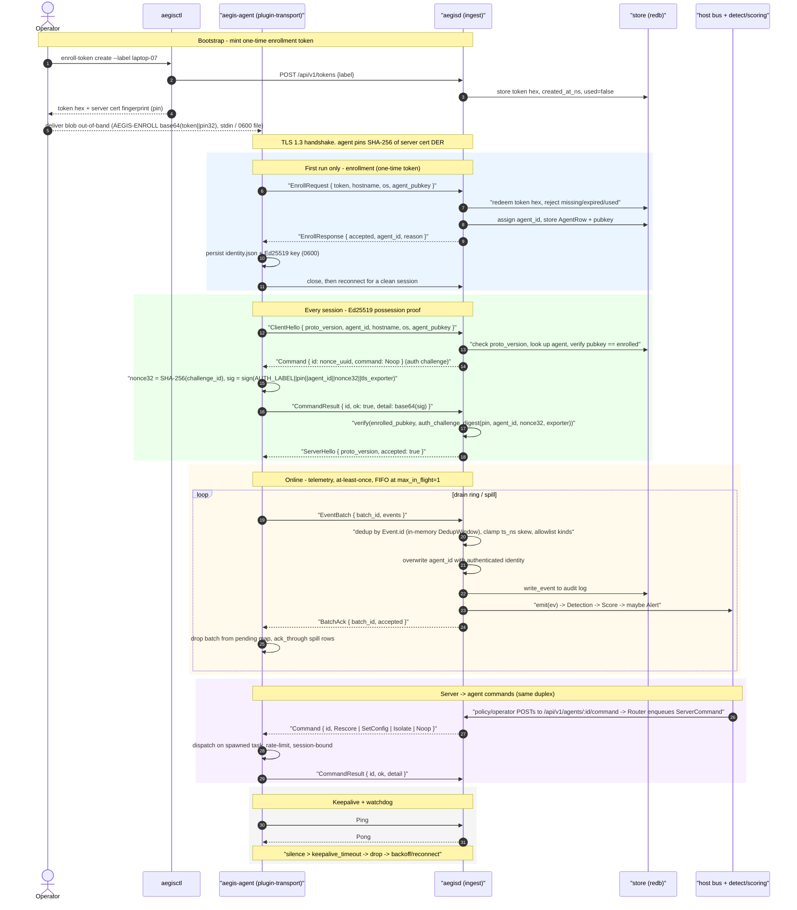

# Can You Tell a Human From an AI at the Keyboard? Building Aegis, a Plugin-Native Insider-Threat Platform in Rust

*By Anthony Herman and Claude.*

---

It is 3am. An operator logs into a production host and runs a twelve-command cleanup: change directory, list, grep a log, delete three files, restart a service, clear history, log out. The whole sequence takes four seconds. There is not a single backspace. No pause to read the output of one command before the next one fires. The inter-command gaps are nearly identical, command after command, like a metronome.

Was that a person?

Almost certainly not — and the interesting part is *how* we know. Nothing about *what* was typed is unusual; a sysadmin runs those exact commands every day. The tell is in the *rhythm*: nobody reads a screen, decides, and types a flawless next command in 300 milliseconds, twelve times in a row, with zero corrections. The cadence is wrong for a human and exactly right for a program.

This post is about building the system that makes that call — Aegis, a behavioral insider-threat platform written in Rust whose flagship job is to separate an automated agent from a human at a Linux endpoint, and to do it honestly: with a transparent model, a clear account of what an adversary can fake, and results we are careful not to oversell.

## Why behavior, not content

The obvious approach to "who is at the keyboard" is to read what they type. We deliberately do not. Content is the wrong signal for three reasons.

First, it is privacy-invasive in exactly the way that makes a monitoring system indefensible. Capturing the literal commands and keystrokes of every monitored user is a surveillance liability, and most of what you would capture is irrelevant to the question you actually care about.

Second, content is trivial to vary and easy to make look benign. An adversary controls every byte they type; if your detector keys on suspicious strings, they rename the script.

Third — and this is the deep one — an agent's *commands can be byte-for-byte identical to a human's*. The same `rm -rf`, the same `systemctl restart`. If the agent is doing legitimate-looking work, the content tells you nothing. What differs is the *process* that produced it: a human reads, hesitates, mistypes and corrects, pastes a block, pauses to think. A program emits.

So Aegis watches timing and structure — cadence, think-time, paste behavior, corrections, command shape — and never the verbatim text. This is enforced *structurally*, not by policy. A keystroke event carries only an inter-arrival time, a paste/burst flag, and a burst length; there is no field for the character. A command event carries structural statistics (length, token count, entropy, a backspace flag, an edit distance) plus a **salted hash** for correlating repeated commands across sessions — never the command itself. You cannot reconstruct what someone typed from the data Aegis collects, because the schema has nowhere to put it.

## The big idea: everything is a plugin

Before the detection machinery, the architecture, because it shapes the whole story.

Aegis makes one strong bet: the kernel has *no features*. The core crate, `aegis-core`, does not know what an agent is, does not know what a keystroke is, does not collect anything, score anything, or send anything anywhere. It does exactly four things: it discovers plugins, wires them onto a single event bus, routes events to plugins by subscription, and manages their lifecycle. That is the entire kernel.

Everything else is a plugin depending only on a stable SDK (`aegis-sdk`), never on the kernel. Collection is a plugin. Detection is a plugin. Scoring is a plugin. Network transport is a plugin. Even the agent's own self-defense is a plugin. A strict dependency layering — SDK ← kernel ← binaries, with plugins pinned to the SDK alone — means a plugin can never reach into core internals, and the kernel can never grow a feature.

Why does this matter for *this* post? Because it means the agent-vs-human detector is not a privileged, hard-wired subsystem. It is one swappable processor sitting on a bus that is shared, in-process, by collectors on the endpoint and by scoring on the server. The same feature-free kernel runs on both the agent and the server; they differ only in which plugins are linked in. Two axioms drive everything: *everything is an `Event`* (one envelope, one bus) and *everything is a `Plugin`*.

Here is the full picture. The kernel (the lavender boxes) is identical on both sides; the plugin families around it supply all behavior.



Each plugin emits through its own `ScopedEmitter`, which stamps the source and agent identity and hands the event to the shared `BusEmitter`. The dispatcher fans each event out to every plugin whose subscription matches its kind, and every plugin drains its own bounded queue on its own task — so a slow plugin back-pressures only itself. Processors emit derived events (a `Detection`, a `Score`) back onto the same bus, so the bus is a feedback loop: the detector's verdict re-enters and reaches the scorer.

## Telling humans from agents — the tells

Now the technical heart. How does Aegis actually decide?

The input is a stream of content-free TTY read-chunks. As bytes arrive, they become `Keystroke` events (each carrying an inter-arrival time, a paste flag, a burst length) and, at command boundaries, `CommandObserved` events (inter-command gap, a backspace flag, Shannon entropy of the command, and so on). A per-session accumulator collects these raw observations, discarding implausible gaps as noise.

Crucially, the accumulator is **gated**. It will not render a judgment until it has seen enough evidence — a minimum number of keystrokes and commands — and the most robust features need an even higher command count before they are computed at all. This avoids the trap of declaring "agent!" off two keystrokes.

Once the gate passes, features are derived in tiers:

- **Tier-1 marginals** are cheap to compute and intuitive: the *coefficient of variation* of keystroke timing (the core discriminator — humans are bursty and irregular, automation is metronomic), the paste ratio, mean think-time between commands (humans read output; agents react), the backspace ratio (humans err and correct), command entropy, and cadence regularity.
- **Tier-2/3 features** capture *joint structure* rather than single moments: gap autocorrelation, the heaviness of the think-time tail, throughput decay over a session, the whole-line paste ratio, burst variability, and counts of physiologically impossible reaction times. These are the features that look at how signals relate to each other over time.

Those features feed a deliberately **transparent additive model**. Each feature is mapped through a logistic transfer with a documented center and slope into an "agent-evidence" value, and the values are combined as a weighted average (with missing terms dropped and the weights renormalized). On top of that sit **asymmetric hard rules** that can only ever *raise* suspicion — for example, a physiological-floor-plus-paste combination, or a sustained flat throughput with no human-like decay. The output is a probability `p_agent`, bucketed into Human, Uncertain, or Agent.



Two design choices deserve emphasis. First, **why transparent and explainable?** An insider-threat verdict is an accusation. It has to be defensible — to the analyst who triages it and to the person it implicates. So every detection ships with the feature values that produced it and the strongest contributing reasons. There is no black box to argue with; the math is visible, and the coefficients can later be swapped for a learned model behind the same interface.

Second, **the dead-band camper.** An adversary's best move is often not to look human but to sit forever in "Uncertain," since a single Uncertain verdict is, by itself, weak evidence. Aegis closes this gap from two sides. The detector runs a per-session sequential test: it accumulates the log-odds of each re-assessment into an EWMA, and if a session *sustains* evidence in the suspicious-but-uncertain band long enough, it escalates to Agent on the grounds of persistence. And the scorer treats *sustained* Uncertainty as itself actionable — a small, decaying risk increment (well below what a clear Agent verdict adds) that an isolated blip sheds harmlessly but a session that keeps re-emitting Uncertain accumulates faster than it decays, climbing toward an alert. Between the two, you cannot hide in the gray zone indefinitely.

## It's a game: the agent fights back

Here is where it gets adversarial, and where intellectual honesty matters most.

A detector is not graded against nature; it is graded against an opponent who has read its source. Aegis is open-source, which means the defender *commits first* and the adversary plays second with full knowledge — a white-box Stackelberg game. The rational agent best-responds by spending an **evasion budget** on the *cheapest* tells. Want to defeat the metronome? Insert randomized sleeps to add timing jitter. Want to beat paste detection? Write the command one character at a time. Want a human-like error rate? Sprinkle in some backspaces. Each of these is a few lines of code.

The key insight — and the reason the tiered features exist — is that **cheap marginals are cheap to fake, but joint structure is costly to forge.** Moment-matching a coefficient of variation is easy. Reproducing the *causal* fingerprint of a human at a real terminal is not: kernel-boundary timestamps an unprivileged process cannot mint, HID interrupt correlation that a pseudo-terminal simply does not produce (a `pty` emits no `/dev/input` events), the coupling between errors and recovery, sub-human flight-time floors. To forge those, the adversary needs capabilities — root, real hardware, a faithful generative model of human motor timing — that raise the cost of evasion sharply. That is where robustness lives.

State the honest punchline before you look at the diagram, so its curve is not mistaken for data: **robustness is the *cost* you impose, not your accuracy at a single operating point.** The right way to measure a detector here is the area under the detection-versus-effort curve — how much evasion work it takes to slip through — not a single headline number. A detector that forces the adversary to build a kernel-faithful human emulator has done its job even if a perfect emulator would beat it.



**A note on this diagram's curve.** The degradation values inside the `Degrade` box (Regime A versus Regime B, the per-budget probabilities) are **conceptual and illustrative** — schematic numbers chosen to convey the *shape* of two regimes: a brittle marginals-only model that collapses early, and a joint-structure model that holds and then floors. They are *not* measurements. The real, measured synthetic numbers are in the next-but-one section, and they tell the same qualitative story with actual data. Do not read the Regime A/B values as results.

## Making the agent hard to kill — ethically

A monitoring agent that the monitored user can quietly switch off is worthless. The whole point of an insider-threat tool is that it keeps watching even when the person being watched would rather it did not. So the Aegis agent has to resist *the user*. But — and this line is non-negotiable — it must never resist *the administrator*.

The approach is layered and conjunctive: every rung an attacker would climb is gated on a privileged primitive an unprivileged user simply does not have.

- **Root-owned, immutable files.** The binary and its systemd units are owned by root and carry the filesystem immutable bit, set last at install time. Deleting, truncating, or overwriting them requires the capability to clear that bit, which is effectively root.
- **A systemd service + guardian pair that revive each other.** The service restarts always; the guardian is bound to the service and restarts always; killing one triggers recovery of both. An unprivileged user cannot cross-UID-signal a root process anyway.
- **Detection layers that make going dark *loud*.** A SHA-256 baseline manifest watch notices content drift, a cleared immutable bit, or a missing file. A SIGTERM/SIGINT tripwire fires a Critical alert *before* the process exits and flushes. A startup posture self-check confirms it is root, under systemd, and immutable. The design goal is that disabling the agent becomes a *loud event* — an alert and a heartbeat gap — rather than a silent hole in the record.



The ethics line is drawn hard and deliberately. There is **no rootkit, no process hiding, no kernel or LSM tampering.** The agent is always visible in `ps`, always visible in `systemctl`, always present on disk. And there is exactly one intentional backdoor: a single authenticated, root-only uninstall that clears the immutable bit, disables both units, and removes the files. Root is the authority. The agent resists the user and never the admin — that is what separates a defensible security control from spyware.

(One honesty note: the privileged lifecycle *is* implemented and wired — `aegis-agent install` performs the symlink-safe root-owned copy, writes both systemd units and the SHA-256 manifest, enables the services, and sets the immutable bit last; `aegis-agent uninstall` is the root-only escape hatch; `aegis-agent guard` runs the watchdog loop. What is unproven is *field hardening*: this lifecycle needs root, a systemd host, and an immutable-capable filesystem, and it has not yet been red-teamed in a live deployment. The diagram depicts the implemented design, not a battle-tested one.)

## One binary to run it all

The deployment story is the payoff for all that pure-Rust discipline. `aegisd`, the server, is designed to ship as **a single, statically-linked (musl) binary** with nothing around it. The crypto and TLS stack is pure Rust (`rustls`/`ring`, `rcgen`) — no OpenSSL to link. The datastore is embedded (`redb`, a pure-Rust ACID key-value store) — no external database to stand up. The operator dashboard's assets are compiled *into* the binary (`rust-embed`) — no runtime asset directory. Backup is, quite literally, "copy one file." CI already builds the server for the musl target and asserts the result is statically linked.

And this ties straight back to the plugin thesis. The same feature-free kernel runs on both the agent and the server; the network is not a special subsystem but *two plugins* — a forwarder on the agent and an ingest listener on the server — bridging two otherwise-separate in-process buses. The sequence below shows the designed wire protocol end to end: minting a one-time enrollment token, the TLS-pinned first-contact enrollment, a per-session Ed25519 possession proof, at-least-once telemetry batches with acknowledgement, and a duplex command channel back to the agent.



This is the enrollment and transport protocol as built: the message grammar and framing are implemented and unit-tested, and the moving parts are wired into the running binaries. `aegisd run` opens the embedded redb store, spawns the TLS ingest listener, and feeds every accepted event onto the host bus (so detection and scoring fire on ingested telemetry) while the store sink persists the derived results; the agent's `plugin-transport` spawns its connection actor on init and forwards over mutual-auth TLS; and `aegis-agent enroll` performs the pinned first-contact token exchange. The honest caveat is maturity, not absence: this is an active prototype that has been exercised by integration tests rather than a load-tested, field-deployed system, and a few read-path API surfaces and the duplex command channel are implemented ahead of being driven end-to-end in anger.

## The numbers (honest)

So how well does it work? Here are the real, reproducible **synthetic** results. Each row averages five seeds, with 2,000 human and 2,000 agent sessions per seed, all driven through the *actual* feature pipeline and the *actual* transparent model. The evasion budget `e` interpolates an agent's behavior toward a human's: `e=0` is a naive agent, `e=1` is a perfect behavioral mimic. The agent is the positive class.

| evasion `e` | ROC-AUC | accuracy | precision | recall | F1 | uncertain% |
|----------:|--------:|---------:|----------:|-------:|---:|-----------:|
| 0.0 | **1.000** | 1.000 | 1.000 | 1.000 | 1.000 | 0.0% |
| 0.1 | 1.000 | 1.000 | 1.000 | 1.000 | 1.000 | 0.0% |
| 0.2 | 1.000 | 0.997 | 1.000 | 0.994 | 0.997 | 0.3% |
| 0.3 | 1.000 | 0.838 | 1.000 | 0.675 | 0.806 | 16.2% |
| 0.4 | 1.000 | 0.593 | 1.000 | 0.187 | 0.314 | 40.7% |
| 0.5 | 1.000 | 0.516 | 1.000 | 0.031 | 0.061 | 48.1% |
| 0.6 | 0.999 | 0.502 | 1.000 | 0.004 | 0.007 | 37.0% |
| 0.7 | 0.983 | 0.500 | 0.760 | 0.001 | 0.001 | 8.8% |
| 0.8 | 0.889 | 0.500 | 0.200 | 0.000 | 0.000 | 0.8% |
| 0.9 | 0.716 | 0.500 | 0.000 | 0.000 | 0.000 | 0.1% |
| 1.0 | **0.500** | 0.500 | 0.000 | 0.000 | 0.000 | 0.0% |

The headline: against naive automated agents the model achieves **perfect separation, AUC 1.000** — and it holds at or near 1.000 right through the mid-budget range (still 1.000 at `e=0.5`, 0.999 at `e=0.6`), exactly where a cheap-marginals-only detector would already have collapsed. Then, as the mimic approaches perfection, AUC degrades to **0.500 at `e=1.0`**. Note also a property that matters operationally: across every budget, **human false positives are zero** — the confusion matrices show 0 FP at `e=0.0`, `e=0.5`, and `e=1.0` alike. The detector never accuses a real human in these runs; degradation shows up purely as missed agents (rising false negatives), never as false alarms. And the EWMA sequential test is the mechanism that rescues sustained-but-uncertain sessions from camping in the gray zone.

It would be easy to bury the 0.500. We will not, because it is **not a failure — it is the theorem.** An adversary that *perfectly* reproduces human timing is, by definition, behaviorally indistinguishable from a human; no timing-based detector can separate them, because there is nothing left to separate. The 0.500 at `e=1.0` is the expected and correct result. What the table actually demonstrates is the *cost curve*: an attacker has to climb almost all the way to a flawless mimic before detection meaningfully erodes, and the robust joint-structure features are what keep AUC pinned near 1.0 across the whole mid-range. That cost is the detector's value.

And the limitations, stated plainly. These results are **synthetic**: sessions are sampled from documented behavioral distributions and pushed through the real pipeline. That validates two things — that the model cleanly separates the *modeled* behaviors, and the precise shape of the evasion trade-off. It does **not** constitute a field-accuracy claim. We have not yet collected timing from instrumented humans and real agents in the wild. The live capture path *does* exist — `plugin-tty` reconstructs each command line in a transient buffer to compute content-free statistics and emits exactly the `Keystroke`/`CommandObserved` events the detector consumes, via either a pipe (for CI) or a real PTY (`aegis-agent shell`) — but it ships **off by default** (it has to seize the controlling terminal) and has not been validated against real workloads. The numbers above come from feeding the model synthetic sessions directly, which is deliberate: it isolates the model from any capture noise, but it is not the same as a running field deployment.

(Contrast this measured table with the *conceptual* Regime A/B curve in the game diagram earlier: that one was a schematic illustration of two model regimes; *this* one is real synthetic measurement.)

## What's next / try it

The honest forward look maps onto the gap between an implemented prototype and a trustworthy product. The end-to-end path is wired — capture (`plugin-tty`), forwarder, TLS ingest, store, detection, scoring — but each link is proven by tests rather than by production. So the work ahead is hardening and validation, not construction: exercising the live capture-to-verdict loop on real interactive sessions instead of synthetic streams; red-teaming the privileged install/guardian/immutable lifecycle on real hosts; load-testing ingest and the forwarder's spill-and-replay durability; and — the one that actually moves the accuracy claim — an IRB-approved field study that replaces the synthetic sessions with timing from instrumented humans and real agents.

To try the parts that *are* built:

```bash
# Build everything
cargo build --workspace

# List the plugins the kernel discovers (statically, via inventory)
cargo run --bin aegisctl -- plugins

# Run the agent locally and watch the events it produces
cargo run --bin aegis-agent -- run --print-events

# Build the self-contained, statically-linked server and confirm it
cargo build --release --bin aegisd --target x86_64-unknown-linux-musl
ldd target/x86_64-unknown-linux-musl/release/aegisd   # => "statically linked"

# Reproduce the synthetic evaluation table
cargo run --release -p plugin-agent-detect --example eval_report
```

The full design rationale lives in [`docs/ARCHITECTURE.md`](../ARCHITECTURE.md), the security and ethics analysis in [`docs/THREAT_MODEL.md`](../THREAT_MODEL.md), and the complete academic write-up in the [paper](../paper/paper.md).

So — back to 3am, twelve commands, four seconds, zero typos. Human or agent? Now you know how the machine would answer, *how* it would arrive at the answer, and — just as important — exactly how confident it has any right to be.
