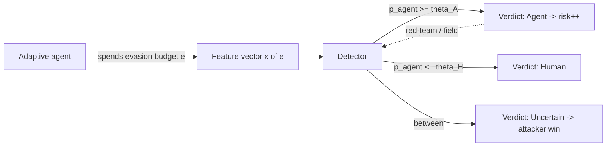
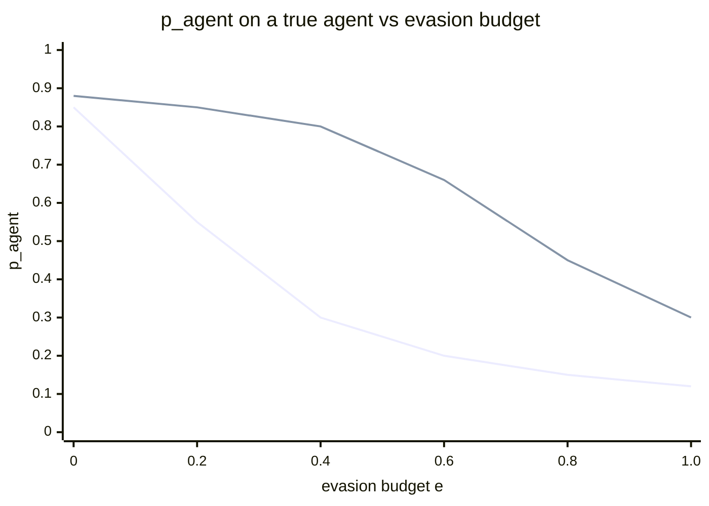

# Agent-vs-Human Detection: Design

> This document specifies the design for Aegis's flagship capability — deciding
> whether the entity driving an interactive session is a **human operator** or an
> **automated agent** — and the roadmap from the current transparent model to an
> evasion-robust, calibrated detector. It is the design reference behind
> `plugins/plugin-agent-detect` and is read alongside
> [`THREAT_MODEL.md`](./THREAT_MODEL.md) (adversary #2 is the agent-evasion game)
> and [`ARCHITECTURE.md`](./ARCHITECTURE.md).

## Table of contents

1. [Problem & threat model](#1-problem--threat-model)
2. [Telemetry substrate (content-free)](#2-telemetry-substrate-content-free)
3. [Feature catalog](#3-feature-catalog)
4. [The model](#4-the-model)
5. [Evasion robustness: which features to trust](#5-evasion-robustness-which-features-to-trust)
6. [Evaluation methodology](#6-evaluation-methodology)
7. [Calibration & false-positive control](#7-calibration--false-positive-control)
8. [Honest limitations](#8-honest-limitations)
9. [Implementation roadmap](#9-implementation-roadmap)

---

## 1. Problem & threat model

The core question, from `aegis_sdk::Verdict`, is ternary: **Human**, **Agent**, or
**Uncertain**. The subject is an interactive session (`SessionId`); the evidence is
timing- and structure-only telemetry. The keystroke/command timing the model keys on
comes from **`plugin-tty`** (the PTY/pipe collector that emits `Keystroke` /
`CommandObserved`); `plugin-session` emits session lifecycle (`SessionStart`) plus
the content-free command-statistics helpers, and `plugin-process` emits
`ProcessExec`.

### 1.1 The adversary is *adaptive*

The interesting adversary is not a naive script. It is an **adaptive agent** that
knows the detector. Under Kerckhoffs's principle we must assume the worst: this
detector is open source in this repository, so its feature definitions, transfer
functions, weights, and thresholds are all known to the attacker. Security through
obscurity of the model is **not available**. The threat model already names this as
adversary #2 — "Automated agent attempting to mimic human behaviour to evade the
agent-vs-human detector (detection-vs-evasion game)."

### 1.2 The game

This is a **Stackelberg game** in which the defender commits first (ships a
detector), the attacker best-responds (tunes an evasion to whatever was shipped),
and the defender re-weights over successive rounds. The right question for the
defender is therefore not "which features score well against today's naive agent?"
but **"given that the attacker will best-respond to whatever I deploy, which
commitment leaves the attacker worst off?"**

| Player | Strategy space | Objective |
|---|---|---|
| Defender `D` | Feature subset, transfers, thresholds `(θ_H, θ_A)`, decision rule over a session | `max TPR s.t. FPR ≤ α` (Neyman–Pearson) — catch agents without crying wolf on operators |
| Adaptive agent `A` | Evasion effort vector: keystroke jitter, injected typos/backspaces, throttled reaction, no bracketed paste, randomized cadence, faked retries | Maximize `P(verdict ≠ Agent)`. **`Uncertain` is a win for `A`** — `plugin-scoring` only adds risk on `Verdict::Agent` |

### 1.3 The asymmetries that decide the design

Two asymmetries shape every downstream choice:

- **Loss asymmetry (defender side).** A false "Agent" verdict on a real operator
  inflates a decaying risk score (`plugin-scoring`, `agent_detection_weight = 60 ×
  confidence`) toward a human-reviewed `Alert` (`alert_threshold = 75`). Repeated
  false alerts train analysts to ignore the signal. So the objective is
  Neyman–Pearson — maximize true-positive rate subject to a hard cap on
  false-positive rate — not raw accuracy.

- **Cost asymmetry (attacker side, the defender's deepest lever).** Every injected
  think-pause, typo-correction round-trip, and randomized delay **slows the agent
  down**. An agent that perfectly mimics human tempo has thrown away its only
  reason to automate: throughput. The win condition is therefore not "the agent can
  never evade" but **"to evade, the agent must become as slow and error-prone as a
  human, erasing its advantage."**

---

## 2. Telemetry substrate (content-free)

By design (`event.rs` "Privacy by design"), behavioral telemetry captures
**timing and structure, never content**. This is a hard invariant from
`THREAT_MODEL.md` ("Telemetry is content-free by design"). The detector consumes:

| Event (`aegis_sdk::EventPayload`) | Fields used today | Fields **present but unconsumed** |
|---|---|---|
| `Keystroke` | `inter_arrival_ns`, `is_paste`, `burst_len` | — |
| `CommandObserved` | `inter_command_ns`, `had_backspace`, `shannon_entropy` | `command_len`, `token_count`, `edit_distance_prev`, `command_hash` |
| `SessionStart` / `SessionEnd` | session boundary | `Event.ts_ns` — absolute producer timestamp on every event envelope |
| `ProcessExec` | — | `cwd: Option<String>` (collector currently sets `None`) |

The distinction between **what is already on the wire but unused** versus **what
needs new telemetry** drives the entire defensive roadmap in §5 and §9. Critically,
`edit_distance_prev`, `command_hash`, `token_count`, and per-event `ts_ns` are
*already transmitted* and cost nothing new to consume.

Any new telemetry proposed in this document is **content-free**: counts, salted
hashes, enums, or exit codes — never characters. `plugin-session::command_stats`
already demonstrates the pattern (salted SHA-256 `command_hash`, structural counts);
new fields mirror it.

---

## 3. Feature catalog

Each feature is rated on **discriminating power** (how well it separates human from
naive agent) and, more importantly, **evasion cost** (what the attacker must
construct to fake it, and whether faking it forces a detectable distortion
elsewhere). `computable_from` records whether the feature is free today or needs new
telemetry.

### 3.1 Keystroke timing & rhythm

| Feature | Power | Evasion cost | Computable from |
|---|---|---|---|
| `inter_key_cv` (= live `keystroke_cv`) | high | medium | `Keystroke.inter_arrival_ns`; already computed |
| `log_normal_fit_residual` | high | **high** | `inter_arrival_ns`; KS/AD residual of `ln(IKI)` vs fitted Gaussian (~50+ samples) |
| `bimodal_burst_gap_ratio` | high | **high** | `inter_arrival_ns` with `is_paste=false` filter; within-word vs between-word modes |
| `digraph_latency_cv` | high | **high** | **Needs new telemetry**: hashed/bucketed digraph-pair id on a `KeystrokeDigraph` event |
| `pause_rate` | medium | medium | `inter_arrival_ns`; counter for gaps in (2 s, 60 s) |
| `burst_internal_regularity` | medium | medium | `inter_arrival_ns`; CV within bursts (gap < 300 ms) |
| `iki_entropy` | medium | medium | `inter_arrival_ns`; Shannon entropy of 20 ms-binned IKIs. Use the same entropy formula as `plugin-session::shannon_entropy` but applied to bin-count frequencies, not the `&str` API (which operates on byte distributions of strings). |
| `inter_command_pause_tail_weight` | medium | medium | `inter_commands_ms`; fraction > 10 s |
| `command_rhythm_autocorrelation` | medium | **high** | `inter_commands_ms`; lag-1 Pearson (~20+ commands) |
| `keystroke_acceleration_asymmetry` | medium | **high** | **Needs new telemetry**: per-command IKI sequence (command index on `Keystroke`) |

### 3.2 Command structure & correctness

| Feature | Power | Evasion cost | Computable from |
|---|---|---|---|
| `within_command_correction_intensity` (churn ratio) | high | **high** | `command_len` today + **new** `keystrokes_in_command:u32`, `delete_events:u32` on `CommandObserved` |
| `command_repetition_rate` | medium | medium | `command_hash` (unconsumed today) — distinct ratio + repeat run-lengths |
| `inter_command_edit_distance_profile` | high | medium | `edit_distance_prev` (unconsumed) normalized by `command_len` |
| `command_length_dispersion` | medium | medium | `command_len`, `token_count`; CV of each |
| `tab_completion_signature` | high | **high** | Partial via `burst_len`/`is_paste`; robust needs **new** `completion_bursts:u32` / source-kind enum |
| `whole_line_injection_ratio` | high | **high** | Correlate `is_paste`/`burst_len` vs `command_len`; cleaner with `delivered_as_single_burst:bool` |
| `first_try_correctness_rate` | high | **high** | Proxy today; strong version needs **new** `exit_status:i32` / `shell_syntax_error:bool` on `CommandObserved` |
| `token_count_entropy` | low | low | `token_count`; entropy/CV — weak corroborator only |

### 3.3 Session tempo & circadian

| Feature | Power | Evasion cost | Computable from |
|---|---|---|---|
| `think_time_tail_ratio` | high | medium | `inter_commands_ms`; p90/p50 (~20+ commands) |
| `micro_pause_burst_pattern` | high | **high** | `inter_commands_ms`; dip depth between KDE modes of `log(gap)` |
| `session_hour_of_day` | medium | medium | `Event.ts_ns` of `SessionStart` event |
| `sustained_throughput_no_decay` | high | **high** | `Event.ts_ns` per `CommandObserved` event; slope of cmds/min vs elapsed |
| `gap_at_output_boundary` | medium | **high** | Pair `inter_command_ns` with prior `command_len`/`token_count` |
| `reaction_time_floor` | high | low (see §5.4) | `inter_command_ns` when command was not pasted; sub-~150 ms gap is physiologically impossible for a human. **Needs new telemetry to filter reliably**: `CommandObserved` has no `is_paste` field — correlate with preceding `Keystroke.is_paste` events, or add `delivered_as_paste:bool` to `CommandObserved` (Ring 3). `had_backspace=false` is **not** a paste filter. |
| `session_duration_without_long_pause` | high | medium | `Event.ts_ns` of `SessionStart`/`SessionEnd` events + max gap |
| `command_gap_autocorrelation` | medium | **high** | `inter_commands_ms`; lag-1 Pearson (~16+ commands) |

### 3.4 Sequence & intent

| Feature | Power | Evasion cost | Computable from |
|---|---|---|---|
| `command_repetition_entropy` | high | medium | `command_hash`; normalized window entropy + exact-repeat fraction |
| `ngram_predictability` | high | **high** | `command_hash`; online bigram conditional surprisal |
| `edit_distance_progression` | high | **high** | `edit_distance_prev` (unconsumed); small-nonzero band fraction |
| `structural_drift_smoothness` | medium | medium | `command_len`, `token_count`, `shannon_entropy`; total-variation across commands |
| `error_recovery_coupling` | high | **high** | Join `Keystroke` timing with `CommandObserved.had_backspace`; **needs** per-command keystroke alignment (boundary index) |
| `exploration_to_action_ratio` | medium | medium | Proxy via `command_hash`+`token_count`; cleaner with **new** read/write verb-class enum |
| `working_directory_churn` | medium | **high** | **Needs new telemetry**: salted `cwd_hash` on `CommandObserved` (or populate `ProcessExec.cwd`) |
| `session_phase_autocorrelation` | high | **high** | `inter_command_ns` ordered series; lag-1 autocorr + non-stationarity |
| `burst_run_length_distribution` | medium | medium | `inter_command_ns`; run lengths of sub-threshold gaps |
| `retry_loop_signature` | medium | **high** | `command_hash`+`edit_distance_prev`+`inter_command_ns` |

---

## 4. The model

### 4.1 What ships today (`model.rs`)

A deliberately **transparent additive model**: each feature maps to an
"agent-evidence" value in `[0,1]` via a logistic transfer with a documented centre
and slope, combined as a weighted average. `p_agent ≥ 0.62 ⇒ Agent`,
`≤ 0.35 ⇒ Human`, else `Uncertain`. Transparency is the right call for an
insider-threat tool — every verdict must be explainable via `Detection.reasons` to
an analyst.

The re-weighting argued for in earlier revisions of this document **has shipped**:
the live model is **eleven terms**, with the cheap Tier-1 marginals *demoted* to a
combined ≈0.24 and the bulk of the weight (≈0.66) moved onto Tier-2/3 joint-structure
terms an i.i.d.-delay evader cannot reproduce. The Agent threshold was tightened
`0.65 → 0.62` so the re-weighted robust evidence on an evaded agent still crosses
while the human distribution (≈0.03) stays far below. (This section used to describe
a six-term, `0.65`-threshold baseline; that baseline is **superseded** — see ADR #5
in `ARCHITECTURE.md`. The weights below are `model.rs::terms`, verbatim.)

**Tier-1 marginals (demoted; combined ≈0.24):**

| Feature | Term | Weight | Transfer (agent-evidence) |
|---|---|---|---|
| `keystroke_cv` | metronomic-typing | 0.06 | `σ(8·(0.45 − cv))` |
| `paste_ratio` | paste-injection | 0.04 | `clamp(paste_ratio)` |
| `mean_inter_command_ms` | instant-reaction | 0.10 | `σ(0.004·(1000 − mean_ms))` |
| `backspace_ratio` | errorless-input | 0.04 | `σ(40·(0.06 − bs_ratio))` |
| `entropy_mean` | dense-commands | 0.02 | `σ(3·(H − 4.2))` |
| `cadence_regularity` | regular-cadence | 0.04 | `clamp(cadence_regularity)` |

**Tier-2/3 joint-structure terms (promoted; combined ≈0.66):**

| Feature | Term | Weight | Transfer (agent-evidence) |
|---|---|---|---|
| `gap_autocorr` | gap-non-autocorrelation | 0.22 | `σ(6·(0.18 − x))` (NaN below robust gate) |
| `think_tail_ratio` | constant-think-time | 0.12 | `σ(2.2·(2.0 − x))` |
| `throughput_decay` | no-throughput-decay | 0.14 | `σ(4·(x + 0.05))` |
| `whole_line_paste_ratio` | whole-line-injection | 0.12 | `clamp(whole_line_paste_ratio)` |
| `keystroke_burst_cv` | burst-metronome | 0.06 | `σ(8·(0.30 − x))` (NaN if too few bursts) |

Terms whose evidence is `NaN` (the volume-hungry Tier-3 features below
`MIN_COMMANDS_ROBUST`) are dropped and the weighted average renormalizes over the
survivors, so a short session leans on the hard rules and the Tier-1 remnants → more
`Uncertain` by design. Re-assessed every `assess_every = 10` events and on
`SessionEnd`.

**Three asymmetric hard rules** (noisy-OR / max-pooling; can only *raise* `p_agent`,
each appending an auditable reason) are also live in `model.rs::assess`:

1. `physiological-floor+paste` — sustained sub-floor reactions (`reaction_floor_hits
   ≥ 0.25`) co-occurring with whole-line delivery (`whole_line_paste_ratio ≥ 0.5`)
   ratchets `p_agent` to ≥ 0.92.
2. `reaction-time-floor` — sustained sub-floor reactions alone ratchet to ≥ 0.80
   (with the same `≥ 0.25` minimum-evidence gate, so a single isolated slip only
   nudges the average).
3. `uncorrelated-flat-throughput` — the i.i.d.-delay evader signature: ≈0
   autocorrelation **and** flat throughput **and** a narrow think-time tail
   (`< 1.6`) simultaneously ratchets to ≥ 0.72. A genuine heavy-tailed human does
   not trip it.

### 4.2 The headline finding (and what was done about it)

The original six features were all in the cheaply-faked tier (§5.1): a strong
baseline against a naive agent, effectively defenseless against an adaptive one. The
fix — already implemented — was not better thresholds on those six but **migrating
the decision weight onto evasion-robust features** (the §5.3 Tier-3 set), most of
which were already computable from on-the-wire data. The demoted Tier-1 marginals
are kept as cheap corroborators, not as the basis of the verdict.

### 4.3 The path: transparent → calibrated → ensemble

The `Model` interface stays; the internals evolved in three steps. **Steps 1–2 have
shipped** (this is the model described in §4.1); step 3 is partly done:

1. **Re-weight (transparent).** *Done.* Tier-1 marginals demoted to ≈0.24 combined;
   ≈0.66 of the weight moved onto the Tier-2/3 distribution-shape and
   correlation/joint-structure terms (§5).
2. **Interaction terms + hard rules.** *Done.* The three asymmetric "can only
   incriminate" rules of §4.1 (physiological floor, floor+paste, uncorrelated-flat-
   throughput) are live; pure *absence* of a signal never pushes toward Human (§5.4).
3. **Calibrate + sequential test.** *Sequential test done; calibration is future.*
   The per-snapshot assessment is folded into an **EWMA sequential test** over the
   session (lib.rs `ewma_alpha` + `Model::log_likelihood_ratio`; §7.3), so a session
   that *consistently* leans agent is escalated even if no single snapshot crosses
   `agent_threshold`. What remains genuinely future is **calibration**: `confidence`
   is still the raw weighted average, not a Platt/isotonic `P(agent | x)`.

---

## 5. Evasion robustness: which features to trust

The discriminating axis is **"what must the attacker construct to fake this, and
does faking it force a detectable distortion elsewhere?"** Three tiers.

### 5.1 Tier 1 — cheaply faked (single moment-match). The original six features.

> **Status:** these six were the *entire* original model and are now **demoted** to
> a combined ≈0.24 of the weight (§4.1); the analysis below is why. The weights
> quoted inline in this subsection are the *original* Tier-1 weights, retained to
> explain the evasion that motivated the re-weighting — not the live weights.

Each falls to one scalar moment-match, a few lines of code, no model of human
behavior:

- **`paste_ratio` (0.20).** Don't paste; write the pty char-by-char with a `sleep`.
  This is the *first* thing any evasive agent does; zeroes 20% of weight at no
  behavioral cost.
- **`mean_inter_command_ms` (0.25).** A constant 1.5 s pre-command delay drives the
  `σ(0.004·(1000−mean))` term (centred at 1 s) to ~0.12. 25% of weight, one
  constant.
- **`keystroke_cv` (0.25).** Any jitter works: uniform `U(50, 250)` ms yields
  CV ≈ 0.46, just past the 0.45 centre.
- **`backspace_ratio` (0.15).** Emit a Bernoulli `had_backspace` on ~10% of
  commands. The transfer `σ(40·(0.06−bs))` is steep — even rare fake corrections
  saturate toward Human. In today's schema you don't even *do* the correction;
  `had_backspace` is just a bool the collector reports.
- **`cadence_regularity` (0.10).** Randomize gaps. Same moment-match.
- **`entropy_mean` (0.05).** Already weak; interleave short commands.

**Verdict on Tier 1 (against the *original* six-feature model):** an adaptive agent
that (a) stops pasting, (b) adds a constant ~1.5 s pre-command delay, (c) jitters
keystrokes, and (d) fakes a 10% backspace flag would drive *that* model from
`p_agent ≈ 0.85` down through 0.35 into solid **Human** for ~30 lines of code,
costing only ~3–5× wall-clock throughput. That model had *no defense* because it
never checked the *shape* of the faked distributions, only their first moment. The
**live** model closes this: those four moves now move ≈0.24 of the weight at most,
and the same i.i.d.-delay evasion *creates* the `gap-non-autocorrelation` and
`uncorrelated-flat-throughput` tells that now carry the verdict (§5.3).

### 5.2 Tier 2 — moderately expensive (correct parametric family)

The attacker must sample from the *right distribution*, not just match a mean, and
re-parameterize per session context (a `vim` session, a `git` session, and a
`kubectl` session have different IKI and think-time distributions; one hardcoded
log-normal looks anomalous across contexts):

- **`log_normal_fit_residual`** — uniform/Gaussian jitter (the Tier-1 evasion) has
  the wrong tails and *fails this*; the agent must sample `IKI ~ LogNormal(μ, σ)`.
- **`think_time_tail_ratio`** (p90/p50) — a constant/uniform delay gives ≈ 1; the
  agent must inject a heavy right tail, i.e. lumpy throughput loss it would rather
  avoid.
- **`bimodal_burst_gap_ratio`, `iki_entropy`** — reproduce the two-mode typing
  structure.
- **`command_repetition_entropy`, `edit_distance_progression`, `ngram_predictability`**
  (free today from `command_hash`/`edit_distance_prev`) — require realistic
  *iteration*: re-run `ls`/`git status` verbatim, evolve one flag at a time. The
  LLM-driven agent is *too fresh* (high entropy, depleted small-edit band); the loop
  agent is *too periodic*. Both tails differ from the human middle; faking the
  middle means degrading the agent's own planning.

### 5.3 Tier 3 — evasion-robust (reproduce correlations / joint structure)

The defensible core. Defining property: **the feature measures a relationship
between two streams or across time, so faking it cheaply in one marginal breaks it
in the joint.** You cannot satisfy these by post-hoc sampling — the structure must
be causally generated by the act of working.

1. **`error_recovery_coupling`** — do `had_backspace` commands co-occur with a
   fast-deletion keystroke-timing burst in the same window? A Tier-1 agent toggles
   the bool *independently of timing* — exactly the tell. Faking it means generating
   the correction's keystroke micro-pattern (a localized dip-then-resume), not
   flipping a bool. The elegant counter to "fake backspaces"; directly hardens the
   brittle live `backspace_ratio`.
2. **`command_gap_autocorrelation` / `session_phase_autocorrelation`** — lag-1
   autocorrelation + non-stationarity of the gap series. **Defeats the cheapest
   evasion in the book:** injecting i.i.d. random delays fixes the mean and CV
   (beating the live model) but produces autocorrelation ≈ 0; humans sit in a
   structured 0.1–0.6 band with phase trends (slow ramp-up, fast middle, fatigue
   slowdown). Faking it requires a stateful timing process with memory *and* a model
   of session arc.
3. **`sustained_throughput_no_decay`** — slope of cmds/min vs elapsed. Humans decay;
   agents hold constant/rising. Faking a *negative* slope means the agent
   voluntarily, monotonically slows itself for hours — surrendering its core
   advantage.
4. **`session_duration_without_long_pause`** — longest gap / session length. A 2 h
   session with no gap > 5 min is a strong tell. Faking it costs a *real multi-minute
   idle* — pure throughput sacrifice with no task value.
5. **`micro_pause_burst_pattern`** — dip depth between modes of the log-gap KDE.
   Requires a genuinely bimodal think-time process, not a unimodal poll loop.
6. **`whole_line_injection_ratio` / `tab_completion_signature`** — the former
   refines `paste_ratio` from "a paste happened" to "the *entire line* arrived
   atomically vs a human paste of a *fragment* inside hand-typed text"; the latter
   detects the human-only tab-completion affordance (small mid-line burst after a
   think-gap near a token boundary). An agent driving a pty types whole lines or
   pastes whole lines; reproducing "mostly single-key typing punctuated by *small
   mid-line completion bursts*" means simulating readline it doesn't use.
7. **`within_command_correction_intensity`** — `keystrokes_consumed / command_len > 1`
   plus delete-run-length. Humans backtrack mid-token; agents emit each line with
   churn ≈ 1.0 and zero deletions.
8. **`first_try_correctness_rate`** — the strongest *new-telemetry* candidate
   (`exit_status` / `shell_syntax_error`). A near-perfect first-try success rate over
   many commands is something a human essentially cannot produce; faking it means the
   agent must deliberately fail then "recover" — costly and itself detectable.

**Why Tier 3 resists adaptation (the core insight):** **the cheap evasion of a
Tier-1 feature actively produces the Tier-3 tell.** The agent that injects i.i.d.
delays to beat `keystroke_cv` *creates* the zero-autocorrelation signature. The
agent that flips `had_backspace` to beat `backspace_ratio` *creates* the
backspace/timing-decoupling signature. The agent that types char-by-char to beat
`paste_ratio` must then get the digraph/burst micro-structure right, which it won't.
Tier 3 features are **traps on the standard evasion playbook** — most informative
*precisely against an adversary who has already defeated Tier 1.* That is what makes
them the Stackelberg-correct commitment.

### 5.4 Special case: `reaction_time_floor` — cheap to evade, one-way ratchet

Labeled `evasion_cost: low` (one `sleep` floors it), but it earns a slot for a
different reason: it is a **near-zero-false-positive physiological discriminator with
no human-side cost**. A typed (non-paste) command gap below ~150 ms is
biomechanically impossible for a human.

- Against a naive agent: a free, decisive catch (FPR ≈ 0 — no human trips it).
- Against an adaptive agent: trivially evaded, but evading it is a *commitment the
  agent must never violate* — a single sub-150 ms non-paste slip in a long session
  re-condemns it. A "perfection tax": one more thing that breaks under load,
  concurrency, or a forgotten code path.

Deploy as a **hard one-sided rule** (a sub-floor gap can decisively *raise*
`p_agent`; its *absence* contributes nothing toward Human), outside the weighted
average. Same treatment for `session_duration_without_long_pause`.

### 5.5 Detection degrades differently depending on what you deployed

Model the agent's evasion budget as `e ∈ [0, 1]` (fraction of the playbook
implemented) and track `p_agent` on a *true* agent:

*Upper curve at high `e` = the Tier-3-weighted model that **ships today** (Regime B,
§4.1); lower curve = the superseded six-feature baseline (Regime A).*

- **Regime A (the superseded six Tier-1 features).** `p_agent(e)` collapses fast and
  concavely: the attacker spends the first budget units on the highest-weight,
  cheapest features (drop paste −0.20; add command delay −0.25; add jitter −0.25).
  By `e ≈ 0.4` it has crossed below 0.35. **The curve hits the floor before the
  budget is half-spent** — there is no effort wall.
- **Regime B (Tier-3-weighted; the live model).** `p_agent(e)` is convex-then-floored: cheap moves
  barely move it (Tier-1 carries little weight). Progress requires climbing into
  Tier 2 (correct distributions) and Tier 3 (correlations), and **the marginal
  evasions interfere** — making throughput decay realistic perturbs autocorrelation;
  injecting genuine long pauses reshapes the gap KDE that `micro_pause_burst_pattern`
  reads. The agent must run a *joint generative model of a working human*, and any
  single slip leaves a residual.

**Measure detection quality as the area under the "TPR vs attacker
effort/throughput-cost" curve, not TPR at one operating point.** A good detector is
one where pushing TPR down forces the attacker's throughput toward the human
baseline.

### 5.6 The mimicry-overshoot regime

As `e → 1`, a naive evasion converges not to "human" but to **caricature of human**,
because the attacker over-applies each tactic to be safe: backspace injection
overshoots real `backspace_ratio` (~5–15% real, ~25–30% over-cautious); think-time
padding overshoots real medians; jitter overshoots plausible CV. The joint vector
lands **simultaneously high on every human-ness marker — itself anomalous, because
real humans are not uniformly human on all axes at once.** Real operators are messy:
high CV *and* realistic autocorrelation, some errors *coupled to timing*, fast in
places *and* slow in others. A vector maximally human on every marginal
independently sits in a low-density "ideal human" pocket. This is the formal basis
for the too-perfect-mimicry anomaly in §7.4.

### 5.7 Defender best response (summary)

1. **Re-weight onto robust features** (§4.3 step 1), keep the additive/transparent
   structure.
2. **Fuse to reward agreement, not average.** Add interaction terms that fire when
   marginals that should co-move don't (e.g. `backspace_ratio` human-like but
   `error_recovery_coupling` low). Use noisy-OR/max-pooling for the hard rules so a
   single physiological violation can carry the verdict.
3. **Anomaly on too-perfect mimicry** (§7.4) — watch the *covariance structure*, not
   the marginals.
4. **Sequential testing** (§7.3) — accumulate evidence over the session; time favors
   the defender.
5. **Randomize the operating point** — draw `θ_A` per session from a narrow band
   whose worst case still satisfies `α`, denying the attacker a fixed calibration
   target.

---

## 6. Evaluation methodology

Because we have no labeled field corpus yet, the model is evaluated against a
**synthetic trace generator** that samples human-like and agent-like sessions from
*documented distributions*, plus a harness that reports precision/recall/ROC-AUC and,
crucially, **degradation under evasion**.

### 6.1 Synthetic trace generator

A new module produces sequences of `EventPayload::Keystroke` and
`EventPayload::CommandObserved` (with `ts_ns`) for a synthetic session, seeded for
reproducibility (`rand::rngs::StdRng::seed_from_u64`). It models two populations
plus a parametric evasion knob.

| Behavior | Human | Naive agent |
|---|---|---|
| Inter-keystroke timing | log-normal `ln(IKI) ~ N(μ≈4.9, σ≈0.5)` (≈80–250 ms, heavy tail) | near-constant + tiny noise (CV ≈ 0.05) |
| Within/between-word gaps | bimodal (fast within-word, slow between-word) | unimodal |
| Think time (inter-command) | log-normal, heavy right tail (p90/p50 > 4); occasional > 5 min breaks | constant or sub-200 ms |
| Paste behavior | rare, *fragment* pastes inside typed lines | whole-line injection, high `paste_ratio` |
| Errors | `backspace_ratio` ≈ 0.05–0.20, *coupled* to a deletion timing burst | `had_backspace = false` (or independent Bernoulli when evading) |
| Throughput over session | decays (negative cmds/min slope), phase structure | constant/rising, stationary |
| Command sequence | iteration: verbatim repeats, small `edit_distance_prev`, autocorrelated gaps | fresh/independent or rigidly periodic |
| Reaction floor | never < ~150 ms typed | can be sub-100 ms |

The generator exposes an **evasion budget `e ∈ [0, 1]`** that progressively turns a
naive agent toward the Tier-1 playbook: at `e = 0.4` it has stopped pasting, added a
constant command delay, jittered keystrokes, and faked a backspace flag (the §5.1
attack), while *leaving the Tier-3 structure agent-like* (i.i.d. gaps, no throughput
decay, decoupled backspaces, sub-floor slips). Higher `e` optionally layers Tier-2
distribution-matching.

> **The point of the evasion knob:** an honest evaluation must show that the original
> six features collapse by `e ≈ 0.4` while the robust set (now the shipped model)
> degrades gracefully. A generator that only emits naive agents would flatter the
> old marginals-only model and hide the finding.

### 6.2 Evaluation harness

The harness samples balanced cohorts of human and agent sessions across evasion
budgets, runs each through `SessionAccumulator::features()` + `Model::assess()`, and
reports:

- **Per-operating-point:** precision, recall, F1, confusion matrix at the deployed
  `(θ_H, θ_A)`; the `Uncertain` rate (attacker wins) tracked separately.
- **Threshold-free:** ROC-AUC and PR-AUC of `p_agent` (or the SPRT log-likelihood
  ratio) on the human-vs-agent label.
- **Degradation curve:** TPR (at fixed FPR ≤ α) as a function of evasion budget `e`
  — the §5.5 curve — and its **area under the TPR-vs-budget curve** as the headline
  robustness metric.
- **Ablation:** the same curves for `{current 6 features}` vs `{+ Ring 1}` vs
  `{+ Ring 1 + Ring 2}`, demonstrating that robustness comes from the new features,
  not re-thresholding.

### 6.3 Regression assertions (CI)

Concrete tests the build will pin:

- Naive agent (`e = 0`) ⇒ `Verdict::Agent` at high confidence (matches today's
  `classifies_agent`).
- Genuine human ⇒ `Verdict::Human`, and FPR over a human cohort ≤ α.
- **Evasion regression:** the §5.1 attack (`e = 0.4`) flips the *current* model to
  Human (documents the gap) but is still caught (Agent or Uncertain-with-risk) once
  Ring 1 features are weighted in.
- Monotonicity: `p_agent` non-decreasing in `paste_ratio` / `whole_line_injection_ratio`
  (generalizes today's `monotonic_in_paste_ratio`).

---

## 7. Calibration & false-positive control

Objective: **maximize TPR subject to a hard cap on FPR**, because a false "Agent"
inflates the decaying risk score toward a human-reviewed `Alert`.

### 7.1 Set the operating point from the human-only distribution

For the ensemble score `s(x)`, pick `θ_A` as the **empirical (1 − α) quantile of `s`
on genuine human sessions**, with a deliberately small `α` (start at **1%**). This
*defines* the threshold by the FPR budget rather than guessing 0.65. The asymmetric
loss justifies a tight `α`: missing one evasive agent is recoverable (the SPRT keeps
integrating over a long session), but crying wolf on operators destroys the tool's
standing.

### 7.2 Calibrate the score to a probability

Platt-scale or isotonic-regress `s` on a held-out set so the `confidence` fed to
`plugin-scoring` is *actually* `P(agent | x)`. Today `confidence` is an
un-calibrated weighted average; multiplying it by `agent_detection_weight = 60`
makes the `alert_threshold = 75` arbitrary. Calibration makes the risk arithmetic
defensible.

### 7.3 Govern FPR over the session with a sequential test — *implemented (EWMA form)*

The detector no longer treats each `assess_every`-event re-assessment as a
*memoryless snapshot*. A **sequential test over the session is live**:
`Model::log_likelihood_ratio` returns each snapshot's agent-evidence in log-odds
(`logit(p_agent)`), and `lib.rs` folds those into an **EWMA** (config `ewma_alpha`,
default 0.3, validated at init). When the smoothed log-odds crosses `escalate_logit`
a session that merely *camps* `Uncertain` is escalated to `Agent` — the
dead-band-camping defense (cross-reference `THREAT_MODEL.md` §5.1(b), "Now
implemented"). This eliminates the per-snapshot FPR compounding (every 10 events was
otherwise another coin-flip against a human) and lets time favor the defender.

The EWMA is the shipped, dependency-free realization of the idea below; a strict
Wald **SPRT** with explicit `(α, β)` accept/reject bounds remains a possible
refinement:

- Maintain `Λ = Σ log[ p(xₜ | agent) / p(xₜ | human) ]` as events arrive.
- Declare **Agent** when `Λ ≥ B = log((1 − β)/α)`, **Human** when
  `Λ ≤ A = log(β/(1 − α))`, else keep watching.
- Wald's bounds approximately guarantee target `(α, β)` **regardless of session
  length**.

SPRT specifically beats snapshotting here because the robust Tier-3 features
(autocorrelation, throughput decay, long-pause presence) **need ~16–30 commands to
estimate** — a snapshot at command 5 *cannot* use them. SPRT defers a confident
verdict until the evidence exists, and **a long agent session accumulates `Λ`
relentlessly** because the agent cannot fake *every* robust feature for hours without
a slip. Evasion reframes from "fool one snapshot" to "sustain a perfect lie
indefinitely."

> **Implementation note.** Raise per-feature gates (`MIN_COMMANDS` → ~16 for the
> autocorrelation/throughput/tail features) while keeping the cheap Tier-1 features
> at the current low gate for *provisional* live verdicts; carry SPRT state in
> `maybe_emit` rather than recomputing a one-shot `p_agent`.

### 7.4 Don't let mimicry-anomaly inflate FPR

Fit a one-class model of the *genuine human* population in feature space and flag
vectors that are **too deep in the human mode on every axis at once** — specifically,
vectors whose feature *correlations* don't match the human population (§5.6). Real
humans have characteristic correlations (high CV co-occurs with positive
autocorrelation; errors co-occur with timing dips); an agent that independently dials
each marginal to "human" destroys them. Watch the **covariance residual**, not the
marginals.

Calibrate this detector on humans too (threshold = high quantile of the human
covariance-residual), so messy humans essentially never trip it. Route hits to
**`Uncertain` + a risk contribution + a distinct reason ("mimicry-anomaly")**, never
to a high-confidence `Agent`. This also closes the loophole where the attacker farms
free `Uncertain` verdicts — `plugin-scoring` should accept risk from high-confidence
mimicry anomalies, not only from `Verdict::Agent`.

### 7.5 Context-stratify and randomize the threshold

Stratify thresholds by session context where possible (a `vim`-heavy session has a
different baseline than a `kubectl` session) — a single global threshold over-flags
humans in atypical-but-legitimate contexts, the dominant real-world FPR source. Then
draw `θ_A` per session from a narrow band whose *worst case* still satisfies `α`,
denying the attacker a fixed calibration target while preserving the FPR guarantee.

### 7.6 Close the loop

Re-estimate human quantiles periodically (operator behavior drifts; new tooling
shifts baselines) and red-team the deployed set each cycle. The Stackelberg structure
means whatever ships will be best-responded to, so the calibration corpus and feature
weights are **living artifacts, not set-once constants.**

---

## 8. Honest limitations

- **Synthetic ≠ field-validated.** Every number in §6 comes from a generator whose
  distributions we *chose* from the literature (log-normal keystroke latencies,
  heavy-tailed think time, ~5–20% human correction rates). Real operators vary by
  role, tooling, fatigue, and culture; real agents vary by framework. The synthetic
  harness validates *internal consistency and relative robustness* (does the robust
  set degrade more gracefully than the six features?), **not absolute accuracy**.
  Field calibration on labeled sessions is required before any threshold here is
  trusted in production, and the `α`/weights must be re-derived on that corpus.
- **The generator can flatter its own features.** If the generator and the detector
  share assumptions (e.g. both assume log-normal IKIs), evaluation overstates power.
  Mitigate by sourcing distributions from external references and by red-teaming with
  evasions the generator's author did *not* design the features against.
- **Tier-3 features need data volume.** The most robust features are unusable on
  short sessions (< ~16 commands). Short interactive sessions will lean on the weaker
  Tier-1/Tier-2 signals and should more often resolve to `Uncertain` than to a
  confident verdict — a deliberate, FPR-protecting choice.
- **A sufficiently determined adversary with offline effort can climb the tiers.**
  The claim is economic, not absolute: evasion is *possible* but forces the agent
  toward human throughput and error rates, erasing the reason to automate. We do not
  claim unconditional un-evadability.
- **New telemetry is a privacy-budget spend.** Ring 3 (§9) adds content-free fields
  (`exit_status`, counts, salted `cwd_hash`), but each new field widens the telemetry
  surface and must be justified against the content-free invariant in
  `THREAT_MODEL.md`. Ship Rings 1–2 (zero new telemetry) first.
- **Adaptive over-fitting risk on the defender side too.** Calibrating tightly to one
  human corpus can raise FPR on a different team. Context stratification (§7.5) helps
  but does not eliminate this.

---

## 9. Implementation roadmap

Deploy in three rings, ordered by cost-to-implement vs robustness payoff.
**Everything in Ring 1 and Ring 2 is computable from data already on the wire — no
schema change, no new privacy surface.**

### Ring 1 — ship now, zero new telemetry (all Tier-3 or hard-rule)

Consume already-present-but-unused fields:

1. `command_gap_autocorrelation` + `session_phase_autocorrelation` — lag-1
   autocorrelation + non-stationarity of `inter_commands_ms` (the accumulator's
   millisecond conversion of `CommandObserved.inter_command_ns`). *Defeats
   i.i.d.-delay evasion.*
2. `think_time_tail_ratio` — p90/p50 of `inter_commands_ms` (same source). *Defeats
   constant reaction-time padding.*
3. `sustained_throughput_no_decay` — regress cmds/min on elapsed from `Event.ts_ns`
   on each `CommandObserved` event. *Forces throughput surrender.*
4. `session_duration_without_long_pause` — max gap / session duration from
   `Event.ts_ns` on `SessionStart`/`SessionEnd` events. **Hard one-sided rule.**
5. `reaction_time_floor` — sub-~150 ms non-paste command gap. **Hard one-sided
   rule.** The current `SessionAccumulator` already retains sub-150 ms inter-command
   gaps (the lower filter in `record_command` only drops zero and gaps ≥ 1 hour);
   detecting this feature requires correlating `inter_command_ns` values with whether
   the preceding input was pasted. Full reliability requires a `delivered_as_paste:bool`
   field on `CommandObserved` (Ring 3); a partial proxy uses adjacent `Keystroke.is_paste`
   events. **Note:** `had_backspace=false` is not a paste filter and must not be used here.
6. `whole_line_injection_ratio` — correlate `is_paste`/`burst_len` vs `command_len`
   per command (replaces brittle `paste_ratio`).
7. `edit_distance_progression` + `command_repetition_entropy` + `ngram_predictability`
   — from the unconsumed `edit_distance_prev` and `command_hash`. *Catch both the
   too-fresh LLM agent and the too-periodic loop agent.*

### Ring 2 — ship next, zero new telemetry (Tier-2 distribution shape)

8. `log_normal_fit_residual` — KS/AD residual of `ln(IKI)` vs a fitted Gaussian
   (reuse a running log-mean/log-var). *Defeats uniform/Gaussian jitter.*
9. `bimodal_burst_gap_ratio` + `micro_pause_burst_pattern` — bimodality of IKI and
   of `log(inter-command gap)`.
10. `structural_drift_smoothness` — total-variation of
    `(command_len, token_count, shannon_entropy)` across commands.

### Ring 3 — content-free telemetry additions (highest robustness)

Counts, hashes, or enums — never characters, preserving the content-free invariant:

11. `error_recovery_coupling` + `within_command_correction_intensity` — **new**
    `keystrokes_in_command:u32`, `delete_events:u32` on `CommandObserved` + a
    per-command keystroke-boundary index on `Keystroke`. *The definitive counter to
    faked backspaces.*
12. `first_try_correctness_rate` — **new** `exit_status:i32` and/or
    `shell_syntax_error:bool` on `CommandObserved`. *The single most valuable new
    signal; exit status is structural, not content.* Corroborate with `ProcessExec`
    lineage.
13. `tab_completion_signature` — **new** content-free source-kind / `completion_bursts`
    flag on `Keystroke`/`CommandObserved`.
14. `working_directory_churn` — **new** salted `cwd_hash` on `CommandObserved`
    (mirroring `command_hash`), and/or populate `ProcessExec.cwd`.
15. `reaction_time_floor` (robust version) — **new** `delivered_as_paste:bool` on
    `CommandObserved`, so the hard floor rule can reliably exclude pasted commands
    without requiring cross-event correlation of `Keystroke.is_paste` events. Without
    this field, the feature can only be approximated (see Ring 1 item 5).

### Minimum viable robust set

If only one thing ships: **Ring 1 items 1, 3, 6** (gap-autocorrelation,
throughput-decay, whole-line-injection-ratio) **plus the two hard rules (4, 5)**.
Weighted to ~0.55 of the decision, these five convert the model from "defeated by 30
lines of evasion" to "evadable only by an agent that voluntarily slows to human
throughput, sustains correlated timing, and never slips on the physiological floor."

### Where the code changes land

| Work | File | Change |
|---|---|---|
| New features + raised gates | `plugins/plugin-agent-detect/src/features.rs` | Extend `SessionAccumulator` to retain ordered gap/keystroke series and `Event.ts_ns`; add Ring 1/2 feature computations and `FeatureVector` fields + `to_map` entries; raise `MIN_COMMANDS` for robust features. Note: sub-floor `inter_command_ns` gaps are already retained by the current filter (drops only zero and ≥ 1 h); no filter change needed. |
| Calibration (remaining model work) | `plugins/plugin-agent-detect/src/model.rs` | **Done:** the Tier-1/Tier-3 re-weighting of `terms()`, the asymmetric noisy-OR hard rules, and the sequential-test input (`log_likelihood_ratio`, accumulated as an EWMA in `lib.rs`). **Remaining:** Platt/isotonic calibration of `confidence` to a true `P(agent\|x)` (it is still the raw weighted average) |
| Synthetic generator + harness | `plugins/plugin-agent-detect/src/synth.rs` (new module, behind `#[cfg(test)]` or a `synth` feature) | Seeded human/agent/evasion-knob trace generator (§6.1) using workspace `rand`/`statrs`; emit `Keystroke`/`CommandObserved` with `ts_ns` |
| Evaluation harness/example | `plugins/plugin-agent-detect/tests/evaluation.rs` (new) and/or `plugins/plugin-agent-detect/examples/eval_report.rs` (new) | Cohort sampling across evasion budgets; report precision/recall/ROC-AUC/PR-AUC; degradation curve + AUC-vs-budget; ablation across rings; CI regression assertions (§6.3) |
| Accept mimicry-anomaly / calibrated risk | `plugins/plugin-scoring/src/lib.rs` | Extend `handle` beyond `Verdict::Agent` to add risk from high-confidence `Uncertain`-with-mimicry-anomaly detections; treat `confidence` as calibrated |
| New content-free wire fields (Ring 3) | `crates/aegis-sdk/src/event.rs` | Add `keystrokes_in_command`, `delete_events`, `exit_status`, `shell_syntax_error`, salted `cwd_hash`, `delivered_as_paste:bool`, completion/source-kind flags to `CommandObserved`/`Keystroke` as `#[serde(default)]` to stay wire-compatible |
| Populate new fields at the collector | `plugins/plugin-tty/src/analyzer.rs` (keystroke/command stats), `plugins/plugin-process/src/lib.rs` (`ProcessExec.cwd` only) | Emit the Ring 3 `Keystroke`/`CommandObserved` fields content-free where the command stats are computed — `analyzer.rs` already calls `plugin_session::command_stats`, so the salted-hash pattern is reused there. `plugin-process` is the place for `ProcessExec.cwd`. |

> Workspace already provides `rand` and `statrs` (`Cargo.toml` `[workspace.dependencies]`),
> so the generator and goodness-of-fit/quantile math need no new external crates;
> add them to `plugins/plugin-agent-detect/Cargo.toml` (under `[dev-dependencies]`
> for the test-only generator/harness).

---

## Appendix: bottom line

- **The original six-feature model was entirely Tier-1, and has been superseded.**
  ~30 lines of evasion (stop pasting, constant command delay, jitter keystrokes,
  fake a backspace flag) drove *that* model's `p_agent` from ~0.85 to solidly Human
  at a cost of *only throughput*; re-thresholding could not save it because the
  features checked moments, and moments are free to fake. The **live** model (§4.1)
  demotes those six to a combined ≈0.24 and puts ≈0.66 on the robust set below.
- **Robustness comes from correlation/joint-structure features, not better
  marginals — and this is now what ships.** The live model's promoted terms are
  `gap-non-autocorrelation`, `no-throughput-decay`, `whole-line-injection`,
  `constant-think-time`, and `burst-metronome`, plus the three asymmetric hard rules
  (physiological floor, floor+paste, uncorrelated-flat-throughput). The richer
  Tier-2/3 set still on the roadmap (`error_recovery_coupling`,
  `log_normal_fit_residual`, `session_duration_without_long_pause`, …) extends it.
  Shared property: **the cheap evasion of a Tier-1 feature actively generates the
  Tier-3 tell.**
- **Most of the robust set is free.** Rings 1–2 need no schema change — they consume
  `CommandObserved.inter_command_ns` (accumulated as `inter_commands_ms` internally),
  `Event.ts_ns`, `Keystroke.is_paste`/`burst_len`, `CommandObserved.command_len`, and the
  already-on-wire-but-unused `CommandObserved.edit_distance_prev`/`command_hash`. The genuinely new
  telemetry (Ring 3: content-free counts, `exit_status`, salted `cwd_hash`) is where
  the strongest features live and is the deliberate next privacy-budget spend, led by
  `exit_status`.
- **The winning meta-strategy makes evasion economically self-defeating:** weight
  robust features so the only way to evade is to become as slow and error-prone as a
  human (shipped), wrapped in sequential testing so time favors the defender (shipped
  as the EWMA-of-log-odds escalation; a strict SPRT is a possible refinement). Still
  future: a too-perfect-mimicry anomaly on the covariance structure, and FPR-budgeted,
  context-stratified, randomized thresholds calibrated from the human-only distribution.
