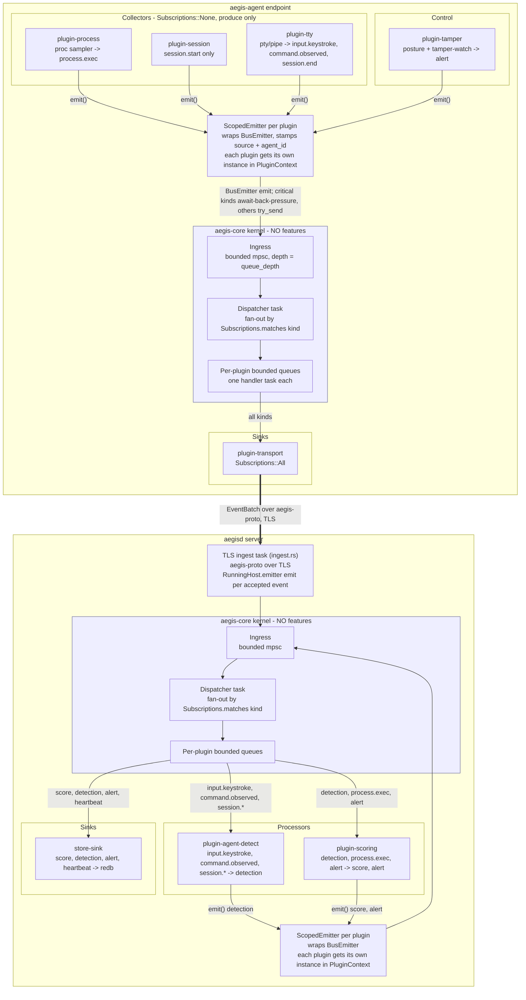
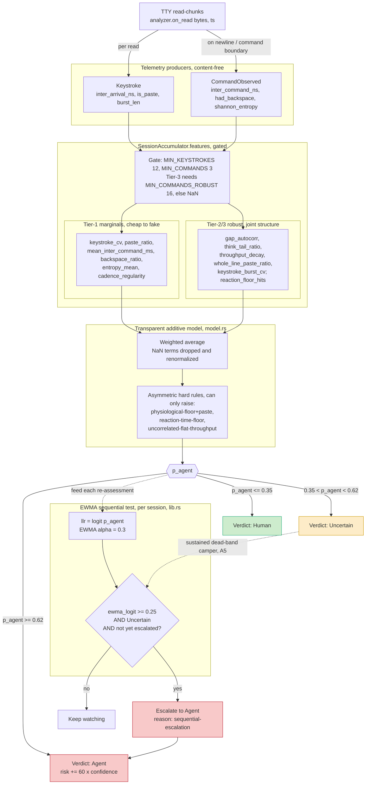
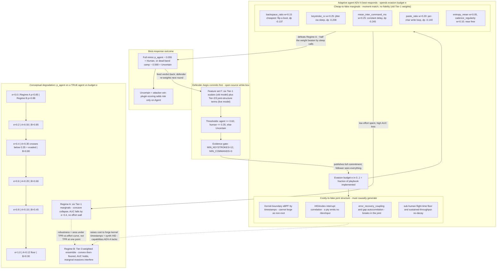
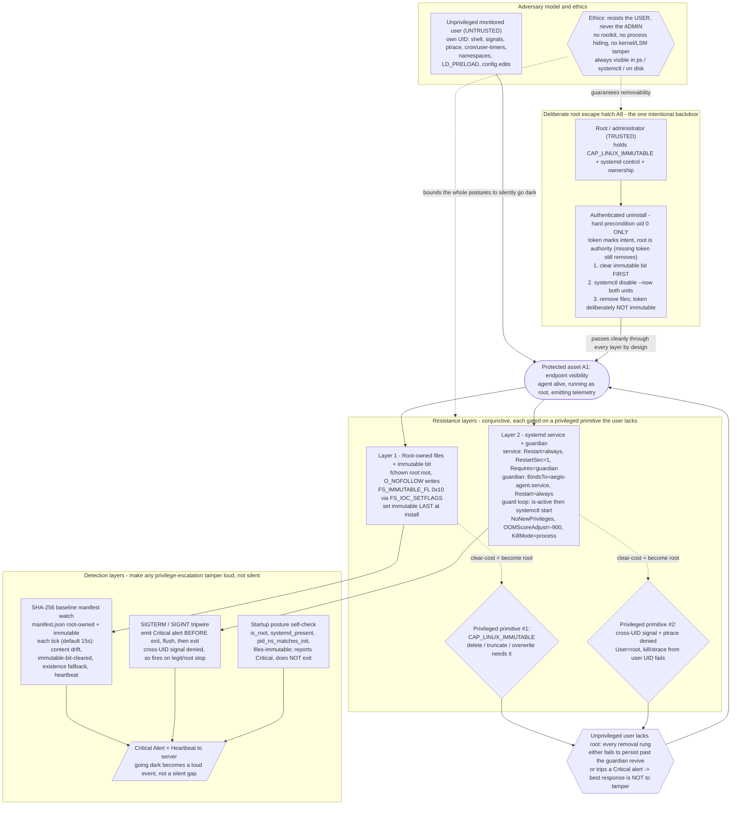

# Aegis Technical Diagrams

This is the shared diagram set for the Aegis blog post and academic paper. Each diagram is maintained here as the single source of truth and referenced by both documents. All diagrams were validated against the implementation in `crates/` and the design documents in `docs/`.

---

## Aegis plugin-native architecture: feature-free aegis-core kernel, BusEmitter/ScopedEmitter, and plugin families



Both the agent and server run the same feature-free aegis-core kernel (ingress mpsc to dispatcher to per-plugin queues); every plugin emits through a ScopedEmitter wrapping the BusEmitter, while collectors/control/processors/sinks supply all behavior and the agent's plugin-transport forwards batches to the server's ingest over aegis-proto.

---

## Aegis agent-to-server transport lifecycle

```mermaid
sequenceDiagram
    autonumber
    actor OP as Operator
    participant CLI as aegisctl
    participant A as "aegis-agent (plugin-transport)"
    participant S as "aegisd (ingest)"
    participant R as "store (redb)"
    participant B as "host bus + detect/scoring"

    Note over OP,S: Bootstrap - mint one-time enrollment token
    OP->>CLI: enroll-token create --label laptop-07
    CLI->>S: POST /api/v1/tokens {label}
    S->>R: store token hex, created_at_ns, used=false
    CLI-->>OP: token hex + server cert fingerprint (pin)
    OP-->>A: deliver blob out-of-band (AEGIS-ENROLL base64(token||pin32), stdin / 0600 file)

    Note over A,S: TLS 1.3 handshake; agent pins SHA-256 of server cert DER

    rect rgb(235, 245, 255)
    Note over A,S: First run only - enrollment (one-time token)
    A->>S: "EnrollRequest { token, hostname, os, agent_pubkey }"
    S->>R: "redeem token hex; reject missing/expired/used"
    S->>R: assign agent_id; store AgentRow + pubkey
    S-->>A: "EnrollResponse { accepted, agent_id, reason }"
    A->>A: persist identity.json + Ed25519 key (0600)
    A->>S: close, then reconnect for a clean session
    end

    rect rgb(235, 255, 235)
    Note over A,S: Every session - Ed25519 possession proof
    A->>S: "ClientHello { proto_version, agent_id, hostname, os, agent_pubkey }"
    S->>R: "check proto_version; look up agent; verify pubkey == enrolled"
    S-->>A: "Command { id: nonce_uuid, command: Noop } (auth challenge)"
    A->>A: "nonce32 = SHA-256(challenge_id); sig = sign(AUTH_LABEL||pin||agent_id||nonce32||tls_exporter)"
    A->>S: "CommandResult { id, ok: true, detail: base64(sig) }"
    S->>S: "verify(enrolled_pubkey, auth_challenge_digest(pin, agent_id, nonce32, exporter))"
    S-->>A: "ServerHello { proto_version, accepted: true }"
    end

    rect rgb(255, 250, 235)
    Note over A,S: Online - telemetry, at-least-once, FIFO at max_in_flight=1
    loop drain ring / spill
        A->>S: "EventBatch { batch_id, events }"
        S->>S: "dedup by Event.id (in-memory DedupWindow); clamp ts_ns skew; allowlist kinds"
        S->>S: overwrite agent_id with authenticated identity
        S->>R: write_event to audit log
        S->>B: "emit(ev) -> Detection -> Score -> maybe Alert"
        S-->>A: "BatchAck { batch_id, accepted }"
        A->>A: drop batch from pending map; ack_through spill rows
    end
    end

    rect rgb(248, 240, 255)
    Note over B,A: Server -> agent commands (same duplex)
    B->>S: "policy/operator POSTs to /api/v1/agents/:id/command -> Router enqueues ServerCommand"
    S-->>A: "Command { id, Rescore | SetConfig | Isolate | Noop }"
    A->>A: dispatch on spawned task, rate-limit, session-bound
    A->>S: "CommandResult { id, ok, detail }"
    end

    rect rgb(245, 245, 245)
    Note over A,S: Keepalive + watchdog
    A->>S: Ping
    S-->>A: Pong
    Note over A,S: "silence > keepalive_timeout -> drop -> backoff/reconnect"
    end
```

Sequence of the Aegis agent-to-server lifecycle, from aegisctl minting a one-time enrollment token through TLS-pinned enrollment, the per-session Ed25519 nonce challenge, at-least-once EventBatch/BatchAck telemetry feeding server-side detection and scoring, and the duplex ServerCommand channel with keepalive.

---

## Agent-vs-Human Detection Pipeline



End-to-end agent-vs-human detection: TTY read-chunks become content-free Keystroke/CommandObserved events, the gated SessionAccumulator derives Tier-1 marginals and Tier-2/3 robust features, a transparent additive model plus asymmetric hard rules yields p_agent and a Human/Uncertain/Agent verdict, while a per-session EWMA sequential test escalates sustained dead-band campers from Uncertain to Agent.

---

## Detection-vs-Evasion Stackelberg Game and AUC-vs-Evasion-Budget Degradation



A Stackelberg detection-vs-evasion game where the open-source defender commits a feature set and thresholds first and the adaptive agent best-responds by spending an evasion budget on cheap-to-fake marginals versus costly-to-fake joint-structure features, with the conceptual AUC/p_agent degradation showing Regime A (six Tier-1 marginals) collapsing below threshold by budget ~0.4 while the Tier-3-weighted Regime B stays robust.

---

## Aegis tamper-resistance: conjunctive root-gated layers protecting visibility against an unprivileged user, with a deliberate authenticated root uninstall



Aegis protects endpoint visibility with conjunctive, root-gated layers (root-owned + FS_IMMUTABLE_FL files and a Restart=always/BindsTo systemd service+guardian) backed by detection (SHA-256 manifest watch, SIGTERM/SIGINT tripwire, posture self-check) so an unprivileged user can neither persist a removal past the guardian nor go dark silently, while a single authenticated uid-0-only uninstall remains a deliberate, ethics-mandated escape hatch that resists the user but never the administrator.
