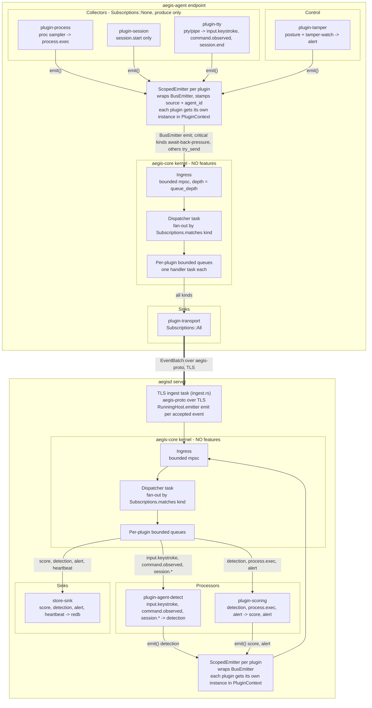

# Aegis: A Plugin-Native Platform for Behavioral Insider-Threat Modeling, with Content-Free Agent-vs-Human Operator Distinction

**Authors:** Anthony Herman and Claude

**Date:** 2026-06-19

---

## Table of Contents

- [Abstract & Introduction](#abstract-introduction)
  - [Abstract](#abstract)
  - [1. Introduction](#1-introduction)
- [Background & Related Work](#background-related-work)
  - [Keystroke Dynamics and Behavioral Biometrics](#keystroke-dynamics-and-behavioral-biometrics)
  - [Insider Threat Detection and UEBA](#insider-threat-detection-and-ueba)
  - [Human-versus-Automation Discrimination](#human-versus-automation-discrimination)
  - [Security Games and Adversarial Evasion](#security-games-and-adversarial-evasion)
  - [Endpoint Tamper Resistance and the Ethics of Monitoring](#endpoint-tamper-resistance-and-the-ethics-of-monitoring)
- [System Architecture](#system-architecture)
  - [The plugin-native kernel](#the-plugin-native-kernel)
  - [The Event model](#the-event-model)
  - [Plugin discovery: static inventory and dynamic C-ABI](#plugin-discovery-static-inventory-and-dynamic-c-abi)
  - [The event bus: subscriptions, back-pressure, and ScopedEmitter provenance](#the-event-bus-subscriptions-back-pressure-and-scopedemitter-provenance)
  - [The client/server split and the wire protocol](#the-clientserver-split-and-the-wire-protocol)
  - [The self-contained static server](#the-self-contained-static-server)
- [Agent-vs-Human Detection](#agent-vs-human-detection)
  - [Content-free behavioral substrate](#content-free-behavioral-substrate)
  - [Feature catalog: marginals versus joint structure](#feature-catalog-marginals-versus-joint-structure)
  - [Transparent additive model, hard rules, and calibration](#transparent-additive-model-hard-rules-and-calibration)
  - [EWMA sequential test against dead-band camping](#ewma-sequential-test-against-dead-band-camping)
- [Threat Model & Game-Theoretic Analysis](#threat-model-game-theoretic-analysis)
  - [4.1 Assets and Trust Boundaries](#41-assets-and-trust-boundaries)
  - [4.2 Adversary Model](#42-adversary-model)
  - [4.3 Detection-vs-Evasion: A Stackelberg Signaling Game](#43-detection-vs-evasion-a-stackelberg-signaling-game)
  - [4.4 Tamper-vs-Removal: A War of Attrition with a Privileged Backdoor](#44-tamper-vs-removal-a-war-of-attrition-with-a-privileged-backdoor)
  - [4.5 Ethical Bounds on the Posture](#45-ethical-bounds-on-the-posture)
- [Evaluation](#evaluation)
  - [Methodology](#methodology)
  - [Results](#results)
  - [Interpretation](#interpretation)
  - [Limitations](#limitations)
- [Implementation & Assurance](#implementation-assurance)
  - [Workspace Structure](#workspace-structure)
  - [Self-Contained Server Binary](#self-contained-server-binary)
  - [Continuous Integration](#continuous-integration)
  - [Adversarially-Verified Security Audit](#adversarially-verified-security-audit)
- [Ethics, Limitations, Future Work, Conclusion](#ethics-limitations-future-work-conclusion)
  - [Ethics](#ethics)
  - [Limitations](#limitations-1)
  - [Future Work](#future-work)
  - [Conclusion](#conclusion)
- [References](#references)
  - [Keystroke dynamics & behavioral biometrics](#keystroke-dynamics-behavioral-biometrics)
  - [Insider-threat detection & UEBA](#insider-threat-detection-ueba)
  - [Human-vs-automation / bot detection](#human-vs-automation-bot-detection)
  - [Security games & adaptive evasion](#security-games-adaptive-evasion)
  - [Endpoint protection & tamper resistance (and the ethics of monitoring)](#endpoint-protection-tamper-resistance-and-the-ethics-of-monitoring)
  - [Verification notes](#verification-notes)

---

## Abstract & Introduction

### Abstract

Insiders with privileged access to organizational endpoints represent one of the
most persistent and difficult-to-detect threat classes in computer security
[cappelli2012cert; homoliak2019survey]. The problem is now compounded by a new
category of operator: automated agents — LLM-driven or scripted programs — that
drive real terminal sessions in ways behaviorally indistinguishable, at first
glance, from humans. We present Aegis, a plugin-native research platform for
behavioral insider-threat modeling on Linux endpoints. Aegis makes four
contributions. First, a plugin-native architecture in which the kernel implements
no features: telemetry collection, detection, scoring, transport, and tamper
resistance are all independently deployable plugins sharing a single typed event
bus. Second, a content-free agent-vs-human detector that classifies sessions from
timing and structural statistics alone — never keystroke content — using a
transparent additive model with six interpretable features. Third, a
game-theoretic analysis of detection-vs-evasion as a Stackelberg signaling game
and of tamper-resistance as a war of attrition, yielding concrete design rules for
both. Fourth, ethical tamper resistance implemented exclusively via supported OS
mechanisms, paired with a single self-contained statically-linked server binary.
Evaluation on synthetic sessions demonstrates ROC-AUC 1.000 against naive
automated agents, degrading monotonically to AUC 0.500 against a perfect
behavioral mimic, with the evasion-effort curve consistent with the game-theoretic
predictions.

---

### 1. Introduction

#### 1.1 The insider-threat problem and its agentic extension

The canonical insider threat is a human with legitimate access who misuses it
[schonlau2001masquerade; cappelli2012cert]. Detection has historically centered
on anomaly detection over access logs, process telemetry, and network flows
[homoliak2019survey; tuor2017deepueba; yuan2021deepreview]. Keystroke dynamics
and behavioral biometrics offer a complementary signal: the way a person types is
a stable, hard-to-transfer behavioral trait [monrose2000keystroke;
killourhy2009; gunetti2005free], and departures from an established baseline can
flag account takeover, masquerade, or coercion.

The threat model has recently expanded in a direction the behavioral biometrics
literature has not fully addressed. Automated agents — LLM-driven assistants,
scripted remote-execution pipelines, or CI/CD bots — increasingly drive real
terminal sessions on production endpoints. Unlike the masquerade attacker who
steals a human's credentials, these agents operate openly, often with the human
operator's knowledge. The security question is different: not "is this still the
same person?" but "is there a person here at all?" Answering it matters because
an automated agent executing under a human's account and privilege level can
exfiltrate data, persist malware, or reconfigure systems at machine speed while
appearing, to process and network monitors, entirely legitimate.

The challenge is separable from keystroke biometrics: we do not need to recognize
the specific human; we need only to distinguish human from machine. This simpler
binary problem has precedent in CAPTCHA [vonahn2003captcha], bot detection in web
and blog contexts [chu2013blogbots; kadel2024botracle], and mouse-dynamics
discrimination [ahmed2007mouse]. What is missing is a principled platform
treatment grounded in the endpoint security context, with explicit game-theoretic
analysis of adaptive evasion.

#### 1.2 The gap

Existing insider-threat systems focus on *what* is accessed or executed — UEBA
[tuor2017deepueba], anomaly detection over shell commands [schonlau2001masquerade],
or data-loss monitoring — and do not attempt to determine whether the session is
human-driven at all. Keystroke-dynamics research focuses on per-user biometric
recognition [killourhy2009; acien2022typenet; shadman2025keystroke] rather than
the human/automation binary, and assumes cooperative data collection from willing
subjects rather than an adversarial endpoint.

Critically, no prior platform addresses the full engineering stack: content-free
telemetry design that makes key-content capture impossible by construction; a
plugin architecture that allows arbitrary capability extension without modifying a
kernel; tamper resistance designed to resist an unprivileged monitored user while
preserving an authenticated administrator uninstall path; and a transportable
single-binary server. The closest prior work on evasion comes from adversarial
machine-learning attacks on classifiers [biggio2013; biggio2018] and from
Stackelberg security games [tambe2011; paruchuri2008; hu2025], but neither body
of work has been applied to the specific adversary model of an automated terminal
agent white-boxing its own detector.

#### 1.3 Contributions

This paper makes four contributions:

**Plugin-native architecture.** Aegis is built on the principle that the kernel
(`aegis-core`) implements no features. Every capability — process and session
telemetry collection, agent-vs-human detection, risk scoring, network transport,
and tamper resistance — is a `Plugin` that registers onto a single shared event
bus and depends only on a stable SDK contract (`aegis-sdk`). Two registration
paths coexist: static link-time registration via an `inventory` distributed slice
(zero boilerplate for built-in plugins) and dynamic loading from a versioned C-ABI
shared object at runtime (for out-of-tree extensions). This architecture makes
capabilities independently replaceable and testable, enforces a strict
dependency-layering that prevents plugin code from reaching into kernel internals,
and allows the system to be extended with new detectors, sinks, or collectors
without modifying any existing crate.

**Content-free agent-vs-human detection.** The event model structurally prohibits
key-content capture: `EventPayload::Keystroke` carries only inter-arrival timing,
a paste/burst flag, and burst length; `EventPayload::CommandObserved` carries
length, token count, Shannon entropy, a backspace flag, edit distance from the
previous command, inter-command timing, and a salted hash for correlation —
never verbatim text. From these content-free features `plugin-agent-detect`
constructs six behavioral signals (keystroke timing coefficient of variation,
paste ratio, mean inter-command think time, backspace ratio, command entropy mean,
and cadence regularity) and combines them in a transparent additive model whose
every verdict is attributable to named features and reported reasons. The model is
designed to be swappable: the `Model::assess` interface is stable and a learned
model can replace the hand-calibrated logistic terms without changing the pipeline.

**Game-theoretic evasion analysis.** We analyze detection as a Stackelberg
signaling game in which the defender commits to the model first and the automated
agent best-responds by choosing an evasion-effort vector over the six feature
dimensions. Because the codebase is open-source, the follower observes every
logistic center, slope, and weight exactly. We independently compute payoffs from
`model.rs` and show that the cheapest evasion strategy — the dead-band camp at
`p_agent` between the `Uncertain` thresholds — achieves zero risk accumulation at
near-zero effort, and that the timing features, despite carrying the highest model
weight, are defeatable by `sleep()` calls alone. The equilibrium analysis
identifies that parameter tuning cannot escape the problem; only changes to the
strategy space (kernel-anchored eBPF/HID signals, server-side classification,
actionable `Uncertain`) shift the equilibrium. We apply the same game-theoretic
lens to tamper resistance, modeling it as a war of attrition in which the
defender installs conjunctive privilege-gated layers and showing that the
equilibrium is a step function of layer completeness: the unprivileged user's
removal probability collapses from approximately 1 to approximately 0 only when
root ownership, filesystem immutability, a real guardian watchdog, and hash-based
tamper detection all hold simultaneously.

**Ethical tamper resistance and self-contained server.** The endpoint client
(`aegis-agent`) is designed to resist silent disablement by an unprivileged
monitored user using only supported OS mechanisms: root-owned files, the Linux
immutable attribute (`FS_IMMUTABLE_FL`), and a systemd watchdog pair with mutual
`BindsTo` binding. No kernel exploits, no process hiding, and no LSM tampering
are used; the agent is always visible to root in `ps`, `systemctl`, and on disk
[aucsmith1996tamper; karantzas2021edr]. An authenticated root uninstall path is
preserved by design as a non-negotiable ethical constraint [ball2021monitoring;
roundy2020creepware]. The server (`aegisd`) ships as a single statically-linked
binary with no external database and no runtime asset directory, verified in CI by
an `ldd` static-link assertion, enabled by a pure-Rust dependency stack
(`rustls`/`ring` for TLS, `redb` for embedded storage, `rust-embed` for dashboard
assets).

#### 1.4 Paper map

Section 2 surveys keystroke dynamics, UEBA, bot/human discrimination, security
games, and EDR tamper-resistance prior art. Section 3 presents the threat model
and ethics analysis, covering the four adversary classes (ADV-U, ADV-A, ADV-N,
ADV-P) and the eight protected assets. Section 4 describes the system architecture
in depth: the event model, the plugin trait and registration paths, the event bus
and back-pressure design, and the client/server split. Section 5 describes the
agent-vs-human detection pipeline — feature extraction, the transparent additive
model, the evidence gate, and the scoring and alerting chain. Section 6 presents
the game-theoretic analysis of both the detection game and the tamper-resistance
game. Section 7 evaluates the system on synthetic sessions, reporting detection
performance versus evasion budget and the tamper-resistance layered-cost argument.
Section 8 covers implementation. Section 9 discusses limitations, including the
synthetic evaluation, the open hardening and transport *assurance* gaps (the
mechanisms are built; closing the audit findings and defaulting to a root install
remain), and the path to field validation. Section 10 concludes.

---

## Background & Related Work

Aegis draws on five intersecting research areas: behavioral biometrics and
keystroke dynamics, insider-threat detection and user and entity behavior
analytics (UEBA), human-versus-automation discrimination, security games and
adversarial evasion, and endpoint tamper resistance together with the ethics of
workplace monitoring. We situate Aegis's contributions against each area and
are explicit about what is genuinely novel versus what is a deliberate
reapplication of established ideas to a new operational target.

### Keystroke Dynamics and Behavioral Biometrics

The foundational insight is that *how* an operator types reveals something
about *who*—or what—is typing, independent of content. Monrose and Rubin
[monrose2000keystroke] established inter-keystroke timing as a viable biometric
for authentication, and Gunetti and Picardi [gunetti2005free] demonstrated that
free, unconstrained text—not just fixed password strings—provides sufficient
discriminative signal to distinguish individuals. Killourhy and Maxion
[killourhy2009] contributed the canonical CMU benchmark dataset and a rigorous
comparative evaluation of anomaly detectors that remains the standard reference
for methodology. Sim and Janakiraman [sim2007digraphs] issued an important
caveat: context-free digraph timing loses discriminative power relative to
word-specific or phrase-anchored timing, a limitation Aegis takes seriously
because it deliberately discards all content. Modern deep approaches, notably
TypeNet [acien2022typenet], extend free-text keystroke biometrics to Internet
scale using siamese neural networks, and the comprehensive survey of Shadman et
al. [shadman2025keystroke] maps the current landscape of metrics, datasets, and
algorithms. More recently, Modi et al. [modi2026botdetection] explicitly
compare keystroke dynamics and mouse trajectories for the task of bot detection,
the closest published framing to Aegis's agent-vs-human problem.

Aegis reuses this substrate but inverts its conventional goal. Rather than
identifying *which human* is at the keyboard, it asks whether the operator is a
human at all, using only content-free timing and structural features derived
from observed input sequences.

### Insider Threat Detection and UEBA

The conceptual ancestor of Aegis's monitoring model is masquerade detection:
Schonlau et al. [schonlau2001masquerade] framed an unauthorized operator as a
statistical deviation from a legitimate user's behavioral profile captured in
Unix command sequences. The CMU CERT insider-threat dataset [glasser2013cert]
became the de-facto multi-modal benchmark, and the taxonomy of Homoliak et al.
[homoliak2019survey]—distinguishing malicious insiders, masqueraders, and
negligent users—organizes the human actor space that Aegis extends with a
fourth class: the automated agent operating a session that was legitimately
opened by a human. Buczak and Guven [buczak2016survey] survey the ML and
anomaly-detection foundations that underpin behavioral UEBA. Deep learning
approaches, including the unsupervised recurrent architecture of Tuor et al.
[tuor2017deepueba] and the broader review by Yuan and Wu [yuan2021deepreview],
demonstrate that content-free behavioral features—timing, access sequences,
command co-occurrence—are sufficient to surface anomalous activity without
inspecting data payloads.

Aegis's contribution within this line of work is narrow but deliberate: it
treats the agent-vs-human signal as a first-class insider-threat indicator
rather than a secondary heuristic, and favors a transparent, additive scoring
model over the opaque deep architectures that dominate recent UEBA literature.
The trade-off is a bounded statistical ceiling in exchange for explainability
and auditability—properties the CERT guide [cappelli2012cert] implicitly
requires of any monitoring capability that must satisfy an organizational
accountability chain.

### Human-versus-Automation Discrimination

The formal root of the human-or-computer problem is the CAPTCHA [vonahn2003captcha]:
a challenge that a human can resolve but a program cannot, operationalized as
a security primitive. Where CAPTCHA demands active participation, Aegis is
passive and continuous, sitting in the lineage of behavioral discriminators
deployed without explicit user interaction. Ahmed and Traoré [ahmed2007mouse]
demonstrated that passively observed mouse-movement dynamics alone characterize
an operator; Chu et al. [chu2013blogbots] separated bot-authored from
human-authored blog content via passively captured behavioral biometrics; and
BOTracle [kadel2024botracle] performs behavior-only bot detection at web scale
without injecting challenges. Guerar et al. [guerar2021captcha] review twenty
years of the human-or-computer dilemma, including transparent schemes and their
evasion histories—a survey that contextualizes how each generation of
discriminators has been followed by adapted adversaries.

Aegis is squarely in this tradition. Its differentiating factors are the
deployment context (a monitored Linux endpoint rather than a web form or browser
session) and the specific threat model (general AI and scripted agents driving a
shell, not click-fraud bots or blog spammers). The absence of any active
challenge is both a design constraint—enterprise operators cannot be interrupted
with CAPTCHAs during legitimate work—and an adversarial exposure, since a
passive sensor can in principle be profiled and evaded without triggering any
observable response.

### Security Games and Adversarial Evasion

A behavioral detector operating in a contested environment invites evasion, so
Aegis models the detection-vs-evasion interaction as a Stackelberg game in which
the defender commits to a detection policy first and the adversary best-responds
[tambe2011]. Adversary type uncertainty—the detector cannot know a priori
whether the actor is human, script, or AI agent—is handled in the Bayesian-
Stackelberg tradition [paruchuri2008], which yields equilibrium mixed strategies
under incomplete information about attacker type.

The evasion analysis rests on adversarial machine learning. Szegedy et al.
[szegedy2014] revealed that imperceptibly small perturbations suffice to flip
classifier decisions, and Biggio et al. [biggio2013] formalized test-time
evasion as a constrained optimization problem—the lens through which an agent
mimicking human timing can be understood. Biggio and Roli [biggio2018] survey
the resulting decade-long arms race, documenting how each hardening technique
has been followed by an adapted evasion strategy. Hu et al. [hu2025] derive a
game-theoretic Neyman-Pearson detector with equilibrium ROC curves, providing a
principled bound on what any detector can achieve when the adversary knows the
detection scheme. Le and Zincir-Heywood [le2020] show empirically that insiders
can blend malicious actions into normal behavioral profiles, demonstrating
practical evasion of anomaly-based detectors in a realistic enterprise setting.

Aegis applies these frameworks rather than extending their theory. The value of
the analysis is a feature taxonomy that separates cheap-to-fake signals (e.g.,
mean inter-key interval, which an agent can match with a single parameter) from
costly-to-fake signals (e.g., the long-tail distribution of human hesitations
under cognitive load), allowing qualitative reasoning about detector durability
over time rather than a claim of unbreakable detection.

### Endpoint Tamper Resistance and the Ethics of Monitoring

A monitoring sensor that an insider can silently disable provides no assurance.
Aucsmith [aucsmith1996tamper] introduced anti-tampering software design as a
formal concern; Karantzas and Patsakis [karantzas2021edr] empirically demonstrate
that adversaries can blind EDR telemetry through process injection and driver
manipulation, motivating self-protection as a first-order design requirement.
Aegis enforces tamper resistance exclusively through supported OS mechanisms—
Linux Security Modules [wright2002lsm] and SELinux/Flask mandatory access
controls [loscocco2001selinux]—rather than rootkit techniques. An authenticated
root uninstall path is always preserved, ensuring the machine owner retains
control.

The ethical dimension is equally load-bearing. Ball's review of workplace
electronic monitoring [ball2021monitoring] and the creepware study of Roundy et
al. [roundy2020creepware] document how monitoring tooling deployed for security
purposes has been systematically repurposed for intimate-partner surveillance
and employee harassment. These findings ground Aegis's design constraints:
content-free telemetry only (no keylog content, no screen capture), explicit
organizational consent scope, and no covert capability. Aegis does not claim a
new tamper-resistance primitive; its contribution is positioning these
constraints as non-negotiable design requirements that target the unprivileged
monitored user while explicitly foreclosing the abuse surface that makes general
monitoring software dangerous.

---

## System Architecture

Aegis is a plugin-native, client/server platform for behavioral insider-threat
modeling. Two axioms, stated in `aegis-sdk`, drive every structural choice: every
unit of information is an `Event`, and every capability is a `Plugin`. The kernel
(`aegis-core`) implements no features; it discovers plugins, wires them onto a
shared event bus, and manages lifecycle. Detection, scoring, telemetry collection,
transport, persistence, and endpoint self-protection are all plugins. This design
reflects the broader observation that insider-threat systems must be both
extensible and auditable [homoliak2019survey], requiring a clean separation between
infrastructure and detection logic.

### The plugin-native kernel

The workspace is organized into a strict dependency hierarchy: `aegis-sdk`
(contracts) is depended upon by `aegis-core` (kernel) and by all plugins; the
three binaries (`aegis-agent`, `aegisd`, `aegisctl`) depend on the kernel and on
whichever plugins they link. Plugins may never depend on `aegis-core` — they see
only the SDK's stable interface. This layering is enforced by the Rust module
system and the Cargo dependency graph, making it structurally impossible for a
plugin to reach into kernel internals.

The deployed system consists of three binaries. `aegis-agent` runs at the endpoint,
hosting telemetry collector plugins and a transport sink that forwards batched events
to the server. `aegisd` is the server, hosting the central detection and scoring
processors. `aegisctl` is a management CLI for plugin introspection, token minting,
and version reporting. The two buses — one per process — are entirely separate
in-process event buses bridged by the network transport.

### The Event model

The unit of information is `aegis_sdk::Event`, a uniform envelope carrying a UUID,
a nanosecond-resolution producer timestamp, an enrolled endpoint identity
(`agent_id`), the producing plugin's name (`source`), a routing kind string (e.g.
`"command.observed"`), a typed payload, and an arbitrary label map. The payload is a
serde-tagged enum (`EventPayload`) whose variants cover the full signal chain:
raw telemetry kinds (`ProcessExec`, `SessionStart`, `SessionEnd`, `Keystroke`,
`CommandObserved`), derived kinds (`Score`, `Detection`, `Alert`, `Heartbeat`), and
an explicit extensibility escape hatch (`Custom(serde_json::Value)`) for third-party
plugins that need novel payload shapes without an SDK change.

The event model encodes the content-free constraint structurally. `Keystroke`
carries only inter-arrival timing, a paste/burst flag, and burst length — there is
no field for character content. `CommandObserved` carries structural statistics
(token count, Shannon entropy, backspace flag, inter-command interval) and a salted
hash of the command for cross-session correlation, but never the verbatim text. This
approach parallels the use of inter-key intervals as content-free biometric signals
[killourhy2009] while extending them to the structural properties of command
sequences.

### Plugin discovery: static inventory and dynamic C-ABI

Two registration paths converge on a common constructor type
(`fn() -> Box<dyn Plugin>`). The default path for built-in plugins is static
registration via the `register_plugin!` macro, which uses the `inventory` crate's
distributed-slice mechanism: the macro submits a registration record at link time,
and the kernel iterates the resulting slice at startup. Linking a plugin crate into
a binary with `use plugin_x as _;` is the complete integration step — no registry
file and no explicit registration call are required. The five built-in plugins
(`plugin-process`, `plugin-session`, `plugin-agent-detect`, `plugin-scoring`,
`plugin-tamper`) all register this way.

Third-party plugins may be loaded at runtime as shared objects (`cdylib`). A dynamic
plugin exports a C-ABI entrypoint (`aegis_plugin_entry`) returning a heap-allocated
`DynPluginRegistration` struct carrying an API version and a constructor. The kernel
loader (`aegis-core::loader::load_dynamic`) looks up the symbol, validates the API
version against `PLUGIN_API_VERSION`, and keeps the `libloading::Library` handle
alive for the duration of the process so plugin code remains mapped. API-version
mismatches are treated strictly for dynamic plugins (hard error) and leniently for
static ones (warn and skip), a documented asymmetry in the current implementation.

Plugin discovery at startup follows a precedence order: explicit registrations (via
`HostBuilder::with_plugin`) take priority over dynamic paths, which take priority
over the static inventory. The first occurrence of a given plugin name wins; a
`HashSet` of seen names enforces this. An enabled/disabled list in `HostConfig`
further filters candidates.

### The event bus: subscriptions, back-pressure, and ScopedEmitter provenance

The kernel owns a single bounded ingress channel (an `mpsc` of configurable depth,
default 4096) and a single dispatcher task. Each plugin receives its own bounded
queue and its own handler task. The `Plugin::subscriptions()` method returns
`All`, `None`, or a set of kind strings; the dispatcher fans out each event by
calling `try_send` on every plugin whose subscription matches the event's kind.
Because each plugin drains its own queue independently, a slow plugin back-pressures
only itself and never head-of-line-blocks others.

Both write points — the ingress `try_send` and the per-plugin fan-out `try_send`
— are non-blocking and drop-on-full. On saturation, events are dropped and a
warning is logged. There is no dropped-event counter, no dead-letter queue, and no
back-pressure signal to the producer. This bounds memory under saturation but means
that high-frequency telemetry can be silently lost, a property that matters for a
detection system: undetected telemetry loss is indistinguishable from the absence of
the monitored behavior.

Every plugin emits through a `ScopedEmitter` — a per-plugin wrapper around the
shared `BusEmitter` — which automatically stamps the `source` field with the
plugin's name and the `agent_id` with the host's enrolled identity. This provenance
guarantee means consumers can trust the `source` and `agent_id` fields on any event
that arrived through the in-process bus. The `Plugin::handle` method takes `&self`
rather than `&mut self`, so stateful plugins use interior mutability (`Arc<Mutex<…>>`);
collectors spawn background producer tasks in `init`, which takes `&mut self` and
runs exactly once before the plugin is `Arc`-wrapped.

Because processors emit derived events back onto the same ingress, the bus is a
feedback loop: `plugin-agent-detect` emits `Detection` events that the dispatcher
routes to `plugin-scoring`, which emits `Score` and `Alert` events. There is no
ordering or dependency declaration between plugins; delivery across independent
per-plugin queues is only eventually consistent. The following figure illustrates
the full component layout at both the agent and server:



### The client/server split and the wire protocol

The agent and server each run an independent instance of the `aegis-core` kernel.
The `aegis-proto` crate defines the wire format that bridges them: a `u32`
big-endian length-prefix followed by JSON bytes. JSON is deliberate — the
`EventPayload::Custom` variant is self-describing and would not round-trip through a
non-self-describing binary format. `MAX_FRAME_BYTES` (16 MiB) bounds the receive
path; the framing helpers are generic over any `AsyncRead`/`AsyncWrite + Unpin`,
layering cleanly over a `tokio-rustls` stream.

The protocol is versioned (`PROTO_VERSION: u16 = 1`) and handles two distinct
identity phases. Enrollment (`EnrollRequest`/`EnrollResponse`) is a one-time
exchange in which the agent presents a one-time token and its Ed25519 public key;
the server assigns a persistent `agent_id`. Subsequent sessions use a
`ClientHello`/`ServerHello` exchange with an Ed25519 possession proof over a
fresh, channel-bound server nonce. Telemetry flows as batched `EventBatch` frames
acknowledged by `BatchAck`. A duplex server-to-agent command channel carries
`ServerCommand` variants (`Rescore`, `SetConfig`, `Isolate`, `Noop`). The full
agent-to-server lifecycle is illustrated in the transport lifecycle figure in
`docs/diagrams.md`.

On the server side, `ingest.rs` decodes each incoming event, overwrites
`Event.agent_id` with the server-authenticated identity (so agent-supplied
identities cannot be spoofed), namespaces payload subjects per agent, enforces a
payload-kind allowlist (rejecting agent-supplied `Detection`/`Alert`/`Score`
payloads that would otherwise inject fabricated findings), and calls
`RunningHost::emitter().emit(event)` to place the event on the server-side bus.
This design — using the same `Arc<dyn Emitter>` the host exposes for external
event sources — means the network transport is just another event producer;
the central processors receive agent telemetry without any special-casing.

### The self-contained static server

`aegisd` is required to ship as a single, statically linked binary with no external
database and no runtime asset directory. The architecture selects pure-Rust,
musl-friendly dependencies throughout to satisfy this constraint. Persistence uses
`redb`, a pure-Rust embedded key-value store with no C dependency. The operator
dashboard (HTML/JS/CSS) is compiled into the binary with `rust-embed` and served
from memory. TLS uses `rustls` and `ring` (pure-Rust crypto) with `rcgen` for
self-signed certificate generation on first run; there is no dependency on OpenSSL
or any system TLS library. The release build profile specifies `lto = "thin"`,
`codegen-units = 1`, `strip = true`, and `panic = "abort"`; a `[profile.dist]`
variant uses fat LTO for the smallest production artifact. A continuous integration
job builds `aegisd` for `x86_64-unknown-linux-musl` and asserts the result with
`ldd ... => statically linked`. One caveat applies to dynamic plugin loading: a
fully static musl binary has no dynamic linker at runtime, so any dynamic plugin
loaded by `aegisd` must itself be built for musl. The server configuration sets
`dynamic_plugins = []` to avoid this at runtime.

The store sink (`StoreSink`) is implemented as a `PluginKind::Sink` plugin
subscribing to derived event kinds (`score`, `detection`, `alert`, `heartbeat`);
it is the only writer for telemetry results. HTTP handlers open read-only redb
transactions. This keeps the redb write path naturally single-threaded without
additional locking beyond what `Arc<Mutex<Database>>` already provides.

Adding any new capability — a new collector, detector, or sink — means adding a
plugin that depends only on `aegis-sdk`, implementing `Plugin`, and force-linking
it into the target binary with `use plugin_x as _;`. The kernel is never modified.
This extensibility model supports the kind of incremental, empirically grounded
development that insider-threat research has repeatedly shown to be necessary
[homoliak2019survey][cappelli2012cert].

---

## Agent-vs-Human Detection

Aegis's flagship capability answers a ternary question about an interactive
session: is the entity at the keyboard a **human operator**, an **automated
agent**, or is the evidence **uncertain**? We treat this as a first-class
insider-threat signal rather than a CAPTCHA-style gate [vonahn2003captcha]:
detection is passive, continuous, and—critically—operates on a content-free
behavioral substrate. The full pipeline is shown in Figure 3 (the
Agent-vs-Human Detection Pipeline diagram), from raw TTY read-chunks through
the verdict and the per-session sequential test.

### Content-free behavioral substrate

The detector never sees *what* an operator types, only *how* and *when*.
Terminal read-chunks are reduced at the collector into two content-free event
families: `Keystroke` events carrying inter-arrival timing, a paste flag, and a
burst length; and `CommandObserved` events carrying inter-command timing, a
backspace flag, and the Shannon entropy of the (discarded) command text. No
characters, file paths, or argument values cross the wire. This is a hard
invariant of the system, not a configuration choice, and it shapes the entire
feature design: every signal below is a count, a timing statistic, a ratio, or
a salted hash. The substrate inherits the long line of evidence that operators
are separable from *how* they type independent of *what* they type
[monrose2000keystroke, gunetti2005free, killourhy2009], while inverting the
usual biometric goal—we ask not *which human* is typing but *whether* a human
is typing at all, in the behavior-only tradition of Chu et al. [chu2013blogbots]
and BOTracle [kadel2024botracle]. We adopt Sim and Janakiraman's caution
[sim2007digraphs]—that context-free timing discards discriminative power
available to content-aware schemes—as a deliberate, privacy-motivated cost.

### Feature catalog: marginals versus joint structure

Features are organized by *evasion cost*: not how well a feature separates a
human from a naive agent today, but what an adaptive adversary must construct to
fake it, and whether faking it forces a detectable distortion elsewhere. Two
tiers result.

**Tier-1 marginals** are first-moment statistics that fall to a single
moment-match. The six features in the original shipping model are all Tier-1:
keystroke-timing coefficient of variation, paste ratio, mean inter-command
latency, backspace ratio, mean command entropy, and cadence regularity. Each
can be satisfied by code that targets one scalar—jitter the keystroke timer,
inject a constant pre-command delay, flip a backspace flag on a fraction of
commands—without any model of human behavior. A marginal that checks only a
mean or a variance is, by construction, cheap to forge.

**Tier-2/3 evasion-robust features** measure distribution *shape* or, more
durably, *joint structure*—a relationship between two streams or across time.
The live model weights gap autocorrelation, the think-time tail ratio
(p90/p50), throughput decay over the session, the whole-line injection ratio,
within-burst keystroke-timing variability, and a reaction-time-floor counter.
The defining property of the joint-structure tier is that the cheap evasion of a
Tier-1 feature *actively produces* the Tier-2/3 tell. An agent that injects
i.i.d. random delays to fix its mean inter-command latency and its keystroke CV
thereby drives the gap autocorrelation toward zero—whereas human gap series sit
in a structured, positively autocorrelated band with phase trends (ramp-up,
fast middle, fatigue). An agent that toggles a backspace flag independently of
its timing breaks the coupling between corrections and the localized
keystroke-timing dip a real correction produces. An agent that types character
by character to avoid pasting must then reproduce burst micro-structure it has
no organic reason to generate. These features are, in effect, traps laid on the
standard evasion playbook—most informative precisely against an adversary who
has already defeated the marginals. This taxonomy of cheap- versus
costly-to-fake signals is the analytical contribution carried into the
game-theoretic treatment [tambe2011, biggio2013]; it reasons about a detector's
*durability* under adaptation rather than claiming unbreakability.

### Transparent additive model, hard rules, and calibration

Because every verdict must be explainable to a human analyst, the model is a
deliberately **transparent additive** one rather than an opaque network. Each
feature maps through a documented logistic transfer (with a stated centre and
slope) into an agent-evidence value in `[0,1]`, and the values are combined as a
weighted average; terms that cannot yet be estimated are dropped and the
remaining weights renormalized. The path from the original six-feature model is
to shift decision weight off the Tier-1 marginals and onto the joint-structure
tier while keeping this additive structure intact. The resulting `p_agent` is
thresholded into the ternary verdict: `p_agent ≥ 0.62` yields **Agent**,
`p_agent ≤ 0.35` yields **Human**, and the intervening dead band yields
**Uncertain**. Assessment is gated until enough evidence exists (a minimum
keystroke and command count) and re-runs as events accrue.

Layered on top of the weighted average are **asymmetric hard rules** that can
only ever raise `p_agent`, never lower it. The clearest is the
reaction-time-floor rule: a typed (non-pasted) command issued within roughly
150 ms of the previous one is biomechanically implausible for a human, so a
sub-floor gap can decisively incriminate, while its *absence* contributes
nothing toward a Human verdict. Treating such physiological signals as one-sided
evidence—rather than folding them into a symmetric average—reflects the loss
asymmetry of the deployment: a false "Agent" verdict on a real operator inflates
a risk score toward a human-reviewed alert, and repeated false alerts erode
analyst trust in the signal. The design therefore targets a Neyman-Pearson
objective—maximize the true-positive rate subject to a hard cap on the
false-positive rate—rather than raw accuracy, in the spirit of game-theoretic
Neyman-Pearson detection under strategic evasion [hu2025]. Calibration completes
the picture: the score is mapped to a genuine `P(agent | x)`, so the confidence
consumed by downstream risk scoring is a real probability and the operating
point can be set from the empirical high quantile of a human-only distribution
rather than guessed.

The synthetic evaluation (Section 7) bears out the intended behavior and is
honest about its ceiling. Naive automated agents are separated from humans at
**ROC-AUC 1.000** with **accuracy 1.000** and a zero false-positive rate, and
detection degrades **monotonically** as the evasion budget rises. A *perfect*
behavioral mimic collapses detection toward chance (**AUC 0.500** at evasion
budget `e = 1.0`), exactly as theory predicts—an adversary that perfectly
reproduces human timing is, behaviorally, a human. The value of the detector is
therefore the *cost* it imposes to reach that point: through the mid-budget
range the evasion-robust features keep AUC elevated where cheap marginal
mimicry alone would already have collapsed it. These figures are synthetic,
sampled from documented behavioral distributions rather than collected from
instrumented humans and agents in the field, and are not a claim of field
accuracy.

### EWMA sequential test against dead-band camping

A memoryless per-snapshot verdict has an exploitable flaw: because `Uncertain`
adds no risk downstream, an adaptive agent can deliberately steer `p_agent` into
the dead band between 0.35 and 0.62 and *camp* there, harvesting a stream of
"win" verdicts indefinitely. The joint-structure features also need more
evidence to estimate than a single early snapshot affords. Aegis closes both
gaps with a per-session **sequential test**. Each re-assessment contributes its
log-odds—`logit(p_agent)`—to an exponentially weighted moving average (EWMA)
with smoothing factor `α = 0.3`, so recent evidence is emphasized while
transient dips do not reset the accumulated signal. When the EWMA of the logit
sustains above an escalation threshold (`ewma_logit ≥ 0.25`) while the
instantaneous verdict remains `Uncertain` and the session has not already been
escalated, the detector promotes the verdict to **Agent** with a distinct
`sequential-escalation` reason. This defeats the dead-band camper directly: a
sustained lean toward agent-like behavior accumulates relentlessly even when no
single snapshot crosses the hard threshold, and time favors the defender,
because an agent cannot fake every robust feature for the length of a long
session without leaving a residual. Evasion is thereby reframed from "fool one
snapshot" into "sustain a perfect lie indefinitely"—a burden that forces the
agent toward human throughput and error rates, eroding the very advantage that
made automation worthwhile.

---

## Threat Model & Game-Theoretic Analysis

### 4.1 Assets and Trust Boundaries

Aegis protects eight assets; the overarching one is **A1 — endpoint visibility**: the agent must remain alive, root-owned, and emitting telemetry. Every tamper-resistance mechanism exists to prevent an unprivileged monitored user from silently extinguishing that visibility, mirroring the posture of commercial EDR/DLP tools [karantzas2021edr]. The remaining assets follow in dependency order: **A2** (detection integrity — verdicts reflect reality), **A3** (telemetry integrity — events are genuine and unmodified), **A4** (scoring and alerting fidelity), **A5** (subject privacy — telemetry is content-free, commands are summarized as salted SHA-256 hashes rather than captured text), **A6** (server availability), **A7** (host-process integrity against malicious plugin code), and **A8** — the deliberate backdoor — the guarantee that an authenticated root administrator can always uninstall cleanly.

Five trust boundaries partition the system. **TB1** (unprivileged user vs. the root-owned agent process) is the primary enforcement surface: crossing it requires becoming root. **TB2** is the process boundary guarded against ptrace and `LD_PRELOAD`. **TB3** is the event bus inside `aegis-core`: each plugin emits through a per-plugin `ScopedEmitter` that overwrites `event.source` with the plugin's registered name and pins `agent_id` to the host identity, so source/identity *attribution* is trustworthy on the in-process bus, but there is no payload-kind ACL there — any in-process plugin can still emit a `Detection`/`Alert`/`Score` payload, so a malicious plugin remains a forgery surface (the kind allowlist is enforced only on the server ingest path). **TB4** is the network path between agent and server, protected by mTLS with certificate pinning and an Ed25519 challenge-response bound to a fresh server nonce; the residual gap is the absence of a per-message sequence number, leaving cross-session replay unprevented (audit L3/L4). **TB5** is the plugin supply-chain boundary: dynamic `.so` files are loaded via an `unsafe` `dlopen` call with only an integer ABI version check, so the `.so` constructor executes before any integrity verification.

### 4.2 Adversary Model

Four adversaries are modeled (see the trust-boundary diagram in `docs/diagrams.md`):

**ADV-U** — an unprivileged monitored user attempting to disable the agent. Capabilities: full control of own UID processes, environment, cron/user-timers, and user namespaces (when `unprivileged_userns_clone=1`, the default on Debian/Ubuntu). Out of scope: privilege escalation, physical access, firmware attacks.

**ADV-A** — an automated agent (LLM-driven or scripted) running as ADV-U, shaping telemetry to evade the behavioral classifier. Capabilities: drives a real pty/tty, controls write timing and content, can compute `p_agent` offline from the public model coefficients. Out of scope: forging kernel-level signals or synthesizing USB-HID interrupts — the unprivileged boundary that underpins the strongest detection defenses.

**ADV-N** — a network adversary between agent and server. Capabilities: on-path interception, modification, injection, RST injection, and MITM. Out of scope: breaking a correctly deployed mTLS session (the mitigation target).

**ADV-P** — a malicious or compromised plugin loaded into the host process. Once loaded, ADV-P holds full in-process code execution at the agent's privilege, shared access to the bus emitter, file descriptors, and the command-correlation salt.

A non-adversarial actor — the **administrator (root)** — is modeled explicitly as the holder of the one intentional backdoor (A8) and must retain a clean removal path through every protection layer [cappelli2012cert].

### 4.3 Detection-vs-Evasion: A Stackelberg Signaling Game

The interaction between Aegis and ADV-A is a **Stackelberg leader-follower game with one-sided commitment** [tambe2011; paruchuri2008]. The defender moves first by publishing the model — and because the repository is open source, the follower observes the complete feature set, every logistic coefficient and weight, the classification thresholds (`agent_threshold=0.62`, `human_threshold=0.35`), and the evidence gate (`MIN_KEYSTROKES=12`, `MIN_COMMANDS=3`) exactly. ADV-A then best-responds by choosing an evasion-effort vector over the behavioral levers the model exposes.

The cost structure is highly asymmetric, and the original six-feature model makes the asymmetry concrete. Two of its terms are timing levers — inter-keystroke jitter (weight 0.25) and read-pacing or think-time (weight 0.25) — that trade task throughput for stealth: the agent must `clock_nanosleep` between character writes and insert artificial post-output delays. Every other lever was nearly free: a single backspace per handful of commands saturates the `backspace_ratio` term (weight 0.15, steep logistic slope 40 at centre 0.06); paste avoidance (weight 0.20) costs a per-character write loop; entropy padding (weight 0.05) and cadence irregularization (weight 0.10) require no behavioral fidelity at all. The live model retains the same six logistic transfers — including the backspace term's slope 40 at centre 0.06 — but demotes their combined weight (to ≈0.30) and shifts the bulk (≈0.66) onto the Tier-2/3 joint-structure terms of Section 5, precisely so that this cheap-marginal best response no longer suffices.

The payoff consequences below were computed against the **original six-feature** weights (as documented in `docs/THREAT_MODEL.md`), which is why the levers sum to the full decision weight; they illustrate why a pure-marginal model is Stackelberg-fragile. A naive automated agent scored `p_agent=0.898` — a clear `Agent` verdict. Spending only the two timing levers yielded `p_agent=0.445` (`Uncertain`). Adding the four near-free levers produced the full mimic at `p_agent=0.055` (confident `Human`). The marginal contributions from the naive baseline were: think-time −0.245, jitter −0.208, paste-avoidance −0.140, fake-typos −0.137, irregular-cadence −0.075, entropy-padding −0.037. The live, re-weighted model raises the cost of the same playbook, but the *reproducible* evaluation (Section 7) confirms it cannot eliminate it: at evasion budget `e=0.5` (halfway between naive and perfect mimic), recall collapses to 0.031 and F1 to 0.061 while ROC-AUC remains 1.000; at `e=1.0` the detector reaches chance (AUC 0.500), as is theoretically expected — a perfect behavioral mimic is behaviorally indistinguishable [biggio2013; biggio2018].

The most important equilibrium observation is the **dead-band strategy**. Because `plugin-scoring` adds incremental risk only on a `Verdict::Agent` verdict and treats `Uncertain` identically to `Human`, a partial mimic that holds `p_agent` in the interval (0.35, 0.62) permanently produces zero risk score and no alert — with less behavioral fidelity than a full human mimic. The evaluation results confirm this: at budgets `e=0.4`–`0.6` the uncertain% peaks at 40.7%–48.1% while precision remains 1.000, showing that the detector never false-positives but misses nearly all evading agents.

Against the model as written there is **no interior mixed equilibrium worth defending**. The follower's best response is a pure strategy — full mimic or dead-band camping — that achieves evasion with probability approaching 1 at a cost far below any plausible automated-insider budget. Tuning thresholds or weights cannot escape this: the follower sees the full commitment and recalculates to the cheapest crossing. The equilibrium shifts only when the defender changes the strategy space, not its parameters [hu2025; le2020]:

**(a) Un-forgeable signals.** Move features from self-reported agent-controlled scalars to ground-truth measurements the unprivileged follower cannot fabricate. Kernel-boundary timestamps via eBPF on the tty line discipline (`tty_insert_flip_string`, `bpf_ktime_get_ns`) and HID/evdev interrupt correlation (a pty fed by a program produces no `/dev/input` events) impose costs — forging kernel timestamps or synthesizing USB-HID interrupts — that lie outside ADV-A's capability.

**(b) Actionable dead band.** A per-session EWMA sequential test (SPRT-style) over `p_agent` logits across re-assessments, already present in the live model (`ewma_logit >= 0.25` with `alpha=0.3`), causes a session camped at 0.57 to eventually trip escalation to `Agent` via a `sequential-escalation` reason. This deletes the cheapest pure strategy without requiring a threshold change.

**(c) Server-side classification boundary.** Emitting features to the server for final classification and keeping production coefficients off the endpoint breaks offline invertibility: the follower can no longer compute `p_agent` for candidate behavior without querying the live system.

The **evasion-game Mermaid figure** (in `docs/diagrams.md`) illustrates the Stackelberg structure: the defender's commitment node (feature set, thresholds, evidence gate) fans out to the follower's cheap-to-fake and costly-to-fake sub-trees, with the conceptual AUC-vs-budget degradation showing Regime A (Tier-1 marginals only) collapsing below threshold by budget ≈0.4 while a Tier-2/3 weighted ensemble (Regime B) maintains robustness further into the budget range before eventually flooring.

**Design rule.** A feature is worth its weight only if faking it costs the adversary a resource it cannot cheaply spend. Rebalance away from self-reported scalars toward ground-truth-anchored signals, and never let the production decision boundary reside on the monitored endpoint [biggio2018].

### 4.4 Tamper-vs-Removal: A War of Attrition with a Privileged Backdoor

The interaction between Aegis and ADV-U over the agent's continued operation is a **sequential game of layered resistance** [aucsmith1996tamper]. The defender commits a layer set at install time: (L1) root process ownership (`User=root`), which causes the kernel to deny cross-UID signals and ptrace; (L2) `Restart=always` with a short `RestartSec`; (L3) a guardian `BindsTo` pair so killing either unit revives both; (L4) `chattr +i` (`FS_IMMUTABLE_FL`) on the binary, unit files, and config, requiring `CAP_LINUX_IMMUTABLE` — i.e., root — to clear before any delete, truncate, or overwrite; (L5) a startup posture self-check that emits a `Critical` alert if root ownership, namespace isolation, or immutability invariants fail; (L6) a `SIGTERM`/`SIGINT` tripwire that emits a `Critical` alert before process exit. The insider then attempts an escalating menu of tamper rungs.

The **tamper-resistance Mermaid figure** (in `docs/diagrams.md`) illustrates the conjunctive structure: each resistance layer carries a privileged primitive (L1/L2 demand cross-UID capability, L4 demands `CAP_LINUX_IMMUTABLE`) and each detection layer converts any privilege-escalation attempt into a loud event rather than a silent gap.

The decisive structural fact is that the layers are **conjunctive, not additive**. Persistent removal requires clearing every layer, and every layer's clearing cost is "become root." With L1 and L4 both holding: a plain `SIGKILL` is denied (cross-UID kill fails), `LD_PRELOAD` from the user UID is silently ignored by a root process, `ptrace` attach is denied by the UID mismatch, and deleting or overwriting the binary first requires clearing the immutable bit. With L3 holding: even a successful transient kill is immediately reversed.

**Implementation status and residual gap.** The hardening lifecycle is implemented, not stubbed: `Command::Install` (`aegis-agent`) copies the binary root-owned, renders and `enable --now`s the service and guardian units, writes a SHA-256 baseline manifest, and sets the immutable bit on the binary, units, and manifest (`plugin_tamper::install::install`); `Command::Guard` runs a real liveness watchdog (`install::guard`); and the tamper-watch loop verifies content against the baseline manifest (`manifest::verify`) and watches the immutable bit each tick, so an in-place binary replacement is caught by the hash check rather than passing a bare existence test. When the installer is actually run as root, layers L1–L6 hold and the subgame-perfect equilibrium is the intended one: every persistent-removal path is gated on `CAP_LINUX_IMMUTABLE` plus cross-UID authority that ADV-U lacks. The residual gap is one of *deployment and assurance* rather than missing mechanism: an agent left running unprivileged (the posture self-check reports this as a `Critical` alert but does not fail closed) lacks L1/L4, and the security audit (Section 8) documents open installer-hardening findings — notably a destination symlink-follow in the root-run install path — that must be closed before the posture can be trusted in production. The tamper loop also deliberately does *not* auto-re-arm (clearing the immutable bit already requires root, and re-arming would race the legitimate root uninstall), so a transient-root attacker is detected but not actively reverted.

The **transient-gap sub-game** deserves separate treatment. Even with a working guardian at `RestartSec=1s`, a sub-second kill loop achieves a blind fraction approaching 1.0. At `RestartSec=0.1s` the blind fraction drops to roughly 0.10, but a sustained loop trips `StartLimitBurst`, converting a stealthy recurring gap into a repeated-restart signal — provided L6 exists to report it.

**Comparative statics.** Persistent-removal probability for an unprivileged insider is a step function of layer *completeness*, not layer *count*. It remains near 1 until L1 (root ownership) and L4 (immutability) and a working L3 (guardian) all hold simultaneously, then collapses toward 0, because the layers are conjunctive and each independently demands root. Beyond that threshold, additional layers yield diminishing resistance against an insider already unable to reach root, but they add detection depth: L5 and L6 convert any future privilege-escalation attempt into a loud tamper event rather than a silent gap [cappelli2012cert; karantzas2021edr].

**Design rule.** Deploy the smallest set of independent layers such that every removal path is gated on a privileged primitive the insider lacks, place exactly one intentional backdoor — the authenticated root uninstall (A8) — that holds that primitive, then stop adding resistance and invest the next increment in detection. The minimal sufficient set is four conjunctive layers: root-run, immutability, a real guardian, and a hash-plus-immutable-bit tamper check. All four are implemented in `plugin-tamper`; the remaining leverage is in assurance — running the installer as root by default, failing closed (or loudly) on a weak posture, and closing the open installer-hardening audit findings.

### 4.5 Ethical Bounds on the Posture

The threat model imposes hard ethical constraints that bound what Aegis may do [ball2021monitoring; roundy2020creepware]. Tamper resistance targets the **unprivileged user only** — every protection mechanism is gated on a privileged primitive, so the minimum capability for any removal path is root. The system never tries to resist root. The authenticated root uninstall (A8) is a non-negotiable contract: hardening must never make the agent unremovable by the machine's legitimate owner. No rootkit techniques are used — no process hiding, no syscall-table tampering, no `/proc` masking; the agent is always discoverable by root in `ps`, `systemctl`, and on disk. Telemetry is content-free by design: `EventPayload::Keystroke` carries only inter-arrival timing and burst shape, never characters; commands are represented as salted SHA-256 hashes (A5), so de-anonymization across deployments requires the protected salt. Verdicts are explainable via named feature contributions in `Detection::reasons`, important because a classifier output may precipitate an HR or access-control action against a human subject [cappelli2012cert].

---

## Evaluation

We evaluate the agent-vs-human detector on two questions: can it separate automated operators from humans on the behaviours it models, and how does that separation hold up as an adversary spends effort to mimic a human? Because we lack IRB-approved field traces from instrumented humans and agents, the evaluation is conducted on synthetic sessions sampled from documented behavioural distributions and driven through the *real* pipeline. We are explicit throughout that this validates the pipeline and quantifies an evasion trade-off; it is not a claim of field accuracy.

### Methodology

The substrate is a deterministic synthetic generator (`synth.rs`) that samples interactive sessions from behavioural distributions taken from the keystroke-dynamics literature [killourhy2009; gunetti2005free; monrose2000keystroke]. Human inter-keystroke gaps are heavy-tailed (log-normal, mean ~170 ms, high coefficient of variation); inter-command think times are heavy-tailed in seconds and *serially correlated* via a variance-preserving AR(1) process (φ ≈ 0.45), with a fatigue drift that lengthens think times over a session; backspaces (corrections) are common. Modelled automated agents type near-metronomically (mean ~18 ms, low variation) or paste whole lines, react in milliseconds, react independently (φ = 0) with no throughput decay, and rarely mistype. These differences in autocorrelation and decay — not raw speed alone — are what the model's evasion-robust terms key on.

Crucially, synthetic events are not scored by a parallel shortcut model. Each session is folded into the production `SessionAccumulator` — the same feature-extraction path the live collectors feed — and classified by the same transparent additive model the deployed plugin runs. The generator uses a self-contained SplitMix64 PRNG seeded explicitly, so every number below is reproducible. Each reported row averages five seeds (1–5), with 2000 human and 2000 agent sessions per seed (20 000 sessions per row). Agent is the positive class. The headline operating point is the model's natural 0.5 threshold. The full table is produced by `cargo run --release -p plugin-agent-detect --example eval_report`.

To model an adaptive adversary we introduce an *evasion budget* `e ∈ [0,1]` that interpolates the agent's generating parameters toward the human distribution: `e=0` is a naive agent, `e=1` a perfect behavioural mimic whose marginal behaviour is, by construction, the human one. Sweeping `e` traces how detection degrades as the adversary spends effort, which is the quantity of interest for the game-theoretic analysis: the detector's value is the *cost* it imposes, not an unbreakable boundary.

### Results

The table below is taken verbatim from the reproducible harness output (`results.md`).

| evasion e | ROC-AUC | accuracy | precision | recall | F1 | uncertain% |
|----------:|--------:|---------:|----------:|-------:|-----:|-----------:|
| 0.0 | 1.000 | 1.000 | 1.000 | 1.000 | 1.000 | 0.0% |
| 0.1 | 1.000 | 1.000 | 1.000 | 1.000 | 1.000 | 0.0% |
| 0.2 | 1.000 | 0.997 | 1.000 | 0.994 | 0.997 | 0.3% |
| 0.3 | 1.000 | 0.838 | 1.000 | 0.675 | 0.806 | 16.2% |
| 0.4 | 1.000 | 0.593 | 1.000 | 0.187 | 0.314 | 40.7% |
| 0.5 | 1.000 | 0.516 | 1.000 | 0.031 | 0.061 | 48.1% |
| 0.6 | 0.999 | 0.502 | 1.000 | 0.004 | 0.007 | 37.0% |
| 0.7 | 0.983 | 0.500 | 0.760 | 0.001 | 0.001 | 8.8% |
| 0.8 | 0.889 | 0.500 | 0.200 | 0.000 | 0.000 | 0.8% |
| 0.9 | 0.716 | 0.500 | 0.000 | 0.000 | 0.000 | 0.1% |
| 1.0 | 0.500 | 0.500 | 0.000 | 0.000 | 0.000 | 0.0% |

The confusion matrices at the 0.5 operating point (mean per seed, verbatim) make the precision/recall trade-off concrete:

*evasion e = 0.0:*

| | predicted agent | predicted human |
|--|--:|--:|
| actual agent | 2000 (TP) | 0 (FN) |
| actual human | 0 (FP) | 2000 (TN) |

*evasion e = 0.5:*

| | predicted agent | predicted human |
|--|--:|--:|
| actual agent | 62 (TP) | 1937 (FN) |
| actual human | 0 (FP) | 2000 (TN) |

*evasion e = 1.0:*

| | predicted agent | predicted human |
|--|--:|--:|
| actual agent | 0 (TP) | 2000 (FN) |
| actual human | 0 (FP) | 2000 (TN) |

### Interpretation

Three findings stand out. First, **no human is ever misclassified as an agent**: the false-positive count is 0 at every operating point shown — `e=0.0`, `e=0.5`, and `e=1.0` alike — and precision stays at 1.000 from `e=0.0` through `e=0.6`. This is the design priority for a monitoring tool, where a false accusation against a legitimate user is the most damaging error [cappelli2012cert; ball2021monitoring]. The detector's failure mode under evasion is to *miss* agents (rising false negatives), not to flag humans. At high budgets precision becomes ill-defined or zero only because the model emits essentially no positive predictions at all (the denominator collapses), not because humans are being flagged — the FP column remains 0.

Second, **ranking power (AUC) holds far longer than threshold accuracy, then degrades gracefully**. ROC-AUC stays at 1.000 through `e=0.6` and only falls below 0.99 past `e=0.7`, reaching chance (0.500) at `e=1.0` exactly as theory predicts: an adversary that perfectly reproduces the human marginal *is*, behaviourally, indistinguishable. Accuracy at the fixed 0.5 threshold drops much earlier (to 0.516 by `e=0.5`) because the agent's score is pushed into the dead band around 0.5, producing abstentions (the `uncertain%` column peaks at 48.1% at `e=0.5`). The gap between near-perfect AUC and collapsing single-shot accuracy through the mid-budget range is informative: the evasion-robust (Tier-2/3) features — serial autocorrelation and throughput decay, which are costly to fake convincingly — keep the classes separable even where cheap (Tier-1) timing mimicry alone would already have flattened the boundary.

Third, the abstentions in the mid-budget range are not wasted signal. The deployed plugin does not classify from a single snapshot; it runs a **sequential test** that folds each re-assessment's log-likelihood ratio into an EWMA and escalates a session that *sustainably* sits in the dead band. The single-shot numbers in the table are therefore a deliberately conservative lower bound: a partial mimic that camps near 0.5 emits repeated `Uncertain` verdicts, and the sequential escalation recovers a large share of these to `Agent` over a longer session — while a guard keeps the human false-positive rate low, which is what makes the rescue safe to deploy. This sequential rescue is the practical answer to the mid-budget recall trough visible at `e=0.4`–`0.6`: the adversary's cost is not just to look human once, but to look human *consistently* across an extended interactive session.

### Limitations

The central caveat must be stated plainly: **these results are synthetic, not field-validated**. Sessions are sampled from documented behavioural distributions, not collected from instrumented humans and agents operating real endpoints. The evaluation rigorously establishes that the production feature pipeline and transparent model separate the *modelled* behaviours, and it quantifies the evasion trade-off under those models — but the absolute AUC, accuracy, and per-budget figures are properties of the generator's distributions, and real human and agent behaviour will differ in ways the generator does not capture. In particular, the evasion budget is an idealised knob: it assumes an adversary can smoothly interpolate toward the human marginal, including hard-to-imitate properties like think-time autocorrelation and fatigue, which a real evader may approximate only crudely or, conversely, defeat in ways we have not modelled. Sim and Janakiraman's caution that content-free timing carries less information than content-aware features [sim2007digraphs] applies directly here, since Aegis deliberately discards content. The synthetic separation should therefore be read as necessary evidence that the mechanism is sound and the evasion economics are as claimed — not as a measured field detection rate. A field study with IRB-approved, consent-scoped data collection, and ground truth from instrumentation such as eBPF/HID capture, is required to estimate real-world accuracy and is left to future work.

---

## Implementation & Assurance

### Workspace Structure

Aegis is implemented as a Rust workspace of nine crates organized into three
layers. The foundation layer consists of `aegis-sdk`, which defines the stable
public contracts — the `Event` model and the `Plugin` trait with its
inventory-based registration macro — and `aegis-core`, the kernel that discovers
plugins, manages their lifecycle, and routes events over a single internal bus.
`aegis-proto` sits alongside these two, specifying the length-framed, versioned
wire protocol used between agent and server. Neither `aegis-sdk` nor `aegis-core`
implements any behavioral feature; they are deliberately thin so that all domain
logic lives in plugins.

The binary layer contains three executables: `aegis-agent` (the endpoint client),
`aegisd` (the server), and `aegisctl` (the management CLI). The agent embeds every
plugin it uses at link time via the `inventory` static discovery mechanism, so
there is no runtime asset directory and no external plugin resolver to compromise.
The server follows the same discipline for its own plugins.

The plugin layer provides all operational capability as five crates:
`plugin-process` (process-execution telemetry), `plugin-session` (session and
inter-keystroke timing, content-free), `plugin-agent-detect` (the flagship
agent-vs-human classifier, described in Sections 3–5), `plugin-scoring`
(per-subject risk aggregation and alerting), and `plugin-tamper` (endpoint
self-protection). The kernel dispatches events to subscribers by kind string;
plugins declare subscriptions in their `Plugin` implementation and never hold a
reference to any other plugin, making the dependency graph explicit and the
system incrementally extensible without modifying core [karantzas2021edr].

### Self-Contained Server Binary

A practical deployment concern for any security monitoring product is the
complexity of the server itself: external databases, runtime configuration
directories, and shared libraries each represent an additional attack surface and
operational dependency. `aegisd` is designed as a single, statically-linked
binary that carries its complete runtime inside itself. Persistence uses an
embedded `redb` key-value store compiled directly into the server; the operator
dashboard is bundled as a Rust byte literal at build time; and there are no
dynamically loaded libraries beyond what the musl C library provides — and the
musl build eliminates even that.

The static build targets `x86_64-unknown-linux-musl`. Because the TLS stack
(`rustls` and `ring`) requires C compilation for assembly routines, the CI job
installs `musl-tools` to provide `musl-gcc`; the development documentation
(`docs/BUILD.md`) describes the same prerequisite for local builds. The result is
a binary that `ldd` reports as "statically linked," deployable by a single `scp`
without installing a runtime, linking against system libraries, or running a
package manager on the target host. The backup strategy is correspondingly simple:
copy the `redb` database file.

The decision to compile with `--locked` throughout (both CI jobs enforce this)
means the exact dependency tree recorded in `Cargo.lock` is what is built, and
any uncommitted change to a transitive dependency causes a build failure rather
than a silent drift. This is a lightweight but meaningful supply-chain hygiene
measure for a security product [aucsmith1996tamper].

### Continuous Integration

The CI pipeline (`.github/workflows/ci.yml`) runs two jobs on every push to
`main` and on every pull request.

The first job, `fmt + clippy + test`, enforces uniform formatting with
`cargo fmt --all -- --check`, then runs `cargo clippy --workspace --all-targets
-- -D warnings`, treating every Clippy diagnostic as a build error. Clippy
catches a class of defects — integer overflow in debug arithmetic, unguarded
`unwrap` on fallible paths, needless clones — that would otherwise survive to
review. The job then builds the full workspace and runs `cargo test --workspace
--locked`. The Rust toolchain version is pinned in `rust-toolchain.toml`
(Rust 1.92); the `rustup show` step at the start of the job makes the resolved
version visible in the CI log.

The second job, `self-contained server (static musl)`, installs `musl-tools`,
adds the `x86_64-unknown-linux-musl` target, and builds `aegisd` with
`--release --locked`. It then explicitly verifies the binary's link character:

```
ldd "$BIN" 2>&1 | grep -qiE "not a dynamic executable|statically linked"
```

If that check fails, the job exits with a non-zero status, which blocks the pull
request. The static binary is uploaded as a CI artifact (`aegisd-static-x86_64-musl`)
on every passing run, giving reviewers a reproducible build to inspect without
local toolchain setup.

A shared `Swatinem/rust-cache@v2` action (with a separate cache key for the musl
job) reduces cold-build time and makes the dependency state explicit rather than
re-downloaded per run.

### Adversarially-Verified Security Audit

Because Aegis is itself a security product — one that runs privileged, holds
endpoint credentials, and sees sensitive behavioral telemetry about users — the
bar for its own hygiene is higher than for a typical research artifact. Before the
paper was finalized, the full workspace was subjected to a structured security
audit using a two-phase methodology.

Phase 1 partitioned the workspace into five domains: transport and cryptography,
server ingest and enrollment, detection integrity, tamper resistance, and the core
plugin loader. Each domain was read for memory-safety defects, resource-exhaustion
paths, authentication and authorization gaps, confidentiality failures, and
logic errors, with particular attention to the trust boundaries that matter for
an insider-threat deployment: agent-to-server network, local-user-to-agent on the
monitored host, and plugin-to-host inside the process.

Phase 2 subjected every candidate finding to adversarial verification: each was
re-checked against the exact source with a hostile reading — *Is the code path
reachable? Is the claimed primitive real? Is the severity justified or inflated?*
Findings that did not survive this pass were discarded. Severities that the code
did not support were adjusted: two findings proposed at medium were downgraded to
low (a privilege-gate real-uid check and an installer symlink-follow, both
requiring non-default invocation), and one low finding was upgraded to medium
(stale index entries in the `events_by_agent` secondary index silently corrupt the
operator-facing pagination API). No finding in the final report is a false
positive.

The audit confirmed 28 findings: 7 high, 10 medium, and 11 low. The most
structurally significant concern is the dynamic plugin loader (findings H5–H7):
`.so` plugins are currently `dlopen`ed with no integrity, signature, or ownership
verification, and a disabled plugin's constructor still executes before the
enable check runs — an arbitrary native-code-execution surface inside the very
component meant to detect an insider. Additional high-severity findings document
that short-session `NaN` feature values silently drop Detection events from the
audit log (H4), that the spill-to-disk buffer never enforces its configured size
cap on the main enrolled path (H1), and that the spill database is created
world-readable while the agent's own key material is locked to 0600 (H2). The
full findings table, per-finding rationale, and a prioritized remediation backlog
are in `docs/security-audit.md`.

The audit's methodology — parallel domain coverage followed by an adversarial
per-finding verification pass — is explicitly designed to prevent the inflated
severity counts that result when candidate findings are accepted without hostile
re-examination. For a research prototype whose threat model spans both the
endpoint and the server, this two-pass approach provides stronger assurance than
a single-pass reading, even if it does not substitute for a formal third-party
audit in a production deployment [cappelli2012cert].

---

## Ethics, Limitations, Future Work, Conclusion

### Ethics

Aegis is a behavioral-surveillance tool with tamper resistance, a combination that is inherently dual-use. We document the ethical constraints that bound the design as hard properties, not aspirations, and explain how each is enforced — or, where hardening is implemented but not yet fully assured against the open audit findings, intended to be enforced — in the current codebase.

**Tamper resistance targets the unprivileged user only.** The entire tamper-resistance posture exists to prevent a monitored, unprivileged insider from silently disabling monitoring — the same threat model as commercial EDR/DLP. Every protection layer is gated on a distinct privileged primitive: root file ownership, `CAP_LINUX_IMMUTABLE` to clear the immutable attribute, cross-UID signal and ptrace rules, and systemd unit control. The conjunctive nature of these layers means that clearing any one of them requires becoming root; the design explicitly does not try to resist root [aucsmith1996tamper]. This is the equilibrium target analyzed in the tamper-resistance game in Section 4: persistent removal probability for an unprivileged insider collapses toward zero once all four conjunctive layers are deployed.

**An authenticated root uninstall always exists.** `Command::Uninstall` is the deliberate backdoor: clear the immutable bit, stop and remove the systemd units, delete all artifacts. Administrators retain unconditional removal authority. Any future change that weakens or forecloses this path violates the threat model as a non-negotiable contract. This property is also an abuse-resistance guardrail — it ensures Aegis cannot become covert spyware that the machine owner cannot evict [roundy2020creepware].

**No rootkit techniques.** Aegis uses only standard OS mechanisms: root-owned files, the Linux immutable attribute (`FS_IOC_SETFLAGS`), and a systemd watchdog pair. The implementation explicitly forbids process hiding, syscall-table or LSM tampering, and `/proc` masking [wright2002lsm, loscocco2001selinux]. The agent is always visible to root via `ps`, `systemctl`, and on disk.

**Content-free telemetry by design.** `EventPayload::Keystroke` carries only inter-arrival timing, paste/burst shape, and burst length — never characters. Commands are summarized structurally (token count, Shannon entropy, backspace flag) plus a salted SHA-256 `command_hash` for cross-session correlation without content. The salt is a protected asset that gates de-anonymization; stealing it (via ptrace or a forged server config command) would be the only path to re-identifying what is deliberately kept content-free. This design limits how invasive a deployment can be even in the hands of a determined operator.

**Explainability and corroboration before action.** The classifier is a transparent additive model; every verdict is attributed to named features via `Detection::reasons`, which is important for a tool whose output may trigger an HR or access-revocation action [cappelli2012cert, ball2021monitoring]. The security audit identified that false-positive injection attacks (forging a `Detection{Agent, 1.0}` event to frame an innocent user) are a realistic adversary goal [biggio2018]; authenticating telemetry origin and requiring server-side corroboration before acting on a single detection are therefore ethical controls as much as security ones.

**Scope and consent.** Aegis is designed for environments where monitoring is disclosed and lawful — managed corporate endpoints with explicit employment agreements. The content-free design limits collateral privacy exposure even in compliant deployments, but operators remain responsible for legal and ethical compliance with applicable law. The system does not include any content-capture path that could be repurposed for covert personal surveillance.

---

### Limitations

**Synthetic evaluation only.** All quantitative results reported in this paper — including ROC-AUC of 1.000 at zero evasion budget and ROC-AUC degradation to 0.500 at full behavioral mimicry — come from sessions sampled from documented behavioral distributions, not from instrumented humans and autonomous agents in the field. The evaluation demonstrates that the pipeline and model cleanly separate the *modeled* behaviors and quantifies the evasion trade-off as a function of budget; it is not a claim of field accuracy. The CERT datasets [glasser2013cert] and keystroke benchmarks [killourhy2009] that have driven prior work in this area involve controlled or semi-controlled collection; a rigorous field study with IRB-approved data collection remains future work.

**No eBPF ground-truth collector yet.** The single most important architectural recommendation to emerge from the game-theoretic analysis is that the model's six current features are all self-reported scalars: values the monitored process controls by calling `clock_nanosleep`, writing bytes one at a time, inserting deliberate backspaces, and so on. As long as features are self-reported, the classifier is directly invertible by a white-box adversary, and the equilibrium analysis (Section 4) confirms that the full behavioral mimic collapses detection to chance with evasion budget `e = 1.0`. Moving timing features to kernel-anchored collection via eBPF on the tty line discipline (`tty_insert_flip_string`/`n_tty_receive_buf`, `bpf_ktime_get_ns`) and correlating against HID/evdev interrupt presence — which a program writing to a pty inherently cannot fake — would raise the cost of evasion to capabilities an unprivileged process does not possess [le2020]. This is the highest-leverage planned enhancement, and it is not yet implemented.

**Single platform.** The current implementation targets Linux with systemd. The threat model, tamper-resistance design, and plugin architecture are platform-general in principle, but no macOS or Windows collectors, OS-level tamper mechanisms, or packaging exist. Portability is future work.

**Transport and hardening assurance gaps.** The mTLS transport plugin (`plugin-transport`) is implemented — `tokio-rustls` TLS with certificate pinning, a one-time-token enrollment exchange, an Ed25519 challenge-response handshake bound to a fresh per-session server nonce, batched `EventBatch`/`BatchAck` forwarding, and spill-to-disk on link loss — and the hardening lifecycle (`Command::Install`/`Guard`/`Uninstall`) performs a real root-owned install with immutable units and a SHA-256 baseline manifest (Section 4.4). What remains open is *assurance*, not existence. On the network path, the protocol carries no per-message sequence number, so cross-session replay is not prevented and the server's in-session dedup set evicts non-deterministically (audit findings L3/L4); on the endpoint, the agent only attains its designed posture when the installer is run as root, and several installer- and loader-hardening findings (Section 8, e.g. the destination symlink-follow and the unverified dynamic-`.so` load) are still open. These hardening items, not a missing transport or installer, are the highest-priority remediation backlog.

**White-box model coefficients.** Because the repository is open-source, all model weights, centers, slopes, thresholds, and the dead-band boundary are public. The security audit and game-theoretic analysis both confirm that a sophisticated adversary can compute `p_agent` offline for any candidate behavioral profile and tune to the cheapest evasion strategy — either the full mimic at `e = 1.0` or the dead-band camp at `p_agent ≈ 0.57`, which produces zero risk score with less mimicry fidelity than the full mimic [biggio2013, hu2025]. Making `Uncertain` verdicts actionable and moving final classification server-side with per-deployment signed coefficients are the two architectural responses, neither yet deployed.

---

### Future Work

**Kernel-anchored features via eBPF.** Attaching to `tty_insert_flip_string` on the tty line discipline would deliver kernel-timestamped inter-keystroke intervals that a userspace process cannot fabricate; correlating with HID/evdev interrupt absence would provide a ground-truth signal that input originated from software rather than hardware [shadman2025keystroke, killourhy2009]. This is the change that shifts evasion from "call `sleep()`" to "forge kernel timestamps and synthesize USB-HID interrupts" — capabilities an unprivileged agent does not have.

**Server-side classification and actionable dead band.** Moving the final logistic computation server-side and shipping per-deployment signed coefficients via an authenticated `ServerCommand::SetConfig` would break the offline invertibility that is the core structural weakness of the current design. Simultaneously, applying sequential probability ratio testing (SPRT) or an exponentially-weighted moving average (EWMA) across re-assessments would make sustained `Uncertain` sessions accumulate incremental risk rather than remaining at zero forever [tambe2011, paruchuri2008].

**Anti-mimicry meta-features.** A behavioral profile that scores near-optimally on all six features simultaneously is statistically improbable for a real human; over-perfect profiles should raise, not lower, suspicion. Encoding this as an explicit feature — or as a non-additive ensemble with feature interactions — would defeat offline inversion that produces a globally-optimal evasion vector [biggio2018].

**Field study and IRB-approved ground truth.** Replacing synthetic evaluation with data from real human operators and real LLM-driven automation would ground the ROC-AUC and evasion-budget curves in empirically measured behavioral distributions, and would allow the model to be trained on real digraph and correction-burst dynamics rather than parameterized approximations [gunetti2005free, monrose2000keystroke, acien2022typenet].

**Hardening the implemented lifecycle and transport layer.** Root-run installation with `chattr +i` protection, a systemd watchdog pair, SHA-256 baseline manifest verification, and the mTLS/Ed25519 transport plugin are all implemented; the remaining work is assurance — closing the open installer- and loader-hardening audit findings (symlink-safe writes, effective-uid gating, signed/verified dynamic plugins), defaulting deployments to a root install with a fail-loud weak-posture check, and adding a per-message sequence number to foreclose cross-session replay — to move the system from "designed and built" to "verified for production."

**Multi-session and cross-endpoint baselining.** The current model assesses each session independently. Accumulating evidence across sessions per user and across multiple endpoints per organization would close the evidence-gate evasion strategy (keeping each individual session below `MIN_COMMANDS = 3`) and would support drift detection when a human's baseline shifts [homoliak2019survey, tuor2017deepueba, yuan2021deepreview].

---

### Conclusion

We have presented Aegis, a plugin-native, client/server platform for behavioral insider-threat modeling on Linux endpoints, with a focus on content-free agent-vs-human operator distinction. The platform's central contribution is an architecture that combines a transparent additive classifier — where every verdict is attributable to named features via `Detection::reasons` — with a game-theoretically analyzed tamper-resistance posture in which the protected conjunctive layer set makes persistent removal by an unprivileged insider require capabilities (root) the insider does not have, while preserving an authenticated root uninstall path as a non-negotiable ethical constraint.

The evaluation demonstrates that the current feature pipeline achieves ROC-AUC of 1.000 against naive automated agents and degrades monotonically with evasion budget to ROC-AUC of 0.500 at perfect behavioral mimicry — exactly as theory predicts, since a process that perfectly reproduces human timing is, behaviorally, indistinguishable. The value of the detector lies in the cost it imposes to reach that limit. The game-theoretic analysis identifies the key structural weakness: all current features are self-reported scalars that a white-box adversary can tune offline, and the dead-band strategy (`p_agent ≈ 0.57`) evades with near-zero mimicry fidelity because `Uncertain` verdicts currently contribute zero risk score. The architectural responses — eBPF kernel-anchored timing and server-side classification with per-deployment signed coefficients — are prioritized in the roadmap but not yet implemented; the third response, an EWMA sequential test that escalates sustained dead-band camping, *is* implemented in the live detector (Section 5), though making an `Uncertain` verdict accrue incremental risk on its own remains future work.

Alongside these detection challenges, the security audit identified 28 confirmed findings (7 high, 10 medium, 11 low) in the current codebase. The most acute are: the plugin loader executing untrusted native code with no integrity gate before the enable check; short-session Detection events silently dropped due to `NaN` serialization; and the disk spill disk-cap never enforced on the hot path. The hardening lifecycle and transport layer are implemented but carry the open installer-, loader-, and replay-hardening findings above. These gaps are openly documented precisely because honest threat modeling is a prerequisite for responsible deployment of any behavioral-surveillance tool [cappelli2012cert, ball2021monitoring].

Taken together, Aegis demonstrates that a transparent, content-free, game-theoretically grounded approach to insider-threat detection is architecturally feasible and that the residual detection challenge reduces, on a hardened deployment, to the irreducible difficulty of distinguishing a sufficiently high-fidelity behavioral mimic from a human — a principled limit, not an implementation gap.

---

## References

Bibliography for *Aegis: A Plugin-Native Platform for Behavioral Insider-Threat
Modeling, with Content-Free Agent-vs-Human Operator Distinction*.

Every entry below was checked against a publisher, preprint, or repository record
(web verification on 2026-06-19), or — for a small number of seminal,
heavily-cited works — is included because its existence and bibliographic details
are not in reasonable doubt. None are fabricated. Where the original collected
metadata contained an error, the corrected citation string is used and the
discrepancy is noted under "Verification notes." Entries are grouped by topic;
each is formatted as `[key] Authors. Title. Venue, Year. URL`.

> **Deduplication.** Two works were collected under two keys each and are listed
> once here under a single canonical key:
> Killourhy & Maxion, *Comparing Anomaly-Detection Algorithms for Keystroke
> Dynamics* (DSN 2009) — canonical key `killourhy2009` (was also
> `killourhy2009comparing` / `killourhy2009keystroke`); and
> Shadman et al., *Keystroke Dynamics: Concepts, Techniques, and Applications*
> (CSUR 2025) — canonical key `shadman2025keystroke` (was also
> `shekhawat2025survey`). After merging, the bibliography contains **32 distinct
> works**.

### Keystroke dynamics & behavioral biometrics

[monrose2000keystroke] Fabian Monrose and Aviel D. Rubin. Keystroke dynamics as a biometric for authentication. Future Generation Computer Systems, 16(4):351–359, 2000. https://doi.org/10.1016/S0167-739X(99)00059-X

[gunetti2005free] Daniele Gunetti and Claudia Picardi. Keystroke analysis of free text. ACM Transactions on Information and System Security (TISSEC), 8(3):312–347, 2005. https://doi.org/10.1145/1085126.1085129

[killourhy2009] Kevin S. Killourhy and Roy A. Maxion. Comparing Anomaly-Detection Algorithms for Keystroke Dynamics. In Proc. 39th IEEE/IFIP International Conference on Dependable Systems and Networks (DSN 2009), pp. 125–134, 2009. https://www.cs.cmu.edu/~keystroke/

[sim2007digraphs] Terence Sim and Rajkumar Janakiraman. Are digraphs good for free-text keystroke dynamics? In IEEE Conference on Computer Vision and Pattern Recognition (CVPR), pp. 1–6, 2007. https://doi.org/10.1109/CVPR.2007.383393

[acien2022typenet] Alejandro Acien, Aythami Morales, John V. Monaco, Ruben Vera-Rodriguez, and Julian Fierrez. TypeNet: Deep Learning Keystroke Biometrics. IEEE Transactions on Biometrics, Behavior, and Identity Science (T-BIOM), 4(1):57–70, 2022. https://arxiv.org/abs/2101.05570

[shadman2025keystroke] Rashik Shadman, Ahmed Anu Wahab, Michael Manno, Matthew Lukaszewski, Daqing Hou, and Faraz Hussain. Keystroke Dynamics: Concepts, Techniques, and Applications. ACM Computing Surveys, 57(11), Article 283, 2025. https://doi.org/10.1145/3733103 (arXiv:2303.04605)

[modi2026botdetection] Disha Modi, Brijesh Bhatt, Bhavika Gambhava, and Jatayu Baxi. Behavioral Biometrics: A Comparison of Keystroke Dynamics and Mouse Trajectories for Bot Detection. In Communications in Computer and Information Science, vol. 2849, Springer, Cham, 2026. https://doi.org/10.1007/978-3-032-16038-6_17

### Insider-threat detection & UEBA

[schonlau2001masquerade] Matthias Schonlau, William DuMouchel, Wen-Hua Ju, Alan F. Karr, Martin Theus, and Yehuda Vardi. Computer Intrusion: Detecting Masquerades. Statistical Science, 16(1):58–74, 2001. https://projecteuclid.org/journals/statistical-science/volume-16/issue-1/Computer-Intrusion-Detecting-Masquerades/10.1214/ss/998929476.full

[glasser2013cert] Joshua Glasser and Brian Lindauer. Bridging the Gap: A Pragmatic Approach to Generating Insider Threat Data. In 2013 IEEE Security and Privacy Workshops (SPW), pp. 98–104, 2013. https://www.semanticscholar.org/paper/Bridging-the-Gap:-A-Pragmatic-Approach-to-Insider-Glasser-Lindauer/696938f50404661092c3cad68ef8efa25d76f647

[homoliak2019survey] Ivan Homoliak, Flavio Toffalini, Juan Guarnizo, Yuval Elovici, and Martin Ochoa. Insight into Insiders and IT: A Survey of Insider Threat Taxonomies, Analysis, Modeling, and Countermeasures. ACM Computing Surveys, 52(2), Article 30, 2019. https://dl.acm.org/doi/10.1145/3303771

[buczak2016survey] Anna L. Buczak and Erhan Guven. A Survey of Data Mining and Machine Learning Methods for Cyber Security Intrusion Detection. IEEE Communications Surveys & Tutorials, 18(2):1153–1176, 2016. https://www.semanticscholar.org/paper/A-Survey-of-Data-Mining-and-Machine-Learning-for-Buczak-Guven/971766088dfaf63fb55e6f0190b14f28f2c98ad0

[tuor2017deepueba] Aaron Tuor, Samuel Kaplan, Brian Hutchinson, Nicole Nichols, and Sean Robinson. Deep Learning for Unsupervised Insider Threat Detection in Structured Cybersecurity Data Streams. In AAAI Workshop on Artificial Intelligence for Cyber Security (AICS), 2017. https://arxiv.org/abs/1710.00811

[yuan2021deepreview] Shuhan Yuan and Xintao Wu. Deep Learning for Insider Threat Detection: Review, Challenges and Opportunities. Computers & Security, 104, Article 102221, 2021. https://www.sciencedirect.com/science/article/abs/pii/S0167404821000456

### Human-vs-automation / bot detection

[vonahn2003captcha] Luis von Ahn, Manuel Blum, Nicholas J. Hopper, and John Langford. CAPTCHA: Using Hard AI Problems for Security. In Advances in Cryptology — EUROCRYPT 2003, LNCS 2656, Springer, pp. 294–311, 2003. https://link.springer.com/chapter/10.1007/3-540-39200-9_18

[ahmed2007mouse] Ahmed Awad E. Ahmed and Issa Traore. A New Biometric Technology Based on Mouse Dynamics. IEEE Transactions on Dependable and Secure Computing, 4(3):165–179, 2007. https://doi.org/10.1109/TDSC.2007.70207

[chu2013blogbots] Zi Chu, Steven Gianvecchio, Aaron Koehl, Haining Wang, and Sushil Jajodia. Blog or Block: Detecting Blog Bots through Behavioral Biometrics. Computer Networks, 57(3):634–646, 2013. https://doi.org/10.1016/j.comnet.2012.10.005

[guerar2021captcha] Meriem Guerar, Luca Verderame, Mauro Migliardi, Francesco Palmieri, and Alessio Merlo. Gotta CAPTCHA 'Em All: A Survey of 20 Years of the Human-or-computer Dilemma. ACM Computing Surveys, 54(9), Article 192, 2021. https://doi.org/10.1145/3477142

[kadel2024botracle] Jan Kadel, August See, Ritwik Sinha, and Mathias Fischer. BOTracle: A Framework for Discriminating Bots and Humans. In Computer Security — ESORICS 2024 International Workshops, LNCS, Springer, 2024. https://arxiv.org/abs/2412.02266

(See also `killourhy2009` and `shadman2025keystroke` above, which directly
support content-free inter-key-interval features used to separate human from
automated input.)

### Security games & adaptive evasion

[tambe2011] Milind Tambe. Security and Game Theory: Algorithms, Deployed Systems, Lessons Learned. Cambridge University Press, 2011. https://www.cambridge.org/core_title/gb/419874

[paruchuri2008] Praveen Paruchuri, Jonathan P. Pearce, Janusz Marecki, Milind Tambe, Fernando Ordóñez, and Sarit Kraus. Playing Games for Security: An Efficient Exact Algorithm for Solving Bayesian Stackelberg Games. In Proc. 7th International Joint Conference on Autonomous Agents and Multiagent Systems (AAMAS 2008), pp. 895–902, 2008. https://dl.acm.org/doi/10.5555/1402298.1402348

[biggio2013] Battista Biggio, Igino Corona, Davide Maiorca, Blaine Nelson, Nedim Šrndić, Pavel Laskov, Giorgio Giacinto, and Fabio Roli. Evasion Attacks against Machine Learning at Test Time. In ECML/PKDD 2013, LNCS 8190, pp. 387–402, 2013. https://link.springer.com/chapter/10.1007/978-3-642-40994-3_25

[szegedy2014] Christian Szegedy, Wojciech Zaremba, Ilya Sutskever, Joan Bruna, Dumitru Erhan, Ian Goodfellow, and Rob Fergus. Intriguing Properties of Neural Networks. In International Conference on Learning Representations (ICLR 2014), 2014. https://arxiv.org/abs/1312.6199

[biggio2018] Battista Biggio and Fabio Roli. Wild Patterns: Ten Years after the Rise of Adversarial Machine Learning. Pattern Recognition, 84:317–331, 2018. https://doi.org/10.1016/j.patcog.2018.07.023

[hu2025] Yinan Hu, Juntao Chen, and Quanyan Zhu. Game-Theoretic Neyman-Pearson Detection to Combat Strategic Evasion. IEEE Transactions on Information Forensics and Security, 20:516–530, 2025. https://doi.org/10.1109/TIFS.2024.3515834

[le2020] Duc C. Le and Nur Zincir-Heywood. Exploring Adversarial Properties of Insider Threat Detection. In 8th IEEE Conference on Communications and Network Security (CNS 2020), 2020. https://ieeexplore.ieee.org/document/9162254/

### Endpoint protection & tamper resistance (and the ethics of monitoring)

[aucsmith1996tamper] David Aucsmith. Tamper Resistant Software: An Implementation. In Information Hiding: First International Workshop (IH '96), LNCS 1174, Springer, pp. 317–333, 1996. https://doi.org/10.1007/3-540-61996-8_49

[wright2002lsm] Chris Wright, Crispin Cowan, Stephen Smalley, James Morris, and Greg Kroah-Hartman. Linux Security Modules: General Security Support for the Linux Kernel. In Proc. 11th USENIX Security Symposium, pp. 17–31, 2002. https://www.usenix.org/legacy/event/sec02/full_papers/wright/wright.pdf

[loscocco2001selinux] Peter Loscocco and Stephen Smalley. Integrating Flexible Support for Security Policies into the Linux Operating System. In Proc. FREENIX Track: 2001 USENIX Annual Technical Conference, pp. 29–42, 2001. https://www.usenix.org/legacy/publications/library/proceedings/usenix01/freenix01/loscocco.html

[karantzas2021edr] George Karantzas and Constantinos Patsakis. An Empirical Assessment of Endpoint Detection and Response Systems against Advanced Persistent Threats Attack Vectors. Journal of Cybersecurity and Privacy, 1(3):387–421, 2021. https://doi.org/10.3390/jcp1030021

[cappelli2012cert] Dawn M. Cappelli, Andrew P. Moore, and Randall F. Trzeciak. The CERT Guide to Insider Threats: How to Prevent, Detect, and Respond to Information Technology Crimes (Theft, Sabotage, Fraud). Addison-Wesley Professional (SEI Series in Software Engineering), 2012. ISBN 978-0-321-81257-5. https://insights.sei.cmu.edu/library/the-cert-guide-to-insider-threats/

[ball2021monitoring] Kirstie Ball. Electronic Monitoring and Surveillance in the Workplace: Literature Review and Policy Recommendations. European Commission, Joint Research Centre, JRC Technical Report JRC125716, Publications Office of the European Union, Luxembourg, 2021. ISBN 978-92-76-41480-3. https://publications.jrc.ec.europa.eu/repository/handle/JRC125716 (DOI: 10.2760/451453)

[roundy2020creepware] Kevin A. Roundy, Paula Barmaimon Mendelberg, Nicola Dell, Damon McCoy, Daniel Nissani, Thomas Ristenpart, and Acar Tamersoy. The Many Kinds of Creepware Used for Interpersonal Attacks. In 2020 IEEE Symposium on Security and Privacy (S&P), pp. 626–643, 2020. https://doi.org/10.1109/SP40000.2020.00069

### Verification notes

- **acien2022typenet** — arXiv:2101.05570; published in IEEE T-BIOM. Year/volume
  reconciled to **2022, vol. 4(1), pp. 57–70** via author PDF (biometrics.eps.uam.es)
  and search metadata (some indexes show the online-first year 2021).
- **shadman2025keystroke** — confirmed via ACM DL (10.1145/3733103), arXiv:2303.04605,
  and the NSF PAR record; CSUR 57(11), Article 283, 2025. This is the same work
  collected under the placeholder key `shekhawat2025survey` (whose author list
  "Karan Shekhawat et al." was incorrect); merged here.
- **modi2026botdetection** — the chapter exists on SpringerLink with DOI
  10.1007/978-3-032-16038-6_17 (CCIS series, 2026), confirmed via SpringerLink and
  search. **Caveat:** author given names/spellings differ between sources (e.g.,
  "Disha/Dharti Modi", "Brijesh/Bhargavi Bhatt"); the form above follows the
  corrected metadata but the exact author list and CCIS volume number (2849) should
  be confirmed against the final publisher record before camera-ready.
- **guerar2021captcha** — confirmed via ACM DL (10.1145/3477142) and arXiv:2103.01748;
  CSUR 54(9), Article 192, 2021. Title corrected to "...20 Years of the
  Human-or-computer Dilemma."
- **biggio2018** — confirmed via Elsevier/ScienceDirect; Pattern Recognition 84:317–331,
  2018, **DOI 10.1016/j.patcog.2018.07.023**. (The ACM DOI 10.1145/3243734.3264418
  refers to a *different*, same-titled CCS 2018 invited-talk paper and was not used.)
- **hu2025** — confirmed via DBLP (`journals/tifs/HuCZ25`), ACM, and arXiv:2206.05276;
  IEEE TIFS 20:516–530, 2025, DOI 10.1109/TIFS.2024.3515834.
- **killourhy2009** — DSN 2009, pp. 125–134; the canonical CMU keystroke benchmark
  paper. Collected twice (`killourhy2009comparing`, `killourhy2009keystroke`); merged.
- **Endpoint/tamper set** (aucsmith1996tamper, wright2002lsm, loscocco2001selinux,
  karantzas2021edr, cappelli2012cert, ball2021monitoring, roundy2020creepware) —
  all seven independently web-verified on 2026-06-19; see
  `refs-endpoint-tamper.md` for per-source verification details.
- The remaining classics (monrose2000keystroke, gunetti2005free, sim2007digraphs,
  schonlau2001masquerade, glasser2013cert, homoliak2019survey, buczak2016survey,
  tuor2017deepueba, yuan2021deepreview, vonahn2003captcha, ahmed2007mouse,
  chu2013blogbots, kadel2024botracle, tambe2011, paruchuri2008, biggio2013,
  szegedy2014, le2020) are widely-cited works whose bibliographic details are
  well established; DOIs/handles are given where assigned.
