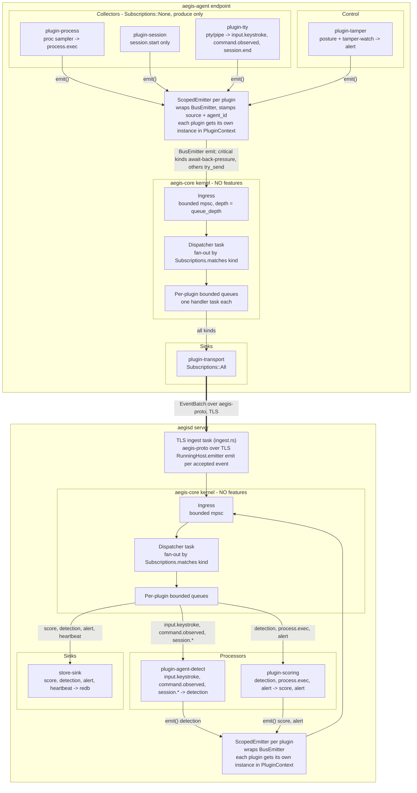

## System Architecture

Aegis is a plugin-native, client/server platform for behavioral insider-threat
modeling. Two axioms, stated in `aegis-sdk`, drive every structural choice: every
unit of information is an `Event`, and every capability is a `Plugin`. The kernel
(`aegis-core`) implements no features; it discovers plugins, wires them onto a
shared event bus, and manages lifecycle. Detection, scoring, telemetry collection,
transport, persistence, and endpoint self-protection are all plugins. This design
reflects the broader observation that insider-threat systems must be both
extensible and auditable [homoliak2019survey], requiring a clean separation between
infrastructure and detection logic.

### The plugin-native kernel

The workspace is organized into a strict dependency hierarchy: `aegis-sdk`
(contracts) is depended upon by `aegis-core` (kernel) and by all plugins; the
three binaries (`aegis-agent`, `aegisd`, `aegisctl`) depend on the kernel and on
whichever plugins they link. Plugins may never depend on `aegis-core` — they see
only the SDK's stable interface. This layering is enforced by the Rust module
system and the Cargo dependency graph, making it structurally impossible for a
plugin to reach into kernel internals.

The deployed system consists of three binaries. `aegis-agent` runs at the endpoint,
hosting telemetry collector plugins and a transport sink that forwards batched events
to the server. `aegisd` is the server, hosting the central detection and scoring
processors. `aegisctl` is a management CLI for plugin introspection, token minting,
and version reporting. The two buses — one per process — are entirely separate
in-process event buses bridged by the network transport.

### The Event model

The unit of information is `aegis_sdk::Event`, a uniform envelope carrying a UUID,
a nanosecond-resolution producer timestamp, an enrolled endpoint identity
(`agent_id`), the producing plugin's name (`source`), a routing kind string (e.g.
`"command.observed"`), a typed payload, and an arbitrary label map. The payload is a
serde-tagged enum (`EventPayload`) whose variants cover the full signal chain:
raw telemetry kinds (`ProcessExec`, `SessionStart`, `SessionEnd`, `Keystroke`,
`CommandObserved`), derived kinds (`Score`, `Detection`, `Alert`, `Heartbeat`), and
an explicit extensibility escape hatch (`Custom(serde_json::Value)`) for third-party
plugins that need novel payload shapes without an SDK change.

The event model encodes the content-free constraint structurally. `Keystroke`
carries only inter-arrival timing, a paste/burst flag, and burst length — there is
no field for character content. `CommandObserved` carries structural statistics
(token count, Shannon entropy, backspace flag, inter-command interval) and a salted
hash of the command for cross-session correlation, but never the verbatim text. This
approach parallels the use of inter-key intervals as content-free biometric signals
[killourhy2009] while extending them to the structural properties of command
sequences.

### Plugin discovery: static inventory and dynamic C-ABI

Two registration paths converge on a common constructor type
(`fn() -> Box<dyn Plugin>`). The default path for built-in plugins is static
registration via the `register_plugin!` macro, which uses the `inventory` crate's
distributed-slice mechanism: the macro submits a registration record at link time,
and the kernel iterates the resulting slice at startup. Linking a plugin crate into
a binary with `use plugin_x as _;` is the complete integration step — no registry
file and no explicit registration call are required. The seven built-in plugins
(`plugin-process`, `plugin-session`, `plugin-tty`, `plugin-agent-detect`,
`plugin-scoring`, `plugin-tamper`, `plugin-transport`) all register this way:
`plugin-tty` is the PTY/pipe keystroke- and command-timing collector, and
`plugin-transport` is the mTLS forwarder sink.

Third-party plugins may be loaded at runtime as shared objects (`cdylib`). A dynamic
plugin exports a C-ABI entrypoint (`aegis_plugin_entry`) returning a heap-allocated
`DynPluginRegistration` struct carrying an API version and a constructor. The kernel
loader (`aegis-core::loader::load_dynamic`) looks up the symbol, validates the API
version against `PLUGIN_API_VERSION`, and keeps the `libloading::Library` handle
alive for the duration of the process so plugin code remains mapped. API-version
mismatches are treated strictly for dynamic plugins (hard error) and leniently for
static ones (warn and skip), a documented asymmetry in the current implementation.

Plugin discovery at startup follows a precedence order: explicit registrations (via
`HostBuilder::with_plugin`) take priority over dynamic paths, which take priority
over the static inventory. The first occurrence of a given plugin name wins; a
`HashSet` of seen names enforces this. An enabled/disabled list in `HostConfig`
further filters candidates.

### The event bus: subscriptions, back-pressure, and ScopedEmitter provenance

The kernel owns a single bounded ingress channel (an `mpsc` of configurable depth,
default 4096) and a single dispatcher task. Each plugin receives its own bounded
queue and its own handler task. The `Plugin::subscriptions()` method returns
`All`, `None`, or a set of kind strings; the dispatcher fans out each event by
calling `try_send` on every plugin whose subscription matches the event's kind.
Because each plugin drains its own queue independently, a slow plugin back-pressures
only itself and never head-of-line-blocks others.

The bus distinguishes *critical* event kinds (`alert`, `detection`, `score`) from
low-value telemetry. Critical kinds take a **non-droppable** path: the dispatcher
`send().await`s a slot on each subscribed plugin's queue, so a flood of cheap
keystroke telemetry cannot evict an alert or a detection. Low-value kinds are
delivered with `try_send` and dropped on a full queue — but the drops are
**counted**, not silent: a `BusMetrics` instance maintains per-cause atomic
counters (`ingress_dropped_full`/`ingress_dropped_closed` at the ingress,
`fanout_dropped_full` at the fan-out) exposed via `RunningHost::bus_metrics()`, and
`aegisd` periodically logs any increase so loss is alertable. This bounds memory
under saturation while keeping the safety-relevant events flowing. The residual,
stated honestly, is that under extreme sustained load *low-value* telemetry can
still be dropped (a biased loss, since critical kinds are protected) — which is
exactly why the counters and a tunable `queue_depth` exist. (This corrects an
earlier draft that described drop-on-full with "no counter"; see security-audit M10,
fixed, and ADR #4/#11.)

Every plugin emits through a `ScopedEmitter` — a per-plugin wrapper around the
shared `BusEmitter` — which automatically stamps the `source` field with the
plugin's name and the `agent_id` with the host's enrolled identity. This provenance
guarantee means consumers can trust the `source` and `agent_id` fields on any event
that arrived through the in-process bus. The `Plugin::handle` method takes `&self`
rather than `&mut self`, so stateful plugins use interior mutability (`Arc<Mutex<…>>`);
collectors spawn background producer tasks in `init`, which takes `&mut self` and
runs exactly once before the plugin is `Arc`-wrapped.

Because processors emit derived events back onto the same ingress, the bus is a
feedback loop: `plugin-agent-detect` emits `Detection` events that the dispatcher
routes to `plugin-scoring`, which emits `Score` and `Alert` events. There is no
ordering or dependency declaration between plugins; delivery across independent
per-plugin queues is only eventually consistent. The following figure illustrates
the full component layout at both the agent and server:

### The client/server split and the wire protocol

The agent and server each run an independent instance of the `aegis-core` kernel.
The `aegis-proto` crate defines the wire format that bridges them: a `u32`
big-endian length-prefix followed by JSON bytes. JSON is deliberate — the
`EventPayload::Custom` variant is self-describing and would not round-trip through a
non-self-describing binary format. `MAX_FRAME_BYTES` (16 MiB) bounds the receive
path; the framing helpers are generic over any `AsyncRead`/`AsyncWrite + Unpin`,
layering cleanly over a `tokio-rustls` stream.

The protocol is versioned (`PROTO_VERSION: u16 = 1`) and handles two distinct
identity phases. Enrollment (`EnrollRequest`/`EnrollResponse`) is a one-time
exchange in which the agent presents a one-time token and its Ed25519 public key;
the server assigns a persistent `agent_id`. Subsequent sessions use a
`ClientHello`/`ServerHello` exchange with an Ed25519 possession proof over a
fresh, channel-bound server nonce. Telemetry flows as batched `EventBatch` frames
acknowledged by `BatchAck`. A duplex server-to-agent command channel carries
`ServerCommand` variants (`Rescore`, `SetConfig`, `Isolate`, `Noop`). The full
agent-to-server lifecycle is illustrated in the transport lifecycle figure in
`docs/diagrams.md`.

On the server side, `ingest.rs` decodes each incoming event, overwrites
`Event.agent_id` with the server-authenticated identity (so agent-supplied
identities cannot be spoofed), namespaces payload subjects per agent, enforces a
payload-kind allowlist (rejecting agent-supplied `Detection`/`Alert`/`Score`
payloads that would otherwise inject fabricated findings), and calls
`RunningHost::emitter().emit(event)` to place the event on the server-side bus.
This design — using the same `Arc<dyn Emitter>` the host exposes for external
event sources — means the network transport is just another event producer;
the central processors receive agent telemetry without any special-casing.

### The self-contained static server

`aegisd` is required to ship as a single, statically linked binary with no external
database and no runtime asset directory. The architecture selects pure-Rust,
musl-friendly dependencies throughout to satisfy this constraint. Persistence uses
`redb`, a pure-Rust embedded key-value store with no C dependency. The operator
dashboard (HTML/JS/CSS) is compiled into the binary with `rust-embed` and served
from memory. TLS uses `rustls` and `ring` (pure-Rust crypto) with `rcgen` for
self-signed certificate generation on first run; there is no dependency on OpenSSL
or any system TLS library. The release build profile specifies `lto = "thin"`,
`codegen-units = 1`, `strip = true`, and `panic = "abort"`; a `[profile.dist]`
variant uses fat LTO for the smallest production artifact. A continuous integration
job builds `aegisd` for `x86_64-unknown-linux-musl` and asserts the result with
`ldd ... => statically linked`. One caveat applies to dynamic plugin loading: a
fully static musl binary has no dynamic linker at runtime, so any dynamic plugin
loaded by `aegisd` must itself be built for musl. The server configuration sets
`dynamic_plugins = []` to avoid this at runtime.

The store sink (`StoreSink`) is implemented as a `PluginKind::Sink` plugin
subscribing to derived event kinds (`score`, `detection`, `alert`, `heartbeat`);
it is the only writer for telemetry results. HTTP handlers open read-only redb
transactions. This keeps the redb write path naturally single-threaded without
additional locking beyond what `Arc<Mutex<Database>>` already provides.

Adding any new capability — a new collector, detector, or sink — means adding a
plugin that depends only on `aegis-sdk`, implementing `Plugin`, and force-linking
it into the target binary with `use plugin_x as _;`. The kernel is never modified.
This extensibility model supports the kind of incremental, empirically grounded
development that insider-threat research has repeatedly shown to be necessary
[homoliak2019survey][cappelli2012cert].
