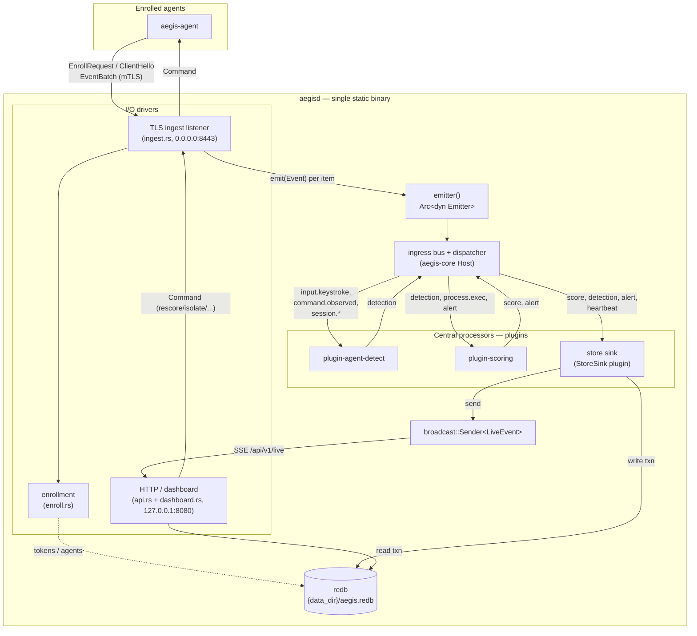

# Aegis Server Design (`aegisd`)

> Expanded by the server workflow. This document specifies how the
> self-contained Aegis server is built on top of the existing plugin host: the
> embedded store, the TLS ingest listener, the enrollment flow, and the operator
> dashboard / HTTP API. It is the design of record for the work that turns the
> current host-only `aegisd` (`crates/aegis-server/src/main.rs`) into a complete
> server.

## 1. Goals and the self-containment constraint

`aegisd` is **one statically linked binary with no external dependencies at
runtime**. This is a hard constraint, stated in the binary's own module doc
(`crates/aegis-server/src/main.rs`): "no external database, no runtime asset
directory — the embedded store and dashboard assets are compiled in, and the
binary targets static linking (musl)."

Concretely:

- **No database server.** Persistence is [`redb`](https://docs.rs/redb), a
  pure-Rust embedded key/value store, in a single file under `--data-dir`.
- **No asset directory.** The dashboard (HTML/JS/CSS) is embedded at compile
  time with `rust-embed` and served from memory.
- **No OpenSSL / system TLS.** TLS uses `rustls` + `ring` (pure-Rust crypto);
  the server's certificate is bootstrapped with `rcgen`.
- **No CA infrastructure.** Agents pin the server certificate fingerprint
  out-of-band; agents authenticate with per-agent Ed25519 keys established at
  enrollment.
- **One artifact to ship, one file to back up.** Deploy = copy `aegisd`. Back
  up = copy the redb file. Upgrade = swap the binary. See §9.

What the server is **not**: it does not collect local telemetry. The agent
(`aegis-agent`) is the collector; the server runs only the *central processors*
(`plugin-agent-detect`, `plugin-scoring`) over telemetry ingested from enrolled
agents, then persists and presents the results.

### Current state vs. this design

The host foundation already exists and runs: `Host::discover(config).run()`
initialises the central processors, spawns one task per plugin draining a
bounded `mpsc` queue, and spawns a dispatcher that fans `Event`s from the
ingress bus to subscribed plugin queues. `RunningHost::emitter()` returns an
`Arc<dyn Emitter>` for feeding external events onto that bus. Today nothing
feeds it and nothing persists the results.

This design adds four things, all inside `crates/aegis-server`:

| Gap | Mechanism | New module |
|---|---|---|
| Storage | `redb` single-file store | `store.rs` |
| TLS ingest | `tokio-rustls` accept loop driving `aegis-proto` | `ingest.rs` |
| Enrollment | one-time tokens + per-agent Ed25519 keys | `enroll.rs` |
| Dashboard / API | `axum` + `rust-embed` | `api.rs`, `dashboard.rs` |

All required crates are **already declared** in the root `[workspace.dependencies]`
(`redb`, `rustls`/`tokio-rustls`/`rcgen` with the `ring` feature, `axum`,
`rust-embed`, `mime_guess`, `ed25519-dalek`, `postcard`, `uuid`, `hex`, `rand`,
`tower`). They must be added to `crates/aegis-server/Cargo.toml` as
`<crate>.workspace = true`. Because none of those crates are depended on by any
workspace member yet, they are absent from `Cargo.lock` until that `Cargo.toml`
edit runs `cargo update`; **no root `Cargo.toml` change is required.**

## 2. Architecture

The server is the existing plugin host plus I/O drivers wired to its bus. The
TLS listener and HTTP server are **not** plugins — they are ingress/egress
drivers that hold `RunningHost::emitter()` and an `Arc<Store>`. Only the
*store sink* is a plugin, because it must observe derived events (`score`,
`detection`, `alert`) that the central processors emit back onto the bus.



Data-flow summary:

1. An agent connects over TLS, enrolls (first contact) or opens a session
   (`ClientHello`), then streams `EventBatch` frames.
2. `ingest.rs` decodes each `Event` and calls `emitter.emit(event).await`,
   placing it on the existing ingress bus.
3. The dispatcher routes by `kind`: `plugin-agent-detect` consumes
   keystroke/command/session events and emits `detection`; `plugin-scoring`
   consumes `detection`/`process.exec`/`alert` and emits `score` (and `alert`
   above threshold).
4. The `StoreSink` plugin subscribes to the *derived* kinds plus `heartbeat`
   and writes them to redb, then publishes a `LiveEvent` to the SSE broadcast
   channel.
5. The HTTP layer reads from redb for REST queries and streams `LiveEvent`s over
   SSE to the dashboard. Operator commands flow back out through `ingest.rs` to
   the connected agent.

### Why this split

- **`emit()` is the only coupling to the host.** The host core is untouched;
  ingest is a plain Tokio task holding the same `Arc<dyn Emitter>` the host
  hands out. This matches the host's own design note: external code "(e.g. a TLS
  listener) can clone and use [the emitter] to push ingested events onto the
  bus."
- **The store is a sink plugin, not HTTP-owned, so it sees derived events.**
  `score`/`detection`/`alert` are produced *inside* the host by the processors;
  the only way to observe them is to subscribe on the bus. A plugin is the
  natural fit, and `PluginKind::Sink` is exactly this role ("Persists, forwards,
  or alerts on events").
- **HTTP is read-only against the store.** All writes funnel through the single
  `StoreSink` task (and the enrollment path); HTTP handlers only open read
  transactions. This keeps redb's write path single-threaded without a `Mutex`.

## 3. Embedded storage (`store.rs`)

A `Store` wraps `Arc<Mutex<redb::Database>>` (redb's `Database` is `Send +
Sync`, but `compact()` requires `&mut self`, so an `Arc<Mutex<…>>` is needed).
It is constructed in `run()` before `host.run()`, opening
`Database::create("{data_dir}/aegis.redb")`. The `Arc` is cloned into the
`StoreSink` plugin (write path), the enrollment logic, and the HTTP `AppState`
(read path). Regular read and write transactions call `begin_read()`/
`begin_write()` which take `&self` and therefore only need the `Arc` — the
`Mutex` is locked exclusively only during the periodic `compact()` call.

> redb takes an **exclusive file lock** for the database handle's lifetime. A
> second `aegisd` against the same `--data-dir` fails to open — the correct
> behaviour for a single-node embedded store.

### Serialization

Stored values are **`postcard`** bytes (compact, pure-Rust, no-std-friendly) of
small `serde` row structs, *except* the raw event payload, which is stored as
its **verbatim wire JSON** (the bytes already arrived as JSON in the
`EventBatch` frame, so no re-encoding is needed on the hot path; the dashboard
can serve it directly). The HTTP layer deserializes rows from `postcard` and
re-serializes to JSON for browsers.

### Key encoding

Append-only logs (events, detections, alerts) use a **24-byte composite key**:

```
key = ts_ns.to_be_bytes() (8 bytes, big-endian)  ||  event_uuid.as_bytes() (16 bytes)
```

Big-endian timestamp bytes first means redb's B-tree orders keys by time for
free, so time-range scans and "most recent N" (`range(..).rev().take(n)`) are
cheap. Within a single nanosecond, ordering falls back to the random-but-stable
UUID, which is acceptable for a dashboard. A single helper enforces the
invariant:

```rust
fn composite_key(ts_ns: u64, id: Uuid) -> [u8; 24] {
    let mut k = [0u8; 24];
    k[..8].copy_from_slice(&ts_ns.to_be_bytes());
    k[8..].copy_from_slice(id.as_bytes());
    k
}
```

### Subject keys (important detail)

The central processors use a bare **`subject`** string, *not* one scoped by
agent. `plugin-agent-detect` sets `subject = session_id`; `plugin-scoring` sets
`subject = session_id` (forwarded from a detection) **or** `subject = "uid:<n>"`
(from a process exec). Subjects are therefore only unique *within* an agent. To
avoid cross-agent collisions, score/detection rows are keyed by a composite
string `"{agent_id}:{subject}"`. Agent IDs are server-assigned UUIDv4 (hex +
hyphens only), so a `':'` separator is unambiguous; the enrollment path must
reject any `agent_id` containing `':'` (it never will, but the assertion
documents the invariant).

### Tables

| Table (`TableDefinition`) | Key | Value (`postcard` unless noted) | Shape / purpose |
|---|---|---|---|
| `events` | `&[u8]` 24-byte composite | `EventRow` | Full raw audit log, time-ordered. `payload_json` field holds verbatim wire JSON. |
| `events_by_agent` | `&str` `agent_id` | `Vec<[u8;24]>` | Secondary index: composite keys for an agent, newest last, capped at `AGENT_EVENT_INDEX_LIMIT` (10 000; oldest evicted on insert). Backs per-agent event pagination. |
| `detections` | `&str` `"{agent_id}:{subject}"` | `DetectionRow` | Latest detection per subject (mutable cell). |
| `scores` | `&str` `"{agent_id}:{subject}"` | `ScoreRow` | Latest risk score per subject (mutable cell — `plugin-scoring` already decays in memory). |
| `alerts` | `&[u8]` 24-byte composite | `AlertRow` | Append-only alert log, time-ordered. |
| `agents` | `&str` `agent_id` | `AgentRow` | Enrolled-agent registry (identity, pubkey, last-seen). |
| `enroll_tokens` | `&str` token hex | `TokenRow` | One-time enrollment tokens. |

Row structs (all `#[derive(Serialize, Deserialize)]`):

```rust
struct EventRow      { id: [u8;16], ts_ns: u64, agent_id: String, source: String,
                       kind: String, payload_json: Vec<u8> }
struct DetectionRow  { agent_id: String, subject: String, verdict: String,
                       confidence: f64, model: String, reasons: Vec<String>, ts_ns: u64 }
struct ScoreRow      { agent_id: String, subject: String, model: String,
                       score: f64, ts_ns: u64 }
struct AlertRow      { id: String, agent_id: String, severity: String, title: String,
                       detail: String, subject: Option<String>, ts_ns: u64, acknowledged: bool }
struct AgentRow      { agent_id: String, hostname: String, os: String,
                       pubkey: [u8;32], enrolled_at_ns: u64, last_seen_ns: u64 }
struct TokenRow      { created_at_ns: u64, label: String, used: bool }
```

> **Two tables vs. one for enrollment.** Agents and tokens are kept in
> *separate* tables so that listing agents never scans token rows, and a 1-byte
> prefix discriminator is unnecessary. The burn-and-enroll operation (§6) still
> opens both tables inside a single write transaction, so atomicity is
> preserved.

### Write path

The `StoreSink` plugin's `handle()` is the only writer for telemetry. Each call
opens one write transaction, performs the writes, and commits — all
**synchronously**, with no `.await` between `begin_write()` and `commit()`. In
redb v2 `WriteTransaction` is `Send` (it uses `Arc`/`Mutex` internally, not
`Rc`/`Cell`), so holding one across an await point is technically allowed by
the compiler. Nevertheless the design avoids doing so for clarity and to keep
the redb write path behaving like a single-threaded journal. Because the host
delivers events to a plugin one at a time on its own task, writes are naturally
serialized; no additional `Mutex` on the write path is needed beyond the one
already in `Arc<Mutex<Database>>`.

Per kind:

- **every** subscribed event → `events` + `events_by_agent`
- `detection` → additionally upsert `detections`
- `score` → additionally upsert `scores`
- `alert` → additionally append `alerts`
- `heartbeat` → additionally `touch` the agent's `last_seen_ns`

`StoreSink::subscriptions()` returns
`Subscriptions::kinds(["score", "detection", "alert", "heartbeat"])`. The raw
collector kinds (`input.keystroke`, `command.observed`, `session.*`,
`process.exec`) arrive at the server inside `EventBatch` frames and are written
straight to `events` by `ingest.rs` *before* `emit()` (so the audit log is
complete even for kinds no plugin subscribes to). Derived kinds are written by
the sink. This keeps a single clear rule: ingest persists what it receives off
the wire; the sink persists what the processors produce.

> **MVP write cost.** One fsync per event serializes throughput on disk I/O.
> The post-MVP optimization is to coalesce: in the sink task, `recv()` one event
> then drain with `try_recv()` in a ~10 ms window and commit the batch in one
> transaction. The single-event path is correct and is the MVP.

### Read path

Four owned-return read methods back the HTTP handlers; each opens and drops its
own read transaction so axum handlers never touch redb lifetimes:

```rust
fn agents(&self) -> Vec<AgentRow>;
fn alerts_recent(&self, limit: usize) -> Vec<AlertRow>;   // range().rev().take(limit)
fn score(&self, agent_id: &str, subject: &str) -> Option<ScoreRow>;
fn events_for_agent(&self, agent_id: &str, page: usize, page_size: usize) -> Vec<EventRow>;
```

`events_for_agent` reads the `events_by_agent` index vec once, slices the
requested page from the tail (newest first), then does `page_size` point lookups
in `events`. For a dashboard with O(10) operators this is fine; the upgrade path
(if per-agent counts exceed ~100 K) is a two-column secondary index
`TableDefinition<(&str, &[u8]), ()>` keyed by `(agent_id, composite_key)`.

### Retention and compaction

`Store::compact(retention_ns)` runs from an hourly Tokio `interval` task spawned
in the sink's `init()`. Default retention is 30 days. Because the composite key
leads with big-endian `ts_ns`, deletion is a B-tree prefix range: build a cutoff
key of `(now_ns - retention_ns).to_be_bytes()` followed by 16 zero bytes and
call `table.retain_in(..cutoff, |_, _| false)` on `events`, `detections`
(*append variants only*), and `alerts`. (redb v2 has no `drain()` method; the
correct API is `retain_in` or `extract_from_if`.) **Two steps:** the retention
write-transaction commits first, then `Database::compact()` defragments in place
(redb v2 supports in-place compaction — no second file; `compact()` requires
`&mut Database`, obtained via `Mutex::lock().unwrap()`).
`scores`, `detections` (latest-per-subject cells), `agents`, and `enroll_tokens`
are **not** time-expired; identity and current state are authoritative and only
change by explicit action.

## 4. HTTP API and dashboard

`api.rs` builds an `axum::Router`; `dashboard.rs` serves the embedded SPA as the
router fallback. The whole app binds to `--http` (default `127.0.0.1:8080`) via
`axum::serve(TcpListener::bind(addr).await?, app)`. It is **spawned** and its
`JoinHandle` is held so Ctrl-C aborts it alongside `RunningHost::shutdown()`.

`AppState` (in `api.rs`) is `Arc`-shared into every handler:

```rust
struct AppState {
    store:   Arc<Store>,
    live_tx: broadcast::Sender<LiveEvent>,                 // SSE fan-out (capacity 1024)
    agents:  Arc<RwLock<HashMap<String, mpsc::Sender<ServerCommand>>>>, // connected agents
}
```

`LiveEvent` is the SSE payload, tagged by `kind`:

```rust
#[derive(Clone, Serialize)]
#[serde(tag = "kind", rename_all = "snake_case")]
enum LiveEvent {
    Score     { agent_id: String, subject: String, score: f64, ts_ns: u64 },
    Detection { agent_id: String, subject: String, verdict: String, confidence: f64, ts_ns: u64 },
    Alert     { agent_id: String, severity: String, title: String, subject: Option<String>, ts_ns: u64 },
    AgentSeen { agent_id: String, hostname: String, ts_ns: u64 },
}
```

### Security posture

The default bind is loopback-only and the API is **unauthenticated** — it is an
operator tool meant to sit behind SSH or a local reverse proxy. On startup, if
`--http` does not begin with `127.`, log a warning. No CORS headers are added
(loopback same-origin needs none and permissive CORS would be misleading). A
single `axum::middleware::from_fn` layer sets hardening headers on every
response: `X-Content-Type-Options: nosniff`, `X-Frame-Options: DENY`, and a
strict `Content-Security-Policy` (`default-src 'self'; connect-src 'self'`),
which the embedded SPA respects (no inline scripts, no external CDNs).

### Routes

All API routes are under `/api/v1`. JSON in, JSON out. Errors return a shared
`{ "error": "..." }` body with an appropriate status.

| Method | Path | Purpose | Success |
|---|---|---|---|
| GET | `/api/v1/agents` | List enrolled agents | 200 `[AgentRecord]` |
| GET | `/api/v1/agents/:agent_id` | One agent | 200 / 404 |
| POST | `/api/v1/agents/:agent_id/command` | Push a `ServerCommand` to a connected agent | 202 / 404 / 503 |
| GET | `/api/v1/scores` | All latest scores (`?subject=&min_score=&limit=`) | 200 `[ScoreRecord]` |
| GET | `/api/v1/scores/:agent_id` | Latest scores for one agent | 200 `[ScoreRecord]` |
| GET | `/api/v1/detections` | Latest detections (`?verdict=&min_confidence=&limit=`) | 200 `[DetectionRecord]` |
| GET | `/api/v1/detections/:agent_id` | Detections for one agent | 200 `[DetectionRecord]` |
| GET | `/api/v1/alerts` | Alert feed (`?severity=&acknowledged=&agent_id=&since_ns=&limit=`) | 200 `[AlertRecord]` |
| PATCH | `/api/v1/alerts/:id/ack` | Acknowledge an alert | 200 / 404 |
| GET | `/api/v1/events/:agent_id` | Per-agent event log (`?page=&page_size=`) | 200 `[EventRecord]` |
| POST | `/api/v1/tokens` | Create a one-time enrollment token (`{ "label": "..." }`) | 201 |
| GET | `/api/v1/tokens` | List tokens (incl. `used`) | 200 `[TokenRecord]` |
| DELETE | `/api/v1/tokens/:token` | Revoke a token | 204 / 409 |
| GET | `/api/v1/server-info` | Server cert fingerprint, proto version | 200 |
| GET | `/api/v1/live` | Server-Sent Events stream of `LiveEvent`s | 200 (`text/event-stream`) |
| GET | `/*path` | Dashboard SPA (fallback) | 200 / 404 |

Status codes used: `200` GET ok, `201` token created, `202` command queued,
`204` token revoked, `404` unknown id, `409` token already consumed, `503`
agent connected but command channel full, `500` redb error (logged before
returning).

### Representative JSON shapes

```jsonc
// GET /api/v1/agents  -> [ AgentRecord ]
{ "agent_id": "550e8400-e29b-41d4-a716-446655440000",
  "hostname": "workstation-42", "os": "Linux 6.1",
  "enrolled_at_ns": 1718654400000000000, "last_seen_ns": 1718740800000000000,
  "pubkey_hex": "a3f2…" }

// GET /api/v1/scores -> [ ScoreRecord ]
{ "agent_id": "550e…", "subject": "session:s42",
  "model": "risk-aggregator/v1", "score": 82.3, "ts_ns": 1718740800000000000 }

// GET /api/v1/detections -> [ DetectionRecord ]
{ "agent_id": "550e…", "subject": "session:s42", "verdict": "agent",
  "confidence": 0.91, "model": "transparent-additive/v1",
  "reasons": ["median_iki below human threshold", "paste_fraction high"],
  "ts_ns": 1718740800000000000 }

// GET /api/v1/alerts -> [ AlertRecord ]
{ "id": "uuid", "agent_id": "550e…", "severity": "high",
  "title": "Elevated insider-threat risk",
  "detail": "subject session:s42 reached risk score 82.3",
  "subject": "session:s42", "ts_ns": 1718740800000000000, "acknowledged": false }

// POST /api/v1/tokens  {"label":"laptop-3"}  -> 201
{ "token": "a3f2…64-hex…", "fingerprint": "sha256-hex-of-server-cert-der",
  "created_at_ns": 1718740800000000000 }

// POST /api/v1/agents/:agent_id/command  (body is a ServerCommand)
{ "cmd": "rescore", "subject": "session:s42" }          // or
{ "cmd": "isolate", "reason": "elevated risk score" }   // or
{ "cmd": "set_config", "plugin": "plugin-agent-detect", "config": { "assess_every": 5 } }
```

The command body deserializes **directly** into `aegis_proto::ServerCommand`,
whose `#[serde(tag = "cmd", rename_all = "snake_case")]` already matches these
shapes. The handler looks up the agent's `mpsc::Sender<ServerCommand>` in
`AppState.agents` (registered by `ingest.rs` on `ClientHello`, removed on
disconnect), `try_send`s the command, and returns 202 / 404 / 503. Delivery is
fire-and-forget at the HTTP layer; the agent's `CommandResult` frame is logged.

### Live view (SSE)

`GET /api/v1/live` returns an `axum::response::sse::Sse` over the broadcast
receiver. Each `LiveEvent` becomes an SSE event named for its `kind` (`score`,
`detection`, `alert`, `agent_seen`); the dashboard's `EventSource` adds one
listener per name. `KeepAlive::default()` holds idle connections open. Lagging
receivers are dropped by broadcast semantics (the `send()` on the write path
uses `.ok()` — zero subscribers is not an error). The pull-based equivalent for
clients without `EventSource` is `GET /api/v1/alerts?since_ns=<cursor>`.

> The SSE stream wraps the broadcast receiver. If a `tokio_stream`
> `BroadcastStream` adapter is used it must be added to `[workspace.dependencies]`
> (the one place this would touch the root manifest); the alternative is an
> inline `async_stream`-free loop reading the `broadcast::Receiver` directly,
> which keeps the change confined to `crates/aegis-server`.

## 5. Dashboard (embedded assets) — `dashboard.rs`

Assets live in `crates/aegis-server/assets/dashboard/`. A `rust-embed` derive
bakes them into the binary in release builds (`include_bytes!`), so the shipped
binary needs no asset directory; in debug builds it reads from disk for fast
iteration.

```rust
#[derive(rust_embed::RustEmbed)]
#[folder = "$CARGO_MANIFEST_DIR/assets/dashboard"]
struct Assets;
```

The fallback handler resolves the request path (empty → `index.html`), looks it
up with `Assets::get`, sets `Content-Type` from
`mime_guess::from_path(path).first_or_octet_stream()`, and returns the bytes
(`Cow<'static, [u8]>`). Unknown paths fall back to `index.html` so client-side
routing works (SPA pattern).

> The `assets/dashboard/` folder **must be non-empty at compile time** or the
> derive is a build error (a useful fail-fast). A minimal `index.html`
> placeholder is committed; the real dashboard is built by the dashboard
> workflow. The `$CARGO_MANIFEST_DIR` path (from the `interpolate-folder-path`
> feature, already enabled in the workspace dep) resolves independent of the
> build's working directory.

The dashboard is a single-page app that lists agents, shows per-subject risk
scores and detection verdicts, streams the live alert feed over SSE, and offers
token creation and per-agent command buttons (rescore / isolate). It calls only
the same-origin `/api/v1` endpoints.

## 6. TLS ingest listener and enrollment — `ingest.rs` + `enroll.rs`

### TLS bootstrap

On first start, if `{data_dir}/server/tls.crt` / `tls.key` are absent, the
server self-signs a certificate with
`rcgen::generate_simple_self_signed(["aegisd"])`, writes the cert and key PEM
atomically (temp file + rename), and records the **SHA-256 of the DER cert** as
the fingerprint. On later starts it loads the existing PEM. The `rustls::ServerConfig`
is built on the `ring` provider with `with_no_client_auth().with_single_cert(...)`,
wrapped in a `tokio_rustls::TlsAcceptor`.

> There is no CA. Agents pin this exact certificate by fingerprint, distributed
> out-of-band: `aegisctl` prints the fingerprint alongside a new token
> (`GET /api/v1/server-info` exposes it), and the operator places both in the
> agent's enrollment config before deployment. A future workflow can introduce a
> real CA without changing the wire protocol.

### Accept loop

`ingest.rs` binds a `TcpListener` on `--listen` (default `0.0.0.0:8443`), and
for each connection: completes the TLS handshake, then reads `aegis-proto`
frames with `read_message` / writes with `write_message` (length-prefixed JSON,
`MAX_FRAME_BYTES` = 16 MiB guard). The connection handler holds the host's
`Arc<dyn Emitter>`, the `Arc<Store>`, and a clone of `AppState`'s agent map.

Per-connection state machine over the `aegis_proto::Message` grammar:

- `EnrollRequest { token, hostname, os, agent_pubkey }` → validate token, assign
  identity, persist, reply `EnrollResponse { accepted, agent_id, reason }`. The
  same TLS connection may then proceed directly to a session.
- `ClientHello { proto_version, agent_id, hostname, os, agent_pubkey }` →
  authenticate (challenge below), reply `ServerHello { accepted, reason }`,
  register the command sender in the agent map, and `touch` `last_seen_ns`.
- `EventBatch { batch_id, events }` → for each `Event`: write to `events` and
  `emitter.emit(event).await`; then reply `BatchAck { batch_id, accepted }` and
  `touch` `last_seen_ns`.
- `Command` is server→agent only; the handler drains the per-agent
  `mpsc::Receiver<ServerCommand>` and writes `Command { id, command }` frames.
  Agent replies arrive as `CommandResult` (logged).
- `Ping` → `Pong`.

### Enrollment flow

```mermaid
sequenceDiagram
    autonumber
    actor Op as Operator
    participant Ctl as aegisctl
    participant Srv as aegisd
    participant Ag as aegis-agent

    Note over Op,Ag: Provisioning (out of band)
    Op->>Ctl: tokens create --label laptop-3
    Ctl->>Srv: POST /api/v1/tokens {label}
    Srv->>Srv: random 32B token (hex); store TokenRow{used:false}
    Srv-->>Ctl: { token, fingerprint }
    Ctl-->>Op: token + cert fingerprint
    Op->>Ag: place token + fingerprint in agent config

    Note over Ag,Srv: First contact (TLS, cert pinned by fingerprint)
    Ag->>Ag: generate Ed25519 keypair; store secret 0600
    Ag->>Srv: TLS handshake (verify server cert == pinned fp)
    Ag->>Srv: EnrollRequest{token, hostname, os, agent_pubkey}
    Srv->>Srv: one write txn: validate token, assign agent_id (UUIDv4), write AgentRow{pubkey}, mark token used
    alt token valid
        Srv-->>Ag: EnrollResponse{accepted:true, agent_id}
        Ag->>Ag: persist agent_id; delete one-time token
    else invalid / used / expired
        Srv-->>Ag: EnrollResponse{accepted:false, reason}
        Srv->>Ag: close connection
    end

    Note over Ag,Srv: Subsequent session (proves key possession)
    Ag->>Srv: ClientHello{agent_id, agent_pubkey, ...}
    Srv->>Srv: lookup AgentRow; stored pubkey == hello pubkey?
    Srv->>Ag: Command{id: challenge_uuid, ServerCommand::Noop}
    Ag->>Srv: CommandResult{id, ok:true, detail: hex(sign(challenge_uuid))}
    Srv->>Srv: verify signature with stored pubkey
    alt verified
        Srv-->>Ag: ServerHello{accepted:true}
        Note over Ag,Srv: EventBatch / BatchAck / Command flow
    else
        Srv-->>Ag: ServerHello{accepted:false, reason}
    end
```

Key points:

- **Tokens** are 32 random bytes (hex, 64 chars), single-use, with a soft
  validity window (e.g. 24 h) plus explicit revocation via
  `DELETE /api/v1/tokens/:token`. The token is the redb key in `enroll_tokens`.
- **Agent identity** is an Ed25519 keypair the agent generates *before* first
  contact and never shares; only the 32-byte public key is sent. The server
  stores it in `AgentRow.pubkey`.
- **Burn-and-enroll is atomic.** `Store::enroll(token, hostname, os, pubkey)`
  opens **one** write transaction that reads the token (rejecting used/expired),
  marks it used, assigns a fresh `Uuid::new_v4()` `agent_id`, and writes the
  `AgentRow` — both tables in the same transaction, so a crash mid-enrollment
  leaves a consistent state.
- **Session authentication reuses existing message variants.** Rather than
  adding a proto variant, the server issues `ServerCommand::Noop` as a challenge
  carrying a fresh UUID; the agent signs `challenge_uuid.as_bytes()` and returns
  the signature hex in `CommandResult.detail`. TLS already provides
  cross-connection replay protection, and this exchange precedes any event flow.
  Verification uses `ed25519-dalek` against the stored public key.

`enroll.rs` owns token CRUD (`create_token`, `list_tokens`, `revoke_token`) and
the `enroll`/challenge-verify helpers; `ingest.rs` calls them from the
connection state machine.

## 7. Module plan for `crates/aegis-server`

| Module | Responsibility | Key APIs |
|---|---|---|
| `main.rs` (exists) | CLI (`run`, `plugins`); in `run()`: open `Store`, build `AppState`, add `StoreSink` via `HostBuilder::with_plugin`, `host.run()`, then spawn `ingest::serve(...)` and `api::serve(...)`; await Ctrl-C; shutdown host + abort I/O tasks. | `run(args)` |
| `store.rs` (new) | redb open/lifecycle; table defs; row structs; composite-key helper; all read/write/compaction. | `Store::open(data_dir)`, `write_event`, `upsert_detection`, `upsert_score`, `append_alert`, `touch_agent`, `agents`, `alerts_recent`, `score`, `events_for_agent`, `compact` |
| `sink.rs` (new) | `StoreSink` plugin (`PluginKind::Sink`). Subscribes to `score`/`detection`/`alert`/`heartbeat`; writes via `Store`; publishes `LiveEvent`; spawns hourly compaction in `init`. | `impl Plugin for StoreSink`, `StoreSink::new(store, live_tx)` |
| `ingest.rs` (new) | TLS bootstrap + `TlsAcceptor`; accept loop; per-connection `aegis-proto` state machine; bridges to `emitter`, `Store`, and the command map. | `serve(addr, data_dir, emitter, store, agents) -> JoinHandle`, `load_or_make_cert(dir)` |
| `enroll.rs` (new) | Token CRUD; atomic burn-and-enroll; Ed25519 challenge/verify; server-cert fingerprint. | `create_token`, `list_tokens`, `revoke_token`, `enroll`, `verify_challenge`, `cert_fingerprint` |
| `api.rs` (new) | `AppState`; `axum::Router`; all REST handlers; SSE `/live`; security-headers middleware; `serve`. | `router(state) -> Router`, `serve(addr, state) -> JoinHandle`, `AppState`, `LiveEvent` |
| `dashboard.rs` (new) | `rust-embed` asset bundle + SPA fallback handler (mime via `mime_guess`). | `Assets`, `static_handler(uri)` |

`Cargo.toml` (server crate) gains, all `<crate>.workspace = true`: `redb`,
`postcard`, `uuid`, `ed25519-dalek`, `hex`, `rand`, `rustls`, `tokio-rustls`,
`rcgen`, `axum`, `tower`, `rust-embed`, `mime_guess`. (`aegis-proto`, `tokio`,
`serde`, `serde_json`, `tracing`, `anyhow`, `clap` are already present.)

## 8. Static build (musl)

The target is `x86_64-unknown-linux-musl`, pinned (with `gnu`) in
`rust-toolchain.toml` alongside toolchain `1.92.0`. The dependency feature sets
in `[workspace.dependencies]` are already musl-correct: `rustls`,
`tokio-rustls`, and `rcgen` set `default-features = false` + `features =
["ring", ...]`, so **no OpenSSL / aws-lc / native-tls** is pulled; `redb` and
the HTTP stack are pure Rust. The musl target defaults to
`target_feature = "crt-static"`, producing a `static-pie` binary with no
dynamic loader. A committed `.cargo/config.toml` pins the musl **linker** to
`musl-gcc` (from `musl-tools`) so the build needs no per-invocation `RUSTFLAGS`;
the only external prerequisite is a musl-targeting C compiler for `ring` (see the
build-env note below).

> **`libloading` and `dlopen` — static-linking caveat.** `aegis-core` depends on
> `libloading` for runtime plugin loading. On Linux, `libloading` links against
> `-ldl` and calls `dlopen(3)`. This does **not** prevent the binary from
> building statically — musl ships a stub `libdl` that satisfies the link — but
> at **runtime** a fully static musl binary has no dynamic linker present, so any
> call to `dlopen()` on a `.so` path will fail. This is acceptable: `aegisd`
> uses only statically-linked (`inventory`-registered) plugins; the
> `dynamic_plugins` list in `HostConfig` is empty in the server's `run()`.
> Calling `aegisd` with a config that populates `dynamic_plugins` on a musl
> static binary will produce a runtime error, not a build error — operators
> should be aware of this. If dynamic plugin loading on musl is ever required,
> the path is a GNU-linked build (`x86_64-unknown-linux-gnu`) or deploying
> plugins as static `inventory` crates.

```sh
# Standard route (matches CI): install musl-tools (provides musl-gcc), which the
# committed .cargo/config.toml already pins as the linker. No CC override needed.
sudo apt-get install -y musl-tools

# Release (thin LTO, stripped, panic=abort — see [profile.release])
cargo build -p aegis-server --release --target x86_64-unknown-linux-musl

# Distribution (fat LTO — [profile.dist])
cargo build -p aegis-server --profile dist --target x86_64-unknown-linux-musl
```

> **Build-env note (musl C compiler for `ring`).** `ring`'s build script compiles
> a small C/asm component via `cc-rs` and needs a musl-targeting C compiler; the
> pure-Rust crates need none. The **standard route** (used by CI and the
> Dockerfile) is to install `musl-tools`, which provides `musl-gcc`; `cc-rs`
> auto-detects it and the committed `.cargo/config.toml` pins it as the linker, so
> `cargo build --target …-musl` works with no env overrides. On a host that has
> **`clang` but not `musl-tools`**, point both the linker and `cc-rs` at clang
> instead:
> ```sh
> CARGO_TARGET_X86_64_UNKNOWN_LINUX_MUSL_LINKER=clang \
> CC_x86_64_unknown_linux_musl=clang \
> AR_x86_64_unknown_linux_musl=ar \
> CFLAGS_x86_64_unknown_linux_musl="--target=x86_64-unknown-linux-musl" \
> cargo build -p aegis-server --release --target x86_64-unknown-linux-musl
> ```
> Only a host that has *neither* `musl-gcc`/`musl-tools` *nor* `clang` is blocked
> (the naive build then fails with `failed to find tool "x86_64-linux-musl-gcc"`);
> install one of them.

Result (empirically): `ELF 64-bit … static-pie linked, stripped`, `ldd` =
"statically linked", no `INTERP`/`NEEDED`/`RUNPATH`. Size with storage + TLS +
HTTP exercised is ~3.9 MB (release) / ~3.65 MB (dist). The existing
`[profile.release]` (`lto = "thin"`, `codegen-units = 1`, `strip = true`,
`panic = "abort"`) and `[profile.dist]` (`lto = "fat"`) are correct as-is; no
profile changes are needed.

Verify a build is self-contained:

```sh
file   target/x86_64-unknown-linux-musl/release/aegisd   # static-pie linked, stripped
ldd    target/x86_64-unknown-linux-musl/release/aegisd   # statically linked
```

## 9. Operations

Everything the server needs at runtime lives under `--data-dir` (default
`./data/server`):

```
{data_dir}/
  aegis.redb            # the entire datastore (events, scores, alerts, agents, tokens)
  server/tls.crt        # self-signed server certificate (PEM)
  server/tls.key        # server private key (PEM, 0600)
  <plugin>/             # per-plugin state dirs created by the host
```

- **Run.** `aegisd run --listen 0.0.0.0:8443 --http 127.0.0.1:8080
  --data-dir /var/lib/aegis`. The HTTP API is loopback-only and unauthenticated
  by default — reach it over SSH or a local reverse proxy.
- **Enroll an agent.** Create a token (`aegisctl tokens create` →
  `POST /api/v1/tokens`), copy the token **and** the printed server-cert
  fingerprint into the agent's config, start the agent. First contact enrolls;
  subsequent sessions authenticate by Ed25519 challenge.
- **Back up.** Copy the single redb file. redb is crash-consistent
  (transactional), so a copy taken while running is a valid snapshot to the last
  committed transaction; for a guaranteed-quiescent copy, stop the server first.
  The `tls.*` files are regenerated if missing, but copying them preserves the
  pinned fingerprint so enrolled agents keep trusting the server after a
  restore.
- **Upgrade.** Swap the `aegisd` binary and restart. The on-disk redb format is
  stable within a `redb` major version; the wire protocol is versioned
  (`PROTO_VERSION`, negotiated in `ClientHello`/`ServerHello`).
- **Restore / move host.** Copy `aegis.redb` and `server/tls.*` to the new host
  and start `aegisd` with the same `--data-dir` layout. Because the certificate
  (and thus the pinned fingerprint) and all `AgentRow` public keys come along,
  enrolled agents reconnect without re-enrollment.
- **Single-writer invariant.** Only one `aegisd` may hold a given `--data-dir`
  (redb's exclusive lock enforces this); run exactly one server per data
  directory.
