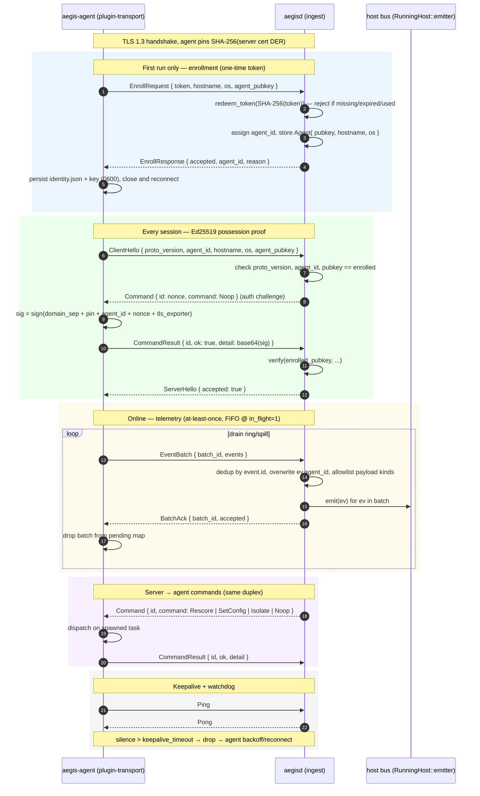
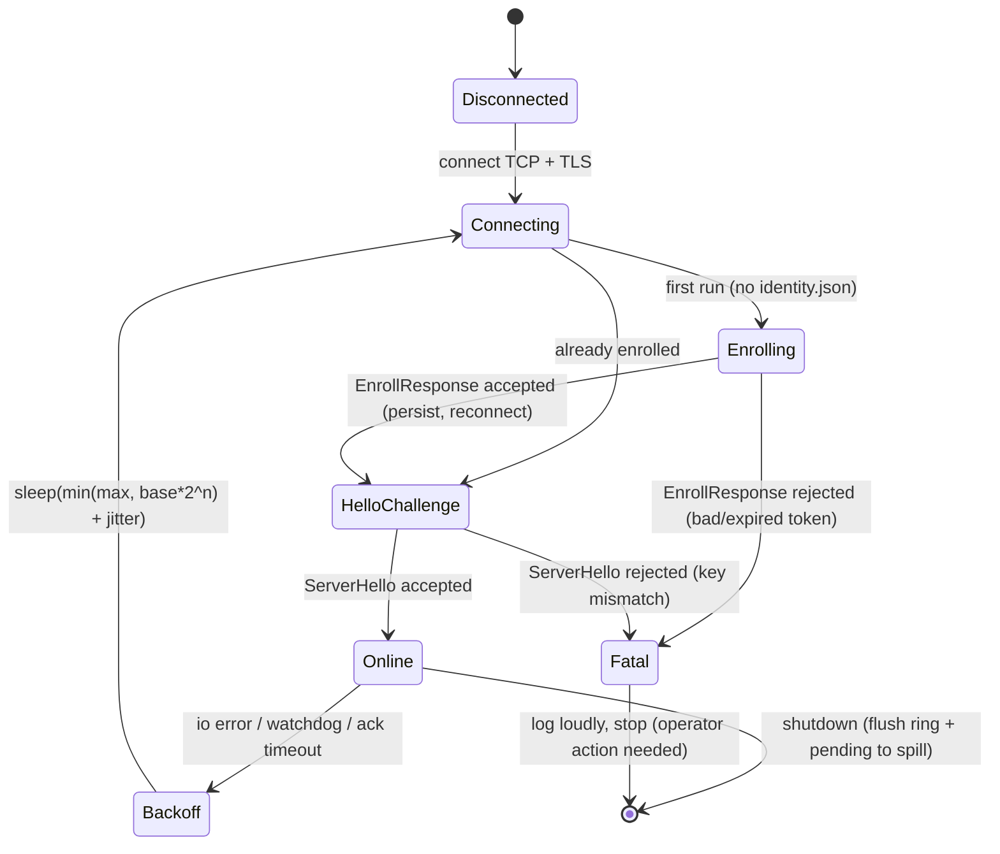

# Aegis Transport — Design

The agent↔server transport: mutual-authentication TLS, enrollment, telemetry
forwarding, backpressure/ordering, and the server→agent command channel.

It is built strictly on the types that already exist in the tree:
[`aegis_proto::Message`] / [`aegis_proto::ServerCommand`]
(`crates/aegis-proto/src/lib.rs`), [`aegis_sdk::Event`] /
[`aegis_sdk::EventPayload`] (`crates/aegis-sdk/src/event.rs`), the
[`aegis_sdk::Plugin`] contract (`crates/aegis-sdk/src/plugin.rs`), and the host
runtime's `RunningHost::emitter()` (`crates/aegis-core/src/host.rs`).
**No change to the wire grammar is required** — every `Message` variant already
exists and is used as-is.

Naming note: the client forwarder ships as the crate
**`plugins/plugin-transport`** (the name used throughout this document and by the
task). The DESIGN draft and some internal module names refer to it as
`plugin-forward`; treat `plugin-forward` as an alias for the same crate. Choose
one name in code; this document standardizes on `plugin-transport`.

---

## 0. Goals

1. **Confidential, integrity-protected channel** between every enrolled agent and
   the server, with **no CA / PKI to provision** (the server is a single
   self-contained `aegisd` binary; see `crates/aegis-server/src/main.rs`).
2. **Mutual *authentication*** without X.509 client certs:
   - server→agent: TLS server cert + **agent-side SHA-256 fingerprint pinning**;
   - agent→server: **one-time enrollment token**, then a **per-agent Ed25519
     possession proof** over a fresh server nonce on every session.
   This matches the `aegis-proto` module doc, which states auth is "layered
   *under* this protocol" via "enrollment tokens + per-agent Ed25519 keys."
3. **One duplex TLS connection per agent** multiplexing every message type
   (telemetry, acks, commands, keepalive).
4. **At-least-once telemetry delivery with end-to-end FIFO ordering** at the
   default in-flight=1, plus **server-side dedup** so the bus sees each event
   effectively once.
5. **Durability across restarts** (disk spill) and **bounded memory under
   overload** (drop-oldest with visible accounting) — never block the host bus or
   `Plugin::handle`.
6. **A server→agent command channel** carrying the real `ServerCommand` variants
   (`Rescore`, `SetConfig`, `Isolate`, `Noop`).
7. **Minimal kernel/SDK surface:** exactly one additive SDK method
   (`Plugin::reconfigure`, default `Err`) to honor `SetConfig`; everything else is
   new crates/modules layered under the unchanged `aegis-proto` grammar.

Non-goals (out of scope here): the operator dashboard / HTTP API
(`--http`), storage sinks, and a `PROTO_VERSION` bump. Where this design leans on
those (e.g. command producers), it states the dependency and defers it.

---

## 1. Where the code lands

| Concern | Crate/module (new unless noted) | Why there |
|---|---|---|
| Shared TLS setup, cert-pin verifier, frame helpers | `aegis-proto` (extend): `aegis_proto::tls`, `aegis_proto::pin` | `aegis-proto` already owns framing; both sides depend on it. |
| Forwarder (agent → server) | **new** `plugins/plugin-transport`, `PluginKind::Sink` | The forwarder is itself a plugin consuming all events. |
| Enrollment + identity persistence (agent) | `plugin-transport::identity` | Credentials live under the forwarder's `ctx.data_dir`. |
| Disk spill (agent) | `plugin-transport::spill` (redb) | Survives restarts. |
| Ingest listener (server) | **new** `aegis-server::ingest` | Server is a binary; it wires `RunningHost::emitter()`. |
| Token store + agent registry (server) | `aegis-server::registry` (redb) | Server-side durable state. |
| Command queue (server → agent) | `aegis-server::commands` | Feeds the ingest connection's writer. |
| `aegisctl enroll-token` | `aegis-cli` (extend) | Operator mints one-time tokens. |

`plugin-transport` is force-linked into `aegis-agent` exactly like the others
(`use plugin_transport as _;`, alongside the existing `use plugin_process as _;`
etc. at `crates/aegis-agent/src/main.rs:17-19`) and added to its `Cargo.toml`.
The server modules are plain `mod`s in the `aegisd` binary, spawned from `run()`
where the `// (ingest listener + dashboard added by server workflow)` stub
currently sits (`crates/aegis-server/src/main.rs:82`), passing
`running.emitter()`.

### 1.1 Dependency & lockfile reality (correction to the DESIGN draft)

The DESIGN draft claims these versions are "already resolved" in `Cargo.lock` and
that "nothing new is introduced to the lockfile." **That is not accurate and the
implementation must not rely on it.** The crates are declared in
`[workspace.dependencies]` (`Cargo.toml:44-62`) but **no member crate consumes
them yet**, so they are *absent* from `Cargo.lock` (verified: the lock has 106
packages and zero entries for `rustls`, `tokio-rustls`, `rcgen`,
`ed25519-dalek`, `redb`, `ring`, `axum`, `base64`, `postcard`;
`cargo update -p rustls@0.23` errors with "did not match any packages"). Only
`sha2 0.10.9` and `uuid 1.23.3` (already used by `aegis-proto`/`plugin-session`)
are in the lock.

Implication: **adding the transport work WILL add all of the TLS/crypto/storage
stack to `Cargo.lock`.** The registry cache contains the draft's claimed versions
(`rustls 0.23.40`, `tokio-rustls 0.26.4`, `rcgen 0.13.2`, `ed25519-dalek 2.2.0`,
`redb 2.6.3`, `ring 0.17.14`), so those are the most likely resolutions — but the
cache *also* holds `rustls 0.23.38` and `rustls 0.27.9`, so the exact pins are
decided at first `cargo build`, not pre-verified. Treat the version table as
"expected," run `cargo build` once, and commit the resulting `Cargo.lock`.

Additionally, three crates the design references are **not declared as workspace
deps at all** and are genuinely new to the manifest, not just the lock:

- **`base64`** — used pervasively for the enroll blob and signature encoding.
- **`subtle`** — optional, for constant-time pin comparison (a hand-written
  `ct_eq` over `sha2` output avoids this dep entirely; prefer that to keep the
  surface small).
- **`hostname`** — optional; `EnrollRequest.hostname` can instead be read from
  `/proc/sys/kernel/hostname` / `std::env::consts` with no new dep.

Recommendation: add `base64` to `[workspace.dependencies]`; avoid `subtle` and
`hostname` (use `sha2` + a manual constant-time compare, and `/proc` + `std::env`
for host facts). `postcard` (spill encoding) **is** already a workspace dep
(`Cargo.toml:36`) and is fine to use.

---

## 2. TLS (rustls + ring)

The workspace pins `rustls 0.23 { ring, std }`,
`tokio-rustls 0.26 { ring }`, and `rcgen 0.13 { ring, pem }`
(`Cargo.toml`) — ring-backed and musl-friendly, matching the
"self-contained static binary" constraint in `crates/aegis-server/src/main.rs`. The
`tls12` cargo feature has been **dropped** (security-audit L1), so TLS 1.2 is
excluded at the crate-feature level as well as by the runtime version pin below.

### 2.1 Server certificate — self-signed on first run (rcgen)

On `aegisd run`, before the listener binds,
`ingest::load_or_create_server_cert(data_dir)`:

1. Looks for `data_dir/tls/server.{crt,key}.der`.
2. If absent: `rcgen::generate_simple_self_signed(vec![host_san,
   "aegis-server"])`, where `host_san` is derived from the bind address (the
   existing `--listen`, default `0.0.0.0:8443`) or a new `--cert-san` flag;
   defaults also include `127.0.0.1` and `localhost`. Persist cert DER +
   `PrivatePkcs8KeyDer` with `0600` perms.
3. Compute the pin = `SHA-256(cert_der)` and log it once:
   `tracing::info!(fingerprint = %hex, "server identity (sha256 of cert DER)")`.
   **This is verify-only**, not the distribution mechanism (see red-team
   `RT-7`); operators paste it (or `aegisctl enroll-token` embeds it).

Build a `tokio_rustls::TlsAcceptor` from
`rustls::ServerConfig::builder().with_no_client_auth().with_single_cert(...)`.

**Why pin + Ed25519 instead of X.509 mTLS.** True mTLS needs a client-cert PKI.
The system's auth primitive is already specified as **per-agent Ed25519 keys +
enrollment tokens** (`aegis-proto` module doc; `ClientHello.agent_pubkey` /
`EnrollRequest.agent_pubkey` exist precisely for this). So mutual *authentication*
is provided in two layers without X.509 client certs:

- **server→agent** = TLS server cert + agent-side fingerprint pinning (§2.2);
- **agent→server** = the application handshake (`EnrollRequest` token first
  contact; `ClientHello` + Ed25519 nonce signature thereafter — §4).

This keeps `aegisd` a single binary with no PKI. A note recording this decision
("no X.509 client certs; Ed25519 instead") will be added to `aegis-proto`'s
module doc.

### 2.2 Agent side — pinned `TlsConnector`

The agent parses `--server` (`crates/aegis-agent/src/main.rs:54-55`, e.g.
`https://host:8443`) into host+port. It builds a `rustls::ClientConfig` with
`.dangerous().with_custom_certificate_verifier(Arc<PinnedVerifier>)` and
`.with_no_client_auth()`.

`PinnedVerifier` implements `rustls::client::danger::ServerCertVerifier`:

- `verify_server_cert`: compute `SHA-256(end_entity.as_ref())` — explicitly the
  **end-entity** leaf, not an intermediate — and **constant-time** compare
  against the stored pin (manual `ct_eq` over the 32-byte digests). Match →
  `Ok(ServerCertVerified::assertion())`; mismatch →
  `Err(rustls::Error::General("server cert pin mismatch"))`.
- `verify_tls12_signature` / `verify_tls13_signature`: **delegate** to
  `rustls::crypto::ring::default_provider()` so the handshake's own signature is
  still validated. We override only *trust-anchor/identity* checking, not
  signature checking.
- `supported_verify_schemes`: from the ring provider.

This is "TOFU with an out-of-band pin": the pin is supplied at enrollment time
(operator-pasted, or carried in the `aegisctl enroll-token` blob — §4.2), not
blind-trusted on first connect. Hostname is irrelevant to trust (we pin the key),
which suits self-signed / IP-only servers.

### 2.3 TLS 1.3-only (hardening — addresses red-team `RT-6`)

Build both configs with
`.with_protocol_versions(&[&rustls::version::TLS13])`. There are no legacy peers,
so allowing TLS 1.2 only widens the surface. Pinning 1.3 also gives a clean
RFC-5705 keying-material **exporter** for channel binding in the auth handshake
(§4.4). The `tls12` cargo feature has additionally been **dropped** from the
`rustls`/`tokio-rustls` workspace entries (security-audit L1), so the runtime
version pin is belt-and-suspenders rather than the sole defense.

`PinnedVerifier` must be unit-tested against: (a) correct pin → `Ok`;
(b) one-byte-off pin → `Err`; (c) a different self-signed cert → `Err`;
(d) an empty/short cert → `Err`. A slip (returning `Ok` before the compare,
comparing the wrong chain element) silently downgrades to accept-any.

### 2.4 Wrapping the stream

Both sides reuse the existing codec unchanged. After the handshake:

```rust
let tls = acceptor.accept(tcp).await?;               // server: TlsStream<TcpStream>
let tls = connector.connect(server_name, tcp).await?; // agent
let (rd, wr) = tokio::io::split(tls);
```

`aegis_proto::read_message(&mut rd)` / `write_message(&mut wr, &msg)`
(`crates/aegis-proto/src/lib.rs:114,131`) work verbatim — they are generic over
`AsyncRead/AsyncWrite + Unpin`, which `ReadHalf/WriteHalf<TlsStream>` satisfy. The
`MAX_FRAME_BYTES` (16 MiB) cap and `ProtoError::FrameTooLarge` already bound the
receive path; this matters now that the server reads from untrusted agents (see
`RT-8` for the pre-allocation caveat).

---

## 3. Connection lifecycle

A single TLS connection multiplexes **all** message types for an agent. To use it
concurrently from a reader task and a writer task, split it and put the write half
behind `Arc<Mutex<WriteHalf<...>>>` — `write_message` does length-prefix + body +
flush in one call, so holding the lock for its duration keeps frames
non-interleaved. Reads happen on a single task, so no read lock is needed.

### 3.1 Sequence (enroll → authenticated session → batches+acks → commands)



### 3.2 Agent state machine



`Fatal` (bad token, key mismatch) is **non-retryable** and distinct from
transient network errors, which retry forever with exponential full-jitter backoff
(`backoff_min`..`backoff_max`, default 0.5 s..30 s; counter resets after an
`Online` that survives a grace window).

---

## 4. Enrollment & identity

### 4.1 Agent identity persistence

Under `plugin-transport`'s `ctx.data_dir`
(`crates/aegis-core/src/host.rs:158` computes `data_dir/<plugin>`, so
`data_dir/agent/plugin-transport/`):

- `identity.json` — `{ agent_id, server_pins: [hex32, ...], enrolled_at_ns }`
  (a **set** of accepted pins — current + next — to support rotation; see
  `RT-7`).
- `agent_ed25519.key` — the 32-byte Ed25519 seed, `0600`, generated with
  `ed25519_dalek::SigningKey::generate(&mut OsRng)` on first run.

`identity::load_or_first_run(data_dir, cfg)` returns
`Enrolled { agent_id, signing_key, server_pins }` or
`NeedsEnrollment { token, server_pin, signing_key }`. **First-run detection** =
`identity.json` absent. The agent generates its Ed25519 key **before** enrolling
so the token can be bound to the key (`RT-1`).

**Secret intake (addresses `RT-1`, `RT-7`):** do **not** accept the token/pin via
env vars or argv. On a multi-user host the agent runs as root
(`plugin-tamper` install spec: `run_as = "root"`,
`ExecStart=... run --server ...`; `plugins/plugin-tamper/src/install.rs:28,59`),
and `/proc/<pid>/environ` and `/proc/<pid>/cmdline` leak any env/CLI secret to the
same uid; systemd unit text and shell history capture them too. Instead, read the
enroll blob from **stdin** or a **0600 root-only file that is shredded/unlinked
after first read**. The current `--server` flag and the
`AEGIS_SERVER`/`AEGIS_AGENT_ID` env (`crates/aegis-agent/src/main.rs:49,55`) are
*not* secrets and stay; the token/pin must not join them.

### 4.2 Token minting — `aegisctl enroll-token`

New subcommand in `aegis-cli` (alongside `Plugins`/`Version` at
`crates/aegis-cli/src/main.rs:25-34`):

```
aegisctl enroll-token --data-dir ./data/server [--ttl 300] [--label laptop-07]
```

It opens the server's redb (`registry::TokenStore`), generates a 32-byte random
token (`rand`), stores `token_hash = SHA-256(token)` →
`{ created_ns, expires_ns, label, used: false }` (store the **hash**, never the
token, so a DB read cannot replay tokens), and prints one copy-paste blob:

```
AEGIS-ENROLL <base64( token || server_pin_32 )>
```

This binds the one-time secret to the exact server cert pin, so the agent learns
both atomically. **Default `--ttl` is low (300 s)** per `RT-1`. `aegisctl` already
depends on `aegis-core`; it gains `redb`, `rand`, `sha2`, `base64` (it reads the
pin from the file `aegisd` wrote).

### 4.3 First-contact flow (real `Message` variants)

Agent, when `NeedsEnrollment`:

1. TLS-connect with the pin from the blob.
2. Send `Message::EnrollRequest { token, hostname, os, agent_pubkey }` where
   `agent_pubkey = signing_key.verifying_key().to_bytes().to_vec()` (the 32-byte
   Ed25519 key the variant documents at `crates/aegis-proto/src/lib.rs:75-80`),
   `hostname` from `/proc/sys/kernel/hostname`, `os` from
   `std::env::consts::OS` + kernel release.
   **`RT-1` hardening:** require the agent to **sign** the redemption (e.g. the
   token redemption check verifies a signature by `agent_pubkey` over
   `token || hostname || nonce`), so a passively stolen token cannot be redeemed
   by a *different* key. Bind redemption idempotently to the pubkey: a reconnect
   by the same key is fine; a second distinct pubkey presenting a redeemed token
   raises an `Alert`/`Critical` onto the bus (theft signal).
3. Read `Message::EnrollResponse { accepted, agent_id, reason }`.
   - accepted → persist `identity.json` + key; close and reconnect.
   - rejected → log `reason`, exit non-zero (operator must re-mint).

Server, on `EnrollRequest`:

- `registry::redeem_token(token)`: look up `SHA-256(token)`; reject if missing,
  expired, or `used`; verify the agent signature (`RT-1`); atomically mark
  `used=true` (redb write txn) — **one-time** semantics.
- Assign `agent_id` (`format!("agent-{}", Uuid::new_v4())`, or `label` if
  present).
- Store `registry::Agent { agent_id, pubkey: [u8;32], hostname, os, enrolled_ns,
  last_seen_ns }` keyed by `agent_id`, plus a `pubkey -> agent_id` index.
- Reply `EnrollResponse { accepted: true, agent_id, reason: None }`. **Design:
  agent reconnects** to start a clean session — simpler state machine, and it
  proves the persisted-credential path immediately.

### 4.4 Session handshake (already-enrolled) with Ed25519 challenge

The spec says "the agent signs a server nonce," but `ClientHello`/`ServerHello`
carry no nonce/signature field and we must not change the grammar. Resolution that
stays 100% within existing variants:

1. Agent → `Message::ClientHello { proto_version, agent_id, hostname, os,
   agent_pubkey }`.
2. Server validates `proto_version == PROTO_VERSION`
   (`crates/aegis-proto/src/lib.rs:20`), looks up `agent_id`, and checks the
   presented `agent_pubkey` **equals the enrolled pubkey**. Mismatch →
   `ServerHello { accepted: false, reason: Some("unknown agent / key mismatch") }`
   and close.
3. Server issues a challenge **as a command**:
   `Message::Command { id, command: ServerCommand::Noop }`. `Noop` is documented
   as "keepalive / capability probe"
   (`crates/aegis-proto/src/lib.rs:51-52`); we use it as the auth probe.
4. Agent signs a **domain-separated, channel-bound** message (not the raw UUID —
   see `RT-2`) and replies
   `Message::CommandResult { id, ok: true, detail: Some(base64(sig)) }`.
5. Server verifies the signature against the enrolled pubkey. Success →
   `ServerHello { accepted: true }` and `Online`. Failure → close.

**`RT-2` — what is signed.** Signing only `Command.id.as_bytes()` (16 raw UUID
bytes) has no domain separation, no server identity, no channel binding, and reuses
the same key the agent uses to answer *real* `Noop` probes — i.e. it would turn
every keepalive into a signing oracle for a transferable signature. Instead sign:

```
SHA-256( b"aegis-session-auth-v1" || server_pin_32 || agent_id_bytes
         || nonce32 || tls_exporter )
```

where `nonce32` is fresh 32-byte server randomness carried inside the challenge
(derived into / alongside the `Command.id` for auth-only `Noop`s the agent treats
specially), and `tls_exporter` is the rustls RFC-5705 keying-material export for
the current connection (defeats relay/MITM-after-handshake). Keep auth a **distinct
code path**: the agent must refuse to "auth-sign" any `Noop` whose challenge it did
not receive in the handshake window, so the key is never an oracle for
attacker-chosen real commands. Rate-limit failed challenges per `agent_id`.

This proves possession of the enrolled private key over a fresh, channel-bound,
server-chosen nonce using only `Command`/`CommandResult`/`ServerHello`/`Noop` — all
real variants. The convention is documented in `aegis-proto`. (Explicit nonce/sig
fields would be a future `PROTO_VERSION` bump — out of scope.) Replaying a captured
`ClientHello` cannot complete step 4.

---

## 5. Message mapping to `aegis-proto`

Every transport interaction maps onto an existing `Message`/`ServerCommand`
variant (`crates/aegis-proto/src/lib.rs`). Nothing is added.

| Transport step | `Message` variant | Direction | Notes |
|---|---|---|---|
| Enrollment request | `EnrollRequest { token, hostname, os, agent_pubkey }` | A→S | first run only; token = one-time |
| Enrollment result | `EnrollResponse { accepted, agent_id, reason }` | S→A | assigns `agent_id` |
| Session open | `ClientHello { proto_version, agent_id, hostname, os, agent_pubkey }` | A→S | pubkey checked == enrolled |
| Auth challenge (nonce) | `Command { id, command: Noop }` | S→A | `Noop` repurposed as auth probe (§4.4) |
| Auth response (sig) | `CommandResult { id, ok, detail: base64(sig) }` | A→S | domain-separated, channel-bound sig |
| Session accept/reject | `ServerHello { proto_version, accepted, reason }` | S→A | gate into `Online` |
| Telemetry | `EventBatch { batch_id, events }` | A→S | `events: Vec<Event>`; `batch_id: Uuid` |
| Telemetry ack | `BatchAck { batch_id, accepted }` | S→A | `accepted: u32` count |
| Operator command | `Command { id, command }` | S→A | `Rescore`/`SetConfig`/`Isolate`/`Noop` |
| Command outcome | `CommandResult { id, ok, detail }` | A→S | correlates by `id: Uuid` |
| Keepalive | `Ping` / `Pong` | both | no payload |

`ServerCommand` (`crates/aegis-proto/src/lib.rs:41-53`) variants used:
`Rescore { subject }`, `SetConfig { plugin, config }`, `Isolate { reason }`,
`Noop`.

---

## 6. Security

### 6.1 Properties this buys

- **Confidentiality + integrity:** all telemetry/commands ride TLS 1.3
  (rustls/ring), with cipher choice narrowed by the 1.3-only floor (§2.3).
- **Server authentication without a CA:** SHA-256 cert-pin captured out-of-band
  at enrollment; MITM with a different key is rejected by `PinnedVerifier`.
- **Agent authentication:** one-time enrollment token (stored hashed, single-use,
  key-bound) + per-agent Ed25519 possession proof over a fresh, channel-bound
  server nonce on every session.
- **No agent spoofing:** the server overwrites `Event.agent_id` with the
  authenticated identity before emitting (§7.3).
- **DoS bounds:** `MAX_FRAME_BYTES` cap, per-conn timeouts, connection semaphore,
  per-conn/per-agent rate limits, bounded ring/spill/in-flight, idempotent
  per-event dedup.
- **Loss bounds:** at-least-once + server dedup ≈ exactly-once at the bus; disk
  spill makes restarts lossless for buffered data; drop-oldest only under sustained
  overload, always counted and surfaced.

### 6.2 Red-team findings and mitigations

These were derived adversarially against this exact design. Each mitigation is an
**additive** check (ingest validation, intake hardening, signed-message change) —
none requires a wire-grammar change.

| ID | Attack | Mitigation (in this design) |
|---|---|---|
| **RT-1** | **Enrollment token theft/replay.** Token+pin delivered via env/argv leak through `/proc/<pid>/{environ,cmdline}` (agent runs as root) and systemd unit text / shell history. An unredeemed token is fully replayable (redeem only sets `used=true` on success), so an attacker who reads it first binds *their* Ed25519 key. | Never accept token/pin via env/argv; read from stdin or a 0600 root-only file, then shred/unlink (§4.1). Bind redemption to the requesting key: agent signs `token‖hostname‖nonce`; reject a different key (§4.3). Default `--ttl 300` + single-use. Idempotent-per-pubkey redemption; `Alert`/`Critical` when a redeemed token reappears from a second pubkey. |
| **RT-2** | **Agent impersonation via the Ed25519-over-`Noop` weakness.** Signing only `Command.id` (16 raw bytes) has no domain separation, no server/session binding, and reuses the key that answers real `Noop` probes (signing oracle); a captured response is valid for any server issuing the same UUID, including a sibling server sharing the registry. | Sign a domain-separated, channel-bound digest `SHA-256(b"aegis-session-auth-v1"‖pin‖agent_id‖nonce32‖tls_exporter)` with a fresh 32-byte nonce and the RFC-5705 TLS exporter (§4.4). Keep auth a distinct path; refuse to auth-sign any unsolicited `Noop`. Verify `pubkey==enrolled` every reconnect; rate-limit failed challenges. |
| **RT-3** | **Telemetry forgery.** `EventBatch.events` is `Vec<Event>` and `Event.payload` can be **any** `EventPayload` — including `Detection`/`Alert`/`Score`. One forged `Detection{ verdict: Agent, confidence: 1.0 }` makes `plugin-scoring` add `agent_detection_weight (60.0) * confidence` and fire an `Alert` at `alert_threshold 75.0` (`plugins/plugin-scoring/src/lib.rs:33-38,98-149`) — a critical finding with zero behavioral telemetry. The `subject` inside the payload is never authenticated. | At ingest, enforce a **per-agent payload-kind allowlist**: collectors may submit only raw-telemetry kinds (`process.exec`, `session.start`/`end`, `input.keystroke`, `command.observed`, `heartbeat`); **reject** `detection`/`score`/`alert` (server-derived). Namespace `subject` server-side (`format!("{agent_id}:{subject}")`) so no endpoint can manufacture findings about another's subjects/uids; scoring keys on the namespaced subject. Validate numeric ranges (`confidence ∈ [0,1]`, finite `f64` — reject NaN/Inf). Quarantine offenders + tamper `Alert`. |
| **RT-4** | **Telemetry suppression.** (a) `handle()` is driven by the host's per-plugin queue, which the dispatcher fills with `try_send` and **drops on full** (`crates/aegis-core/src/host.rs:221-225`, `crates/aegis-core/src/bus.rs:31`); with `Subscriptions::All` and `queue_depth 4096`, a flood silently drops events *before* they reach the forwarder ring — so "the ring is the controlled overflow point" is false under load. (b) drop-oldest on ring/spill discards the *earliest* (incriminating) events under induced backpressure. (c) root compromise can delete spill/identity files. | (a) Surface host-queue drops as a counter + periodic `Alert` so blind-by-flood is visible; size the forwarder path so its own bounded ring is the only intended drop point. (b) Maintain a per-agent monotonic sequence + periodic signed `Heartbeat` carrying drop counts; the server alerts on sequence gaps / nonzero drops (loss becomes detectable). (c) Keep spill/identity root-owned `0600` and add them to `plugin-tamper`'s `protected_paths` (`plugins/plugin-tamper/src/lib.rs:36-37,121-135`) so deletion raises `Critical`; the monitored unprivileged user already cannot touch root-owned files. |
| **RT-5** | **Replay of whole `EventBatch` frames.** At-least-once means the agent retransmits un-acked batches; an on-path attacker or compromised agent can also replay captured frames or re-send the same events under a **fresh** `batch_id` (the dedup key is sender-chosen), defeating a `batch_id`-only LRU. Replayed `detection`/`process.exec`/`alert` re-bump scores / re-fire alerts. | Dedup on per-event `Event.id` (already a `Uuid`), **not** `batch_id` alone; persist a per-agent high-watermark + recent-id set in the server redb (survives restarts). Bound freshness: reject `Event.ts_ns` outside a ±skew window. Cap per-subject score-increase rate server-side to blunt inflation. |
| **RT-6** | **TLS downgrade / weak parameters.** *Resolved.* The `tls12` cargo feature has been **dropped** from the `rustls`/`tokio-rustls` workspace entries (security-audit L1), and the configs pin **TLS 1.3 only** via `.with_protocol_versions(&[&rustls::version::TLS13])` (§2.3), so TLS 1.2 cannot be negotiated at either the feature or the version level. | Done (TLS-1.3-only + `tls12` feature removed). `PinnedVerifier` is unit-tested for correct/off-by-one/different/short certs; it verifies the **end-entity** leaf and still delegates signature checks to the ring provider. |
| **RT-7** | **Cert-pin bypass at bootstrap / via logs / on rotation.** Pin confidentiality rests on the OOB channel (same exposure as `RT-1`); `aegisd` logs the fingerprint (a verify value); pin **rotation is unspecified**, so a legit cert regen looks identical to a MITM (fleet outage or temptation to disable pinning). | Deliver the pin only over an authenticated/confidential OOB channel; treat the enroll blob as a secret (stdin/0600/shred). Mark the logged fingerprint **verify-only**; access-control server logs. Support a **set** of accepted pins in `identity.json` (current + next) for pre-cutover rotation (§4.1); provide an authenticated re-pin via the command path signed by the enrolled key — never via plain `SetConfig`. Distinguish "pin mismatch" from network errors in operator UX. |
| **RT-8** | **Ingest resource exhaustion.** `read_message` does `vec![0u8; len]` sized from the attacker-supplied length prefix *before* reading the body (`crates/aegis-proto/src/lib.rs:142`); many slow connections each declaring ~16 MiB ≈ `max_conns * 16 MiB` (~64 GiB at 4096). A valid 16 MiB batch of tiny events ⇒ hundreds of thousands of `emit()` calls toward the shared bus. No enrollment rate limit; `serde_json` recursion on nested `Custom`. | Don't pre-allocate to the full declared size — read in bounded chunks up to the cap, and enforce a small **receive** cap (the design's `batch_max_bytes` 1 MiB) on ingest. Per-conn/per-agent byte+frame token buckets; reject batches with `> N` events before iterating `emit`. Short first-frame/handshake deadline (e.g. 5 s) and a per-IP connection+enrollment-attempt rate limiter in front of the semaphore. Bound `serde_json` depth; reject oversized `Custom`. Fair-queue ingest emit per agent so one agent cannot starve the shared bus. |
| **RT-9** | **Malicious / abused server→agent commands.** `SetConfig` can push arbitrary JSON into a named plugin (blind scoring via huge `alert_threshold`, neuter detection via `decay=0`/zero weights, or redirect exfil via the forwarder's `server` config field). `Isolate.reason` is echoed into an `Alert` detail (XSS/log-injection sink) and can be mass-fired (alert storm). Commands are dispatched with no per-command authZ/rate-limit/audit; producers include the deferred unauthenticated `--http` API. | Authenticate/authorize command **producers** (the `--http` API + `aegisctl` must require operator auth — the deferred gap is the real hole) and audit every command with operator identity. Constrain `SetConfig` to an allowlist of plugins/keys; **forbid** remote changes to security-critical fields (`transport.server`/pins, scoring thresholds/weights, tamper `protected_paths`); `Plugin::reconfigure` validates against a schema and rejects out-of-policy values. Treat forwarder server/pin as immutable-at-runtime (only via the authenticated re-pin/enroll path). Escape/​bound `Isolate.reason` before it enters alerts/logs/dashboard. Rate-limit + de-dup inbound commands on the agent; bind commands to the authenticated session (channel binding, `RT-2`) so relayed/replayed commands are rejected. Consider requiring an operator signature on high-impact commands (`Isolate`, `SetConfig`) so a server compromise alone cannot weaponize the fleet. |

---

## 7. Forwarder plugin design (`plugins/plugin-transport`)

### 7.1 Plugin shape (sink)

```rust
// plugins/plugin-transport/src/lib.rs
pub struct TransportPlugin { ring: Arc<Ring>, cfg: TransportConfig, /* ... */ }

#[async_trait]
impl Plugin for TransportPlugin {
    fn metadata(&self) -> PluginMetadata {
        PluginMetadata::new(
            "plugin-transport", env!("CARGO_PKG_VERSION"),
            "Forwards telemetry to the Aegis server over mutual-auth TLS",
            PluginKind::Sink)
    }
    fn subscriptions(&self) -> Subscriptions { Subscriptions::All } // consume ALL events
    async fn init(&mut self, ctx: &PluginContext) -> anyhow::Result<()> { /* spawn connection actor */ }
    async fn handle(&self, ev: &Event, _ctx: &PluginContext) -> anyhow::Result<()> {
        self.ring.offer(ev.clone()); Ok(())     // non-blocking
    }
    async fn shutdown(&self) -> anyhow::Result<()> { /* flush ring + pending -> spill, signal actor */ }
}
register_plugin!("plugin-transport", || Box::new(TransportPlugin::default()));
```

`handle` is intentionally trivial and **non-blocking**: it `offer`s into a bounded
in-memory ring and returns. All network work happens in the connection actor
spawned in `init` — the same pattern `plugin-tamper` uses (it `tokio::spawn`s a
loop holding `ctx.emitter` in `init`; `plugins/plugin-tamper/src/lib.rs:104-140`).
This guarantees the forwarder never head-of-line-blocks the host's per-plugin queue
(`crates/aegis-core/src/host.rs:183-201`). Per `RT-4(a)`, the host queue can still
drop *before* `handle` under flood, so the actor surfaces host-queue drops as an
alert and the ring is sized so `handle` effectively always accepts.

`TransportConfig` (the plugin's `ctx.config` subtree via
`config_as::<TransportConfig>()`; the host passes `config.plugin_config(name)`
(`crates/aegis-core/src/config.rs:78`, returns `serde_json::Value::Null` when
unset); `config_as` is `PluginContext::config_as`
(`crates/aegis-sdk/src/plugin.rs:121`), defaulting to `T::default()` when the
value is `null`):

```
server            : String   // overrides --server if set
batch_max_events  : usize = 512
batch_max_bytes   : usize = 1_048_576    // RECEIVE-enforced too (RT-8); << MAX_FRAME_BYTES
flush_interval_ms : u64   = 1000
ring_capacity     : usize = 50_000        // in-mem bound (drop-oldest)
spill_max_bytes   : u64   = 67_108_864    // 64 MiB on-disk cap
ack_timeout_ms    : u64   = 30_000
backoff_min_ms    : u64   = 500
backoff_max_ms    : u64   = 30_000
keepalive_ms      : u64   = 15_000
keepalive_timeout_ms: u64 = 45_000
max_in_flight     : usize = 1             // 1 = strict FIFO end-to-end
```

### 7.2 Batch builder

A drain loop `select!`s on: the flush ticker, a ring-non-empty notify, and a
"batch full" fast path. It pops events until `batch_max_events` or the serialized
estimate hits `batch_max_bytes`, then builds
`Message::EventBatch { batch_id: Uuid::new_v4(), events }`. Byte budgeting uses a
running estimate (`serde_json::to_vec(&ev).len()`), and the builder re-checks the
whole frame against `MAX_FRAME_BYTES` before send; a single pathological `Custom`
event larger than the cap is dropped with a `warn` rather than wedging the pipe.

### 7.3 At-least-once + ordering

- On send, move the batch into `pending: BTreeMap<Uuid, PendingBatch { events,
  first_sent_ns, attempts }>` keyed by `batch_id`, **before** awaiting the ack.
- On `BatchAck { batch_id, accepted }`: remove from `pending`; if
  `accepted < events.len()`, `warn` (the proto models a count, not per-event
  status, so the batch is treated as delivered and the discrepancy is surfaced in
  metrics/logs).
- **Ordering:** at most `max_in_flight` batches outstanding (default **1**), so
  `batch_id` order == send order == bus order ⇒ FIFO end-to-end. `>1` trades
  strict order for throughput; the server tolerates reorder (events carry `ts_ns`
  + `id`, and processors key on `session_id`, not arrival order —
  `plugins/plugin-agent-detect/src/lib.rs` accumulates per `session_id`).
- **Reconnect retransmit:** on a fresh `Online`, re-send everything in `pending`
  (oldest first) **before** new ring events. Duplicates are possible; dedup is the
  server's job (`RT-5`, §8.4).

### 7.4 Disk spill (durable; survives restart)

A redb DB `data_dir/agent/plugin-transport/spill.redb`, table
`spill: (u64 seq) -> Vec<u8>` (postcard-encoded `Event`; `postcard` is a workspace
dep, `Cargo.toml:36`, and `Event: Serialize + Deserialize`):

- **Ring full + `Disconnected`/`Backoff`:** spill the *oldest* ring events to disk
  (FIFO), enforcing `spill_max_bytes`. If disk is also at cap → **drop-oldest** on
  disk (advance the read cursor) and increment a dropped counter surfaced as a
  periodic `Heartbeat`/`Alert` (`RT-4b`). Drop-oldest (not pause-producer) is
  correct: telemetry is a firehose and we must never block collectors or the bus.
- **`shutdown` (Ctrl-C / systemd stop):** flush the entire ring + un-acked
  `pending` to spill, then return. This makes restarts lossless for buffered data.
- **Startup / reconnect:** the builder drains spill (lowest `seq` first) **ahead
  of** the live ring, and deletes acked rows in the same write txn the ack
  triggers. Precedence on a fresh `Online`: **un-acked `pending` → spill (disk) →
  live ring.**

Per `RT-4c`, `spill.redb` and `identity.json` are root-owned `0600` and added to
`plugin-tamper`'s `protected_paths`.

---

## 8. Server ingest design (`aegis-server::ingest`)

In `aegisd run()`, replacing the stub log at
`crates/aegis-server/src/main.rs:82`, spawn
`ingest::serve(listen_addr, acceptor, registry, command_router,
running.emitter())`.

### 8.1 Accept loop

```rust
let listener = TcpListener::bind(listen).await?;
loop {
    let (tcp, peer) = listener.accept().await?;
    let permit = conn_sem.clone().acquire_owned().await?;   // bound concurrent agents
    if !rate_limiter.allow(peer.ip()) { continue; }          // per-IP throttle (RT-8)
    tokio::spawn(handle_conn(acceptor.clone(), tcp, peer,
                             registry.clone(), router.clone(),
                             emitter.clone(), permit));
}
```

Each connection is independent — a misbehaving agent affects only its own task.
`--max-conns` (default 4096) bounds concurrency; per-conn read timeouts reap
stalled handshakes/sockets.

### 8.2 Per-connection handler

1. `acceptor.accept(tcp).await` → `TlsStream`; `tokio::io::split`. Apply a short
   **first-frame deadline** (e.g. 5 s, `RT-8`).
2. First frame:
   - `EnrollRequest` → §4.3 server path → `EnrollResponse`, then close (agent
     reconnects).
   - `ClientHello` → §4.4 challenge/verify → `ServerHello`. On accept, continue;
     on reject, close.
   - anything else → close (protocol violation).
3. **Session loop** (reader task):

   ```rust
   loop {
     match read_message(&mut rd).await? {
       Message::EventBatch { batch_id, events } => {
         // RT-3: payload-kind allowlist + numeric validation; RT-5: dedup by id.
         let admitted = validate_and_dedup(agent_id, &events, &registry)?;
         let n = admitted.len() as u32;
         for mut ev in admitted {
            ev.agent_id = agent_id.clone();          // RT-3: overwrite spoofable id
            namespace_subject(&mut ev, &agent_id);   // RT-3
            emitter.emit(ev).await;                   // onto the host bus
         }
         write_locked(&wr, Message::BatchAck { batch_id, accepted: n }).await?;
         registry.touch_last_seen(&agent_id);
       }
       Message::CommandResult { id, ok, detail } => router.resolve(id, ok, detail),
       Message::Ping => write_locked(&wr, Message::Pong).await?,
       Message::Pong => { /* refresh keepalive watchdog */ }
       _ => { /* agent must not send ServerHello/Command/etc. */ break; }
     }
   }
   ```

   Reads use a watchdog (`keepalive_timeout`): no frame within the window → close,
   so dead peers are reaped and the agent's reconnect/backoff kicks in.
4. **Command pump** (writer side, same connection): a task does
   `router.subscribe(agent_id).recv().await` and writes
   `Message::Command { id, command }` frames (under the write mutex). The server
   also fires `Ping` on its own keepalive ticker.

### 8.3 Publishing onto the bus

`emitter` is `RunningHost::emitter()` (`crates/aegis-core/src/host.rs:270`), the
**same** bus the central processors subscribe to (`plugin-agent-detect`,
`plugin-scoring` are linked into `aegisd` at
`crates/aegis-server/src/main.rs:18-19`). So a keystroke-timing event collected on
a laptop becomes, server-side, a `Detection` → `Score` → possibly an `Alert`, with
zero special-casing: the transport is just another event *source*. Storage/dashboard
sinks (out of scope) subscribe to the same bus.

**Correctness (RT-3):** incoming `Event.agent_id` is attacker-influenced, so the
handler **overwrites it with the authenticated `agent_id`** before emitting,
**namespaces the payload `subject`**, **allowlists payload kinds**, and validates
numeric ranges. `kind` is validated non-empty.

### 8.4 Idempotency (dedup for at-least-once)

Because the agent retransmits un-acked batches and an attacker can replay under a
fresh `batch_id` (`RT-5`), dedup is keyed on **`Event.id`**, not `batch_id`. The
`registry` keeps a per-agent recent-id set + monotonic high-watermark, **persisted
in redb** so it survives restarts. A repeat is **acked but not re-emitted** ⇒
effectively exactly-once at the bus boundary despite at-least-once on the wire.
Freshness bounds (`±skew` on `Event.ts_ns`) reject stale-telemetry replay.

### 8.5 Server-side state (`aegis-server::registry`, redb)

| Table | Key → Value | Purpose |
|---|---|---|
| `tokens` | `SHA-256(token)` → `{ created_ns, expires_ns, label, used }` | one-time enrollment (hash only) |
| `agents` | `agent_id` → `Agent { pubkey[32], hostname, os, enrolled_ns, last_seen_ns }` | identity + last-seen |
| `pubkey_index` | `pubkey[32]` → `agent_id` | reverse lookup / theft detection |
| `dedup` | `agent_id` → recent `Event.id` set + high-watermark | `RT-5` exactly-once |

---

## 9. Server→agent command channel (`aegis-server::commands`)

### 9.1 Routing

`commands::Router` holds `DashMap<AgentId, mpsc::Sender<(Uuid, ServerCommand)>>`.
When an agent session is `Online`, its command pump (§8.2 step 4) owns the matching
receiver. `router.send(agent_id, cmd)` returns a `oneshot` the caller awaits for the
`CommandResult`; `router.resolve(id, ok, detail)` (from §8.2) completes it. Commands
to an offline agent are queued (bounded `mpsc`) and flushed on next `Online`, or
expire with TTL.

**Producers** (each must be authenticated/audited — `RT-9`):

- the HTTP/dashboard API (`--http`, deferred) → "rescore subject X", "isolate
  agent Y";
- internal policy (e.g. `plugin-scoring` raising `critical` could enqueue
  `Isolate` — wired later);
- `aegisctl` via the HTTP API.

### 9.2 Agent-side dispatch

The forwarder's reader task handles `Message::Command { id, command }` by
dispatching on the **real** `ServerCommand` variants and replying
`Message::CommandResult { id, ok, detail }`. Dispatch is **non-blocking** w.r.t.
the reader: each command runs on a spawned task (or a small bounded worker) so a
slow `Rescore` does not stall ack/keepalive on the same connection. Commands are
rate-limited, de-duplicated, and bound to the authenticated session (`RT-9`).

| `ServerCommand` | Agent handler | Result |
|---|---|---|
| `Rescore { subject }` | Emit a local trigger so `plugin-agent-detect` re-emits a `Detection` for `subject` (subject = `session_id`). | `ok: true` if dispatched; `detail` = current verdict if known. |
| `SetConfig { plugin, config }` | Apply a new config subtree to a named plugin via `Plugin::reconfigure` (§9.3), **schema-validated against an allowlist**; reject security-critical fields (`RT-9`). | `ok` per apply; `detail` = validation error if any. |
| `Isolate { reason }` | Heightened-monitoring posture: bump local sampling, raise an `EventPayload::Alert` (`Severity::Critical`, `subject = agent_id`) — `reason` **escaped/bounded** before it enters the alert (`RT-9`); tighten enforcement if privileged. | `ok: true`, `detail` = sanitized `reason`. |
| `Noop` | Keepalive/capability probe; also the auth challenge carrier (§4.4). | `ok: true`. |

### 9.3 The live-reconfiguration gap (`SetConfig`)

The host applies `ctx.config` once at `init` (`crates/aegis-core/src/host.rs:162-172`);
there is no runtime reconfig API. Minimal in-scope way to honor `SetConfig`:

- Add **one additive, default-`Err`** method to the `Plugin` trait
  (`crates/aegis-sdk/src/plugin.rs`):

  ```rust
  async fn reconfigure(&self, _new: serde_json::Value) -> anyhow::Result<()> {
      anyhow::bail!("plugin does not support live reconfigure")
  }
  ```

  Plugins that opt in (scoring, agent-detect) swap their `Mutex<Config>` /
  `ArcSwap` internally. The default impl means **no existing plugin breaks**
  (mirrors the existing default-`Ok` `init`/`handle`/`shutdown`). `SetConfig` for a
  plugin returning the default ⇒
  `CommandResult { ok: false, detail: Some("plugin does not support live
  reconfigure") }`.

This is **the one SDK touch** the transport work requires; everything else is new
crates/modules. Per `RT-9`, `reconfigure` validates against a schema/allowlist and
forbids security-critical fields.

---

## 10. Failure / backpressure handling

### 10.1 Backpressure policy

| Stage | Bound | Policy on overflow |
|---|---|---|
| Host ingress + per-plugin queue | `queue_depth` (4096) | host's existing `try_send` → warn + **drop** (`crates/aegis-core/src/{host.rs:221-225,bus.rs:31}`); **counted + alerted** (`RT-4a`) |
| Forwarder in-mem ring | `ring_capacity` (50k) | spill oldest to disk; if disk full, drop-oldest on disk |
| Disk spill | `spill_max_bytes` (64 MiB) | drop-oldest (advance read cursor), count + alert |
| In-flight batches | `max_in_flight` (1) | builder pauses popping until an ack frees a slot → natural backpressure into the ring |
| Ingest receive | `batch_max_bytes`/`max events` | chunked reads, reject oversized batch/`Custom`, per-agent fair-queue (`RT-8`) |

The **only** place we "pause the producer" is in-flight gating inside the actor
(it just stops building new batches until acked) — internal, never blocking
`Plugin::handle` or the host bus. Everywhere unbounded growth is otherwise
possible, the policy is **drop-oldest with visible accounting** (appropriate for
security telemetry: freshest-wins, liveness preserved), and loss is made
**detectable** via per-agent sequence + drop-count heartbeats (`RT-4b`).

### 10.2 Keepalive & watchdog

- **Agent:** a `keepalive_ms` ticker (15 s) sends `Message::Ping` when idle; a
  watchdog tracks the last inbound frame and, after `keepalive_timeout_ms` (45 s),
  drops the connection → `Backoff` → reconnect. Any inbound frame (`Pong`,
  `BatchAck`, `Command`) refreshes the watchdog.
- **Server:** symmetric — fires `Ping`, answers inbound `Ping` with `Pong`, reaps
  a reader that times out.

`Ping`/`Pong` are the existing variants (`crates/aegis-proto/src/lib.rs:108-110`);
no payload.

### 10.3 Reconnect / backoff

Exponential **full jitter**, `backoff_min_ms`..`backoff_max_ms` (0.5 s..30 s),
counter reset after an `Online` that survives a grace window. `ack_timeout_ms`
without a `BatchAck` ⇒ dead link ⇒ tear down and reconnect; the un-acked batch
stays in `pending` and is retransmitted. **Fatal, non-retryable:**
`EnrollResponse { accepted: false }` (bad token) and
`ServerHello { accepted: false, reason: "key mismatch" }` ⇒ log loudly and stop
(operator action), distinct from transient network errors (retry forever). Operator
UX must distinguish **pin mismatch** from a network error so a legitimate cert
rotation is not read as a permanent MITM (`RT-7`).

---

## 11. Concrete change list

**`aegis-proto`** (extend; no grammar change):
- `mod tls` — `client_config(pins)`, `server_config(cert, key)`, `connect`,
  `accept` helpers; **TLS 1.3-only** (`RT-6`).
- `mod pin` — `PinnedVerifier` (`ServerCertVerifier`), `fingerprint(cert_der) ->
  [u8;32]`; constant-time compare; unit tests for off-by-one/different/short certs.
- Doc note: domain-separated, channel-bound Ed25519-over-`Noop`-nonce auth (§4.4);
  "no X.509 client certs; Ed25519 instead."
- Add `rustls`, `tokio-rustls`, `sha2` (already present) to its `Cargo.toml`.

**`aegis-sdk`** (one additive method):
- `Plugin::reconfigure(&self, serde_json::Value) -> anyhow::Result<()>` with a
  default `Err` (enables `SetConfig`; no existing plugin breaks).

**`plugins/plugin-transport`** (new crate, `PluginKind::Sink`,
`Subscriptions::All`):
- `lib.rs` (plugin + connection actor + state machine + keepalive), `identity.rs`,
  `spill.rs` (redb), `config.rs`. Deps: `aegis-sdk`, `aegis-proto`, `tokio`,
  `tokio-rustls`, `ed25519-dalek`, `sha2`, `redb`, `postcard`, `base64`, `rand`,
  `uuid`, `serde*`, `tracing`, `async-trait`.

**`aegis-agent`**:
- `use plugin_transport as _;` + dep (next to
  `crates/aegis-agent/src/main.rs:17-19`); wire `--server`/enrollment config into
  the forwarder's config subtree (the `--server` flag already exists,
  `crates/aegis-agent/src/main.rs:54-55`; the token/pin come via stdin/0600 file,
  **not** env/argv — `RT-1`).

**`aegis-server`** (`aegisd`):
- `mod ingest`, `mod registry` (redb: tokens + agents + dedup), `mod commands`.
  Spawn `ingest::serve(...)` from `run()` at the stub
  (`crates/aegis-server/src/main.rs:82`); pass `running.emitter()`. Deps:
  `rustls`, `tokio-rustls`, `rcgen`, `ed25519-dalek`, `sha2`, `redb`, `base64`,
  `rand`. Add `--cert-san`, `--max-conns`.

**`aegis-cli`** (`aegisctl`):
- `enroll-token` subcommand (mint, store hashed, print
  `AEGIS-ENROLL <b64(token‖pin)>`; default `--ttl 300`). Deps: `redb`, `rand`,
  `sha2`, `base64`.

**Workspace `Cargo.toml`**:
- Add `base64` to `[workspace.dependencies]` (not currently declared). Avoid
  `subtle`/`hostname` (use `sha2` + manual ct-compare, and `/proc` + `std::env`).
  The `tls12` feature has been dropped from the `rustls`/`tokio-rustls` entries
  (`RT-6`, security-audit L1) — done.
- **Expect `Cargo.lock` to grow:** the TLS/crypto/storage stack is currently
  absent from the lock (see §1.1); commit the regenerated lock after first build.

**`docs/ARCHITECTURE.md`**: add a transport section linking here, including the
"pin + Ed25519 instead of X.509 mTLS" rationale.

---

## 12. Implementation spec (deliverables)

### (a) `plugins/plugin-transport` — client forwarder sink

- **Crate:** `plugins/plugin-transport`, added to workspace `members`.
- **Public:** `TransportPlugin` (impl `Plugin`, `Sink`, `Subscriptions::All`);
  `register_plugin!("plugin-transport", ...)`.
- **`handle`:** non-blocking `ring.offer(ev.clone())` only.
- **`init`:** load `TransportConfig` via `ctx.config_as()`; run
  `identity::load_or_first_run(ctx.data_dir, &cfg)`; spawn the **connection actor**
  (state machine of §3.2): reader task, writer task behind
  `Arc<Mutex<WriteHalf>>`, batch builder (§7.2), keepalive + watchdog (§10.2),
  reconnect/backoff (§10.3).
- **`identity.rs`:** Ed25519 key gen/load (`0600`); `identity.json` with a **set**
  of pins; secret intake from **stdin/0600-then-shred** (never env/argv).
- **`spill.rs`:** redb `spill: (u64) -> Vec<u8>` (postcard); drain precedence
  pending → spill → ring; drop-oldest accounting.
- **Auth:** sign the **domain-separated, channel-bound** digest of §4.4; never
  auth-sign unsolicited `Noop`.
- **Commands:** dispatch the four `ServerCommand` variants on spawned tasks;
  `SetConfig` → `Plugin::reconfigure` (allowlisted); sanitize `Isolate.reason`.
- **Tests:** ring drop-oldest; spill round-trip + restart recovery; batch byte
  budgeting vs `MAX_FRAME_BYTES`; FIFO at `max_in_flight=1`; `PinnedVerifier`
  matrix (correct/off-by-one/different/short).

### (b) `aegis-server::ingest` — server-side ingest module

- **Entry:** `ingest::serve(listen, acceptor, registry, router, emitter)` spawned
  from `run()` at `crates/aegis-server/src/main.rs:82`, fed `running.emitter()`.
- **TLS:** `load_or_create_server_cert(data_dir)` (rcgen, `0600`); TLS 1.3-only
  `TlsAcceptor`; log fingerprint **verify-only**.
- **Accept loop:** `TcpListener` + `Semaphore(--max-conns)` + per-IP rate limiter;
  per-conn first-frame deadline + read watchdog.
- **Handshake:** `EnrollRequest` → `registry::redeem_token` (hash lookup, expiry,
  single-use, **key-bound signature**, theft alert) → `EnrollResponse`;
  `ClientHello` → pubkey==enrolled → `Noop` challenge → verify channel-bound sig →
  `ServerHello`.
- **Session loop:** `EventBatch` → **validate (allowlist kinds, finite numerics)**
  → **dedup by `Event.id`** → **overwrite `agent_id`** → **namespace `subject`** →
  `emitter.emit` → `BatchAck`; `CommandResult` → `router.resolve`; `Ping`→`Pong`.
- **`registry` (redb):** tables `tokens`, `agents`, `pubkey_index`, `dedup`
  (persistent high-watermark) — §8.5.
- **`commands::Router`:** `DashMap<AgentId, mpsc::Sender<(Uuid, ServerCommand)>>`;
  `send`/`resolve`/`subscribe`; offline queueing with TTL.
- **Tests:** token single-use + expiry; key-mismatch reject; payload-kind
  allowlist reject; `agent_id` overwrite; `Event.id` dedup across reconnect;
  oversized-frame/oversized-batch reject.

### (c) `aegis-proto` additions — signed-nonce auth + TLS helpers

- **`aegis_proto::tls`:** `server_config(cert, key)`, `client_config(pins:
  &[[u8;32]])`, `accept`/`connect` wrappers — **TLS 1.3-only**.
- **`aegis_proto::pin`:** `fingerprint(cert_der) -> [u8;32]`; `PinnedVerifier`
  (`ServerCertVerifier`) doing constant-time **end-entity** pin compare and
  delegating signature checks to `rustls::crypto::ring::default_provider()`.
- **Auth convention (documented, no grammar change):** `Command{Noop}` carries the
  challenge nonce; `CommandResult.detail = base64(sign(SHA-256(b"aegis-session-auth-v1"
  ‖ pin ‖ agent_id ‖ nonce32 ‖ tls_exporter)))`; helper fns to build/verify it so
  agent and server share one implementation.
- **No `Message`/`ServerCommand` variant is added or modified.** `PROTO_VERSION`
  stays `1`.

---

### Key files referenced

- Proto grammar/framing/codec: `crates/aegis-proto/src/lib.rs` (`Message`,
  `ServerCommand`, `write_message`/`read_message`, `MAX_FRAME_BYTES` 16 MiB,
  `PROTO_VERSION` 1).
- Event model: `crates/aegis-sdk/src/event.rs` (`Event`, `EventPayload`,
  `Detection`/`Score`/`Alert`, `Severity`, `Verdict`).
- Plugin trait / context / kinds: `crates/aegis-sdk/src/plugin.rs` (`Plugin`,
  `PluginKind::Sink`, `Subscriptions::All`, `PluginContext`, `register_plugin!`,
  default-`Ok` `init`/`handle`/`shutdown`).
- Host runtime / `RunningHost::emitter()`: `crates/aegis-core/src/host.rs`;
  per-plugin-queue drop policy: `crates/aegis-core/src/bus.rs` (`try_send` → warn).
- Agent binary (`--server`, force-link pattern, `run` wiring):
  `crates/aegis-agent/src/main.rs`.
- Server binary (ingest stub at `run()`, central processors linked):
  `crates/aegis-server/src/main.rs:18-19,82`.
- CLI (enroll-token lands here): `crates/aegis-cli/src/main.rs`.
- Config subtree access: `crates/aegis-core/src/config.rs` (`plugin_config`
  at line 78); `PluginContext::config_as` at `crates/aegis-sdk/src/plugin.rs:121`.
- Scoring (concrete `Detection`→`Alert` path; `RT-3`):
  `plugins/plugin-scoring/src/lib.rs:33-38,98-149`.
- Detect (per-`session_id` accumulation; `Rescore` target):
  `plugins/plugin-agent-detect/src/lib.rs`.
- Control-plugin spawn-in-`init` pattern + install spec (root `run_as`, `RT-1`):
  `plugins/plugin-tamper/src/lib.rs:104-140`,
  `plugins/plugin-tamper/src/install.rs:28,59`.
- Workspace deps: `Cargo.toml:26-79` (TLS/crypto/storage declared at 44-62; **not
  yet consumed**, so absent from `Cargo.lock` — §1.1; `base64` not declared).

#### Verified against the tree (not assumed)

- Every `Message`/`ServerCommand` variant the design uses exists verbatim in
  `crates/aegis-proto/src/lib.rs`. `PROTO_VERSION == 1`; `MAX_FRAME_BYTES ==
  16*1024*1024`; `read_message` pre-allocates `vec![0u8; len]` from the wire length
  (`RT-8`).
- `RunningHost::emitter()` returns `Arc<dyn Emitter>` and the central processors
  are linked into `aegisd`; the ingest stub is at line 82 of the server `main.rs`.
- `plugin-scoring` adds `agent_detection_weight (default 60.0) * confidence` on a
  `Detection{verdict: Agent}` and alerts at `alert_threshold 75.0` — the forged-
  detection path in `RT-3` is real.
- `plugin-tamper` runs as `root` and `tokio::spawn`s its loop in `init` (the actor
  pattern this design reuses); its install `ExecStart` passes `--server` on the
  command line.
- **Lockfile correction:** `rustls`/`tokio-rustls`/`rcgen`/`ed25519-dalek`/`redb`/
  `ring`/`axum`/`base64`/`postcard` are **absent** from `Cargo.lock` (106 packages;
  zero matches; `cargo update -p rustls@0.23` → "did not match any packages").
  Only `sha2 0.10.9` and `uuid 1.23.3` are resolved today. The draft's "already
  resolved / nothing new in the lockfile" claim is false; the listed versions are
  *expected* (they match the registry cache) but are finalized at first build.
